---
lab:
    title: 'Get started with Microsoft Foundry'
    description: 'Create and explore a Microsoft Foundry project.'
    level: 100
    duration: 30 minutes
---

# Get started with Microsoft Foundry

In this exercise, you'll create and explore a Microsoft Foundry project.

This exercise should take approximately **30** minutes to complete.

## Create a Microsoft Foundry project

Microsoft Foundry uses *projects* to organize models, resources, data, and other assets used to develop an AI solution. Projects are associated with an Azure *Microsoft Foundry* resource, which provides the cloud services required to support AI app and agent development on Azure.

1. In a web browser, open [Microsoft Foundry](https://ai.azure.com){:target="_blank"} at `https://ai.azure.com` and sign in using your Azure credentials. Close any tips or quick start panes that are opened the first time you sign in, and if necessary use the **Foundry** logo at the top left to navigate to the home page.

1. If it is not already enabled, in the tool bar the top of the page, enable the **New Foundry** option. Then, if prompted, create a new project with a unique name; expanding the  **Advanced options** area to specify the following settings for your project:
    - **Foundry resource**: *Enter a valid name for your AI Foundry resource.*
    - **Subscription**: *Your Azure subscription*
    - **Resource group**: *Create or select a resource group*
    - **Region**: Select any of the **AI Foundry recommended** regions
 
1. Select **Create**. Wait for your project to be created. It may take a few minutes. After creating or selecting a project in the new Foundry portal, it should open in a page similar to the following image:

    

    The project has an *endpoint* and *key*, which can be used to securely access models, agents, and other assets in the project from client applications. The project is also associated with a specific *region*, which may affect the specific models and services available to it.

## View Azure resources for Microsoft Foundry

Microsoft Foundry projects are based on resources in your Azure subscription. Let's take a look at those.

1. On the project home page, in the toolbar at the top left, select your project name. Then in the resulting menu, select **View all projects** to see all of the projects to which you have access (you may only have one!)

    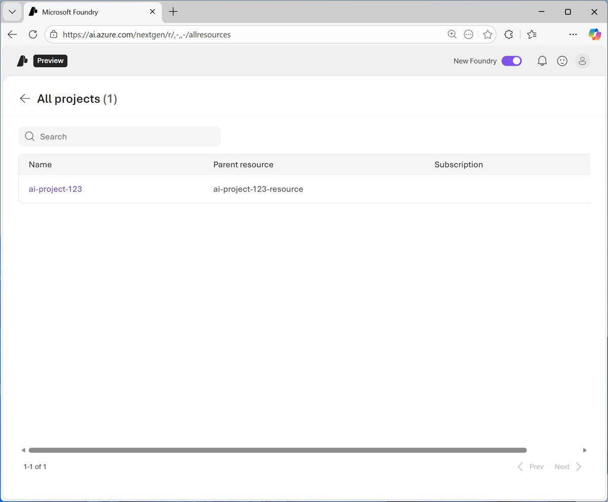

    Each project has a *parent* resource, in which services and configuration can be applied to multiple child projects.

1. Note the name of the parent resource for your project. Then, open a new browser tab and navigate to the [Azure portal](https://portal.azure.com){:target="_blank"} at `https://portal.azure.com` and if prompted, sign in using your Azure credentials.
1. In the Azure poral home page, in the search box at the top of the page, search for your Microsoft Foundry parent resource.

    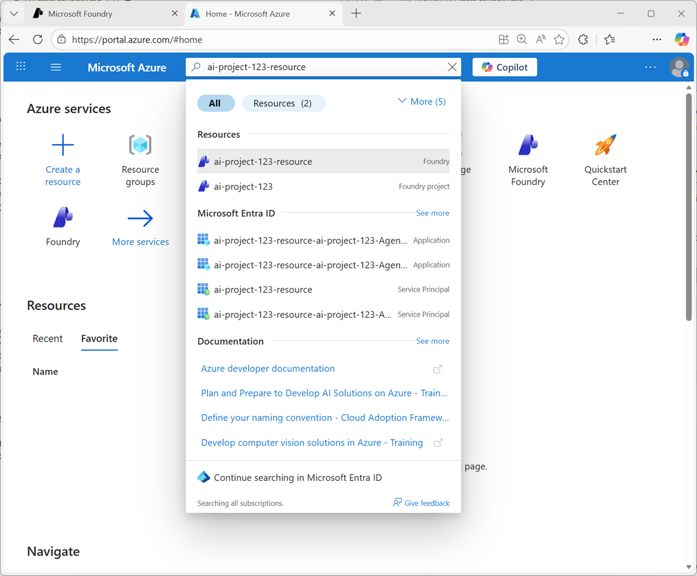

1. Select the **Foundry** resource that matches your parent resource name to open it.
1. In the page for your Foundry resource, view the **Resource Visualizer** page to see the relationship between the resource and its child project(s).

    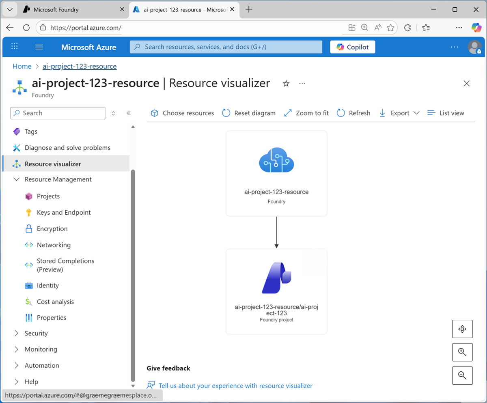

1. Select the child project you created in this resource to open its page in the Azure portal.

    

    While most tasks to develop and manage AI projects can be performed in the Microsoft Foundry portal, it's important to understand that projects and the services they use are implemented as resources in Microsoft Azure; where they may be subject to enterprise governance and security policies.

1. Close the browser tab containing the Azure portal and return to the Microsoft Foundry portal. Then use the "back arrow" icon next to the **All projects** page header to return to the home page for your project.

## Explore the Microsoft Foundry portal

The Microsoft Foundry portal is where you create and manage agents and AI services for your applications.

> **Note**: The Microsoft Foundry portal is subject to continual improvement and expansion. The interface shown in this exercise may not match the interface of your portal exactly.

1. On the **Home** page for your project, note the **Start building** menu.

    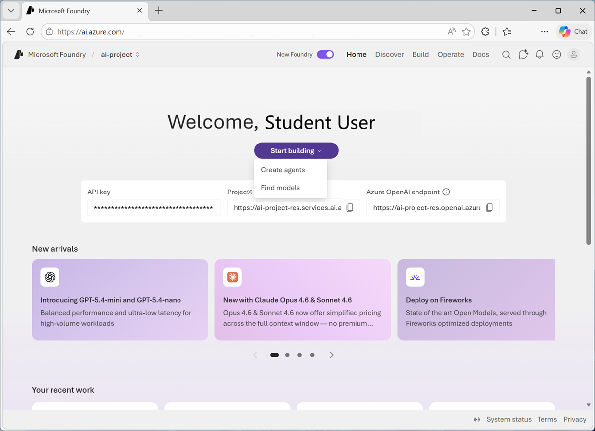

    You can use this menu to:

    - Create *agents* that use a generative AI model, instructions, and tools to intelligently automate tasks and information gathering.
    - Create *workflows* that combine multiple agents in an orchestrated process.
    - Browse *models* in the Foundry model catalog.
1. View the **Discover** page.

    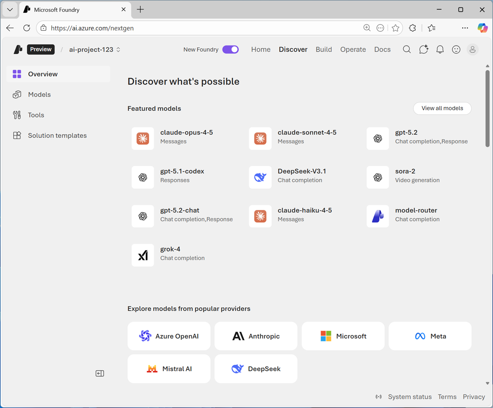

    This page surfaces the latest models and services and enables you to find starting points for AI application development.

1. View the **Build** page.

    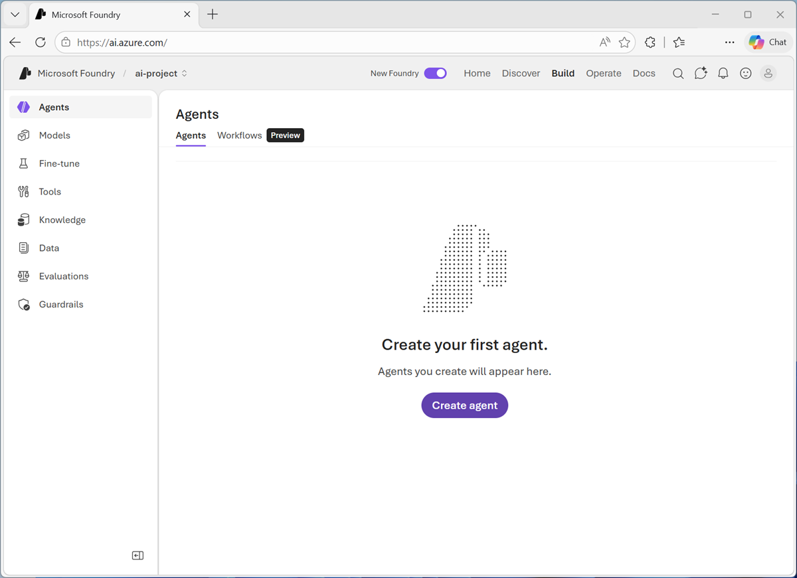

    This page is where you develop AI solutions. Here you can:

    - View and manage the *agents* in your project.
    - View and manage the *workflows* in your project.
    - View and manage the *models* in your project.
    - *Fine-tune* base models to respond to queries based on your application's specific needs.
    - Add and configure *tools* that agents can use to perform tasks.
    - Manage *knowledge* for your agents based on Foundry IQ data sources in your enterprise.
    - Connect and manage *data* indexes for AI agents and generative AI apps.
    - Create *evaluations* to compare model performance.
    - Define and manage *guardrails* to ensure compliance with responsible AI policies for generative AI content and behavior.
1. View the **Operate** page.

    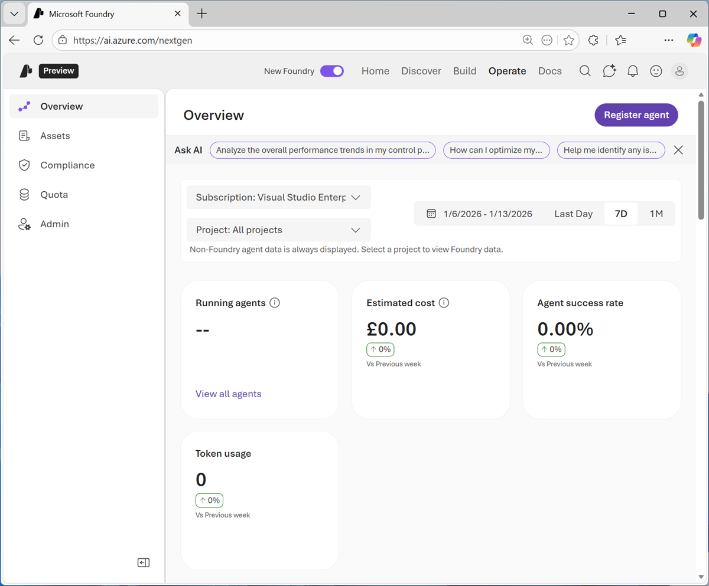

     On this page, you can operate your AI solution by:

    - Managing *assets* like agents, models, and tools in your project.
    - Manage *compliance* with security policies.
    - View and manage *quota* configuration that defines limits for usage of models and other assets in your project.
    - Perform *admin* tasks to manage your projects.

1. View the **Docs** page.
    
    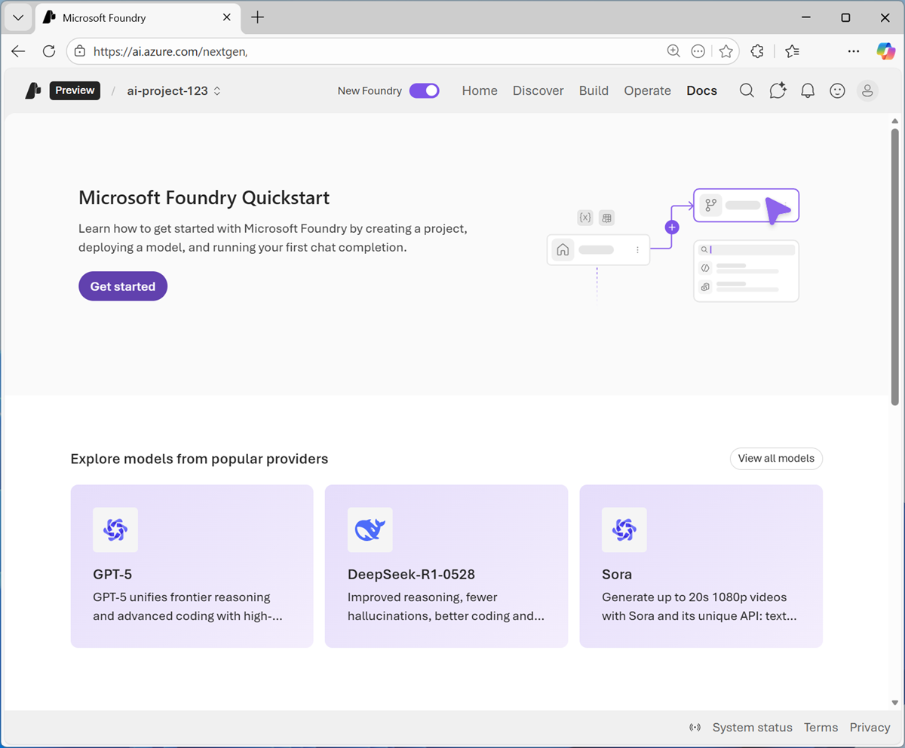

    This page provides access to Microsoft Foundry documentation.

## Get AI assistance

As you would expect in a platform for developing cutting edge AI solutions, Microsoft Foundry provides AI-based assistance.

1. In the toolbar, use the AI chat icon to open the **Ask AI** pane.

    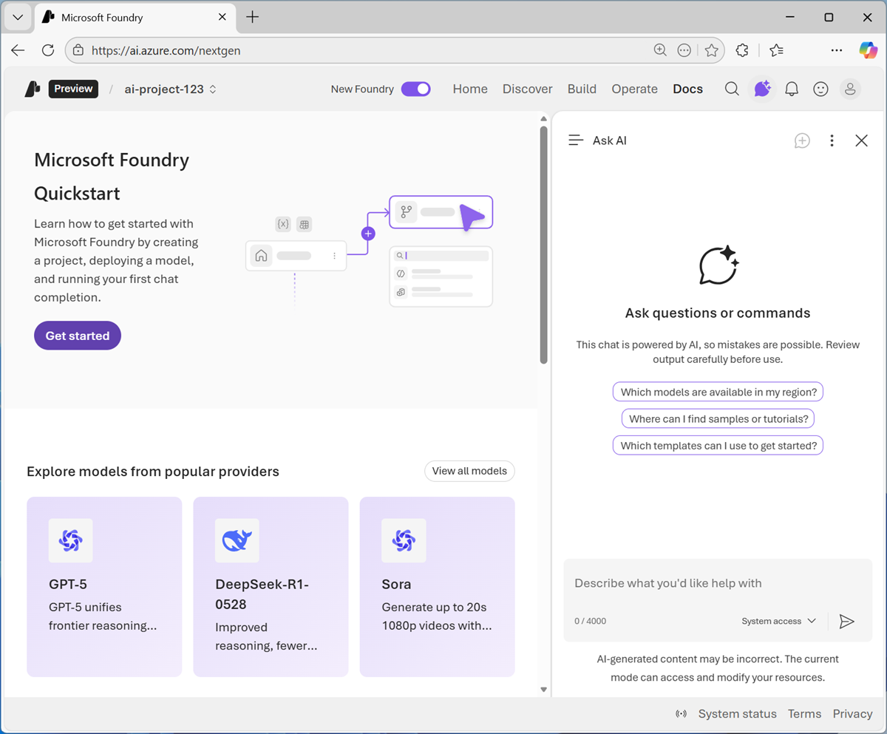

1. Enter a prompt such as `What can I do with Microsoft Foundry?` and review the response.

    If you have any questions about some of the things you've explored so far in this exercise, this is the place to ask them!

## Deploy a model

Your Microsoft Foundry resource provides an endpoint in which you can deploy models and use them from applications and agents.

1. In the **Start building** menu, select **Browse models** to view the Microsoft Foundry model catalog.

    Microsoft Foundry provides a large collection of models from Microsoft, OpenAI, and other providers, that you can use in your AI apps and agents.

    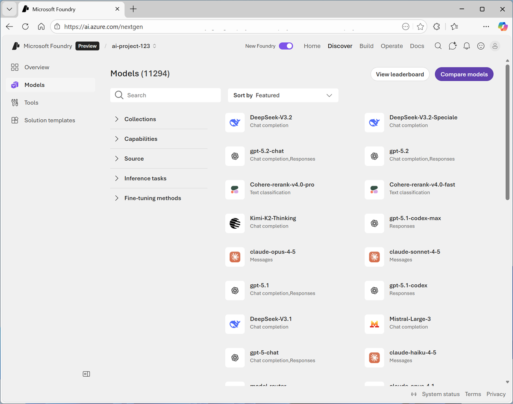

1. Search for and select the `gpt-4.1-mini` model, and view the page for this model, which describes its features and capabilities.

    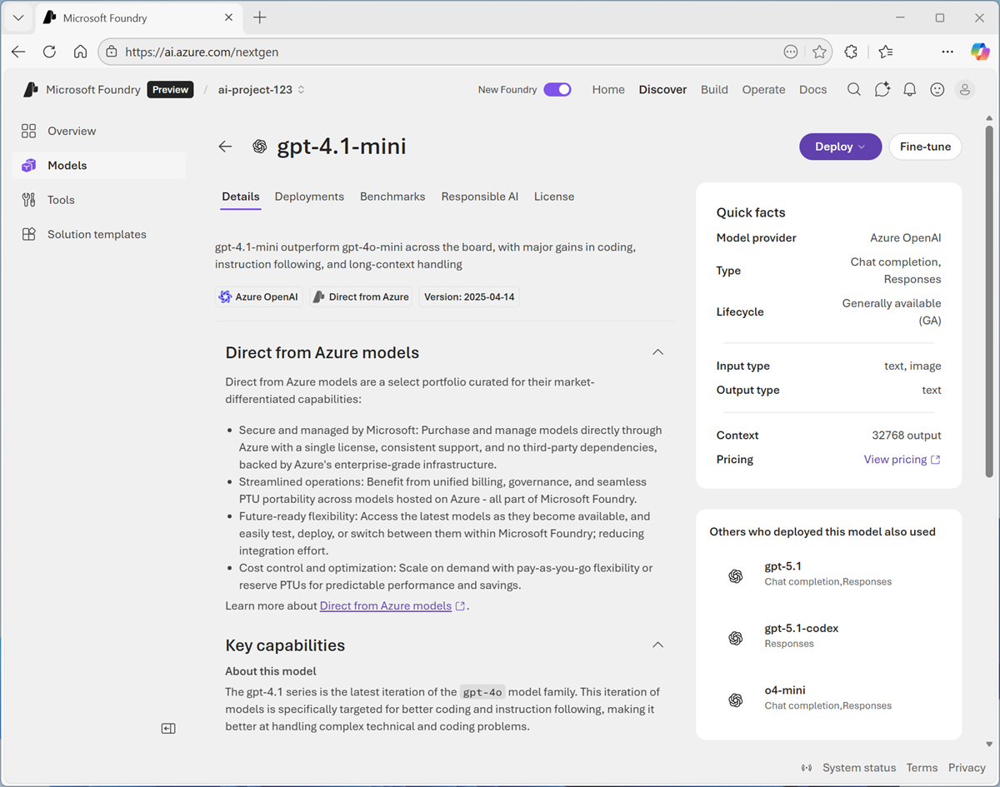

1. Use the **Deploy** button to deploy the model using the default settings. Deployment may take a minute or so.

    > **Tip**: Model deployments are subject to regional quotas. If you don't have enough quota to deploy the model in your project's region, you can use a different model - such as gpt-4.1-nano, or gpt-4o-mini. Alternatively, you can create a new project in a different region.

1. When the model has been deployed, view the model playground page that is opened, in which you can chat with the model.

    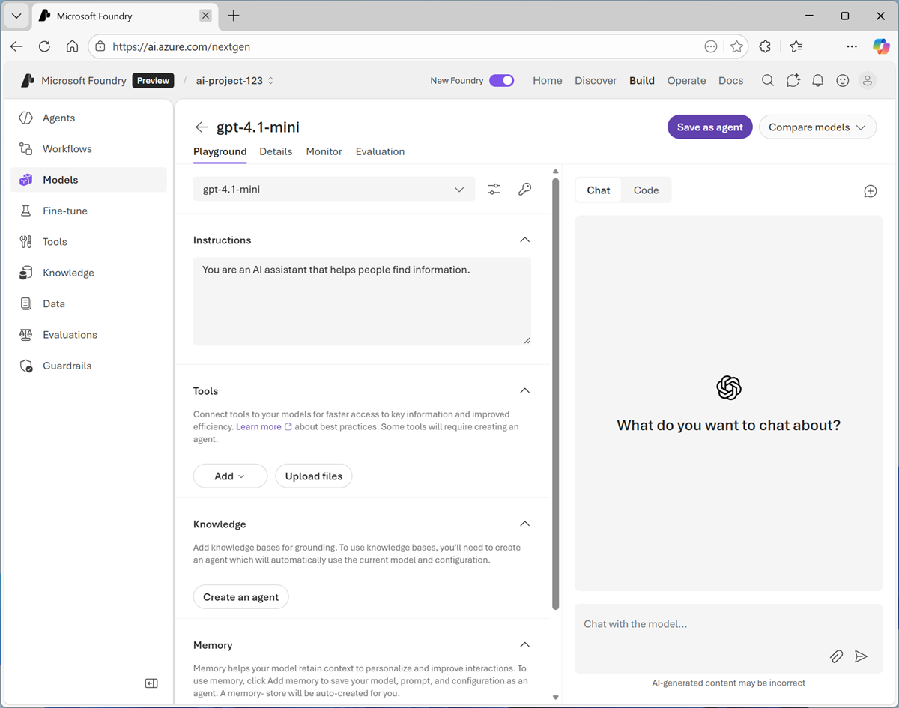

1. Ensure your model deployment (which should be named **gpt-4.1-mini**) is selected in the playground.
1. In the **Chat** pane, test your model by entering a message like `What is AI?`

## Use your Foundry resource endpoint

Now that you have a Microsoft Foundry resource in Azure, you can use its models and tools from client applications. In this exercise, we'll use a simple AI chat application that has been provided for you.

1. In the toolbar at the top of the Foundry portal, select your project to return to the home page.
1. Note the following details for your project:
    - **Project endpoint**: The URL where your project resource can be accessed.
    - **Project API key**: The authentication key used to access your resource.
    - **Project region**: The region where your project is deployed.

1. Open a second browser tab, and navigate to the [Ask Andrew (Azure)](https://aka.ms/ask-andrew-azure){:target="_blank"} app at `https://aka.ms/ask-andrew-azure`.

    The Ask Andrew app should look like this:

    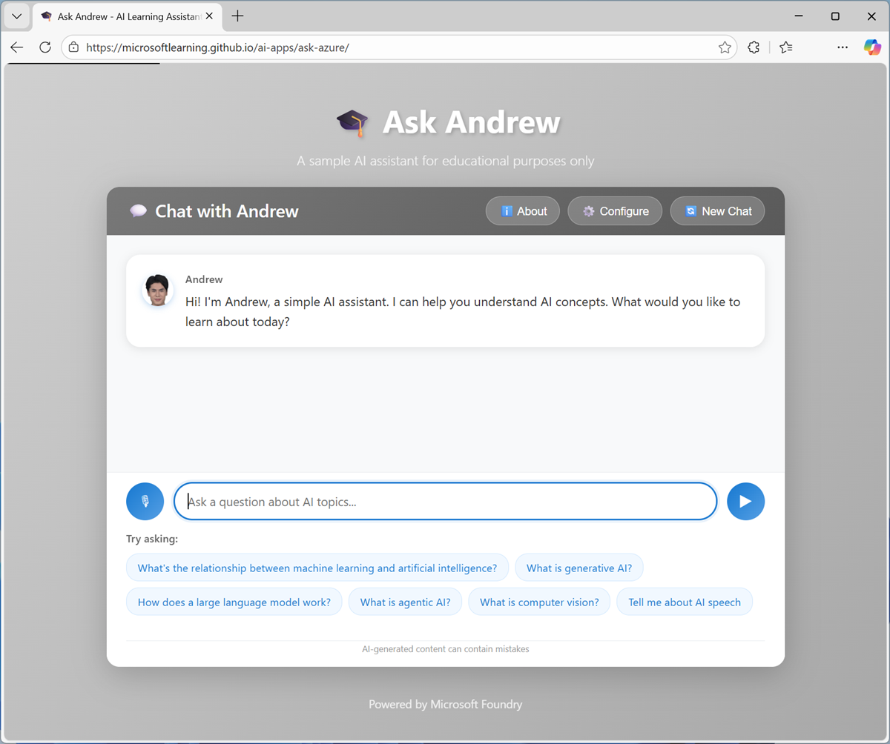

1. In the chat pane header, select **Configure**, and then enter the project values from the Foundry portal home page and your model deployment name into the Foundry configuration settings page.

    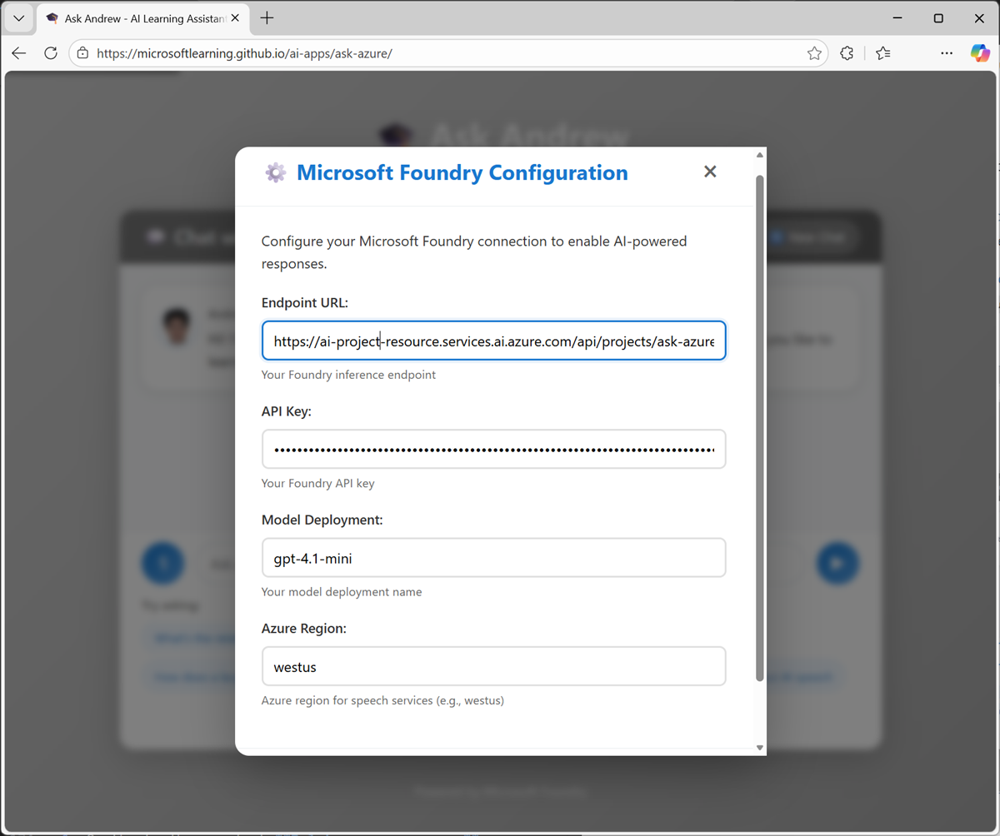

1. Save the configuration.

    > **Note**: The configuration values other than the API key will be stored in your local browser. If you close and re-open the app, you will need to re-enter the APi key.

1. Use the app to chat with Andrew and ask questions about AI concepts. The app will use your deployed model in Microsoft Foundry. If you use the speech functionality, the app will use Azure Speech in Foundry tools in your resource to recognize and synthesize speech.

## Summary

in this exercise, you explored a Microsoft Foundry project and familiarized yourself with the Microsoft Foundry portal. You then deployed a model and connected a client application to your Foundry resource.

## Clean Up

If you have finished exploring Microsoft Foundry, you should delete the resources created in this exercises to avoid unnecessary utilization charges.

1. Open the [Azure portal](https://portal.azure.com){:target="_blank"} at `https://portal.azure.com` and view the contents of the resource group where you deployed the project used in this exercise.
1. On the toolbar, select **Delete resource group**.
1. Enter the resource group name and confirm that you want to delete it.