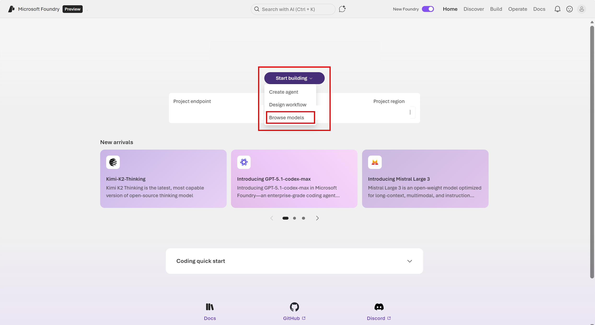
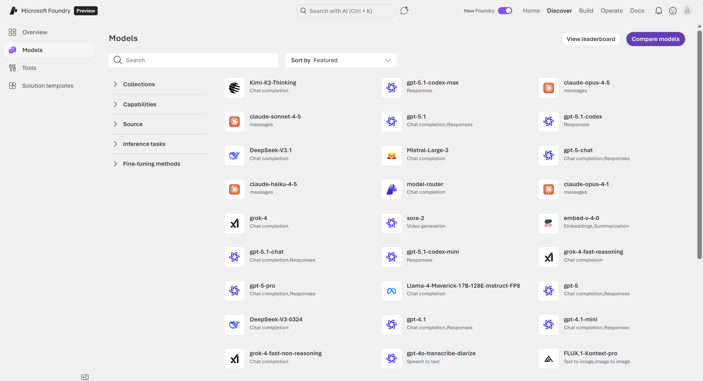
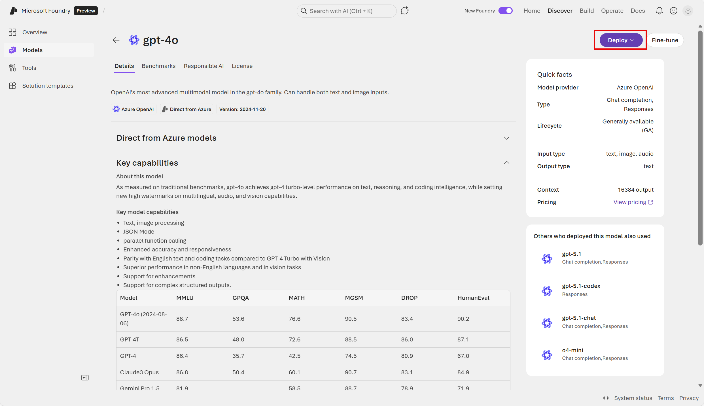

---
lab:
    title: 'Explore AI in Microsoft Foundry'
---

# Explore AI in Microsoft Foundry

Artificial Intelligence (AI) refers to systems designed to perform tasks that typically require human intelligence—such as reasoning, problem-solving, perception, and language understanding. In this exercise, you explore Microsoft Foundry, Microsoft's platform for creating AI applications. 

> **Note**: This exercise utilizes the *new* Foundry user interface. 

This exercise takes approximately **20** minutes.

## Create a project in Microsoft Foundry

1. In a web browser, open [Microsoft Foundry](https://ai.azure.com) at `https://ai.azure.com` and sign in using your Azure credentials. Close any tips or quick start panes that are opened the first time you sign in, and if necessary use the **Foundry** logo at the top left to navigate to the home page, which looks similar to the following image (close the **Help** pane if it's open):

    

1. At the top of the screen, select the **New Foundry** toggle. 

1. To utilize the new Foundry user interface, you will need to create a project in a supported region. In the dropdown menu, select **Create a new project**. (*Note*: If other projects have been created in the subscription, and they are deployed in a supported region, then they will also appear in the drop down list.)

    

1. In the **Create a project** wizard, enter a valid name for your project. Then expand **Advanced options** to specify the following settings for your project:
    - **Foundry resource**: *Enter a valid name for your AI Foundry resource.*
    - **Subscription**: *Your Azure subscription*
    - **Resource group**: *Create or select a resource group*
    - **Region**: Select any of the **Foundry recommended** regions\*
    
    \**Model deployments are restricted by regional quotas. If you select a region in which you have insufficient available quota, you may need to select an alternative region for a new resource later.*

1. Select **Create**. Wait for your project to be created. It may take a few minutes.

## Browse models and deploy for testing

1. After the project is created, in the new Foundry home page, select **Start building** and **Browse models**.

     

1. With the *Models* page, you can discover thousands of models that are Microsoft and third-party-owned. These models form the foundation of the AI applications by powering their reasoning capabilities. Let's take a look at one of the models. Search for and select **gpt-4o**.  

    

1. On the **gpt-4o** page, you can find more information about the model's capabilities. In order to use the model, you need to deploy it. Select **Deploy** with **Default settings**. 

     

## Test the model in a Playground

1. You can test and customize the deployed model's capabilities in a **Playground** setting. Notice the model you are working with is selected at the top of the screen. Let's try chatting with the model. In the chat screen, enter the following (*note*: this is known as a *prompt*): 

    ```prompt
    I'm getting started with AI. Can you summarize the relationship between a model and AI application?
    ```

1. Review the results. Does this reflect your understanding of how these models can be used for AI applications? 

1. In the chat screen, enter the following prompt: 

    ```prompt
    Give one example for each AI workload: generative AI, AI agents and automation, text analysis, computer vision, and information extraction.
    ```

1. Review the results. Feel free to ask for more examples. 

1. When you interact with the model in the playground setting, you are using a chat user interface. The chatbot interface is a common way humans interact with *AI assistants* today.  In the chat screen, enter the following prompt: 

    ```prompt
    List five different ways humans interact with AI other than with a chat interface.
    ```

1. Review the results. The key point is that while *workloads* define the types of tasks an AI application can complete, the *user interface* defines how humans interact with that AI application. Ultimately, each AI application's reasoning is powered by models, which is the core building block we looked at in this exercise. What is very powerful about the models available to us now is that they are capable of solving for multiple workloads, often with one user interface. Thus, with one project in Foundry, you can access models, solve for multiple workloads, and build AI applications at scale. 


## Clean up

If you don’t intend to do more exercises, delete any resources that you no longer need. This avoids accruing any unnecessary costs.

1. Open the **Azure portal** at [https://portal.azure.com](https://portal.azure.com) and select the resource group that contains the resources you created.
1. Select **Delete resource group** and then **enter the resource group name** to confirm. The resource group is then deleted.