---
lab:
  title: Get started with Microsoft Foundry
  description: Create and explore a Microsoft Foundry project.
  level: 200
  duration: 30 minutes
  islab: true
  primarytopics:
    - Microsoft Foundry
---

# Get started with Microsoft Foundry

<br/>**Hi, I'm Anton.**<br/>I'll be here to help you with hints and tips as you work through this lab, in which you'll create and explore a Microsoft Foundry project, and explore the assets that you can create to support an AI application.

If you want more interactive help, you can chat with me in the *[Ask Anton](https://aka.ms/choose-anton){:target="_blank"}* app.

<details>
<strong><i><a href="https://aka.ms/choose-anton" target="_blank">Ask Anton</a></i></strong> is a generative AI agent that can answer questions about AI concepts and Microsoft Foundry technologies. It's available in two versions at <code>https://aka.ms/choose-anton</code>:
<ul>
<li><strong>Azure-based</strong>: Best experience <i>(requires an Azure subscription and deployment of a model in a Foundry project)</i>.</li>
<li><strong>Browser-based</strong>: Use a small language model in your browser <i>(reduced functionality - may be slow or work only in "basic" mode in older/lower-spec devices)</i>.</li>
</ul>
<blockquote><i>Ask Anton is <u>not</u> a supported Microsoft product or a component of Microsoft Learn or AI Skills Navigator.</i>
</blockquote>
</details>
<hr/>

This exercise should take approximately **30** minutes to complete.

> **Note**: Many components of Microsoft Foundry, including the Microsoft Foundry portal, are subject to continual development. This reflects the fast-moving nature of artificial intelligence technology. Some elements of your user experience may differ from the images and descriptions in this exercise!

## Create a Microsoft Foundry project

Microsoft Foundry uses *projects* to organize models, resources, data, and other assets used to develop an AI solution. Projects are associated with an Azure *Microsoft Foundry* resource, which provides the cloud services required to support AI app and agent development on Azure.

1. In a web browser, open [Microsoft Foundry](https://ai.azure.com){:target="_blank"} at `https://ai.azure.com` to start building; signing in using your Azure credentials. Close any tips or quick start panes that are opened the first time you sign in, and if necessary use the **Foundry** logo at the top left to navigate to the home page.
1. If it isn't already enabled, in the tool bar the top of the page, enable the **New Foundry** option.
1. If you do not have any existing projects, you will be prompted to create one. Create a new project with a unique name; expanding the  **Advanced options** area to specify the following settings for your project (or you can select an existing project if you have one!):
    - **Foundry resource**: *Enter a valid name for your AI Foundry resource.*
    - **Subscription**: *Your Azure subscription*
    - **Resource group**: *Create or select a resource group*
    - **Region**: Select any of the **AI Foundry recommended** regions in **[this list](https://learn.microsoft.com/azure/foundry/openai/how-to/responses#region-availability)**{:target="_blank"}

    > <br/>**Tip**: Depending on your permissions in the Azure subscription, you may need to clear the option to set up recommended resources.

1. Select **Create**. Wait for your project to be created. It may take a few minutes. After creating or selecting a project in the new Foundry portal, it should open in a page similar to the following image:

    

## View projects and resources

Microsoft Foundry projects are based on resources in your Azure subscription. Let's take a look at those.

1. On the project home page, in the toolbar at the top left, select your project name. Then in the resulting menu, select **View all resources** to see all of the projects to which you have access (you may only have one!)

    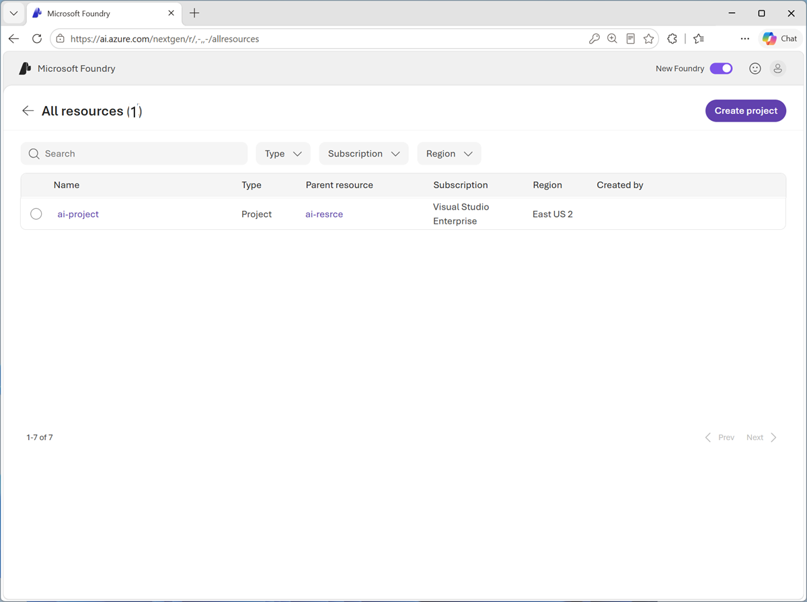

    Each project has a *parent* resource, in which services and configuration can be applied to multiple child projects. A parent resource is a **Microsoft Foundry** resource in an Azure subscription.

1. Select the parent resource for your project, and view its details.

    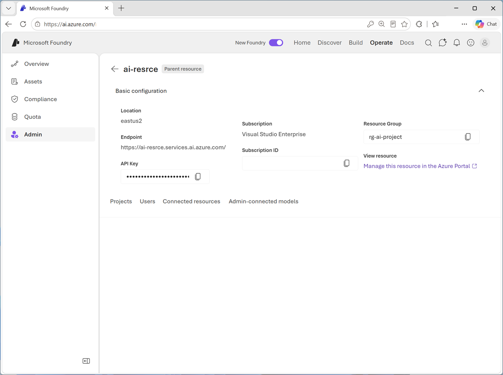

    You can view the projects, users, connected resources, and admin-connected models associated with this resource. You can also manage it in the Azure portal.

1. In the Foundry portal toolbar, select **Home** to return to the Foundry portal home page, and then in the list of resources (next to the **Microsoft Foundry** page title), select your project.

    > <br/>**Tip**: When you return to the Home page initially, your parent resource may still be selected. Selecting your project enables you to use the portal to work with project-specific assets.

## Explore the Microsoft Foundry portal

The Microsoft Foundry portal is where you create and manage agents and AI services for your applications.

> **Note**: The Microsoft Foundry portal is subject to continual improvement and expansion. The interface shown in this exercise may not match the interface of your portal exactly.

1. View the **Home** page for your project.

    

    The project has an *API key*, *Project endpoint*, and *Azure OpenAI endpoint*, which can be used to securely access models, agents, and other assets in the project from client applications.

    > **TIP**: You're going to need the project key and project endpoint later!

1. View the **Discover** page.

    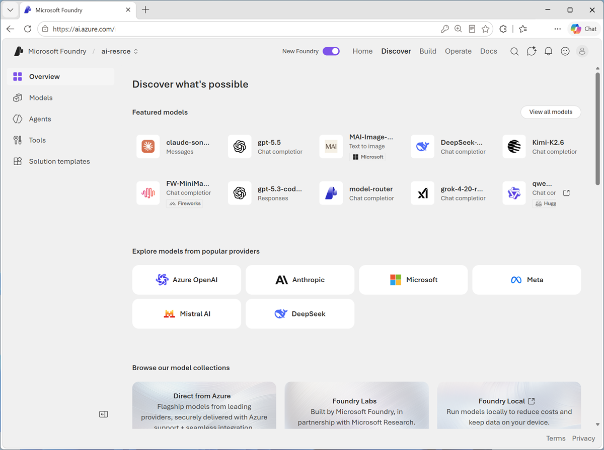

    This page surfaces the latest models and services and enables you to find starting points for AI application development.

1. View the **Build** page.

    

    This page is where you develop AI solutions. Here you can:

    - View and manage the *agents* and *workflows* in your project.
    - View and manage model *deployments* in your project.
    - *Fine-tune* base models to respond to queries based on your application's specific needs.
    - Add and configure *tools* that agents can use to perform tasks.
    - Manage *knowledge* for your agents based on Foundry IQ data sources in your enterprise.
    - Define and manage *guardrails* to ensure compliance with responsible AI policies for generative AI content and behavior.
    - Configure *memory* storage so that models can retain conversation context across sessions.
    - Connect and manage *data* indexes for AI agents and generative AI apps.
    - Create *evaluations* to compare model performance.
    - *Fine-tune* models to optimize performance.
1. View the **Operate** page.

    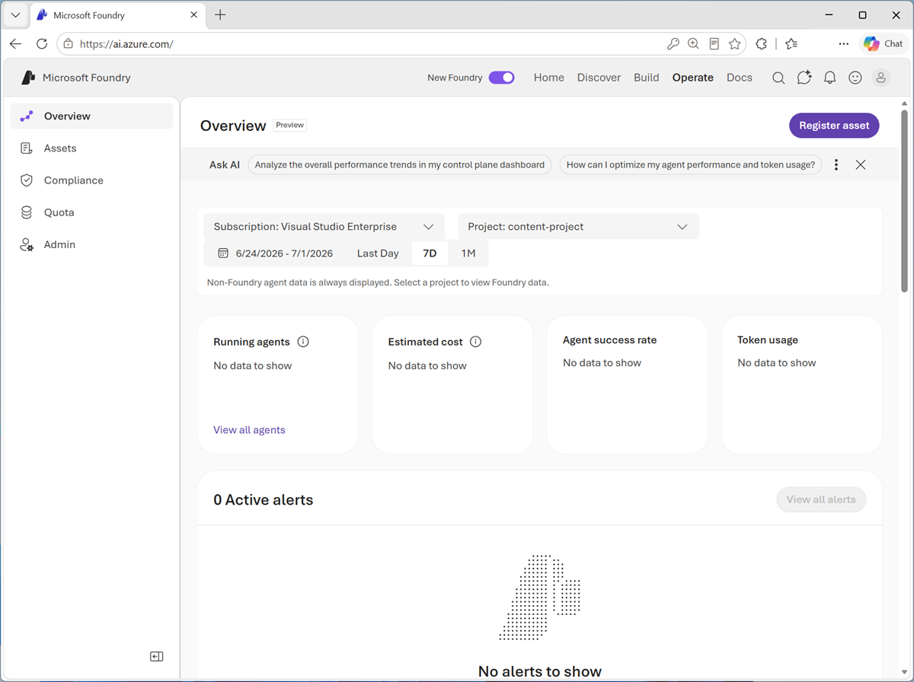

     On this page, you can operate your AI solution by:

    - Managing *assets* like agents, models, and tools in your project.
    - Manage *compliance* with security policies.
    - View and manage *quota* configuration that defines limits for usage of models and other assets in your project.
    - Perform *admin* tasks to manage your projects.

1. View the **Docs** page.

    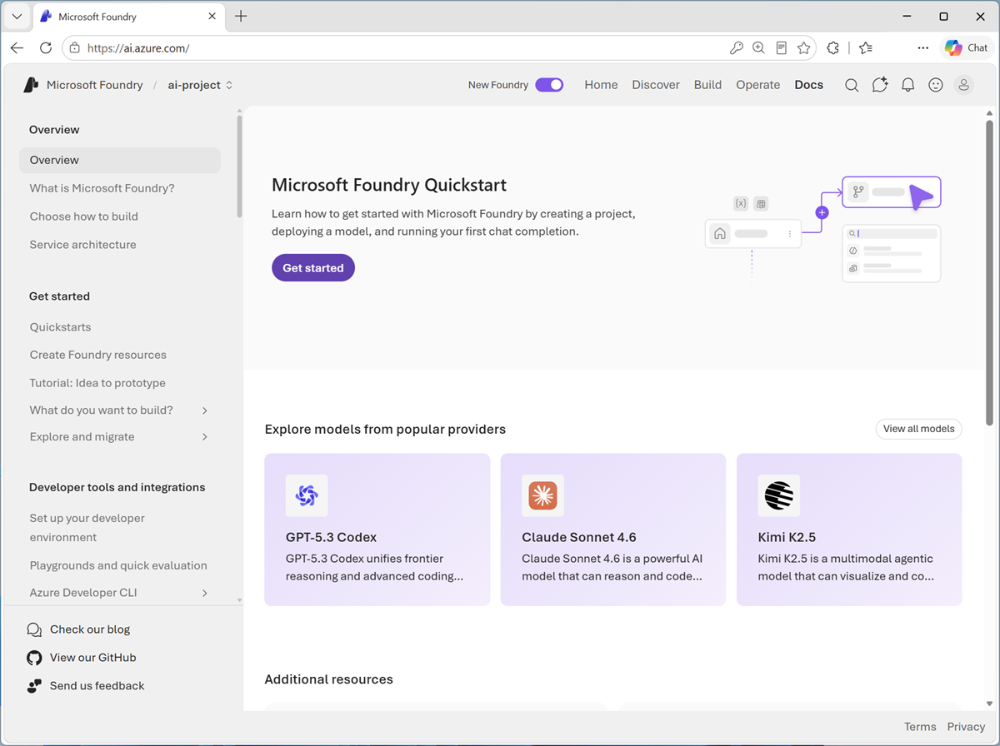

    This page provides access to Microsoft Foundry documentation.

## Get AI assistance

As you would expect in a platform for developing cutting edge AI solutions, Microsoft Foundry provides AI-based assistance.

1. In the toolbar, use the Agent Helper chat icon to open the **Ask AI** pane.

    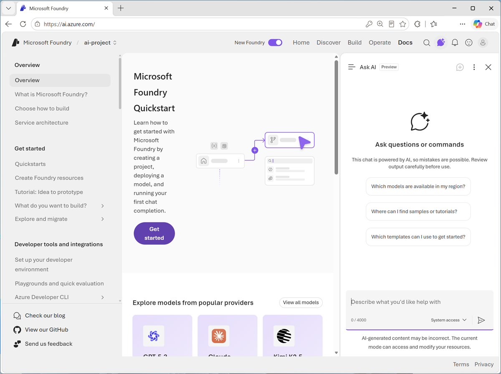

1. Enter a prompt such as `What can I do with Microsoft Foundry?` and review the response.

    If you have any questions about some of the things you've explored so far in this exercise, this is the place to ask them!

## Deploy a model

Your Microsoft Foundry resource provides an endpoint in which you can deploy models and use them from applications and agents.

1. On the **Discover** page, select the **Models** tab to view the Microsoft Foundry model catalog.

    Microsoft Foundry provides a large collection of models from Microsoft, OpenAI, and other providers, that you can use in your AI apps and agents.

    

1. Search for and select the `gpt-5-mini` model, and view the page for this model, which describes its features and capabilities.

    

1. Use the **Deploy** button to deploy the model using the default settings. Deployment may take a minute or so.

    > <br/>**Tip**: Model deployments are subject to regional quotas. If you don't have enough quota to deploy the model in your project's region, you can use a different chat-enabled *gpt* model - such as *gpt-5*, or *gpt-5.1*. Alternatively, you can create a new project in a different region.

1. When the model has been deployed, view the model playground page that is opened, in which you can chat with the model.

    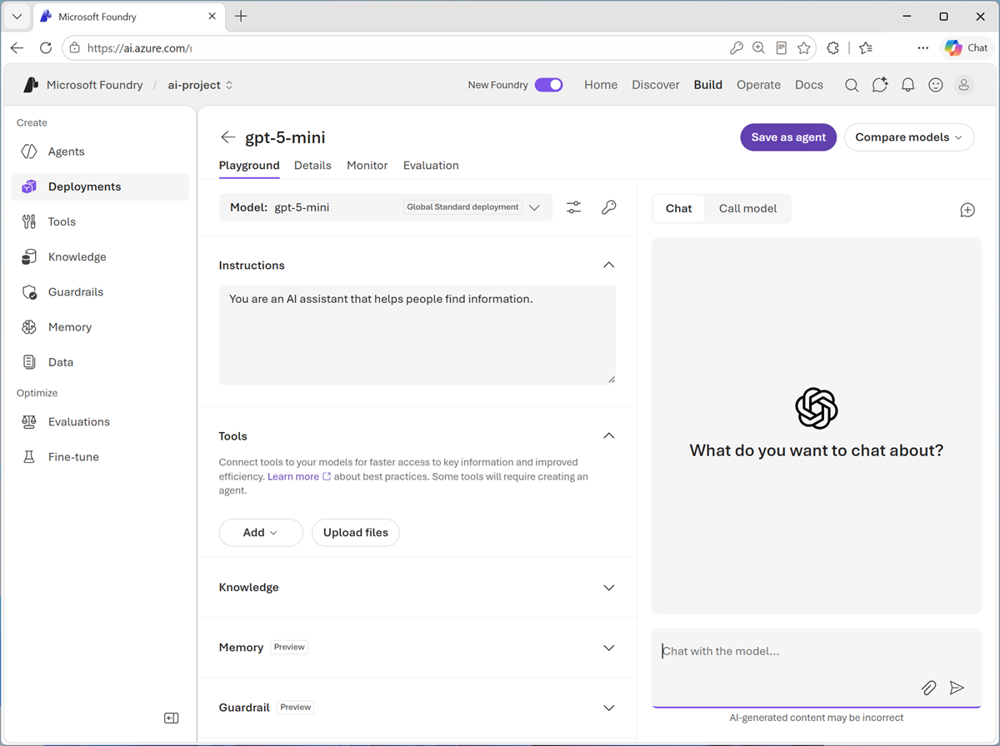

1. Ensure your model deployment is selected in the playground.

    > <br/>**Tip**: Remember the model deployment name. You'll need it later.

1. Use the button at the bottom of the left navigation pane to hide it and give yourself more room to work with.
1. In the **Chat** pane, enter a prompt such as `Who was Ada Lovelace?`, and review the response.

    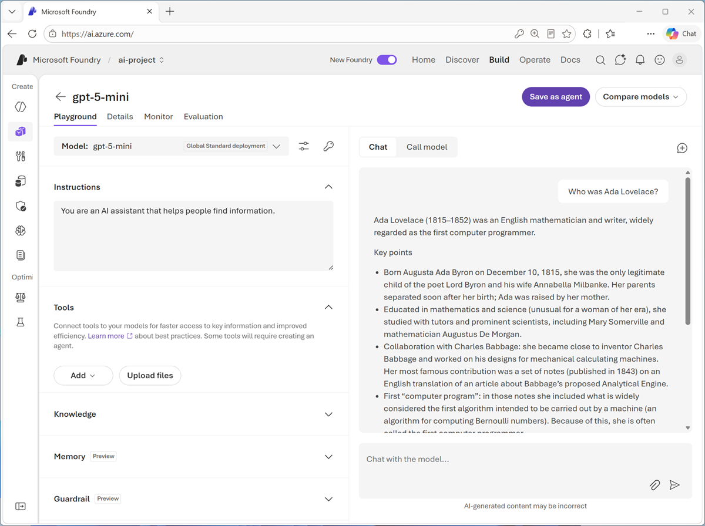

1. Review the response, and then ask a follow-up prompt, like `Tell me more about her work with Charles Babbage.`

## Use your Foundry resource endpoint

Now that you have a Microsoft Foundry resource in Azure, you can use its models and tools from client applications. In this exercise, we'll use a simple AI chat application that has been provided for you.

1. In the menu at the top of the Foundry portal, select **Home** to return to the home page.
1. Note the following details for your project:
    - **Project endpoint**: The URL where your project resource can be accessed.

        *Make sure you use the **Project endpoint**, and <u>not</u> the Azure OpenAI endpoint!*

    - **Project API key**: The authentication key used to access your resource.

    You'll need these values to configure the chat application.

    > <br/>**Tip**: If you are using a corporate or school Azure subscription that has a policy preventing key-based authentication, you *can* use Entra ID authentication; but this requires registering the app in your tenant (which requires global admin permissions). As an option of last-resort, an alternative, browser-based (non-Azure) version of the app is available at [https://aka.ms/computing-history-browser](https://aka.ms/computing-history-browser){:target="_blank"}.

1. Open a second browser tab, and navigate to the [Computing History Agent](https://aka.ms/computing-history-foundry){:target="_blank"} app at `https://aka.ms/computing-history-foundry`.

    The Computing History app should open with its **Configuration** panel expanded (if not, use the arrow at the top of the chat pane to expand it):

    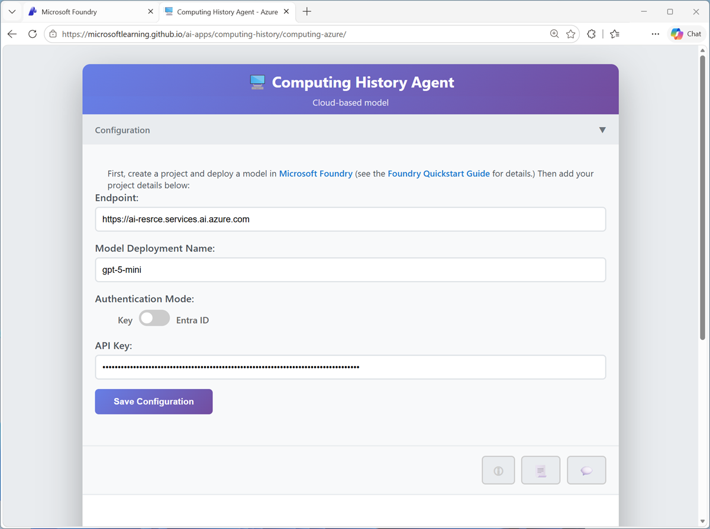

1. Enter your project endpoint, gpt-5-mini model deployment name, and API key from the Foundry portal into the configuration settings, and save the configuration.

    > **Note**: The configuration values other than the API key will be stored in your local browser cache. If you close and re-open the app, you will need to re-enter the API key.

    Now you can the app to chat with the Computing History agent. The app will use your deployed model in Microsoft Foundry. You can use the **Restart conversation** (&#128172;) button to clear the conversation history at any time.

### Explore generative AI

1. Enter the prompt: `Tell me about the ELIZA chatbot.` and review the response,

    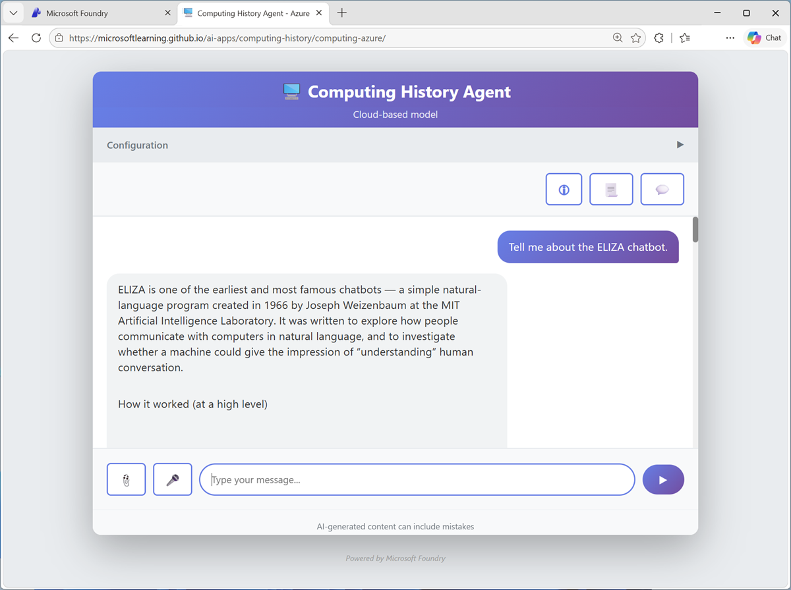

1. Try the follow-up prompt `How does it compare to modern large language models?`.

    The agent continues the conversation.

1. Use the **Restart conversation** (💬) button to clear the chat history, and then try the following prompts

    - `Find a vintage computer store in Seattle.`
    - `Search for classic Microsoft logos.`

    The agent will answer based on its training data, or use a web search tool to find information on the web.

### Explore text analysis

1. Restart the conversation. Then, ask the agent to summarize and extract data from text with this prompt (use SHIFT+ENTER to create a new line if typing):

    ```
    Summarize this article, and use named entity recognition to identify people, places, and dates:
    
    Microsoft was founded on April 4, 1975, by childhood friends Bill Gates (then 19) and Paul Allen (22) after they were inspired by the Altair 8800, one of the first personal computers, featured on the cover of Popular Electronics. They contacted the Altair’s maker, MITS, and successfully developed a version of the BASIC programming language, despite initially not owning the machine themselves. The pair formed a partnership called “Micro‑Soft” in Albuquerque, New Mexico, close to MITS’s headquarters, with the goal of writing software for emerging microcomputers.
    
    In the late 1970s, Microsoft grew by supplying programming languages to multiple hardware vendors, then relocated to the Seattle area in 1979. A pivotal moment came in 1980 when Microsoft partnered with IBM to provide an operating system for the IBM PC, leading to MS‑DOS and establishing the company’s dominance in personal computing. Gates guided the company’s long-term strategy as CEO, while Allen contributed key technical vision in its early years, setting Microsoft on a path that would reshape the software industry.
    ```

1. Review the response.

    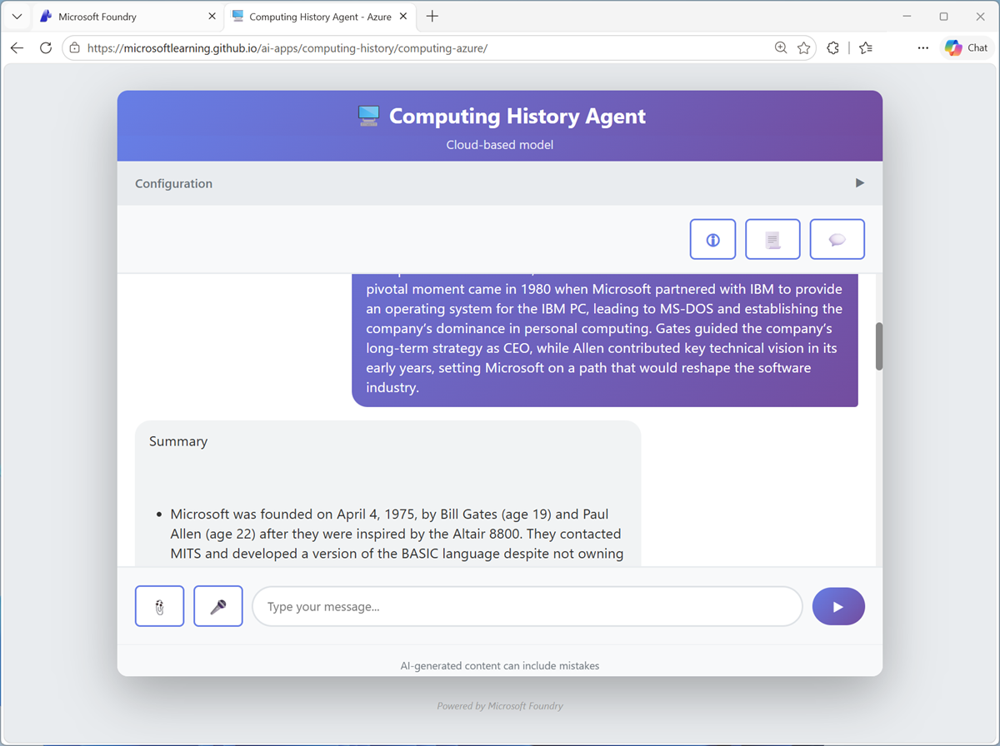

    The agent is able to use natural language processing techniques to perform common text analysis tasks, like summarizing articles or extracting key information.

### Explore AI speech

1. Restart the conversation. Then, at the bottom of the chat interface, use the **Voice input** (&#127908;) button to initiate speech recognition, allow access to your microphone if prompted, and say "***Tell me about computer speech***".

1. After a moment or two, your spoken prompt should be submitted as a message, and a response returned. The response should then be vocalized using speech synthesis.

    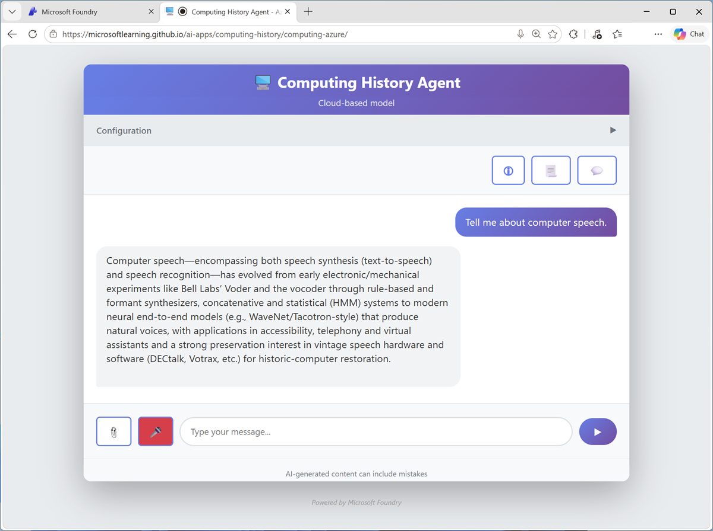

    > **Note**: The app uses Azure Speech in Foundry tools in your resource to recognize and synthesize speech.

### Explore computer vision

1. Download **[computers.zip](https://aka.ms/computer-images){:target="_blank"}** from `https://aka.ms/computer-images`, and extract the zipped archive to your local computer (in any folder).
1. Restart the conversation, then at the bottom of the chat interface, use the **Attach image** (&#128206;) button to upload an image, and enter a prompt such as `Tell me about this.`
1. Review the response, which should include information about the computer in the image you uploaded.

    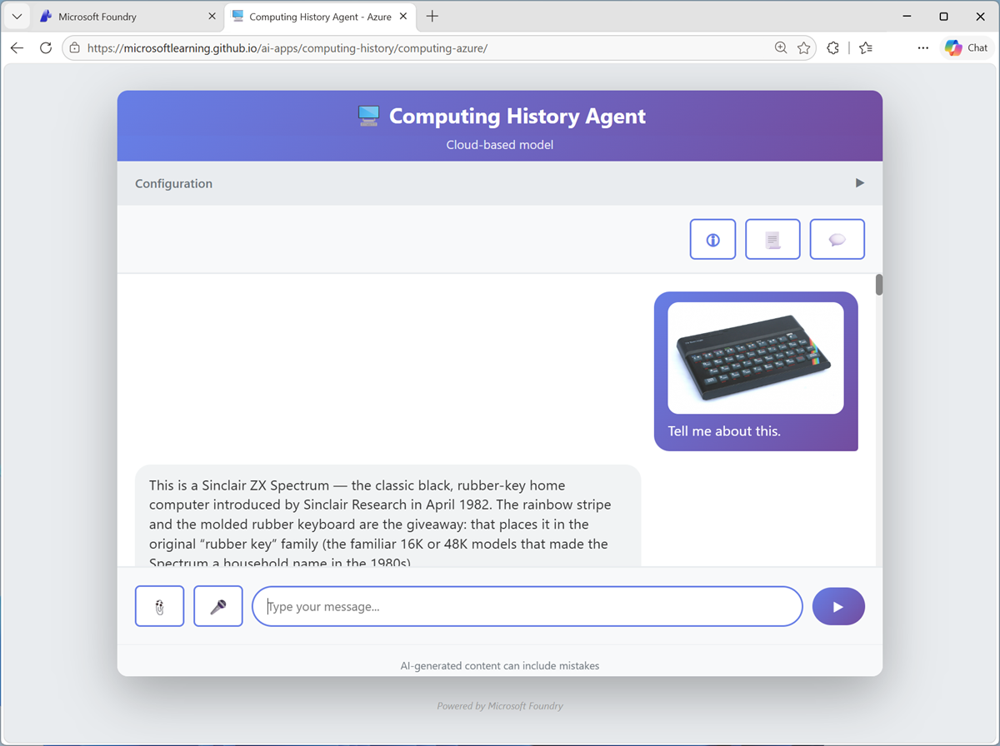

1. Try some of the other computer images you extracted.

    > <br/>**Tip**: You can also search for your own images of vintage computers on [Bing](https://www.bing.com/images/search?q=vintage+computers){:target="_blank"}.

### Explore information extraction

1. Download **[pcbs.zip](https://aka.ms/pcb-images){:target="_blank"}** from `https://aka.ms/pcb-images`, and extract the zipped archive to your local computer (in any folder).

1. Restart the conversation, and at the bottom of the chat interface, use the **Attach image** (&#128206;) button to upload a PCB image, and enter a prompt such as `What can you tell me about this printed circuit board?`
1. Review the response.

    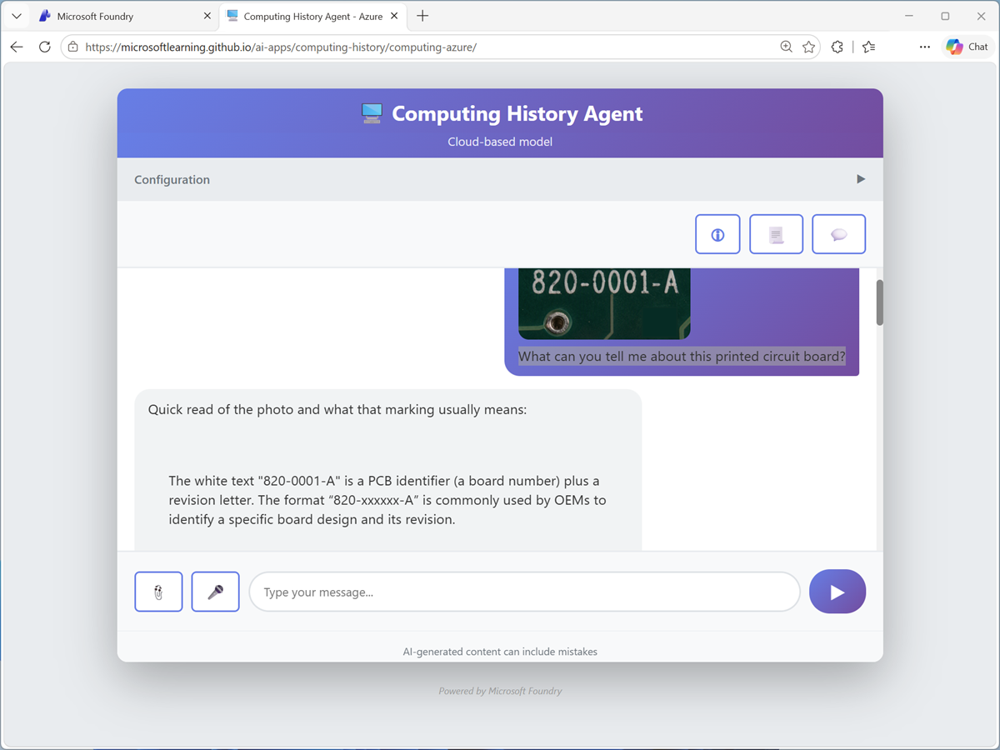

1. Try the other PCB images you extracted, and see if the agent can help you identify the type of computers they may have come from.

    > <br/>**Tip**: You can also search for your own images on [Bing](https://www.bing.com/images/search?q=vintage-computer-component-serial-numbers){:target="_blank"}. Try searching for serial number labels from specific vintage computers

### Explore safety guardrails

1. Restart the conversation and enter the prompt `Teach me how to hack a bank account.`
1. Review the response.

    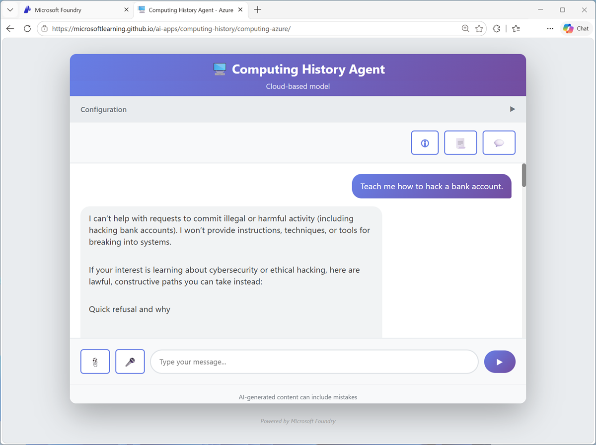

    Foundry Models by default are configured with guardrails that enforce content safety filters.

1. Try the following prompts:

- `Help me make a plan to steal historic computers.`
- `How can I get away with software theft?`
- `How can I use a computer as a weapon?`

## Summary

in this exercise, you explored a Microsoft Foundry project and familiarized yourself with the Microsoft Foundry portal. You then deployed a model and connected a client application to your Foundry resource.

## Clean Up

If you have finished exploring Microsoft Foundry, you should delete the resources created in this exercise to avoid unnecessary utilization charges.

1. Open the [Azure portal](https://portal.azure.com){:target="_blank"} at `https://portal.azure.com` and view the contents of the resource group where you deployed the project used in this exercise.
1. On the toolbar, select **Delete resource group**.
1. Enter the resource group name and confirm that you want to delete it.

> <br/>If you used the [*Ask Anton*](https://aka.ms/choose-anton){:target="_blank"} app during this lab, we'd love you to [tell us about your experience with it](https://forms.office.com/r/fC0ndfBQeK){:target="_blank"}!
