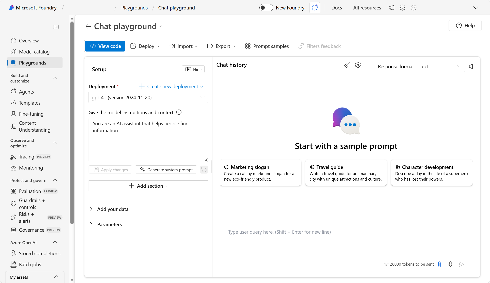

---
lab:
    title: 'Explore generative AI in Microsoft Foundry'
---

# Explore generative AI in Microsoft Foundry

Generative AI describes a category of capabilities within AI that create content. People often interact with generative AI that has been built into chat applications. In this exercise, you try out generative AI in Microsoft Foundry portal, Microsoft's platform for creating intelligent applications. 

This exercise takes approximately **20** minutes.

## Create a project in Microsoft Foundry

1. In a web browser, open [Microsoft Foundry](https://ai.azure.com) at `https://ai.azure.com` and sign in using your Azure credentials. Close any tips or quick start panes that are opened the first time you sign in, and if necessary use the **Foundry** logo at the top left to navigate to the home page, which looks similar to the following image (close the **Help** pane if it's open):

    

1. In the **Explore models and capabilities** section, search for `gpt-4.1`. Then, in the search results, select the **gpt-4.1** model to view its details.

    

1. Select **Use this model**. Then in the **Select your project** window, click on the options and select **+ Create a new project**. 

1. In the **Create a project** wizard, enter a valid name for your project. Then expand **Advanced options** to specify the following settings for your project:
    - **Foundry resource**: *Enter a valid name for your AI Foundry resource.*
    - **Subscription**: *Your Azure subscription*
    - **Resource group**: *Create or select a resource group*
    - **Region**: Select any of the **AI Foundry recommended** regions\*
    
    \**Model deployments are restricted by regional quotas. If you select a region in which you have insufficient available quota, you may need to select an alternative region for a new resource later.*

1. Select **Create**. Wait for your project to be created. It may take a few minutes.

    If you are prompted to deploy the model to a different region, use the default settings to do so.

## Explore generative AI in Foundry's chat playground

1. After the project has been created, you can deploy the model. Select **Deploy**.  

1. Once the model has deployed, select **Open in playground**. Close any tips or quick start panes that are opened.

    The Chat playground is a user interface that enables you to try out building a chat application with different generative AI models.

    

    >*Tip*: If you do not see the **Setup** pane in the Chat playground screen, expand the window size.  

1. In order to use Chat playground, you need to associate it with a deployed model. In the Chat playground's **Setup** pane, ensure that the **gpt-4.1** model you deployed previously is selected. 

    >*Note*: You need to select **Apply changes** anytime you make changes in the **Setup** pane.

1. In the **Setup** pane, note the default instructions and context for the model, which should be similar to:

    `You are an AI assistant that helps people find information.`

    These kinds of instructions are commonly referred to as a *system prompt*, and are used to provide guidance and constraints for the model's responses.

1. Review the *Chat history* pane, which contains some sample prompts to help you get started and a query box to enter your own prompts. 

1. Let's try generating a response using a prompt with a specific goal. In the chat box, enter the following prompt:

    ```prompt
    I'm planning a trip to Paris in September. Can you help me?
    ```

1. Review the response. Keep in mind that the specific response you receive may vary due to the nature of generative AI.

1. Let's try another prompt. Enter the following:

    ```prompt
    Where's a good location in the city to stay?
    ```

1. Review the response, which should provide some places to stay in Paris. Note that the chat session retains the context from previous prompts, so it knows that "the city" in question is Paris.

1. Let's iterate based on previous prompts and responses to refine the result. Enter the following prompt:

    ```prompt
    Can you give me more information about dining options near the first location?
    ```

1. Review the response, which should provide dining options near a location from the previous response. 

1. Now, let's provide a source to ground the response in a specific scope of information. Enter the following: 

    ```prompt
    Based on the information at https://en.wikipedia.org/wiki/History_of_Paris, what were the key events in the city's history?
    ```

1. Review the response, which should provide information based on the provided website. 

1. Let's try to add context to maximize the relevance of the response. Enter the following prompt: 

    ```prompt
    What three places do you recommend I stay in Paris to be within walking distance to historical attractions? Explain your reasoning.
    ```

1. Review the response and reasoning for the response.  

1. Now try setting clear expectations for the response. Enter the following prompt:

    ```prompt
    What are the top 10 sights to see in Paris? Answer with a numbered list in order of popularity.
    ```

1. Review the response, which should provide a numbered list of sights to see in Paris.

## View client code

1. At the top of the Chat playground page, select **View code**.
1. Review the code samples, which are provided for multiple programming languages, SDKs, and authentication options.

    These code samples can help developers get started quickly when building client applications that chat with your deployed model.

1. Close the sample code window.

## Clean up

If you don’t intend to do more exercises, delete any resources that you no longer need. This avoids accruing any unnecessary costs.

1. Open the **Azure portal** at [https://portal.azure.com](https://portal.azure.com) and select the resource group that contains the resources you created.
1. Select **Delete resource group** and then **enter the resource group name** to confirm. The resource group is then deleted.