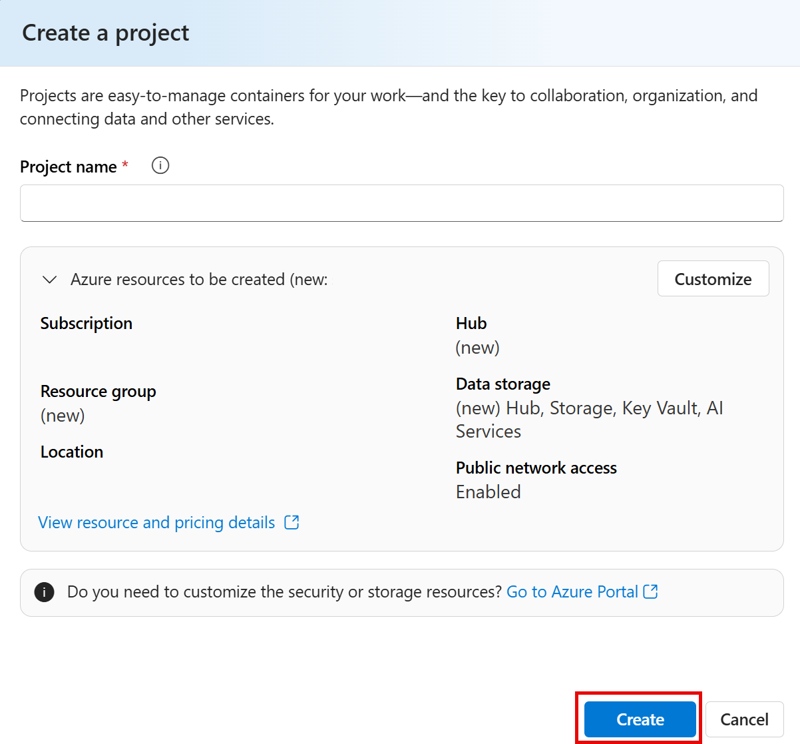
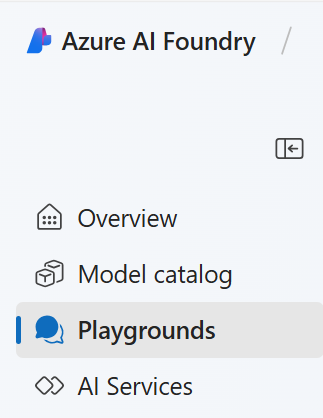

# Explore generative AI in Azure AI Foundry Portal

Generative AI describes a category of capabilities within AI that create content. People typically interact with generative AI that has been built into chat applications. In this exercise, you try out generative AI in Azure AI Foundry portal, Microsoft's platform for creating intelligent applications. 

## Create a project in Azure AI Foundry portal

1. In a browser tab, navigate to [Azure AI Foundry](https://ai.azure.com?azure-portal=true).

1. Sign in with your account. 

1. On the Azure AI Foundry portal home page, select **Create a project**. In Azure AI Foundry, projects are containers that help organize your work.  

    

1. On the *Create a project* pane, you will see a generated project name, which you can keep as-is. Depending on whether you have created a hub in the past, you will either see a list of *new* Azure resources to be created or a drop-down list of existing hubs. If you see the drop-down list of existing hubs, select *Create new hub*, create a unique name for your hub, and select *Next*.  
 
    

    > **Important**: You will need an Azure AI services resouce provisioned in a specific location to complete the rest of the lab.

1. In the same *Create a project* pane, select **Customize** and select one of the following **Locations**: East US, France Central, Korea Central, West Europe, or West US to complete the rest of the lab. Then select **create**. 

1. Take note of the resources that are created: 
- Azure AI services
- Azure AI hub
- Azure AI project
- Storage account
- Key vault
- Resource group  
 
1. After the resources are created, you will be brought to your project's *Overview* page. On the left-hand menu on the screen, select **Playgrounds**.
 
      

## Explore generative AI in Azure AI Foundry's chat playground

1. In Azure AI Foundry's Playgrounds page, select **Try the Chat playground**. The Chat playground is a user interface that enables you to try out building a chat application with different generative AI models.  

1. In order to use Chat playground, you need to associate it with a deployed model. In the Chat playground, select **Create a deployment**. Search for and select **gpt-4**. 

1. In the *Deploy model* window, keep the default naming and selection and select **Deploy**. It may take a moment for the model to deploy. You can check on the status of your deployment by selecting *Models and endpoints* in left-hand menu under *My assets*.
1. In the chat playground, you can use your deployed model when it appears in the *Deployment* selection menu. Make sure the model you deployed is selected. Importantly, you need to select **Apply changes** after you make any changes to the *Setup*. 

1. Consider the following ways you can improve responses from a generative AI assistant:
    - Start with a specific goal for what you want the assistant to do
    - Iterate based on previous prompts and responses to refine the result
    - Provide a source to ground the response in a specific scope of information
    - Add context to maximize response appropriateness and relevance
    - Set clear expectations for the response

1. Let's try generating a resonse using a prompt with a specific goal. In the chat box, enter the following prompt:

    ```prompt
    I'm planning a trip to Paris in September. Can you help me?
    ```

1. Review the response. **Note**: Keep in mind that the specific response you receive may vary due to the nature of generative AI.
 
1. Let's try another prompt. Enter the following:

    ```prompt
    Where's a good location in Paris to stay? 
    ```

1. Review the response, which should provide some places to stay in Paris.

1. Let's iterate based on previous prompts and responses to refine the result. Enter the following prompt:
    
    ```prompt
    Can you give me more information about dining options near the first location?
    ``` 

1. Review the response, which should provide dining options near a location from the previous response. 

1. Now, let's provide a source to ground the response in a specific scope of information. Enter the following: 
    
    ```prompt
    Based on the information at https://en.wikipedia.org/wiki/History_of_Paris, what were the key events in the city's history?
    ```

1. Review the response, which should provide information based on the provided website. 

1. Let's try to add context to maximize the relevance of the response. Enter the following prompt: 

    ```prompt
    What three places do you recommend I stay in Paris to be within walking distance to historical attractions? Explain your reasoning.
    ```

1. Review the response and reasoning for the response.  

1. Now try setting clear expectations for the response. Enter the following prompt:
    
    ```prompt
    What are the top 10 sights to see in Paris? Answer with a numbered list in order of popularity.
    ```

1. Review the response, which should provide a numbered list of sights to see in Paris.

1. When you are done, you can close the browser window.
