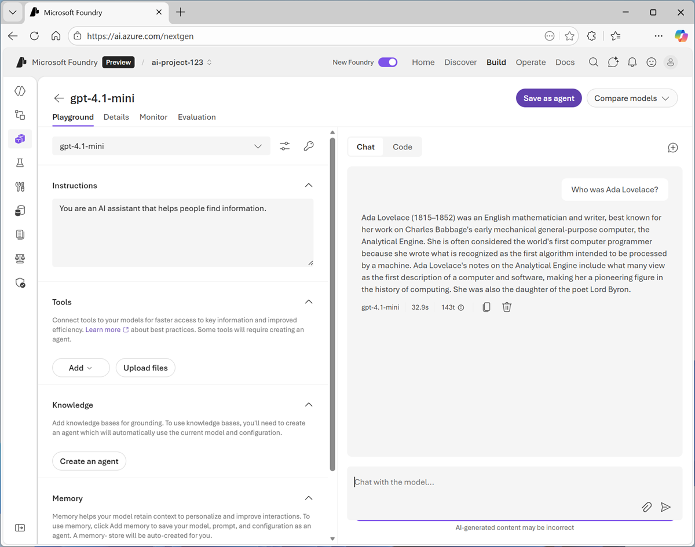
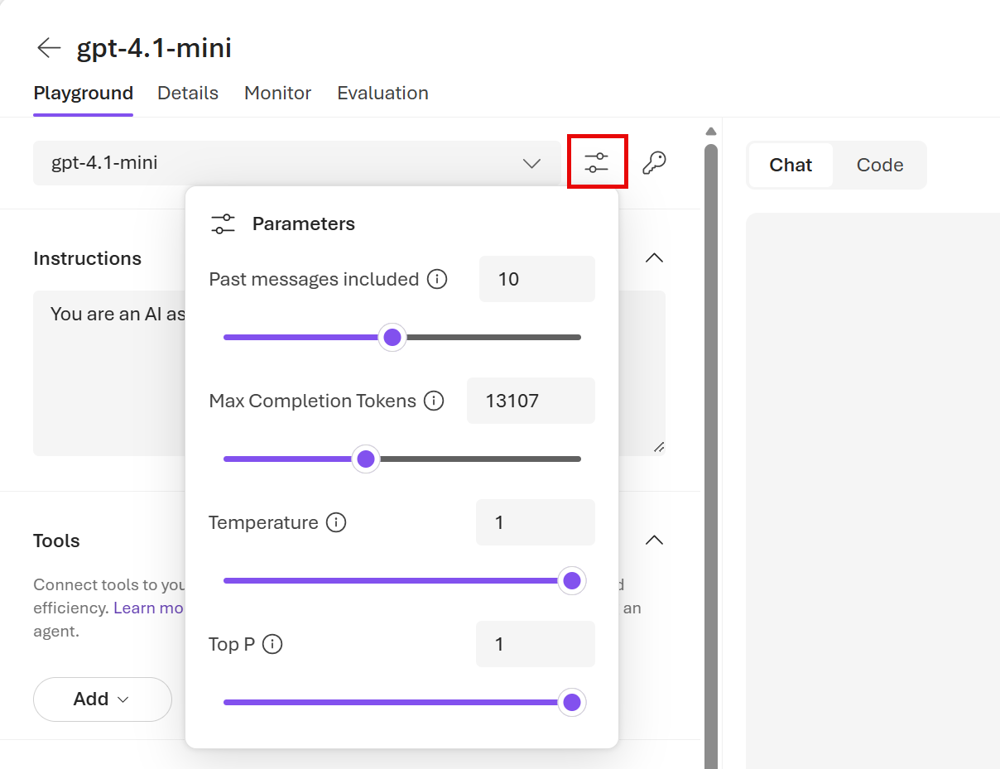
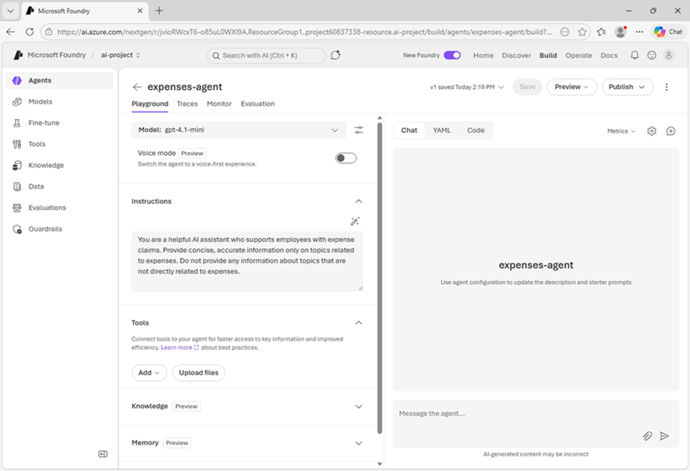
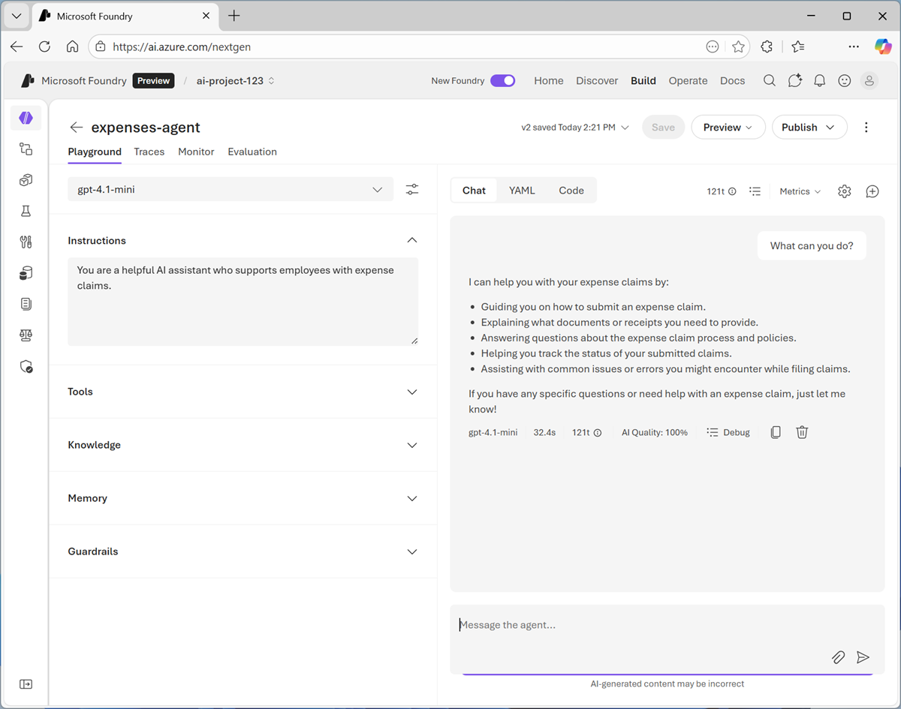
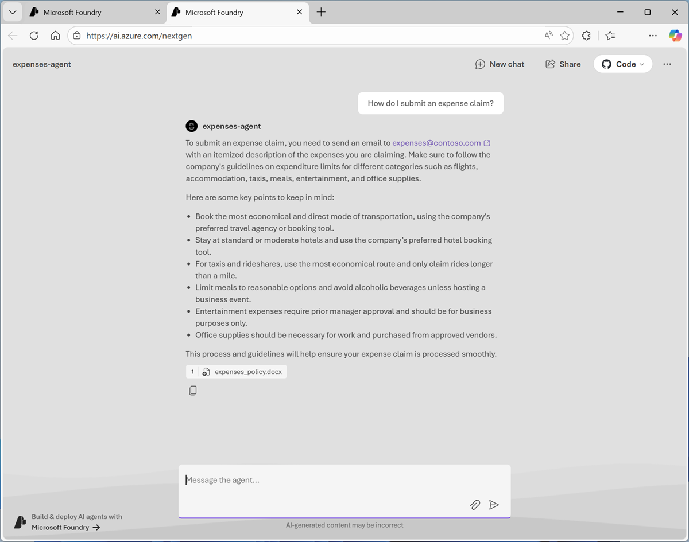

---
lab:
    title: 'Get started with generative AI and agents in Microsoft Foundry'
    description: 'Use Microsoft Foundry to deploy a generative AI model and create an agent.'
---

# Get started with generative AI and agents in Microsoft Foundry

In this exercise, you'll use Microsoft Foundry to deploy and explore a generative AI model. You'll then use the model in an agent that includes knowledge tools to answer user questions.

This exercise should take approximately **45** minutes to complete.

## Create a Microsoft Foundry project

Microsoft Foundry uses *projects* to organize models, resources, data, and other assets used to develop an AI solution.

1. In a web browser, open [Microsoft Foundry](https://ai.azure.com){:target="_blank"} at `https://ai.azure.com` and sign in using your Azure credentials. Close any tips or quick start panes that are opened the first time you sign in, and if necessary use the **Foundry** logo at the top left to navigate to the home page.
1. If it is not already enabled, in the tool bar the top of the page, enable the **New Foundry** option. Then, if prompted, create a new project with a unique name of your choice, using the default options. After creating or selecting a project in the new Foundry portal, it should open in a page similar to the following image:

    

## Deploy a model

At the heart of every generative AI app or agent, there's a language model - usually a large language model (LLM), though in some cases a more compact small language model (SLM) may be used.

1. In the **Start building** menu, select **Browse models** to view the Microsoft Foundry model catalog.

    Microsoft Foundry provides a large collection of models from Microsoft, OpenAI, and other providers, that you can use in your AI apps and agents.

    

1. Search for and select the `gpt-4.1-mini` model, and view the page for this model, which describes its features and capabilities.

    

1. Use the **Deploy** button to deploy the model using the default settings. Deployment may take a minute or so.
1. When the model has been deployed, view the model playground page that is opened, in which you can chat with the model.

    

## Chat with the model

You can use the playground to explore the model by chatting with it and observing the effect of changes to settings like its instructions (sometimes called the *system prompt*) and parameters.

1. Use the button at the bottom of the left navigation pane to hide it and give yourself more room to work with.
1. In the **Chat** pane, enter a prompt such as `Who was Ada Lovelace?`, and review the response.

    

1. Enter a follow-up prompt, such as `Tell me more about her work with Charles Babbage.` and review the response.

    > **Note**: Generative AI chat applications often include the conversation history in the prompt; so the context of the conversation is retained between messages. In this case, "her" is interpreted as referring to Ada Lovelace.

1. At the top-right of the chat pane, use the **New chat** button to restart the conversation. This removes all conversation history.
1. Enter a new prompt, such as `Who was Alan Turing?` and view the response.
1. Continue the conversation with prompts such as `What is the Turing test?` or `What is a Turing machine?`.

## Experiment with system prompts

A system prompt is used to provide the model with instructions that guide its responses. You can use the system prompt to provide guidelines about format, style, and constraints about what the model should and should not include in its responses.

1. At the top of the chat pane, use the **New chat** button to restart the conversation. Then enter a new prompt, such as `What was ENIAC?` and view the response.
1. In the pane on the left, in the **Instructions** text area, change the system prompt to `You are an AI assistant that provides short and concise answers using simple language. Limit responses to a single sentence.`
1. Now try the same prompt as before (`What was ENIAC?`) and review the output.
1. Continue to experiment with different system prompts to try to influence the kinds of response returned by the model.
1. When you have finished experimenting, change the system prompt back to `You are an AI assistant that helps people find information.`

## Experiment with model parameters

Model parameters control how the model works, and can be useful for restricting the size of its responses (measured in *tokens*) and controlling how "creative" its responses can be.

1. Use the **New chat** button to restart the conversation.
1. In the pane on the left, next to the model name, select **Parameters**.

    

1. Review the parameter settings, using the *(i)* links to view their description. Then, without changing them, enter a prompt like `What is Moore's law?` and review the response
1. Experiment by changing the parameter values and repeating the same prompt. You may see some differences in behavior from the model. For example, changing the **Temperature** modifies the randomness of the model's "next word" selection, with lower temperatures resulting in less "creative" response construction.

    ***Tip**: You can use the **Stop generation** button in the chat pane to stop long-running responses.*

1. When you've finished experimenting, reset the parameters to their original values.

## View client code to chat with a model

When you're satisfied with the responses a model returns in the playground, you can develop client applications that consume it. Microsoft Foundry provides a REST API and multiple language-specific SDKs that you can use to connect to the deployed model and chat with it.

1. In the **Chat** pane, view the **Code** tab. This tab shows sample code that a client application can use to chat with the model. Above the sample code, you can choose preferences for:
    - **API**: The OpenAI API is a common standard for implementing conversations with generative AI models. There are two variants of the OpenAI API that you can use:
        - **Completions**: A broadly used programmatic syntax for submitting prompts to a model.
        - **Responses**: A newer syntax that offers greater flexibility for building apps that converse with both standalone models and with *agents*.
    - **Language**: You can write code to consume a model in a wide range of programming languages, including Python. Microsoft C#, JavaScript, and others.
    - **SDK**: You can use a language-specific SDK, which encapsulates the low-level communication details between the client and model; or you can work directly with the REST API, enabling you to have full control over the HTTP request messages that your client sends to the model.
    - **Authentication**: To use a model deployed in Microsoft Foundry, the client application must be authenticated. You can implement authentication using:
        - **Key-based authentication**: The client app must present a security key (which you can find by selecting the key icon above the code sample)
        - **Microsoft Entra ID authentication**: The client app presents an authentication token based on an identify that is assigned to it (or to the current user).

1. Select the following code options:
    - **API**: Responses API
    - **Language**: Python
    - **SDK**: OpenAI SDK
    - **Authentication**: Key authentication

    The resulting sample should be similar to the following code:

    ```python
    from openai import OpenAI
    
    endpoint = "https://your-project-resource.openai.azure.com/openai/v1/"
    deployment_name = "gpt-4.1-mini"
    api_key = "<your-api-key>"
    
    client = OpenAI(
        base_url=endpoint,
        api_key=api_key
    )
    
    response = client.responses.create(
        model=deployment_name,
        input="What is the capital of France?",
    )
    
    print(f"answer: {response.output[0]}")
    ```

    The code connects to the resource endpoint for your Microsoft Foundry project, using its secret authentication key (which you would need to copy into the code to set the **api_key** variable). It then uses your deployed model to generate a response from an input prompt (in this case, the hard-coded question "What is the capital of France?") and prints the response to the output console.

    > **Tip**: If you are using a work or school account to sign into Azure, and you have sufficient permissions in the Azure subscription, you can open the sample code in VS Code for Web to run it, and experiment with editing it.

1. When you have finished reviewing the code, switch back to the **Chat** tab.

## Save the model configuration as an agent

While you can implement generative AI apps using a standalone model, to create a fully agentic AI experience, you need to encapsulate the model, its instructions, and tool configuration that provides additional functionality, in an *agent*. In this exercise, we'll use the model to power an agent that helps employees with expense claims.

1. In the model playground, at the top right select **Save as agent**. Then, when prompted, name your new agent `expenses-agent`.

    When the agent is created, it opens in a new playground specifically for working with agents.

    

1. Change the **Instructions** to `You are a helpful AI assistant who supports employees with expense claims.`
1. At the top of the agent playground, select **Save**.
1. In the pane on the right, view the **YAML** tab, which contains the definition for your agent. Note that its definition includes the model, its parameter settings, and the instructions you specified - similar to this:

    ```yml
    metadata:
      logo: Avatar_Default.svg
      description: ""
      modified_at: "1767997310"
    object: agent.version
    id: expenses-agent:2
    name: expenses-agent
    version: "2"
    description: ""
    created_at: 1767997284
    definition:
      kind: prompt
      model: gpt-4.1-mini
      instructions: You are a helpful AI assistant who supports employees with expense claims.
      temperature: 0.98
      top_p: 1
      tools: []
    ```

1. Switch back to the **Chat** tab, and enter the prompt `What can you do?`

    The response should indicate that the agent is "aware" of its role as an expense claims advisor.

    

1. Enter an expenses-related prompt, such as `How much can I claim for a taxi?`

    The response is likely to be generic. Accurate; but not particularly helpful to the employee. We need to give the agent some knowledge about the company's expense policies and procedures.

## Add a knowledge tool to the agent

Agents use *tools* to perform tasks or find information. You can use a general web search tool or a simple file search tool to provide a source of knowledge; or for more comprehensive agentic solutions, you can create a *Microsoft Foundry IQ* knowledge store that connects the agent to a data source within your enterprise. In this exercise, we'll use a simple file search tool.

1. Open a new browser tab, and view the **[expenses_policy.docx](https://graememalcolm.github.io/ai-labs/data/expenses_policy.docx){:target="_blank"}** at `https://graememalcolm.github.io/ai-labs/data/expenses_policy.docx`. We'll use this to provide a knowledge source that the agent can use to answer questions about expense claims.
1. Download **expenses_policy.docx** to your local computer.
1. Return to the tab containing the agent playground, and in the pane on the left, expand the **Tools** section if it's not already expanded.
1. Upload the **expenses_policy.docx** file, creating a new index with the default index name. When the index has been created, attach it to the agent.
1. At the top of the agent playground, use the **Save** button to update the agent definition.
1. In the pane on the right, view the **YAML** tab, which contains the definition for your agent. Note that its definition now includes the file search tool you added:

    ```yml
    metadata:
      logo: Avatar_Default.svg
      description: ""
      modified_at: "1767999261"
    object: agent.version
    id: expenses-agent:3
    name: expenses-agent
    version: "3"
    description: ""
    created_at: 1767999232
    definition:
      kind: prompt
      model: gpt-4.1-mini
      instructions: You are a helpful AI assistant who supports employees with expense claims.
      temperature: 0.98
      top_p: 1
      tools:
        - type: file_search
          vector_store_ids:
            - vs_sYs3SP17fUcc3E7eJqWfgxBW
    ```

1. Switch back to the **Chat** tab, and enter the same expenses-related prompt as before (for example, `How much can I claim for a taxi?`) and view the response.

    This time the response should be informed by the information in the expenses data source.

1. Try a few more expenses-related prompts, like `What about a hotel?` or `Can I claim the cost of my dinner?`

## Explore options to use the agent

Now that you have an agent, you can power client applications that enable employees to get expense claims guidance.

1. At the top of the agent playground, in the **Preview** drop-down list, select **Preview agent**.
1. In the preview web page that opens in a new tab, enter a prompt such as `How do I submit an expense claim?` and review the response.

    

1. Explore the agent preview by submitting some more prompts. When you're finished, close the browser tab containing the preview app and return to the agent playground.
1. In the agent playground, note that the **Publish** button can be used to publish your agent as an enterprise application in Azure so it can be consumed within Microsoft 365 and Teams.

    In many cases, publishing an expense claim support agent for use in the enterprise application ecosystem would be an ideal way to implement an agentic solution. However, in other cases you may want to consume the agent from a custom application. 

1. Switch from the **Chat** tab to the **Code** tab, and view the sample code for consuming the agent. The code uses the OpenAI Responses API; but has some agent-specific differences from the code you previously examined to chat with the model.

    ```python
    # Before running the sample:
    #    pip install --pre azure-ai-projects>=2.0.0b1
    #    pip install azure-identity
    
    from azure.identity import DefaultAzureCredential
    from azure.ai.projects import AIProjectClient
    
    myEndpoint = "https://your-project-resource.services.ai.azure.com/api/projects/ai-project-123"
    
    project_client = AIProjectClient(
        endpoint=myEndpoint,
        credential=DefaultAzureCredential(),
    )
    
    myAgent = "expenses-agent"
    # Get an existing agent
    agent = project_client.agents.get(agent_name=myAgent)
    print(f"Retrieved agent: {agent.name}")
    
    openai_client = project_client.get_openai_client()
    
    # Reference the agent to get a response
    response = openai_client.responses.create(
        input=[{"role": "user", "content": "Tell me what you can help with."}],
        extra_body={"agent": {"name": agent.name, "type": "agent_reference"}},
    )
    
    print(f"Response output: {response.output_text}")
    ```

    > **Tip**: As with the previous code sample, if you are using a work or school account to sign into Azure, and you have sufficient permissions in the Azure subscription, you can open the sample code in VS Code for Web to run it, and experiment with editing it.

## Summary

In this exercise, you explored how to deploy an chat with a generative AI model in Microsoft Foundry portal. You then saved the model as an agent, and configured the agent with instructions and tools before exploring options for deploying and using the agent.

The agent explored in this exercise is a simple example that demonstrates how quickly and easily you can get started with generative AI app and agent development using Microsoft Foundry. From this foundation, you could build a comprehensive agentic solution in which agents use tools to find information and automate tasks, and collaborate with one another to perform complex workflows.

## Clean Up

If you have finished exploring Microsoft Foundry, you should delete the resources created in this exercises to avoid unnecessary utilization charges.

1. Open the [Azure portal](https://portal.azure.com){:target="_blank"} at `https://portal.azure.com` and view the contents of the resource group where you deployed the project used in this exercise.
1. On the toolbar, select **Delete resource group**.
1. Enter the resource group name and confirm that you want to delete it.