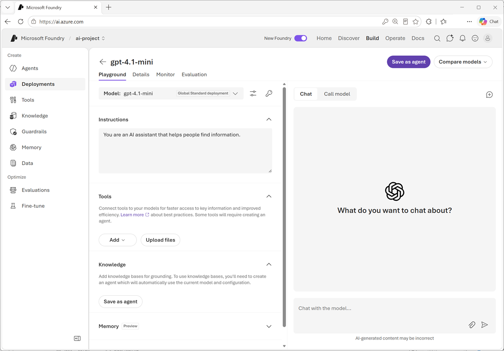
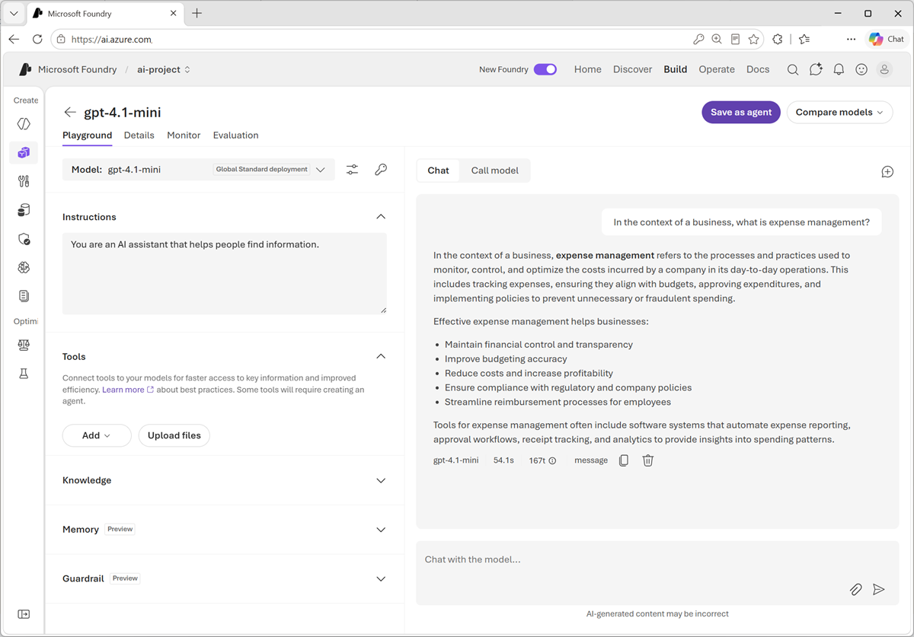
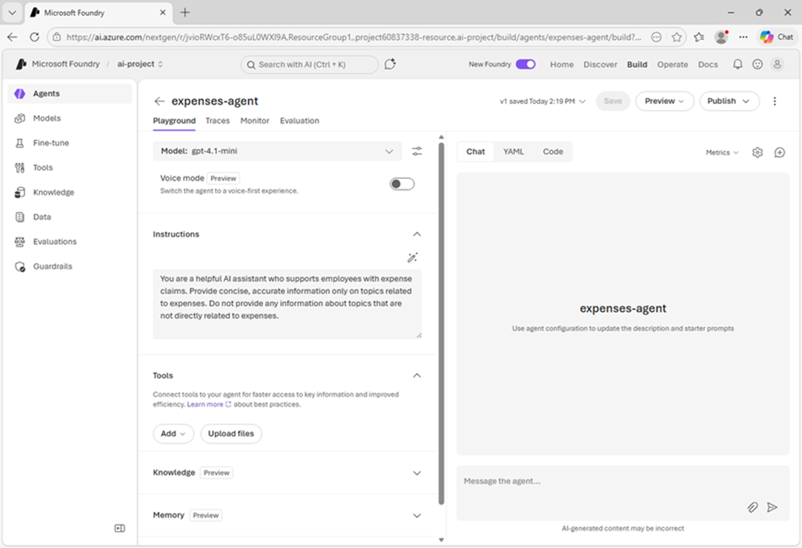
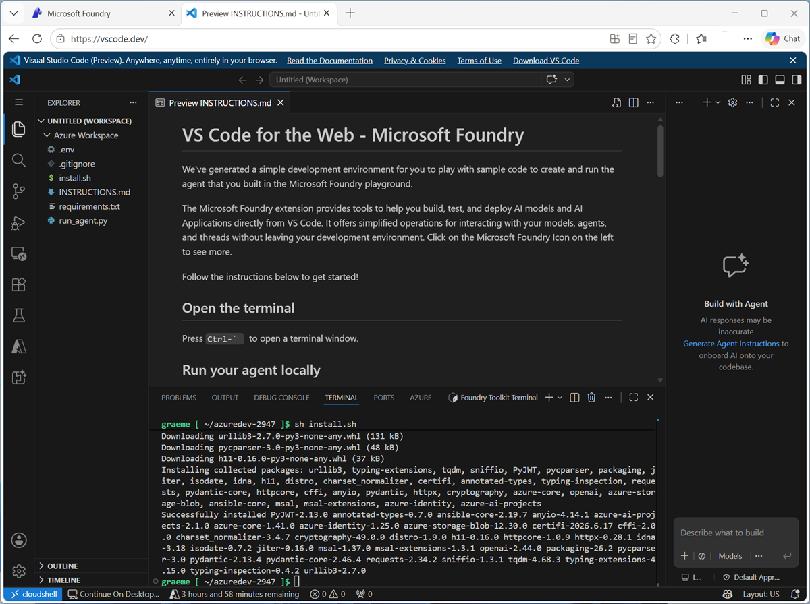
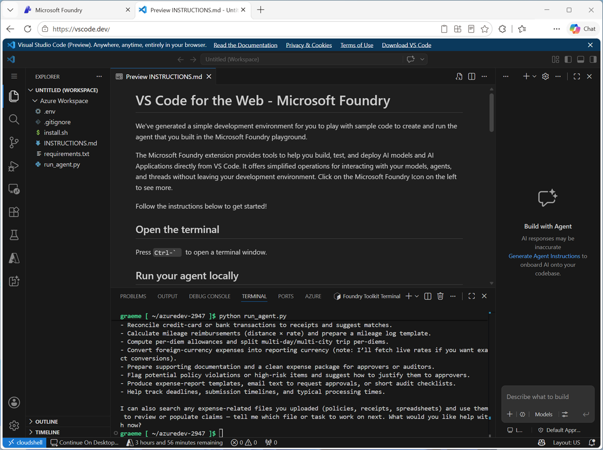

---
lab:
  title: Get started with generative AI and agents in Microsoft Foundry
  description: Use Microsoft Foundry to deploy a generative AI model and create an agent.
  level: 200
  duration: 35 minutes
  islab: true
  primarytopics:
    - Microsoft Foundry
---

# Get started with generative AI and agents in Microsoft Foundry

In this exercise, you'll use Microsoft Foundry to deploy and explore a generative AI model to answer general questions related to expense claims. You'll then use the model in an agent that includes knowledge tools to answer specific expense-related questions.

> **Note**: Many components of Microsoft Foundry, including the Microsoft Foundry portal, are subject to continual development. This reflects the fast-moving nature of artificial intelligence technology. Some elements of your user experience may differ from the images and descriptions in this exercise!

This exercise should take approximately **35** minutes to complete.

## Create a Microsoft Foundry project

Microsoft Foundry uses *projects* to organize models, resources, data, and other assets used to develop an AI solution.

1. In a web browser, open [Microsoft Foundry](https://ai.azure.com){:target="_blank"} at `https://ai.azure.com` to start building; signing in using your Azure credentials.

1. If it is not already enabled, in the tool bar the top of the page, enable the **New Foundry** option. Then, if prompted, create a new project with a unique name; expanding the  **Advanced options** area to specify the following settings for your project:
    - **Foundry resource**: *Enter a valid name for your AI Foundry resource.*
    - **Subscription**: *Your Azure subscription*
    - **Resource group**: *Create or select a resource group*
    - **Region**: Select any of the **AI Foundry recommended** regions in **[this list](https://learn.microsoft.com/azure/foundry/openai/how-to/responses#region-availability)**{:target="_blank"}

    > **Note**: Depending on your permissions in the Azure subscription, you may need to clear the option to set up recommended resources.

1. Select **Create**. Wait for your project to be created. It may take a few minutes. After creating or selecting a project in the new Foundry portal, it should open in a page similar to the following image:

    

## Deploy a model

At the heart of every generative AI app or agent, there's a language model - usually a large language model (LLM), though in some cases a more compact small language model (SLM) may be used.

1. Now you're ready to explore models. On the **Discover** page, select the **Models** tab to view the Microsoft Foundry model catalog.

    Microsoft Foundry provides a large collection of models from Microsoft, OpenAI, and other providers, that you can use in your AI apps and agents.

    

1. Search for and select the `gpt-4.1-mini` model, and view the page for this model, which describes its features and capabilities.

    

1. Use the **Deploy** button to deploy the model using the default settings. Deployment may take a minute or so.

    > **Tip**: Model deployments are subject to regional quotas. If you don't have enough quota to deploy the model in your project's region, you can use a different model - such as gpt-4.1-nano, or gpt-4o-mini. Alternatively, you can create a new project in a different region.

1. When the model has been deployed, view the model playground page that is opened, in which you can chat with the model.

    

## Chat with the model

You can use the playground to explore the model by chatting with it and observing the effect of changes to settings like its instructions (sometimes called the *system prompt*) and parameters.

1. Use the button at the bottom of the left navigation pane to hide it and give yourself more room to work with.
1. In the **Chat** pane, enter a prompt such as `In the context of a business, what is expense management?`, and review the response.

    

1. Enter a new prompt, such as `Tell me about per-diem allowances.` and view the response.
1. Continue the conversation with another prompt, such as `How are they reimbursed?`.

    > **Note**: Generative AI chat applications often include the conversation history in the prompt; so the context of the conversation is retained between messages. In this case, "her" is interpreted as referring to Ada Lovelace.

## View client code to chat with a model

When you're satisfied with the responses a model returns in the playground, you can develop client applications that consume it. Microsoft Foundry provides a REST API and multiple language-specific SDKs that you can use to connect to the deployed model and chat with it.

1. In the **Chat** pane, view the **Call model** tab. This tab shows sample code that a client application can use to chat with the model. Above the sample code, you can choose preferences for:
    - **API**: The OpenAI API is a common standard for implementing conversations with generative AI models. There are two variants of the OpenAI API that you can use:
        - **Completions**: A broadly used programmatic syntax for submitting prompts to a model.
        - **Responses**: A newer syntax that offers greater flexibility for building apps that converse with both standalone models and with *agents*.
    - **Language**: You can write code to consume a model in a wide range of programming languages, including Python. Microsoft C#, JavaScript, and others.
    - **SDK**: You can use a language-specific SDK, which encapsulates the low-level communication details between the client and model; or you can work directly with the REST API, enabling you to have full control over the HTTP request messages that your client sends to the model.
    - **Authentication**: To use a model deployed in Microsoft Foundry, the client application must be authenticated. You can implement authentication using:
        - **Key-based authentication**: The client app must present a security key (which you can find by selecting the key icon above the code sample)
        - **Microsoft Entra ID authentication**: The client app presents an authentication token based on an identify that is assigned to it (or to the current user).

1. Select the following code options:
    - **Language**: Python
    - **Authentication**: Key authentication

    The resulting sample should be similar to the following code:

    ```python
    from openai import OpenAI
    
    endpoint = "https://{your-foundry-resource}.openai.azure.com/openai/v1/"
    deployment_name = "gpt-4.1-mini"
    api_key = "<your-api-key>"
    
    client = OpenAI(
        base_url=endpoint,
        api_key=api_key
    )
    
    response = client.responses.create(
        model=deployment_name,
        input="What is the capital of France?",
    )
    
    print(f"answer: {response.output[0]}")
    ```

    The code connects to the **OpenAI** endpoint for your Microsoft Foundry resource, using its secret authentication key (which you would need to copy into the code to set the **api_key** variable). It then uses the **responses.create** method to generate a response from your deployed model from an input prompt (in this case, the hard-coded question "What is the capital of France?") and prints the response to the output console.

## Specify instructions in a *system prompt*

So far, you've used the model to provide general information. To support specific use cases, you should use a *system prompt* to provide the model with instructions that guide its responses. You can use the system prompt to give the model a specific focus or role, and provide guidelines about format, style, and constraints about what the model should and should not include in its responses.

For example, suppose an organization wants to use a generative AI model to power an AI agent that assists employees with expense claims.

1. In the model playground, switch back to the **Chat** tab. Then, at the top-right of the chat pane, use the **New chat** button to restart the conversation and removes the conversation history.
1. In the pane on the left, in the **Instructions** text area, change the system prompt to:

    ```
   You are a helpful AI assistant who supports employees with expense claims. Provide concise, accurate information only on topics related to expenses. Do not provide any information about topics that are not directly related to expenses.
    ```

1. Now enter a new user prompt related to expense claims, such as `What's a purchasing card?`

    Review the response, which should provide some general guidance about expense claims.

1. Try asking a question that is unrelated to expenses, such as `What's the capital of Spain?`; and compare the response now that the system prompt has changed.

    So far, we've specified instructions in the *playground*; but they're not saved outside of that environment. In a client application, you would need to include the system prompt as an **instructions** parameter in the **responses.create** method, like this:

    ```python
    response = client.responses.create(
            model=deployment_name,
            instructions="""
                You are a helpful AI assistant who supports employees with expense claims.
                Provide concise, accurate information only on topics related to expenses.
                Do not provide any information about topics that are not directly related to expenses.
            """
            input="What kinds of business expense are typically reimbursed by employers?",
        )
    ```

    To encapsulate the instructions and model in a single AI entity, we need to save the configuration as an *agent*.

## Save the model configuration as an agent

While you can implement generative AI apps using a standalone model, to create a fully agentic AI experience, you need to encapsulate the model, its instructions, and any tool configuration that provides additional functionality, in an *agent*.

1. In the model playground, at the top right select **Save as agent**. Then, when prompted, name your new agent `expenses-agent`.

    When the agent is created, it opens in a new playground specifically for working with agents.

    

1. In  the **Chat** tab,  enter the prompt `Who are you?`

    The response should indicate that the agent is "aware" of its role as an expense claims advisor.

1. Enter an expenses-related prompt, such as `How much can I claim for a taxi?`

    The response is likely to be generic, based on the data that the model was trained with. Accurate; but not particularly helpful to the employee. We need to give the agent some knowledge about the company's expense policies and procedures.

## Add tools to the agent

Agents use *tools* to perform tasks or find information. You can use a general web search tool or a simple file search tool to provide a source of knowledge; or for more comprehensive agentic solutions, you can create a *Microsoft Foundry IQ* knowledge store that connects the agent to one or more data sources within your enterprise.

1. In the agent playground, in the pane on the left, expand the **Tools** section if it's not already expanded.

    When you saved the model as an agent, Microsoft Foundry may have automatically added the **Web search** tool.

    > **Tip**: If not, you can add it in the **Tools** drop-down list** and then use the **Save** button at the top to save the changes to your agent.

1. In the chat pane, enter the prompt `Find me a credit card that's good for business expenses` and view the response.

    The agent should use the *Web search* tool to find current credit card deals on the Internet.

The web search tool is great for finding general information on the public Internet; but we need our agent to be able to get information from corporate expense policy documentation.

1. Open a new browser tab, and view the **[expenses_policy.docx](https://microsoftlearning.github.io/mslearn-ai-fundamentals/data/expenses_policy.docx){:target="_blank"}** at `https://microsoftlearning.github.io/mslearn-ai-fundamentals/data/expenses_policy.docx`. We'll use this to provide a knowledge source that the agent can use to answer questions about expense claims.
1. Download **expenses_policy.docx** to your local computer.
1. Return to the tab containing the agent playground, and in the pane on the left, expand the **Tools** section if it's not already expanded.
1. Upload the **expenses_policy.docx** file, creating a new index with the default index name. When the index has been created, attach it to the agent.
1. At the top of the agent playground, use the **Save** button to update the agent definition.
1. In the **Chat** tab, enter the same expenses-related prompt as before (for example, `How much can I claim for a taxi?`) and view the response.

    This time the response should be informed by the information in the expenses data source.

1. Try a few more expenses-related prompts, like `What about a hotel?` or `Can I claim the cost of my dinner?`

    You've successfully added tools to your agent, so it now encapsulates the instructions and capabilities you need to support employees with expense enquiries.

1. In the pane on the right, view the **YAML** tab, which contains the definition for your agent. Note that its definition includes the instructions you set in the system prompt, and web search and file search tools you added (in the **tools** section):

    ```yml
    metadata:
      logo: Avatar_Default.svg
      description: ""
      modified_at: "1782426769"
      microsoft.voice-live.enabled: "false"
    object: agent.version
    id: expenses-agent:2
    name: expenses-agent
    version: "2"
    description: ""
    created_at: 1782426769
    definition:
      kind: prompt
      model: gpt-4.1-mini
      instructions: You are a helpful AI assistant who supports employees with expense claims. Provide concise, accurate information only on topics related to expenses. Do not provide any information about topics that are not directly related to expenses.
      temperature: 1
      top_p: 1
      tools:
        - type: web_search
        - type: file_search
          vector_store_ids:
            - vs_erRFXnYdFNlXyK0RHJjn11uL
    status: active
    instance_identity:
      principal_id: 44acce74-8425-4e5c-8752-f5e96874eeb4
      client_id: 44acce74-8425-4e5c-8752-f5e96874eeb4
    blueprint:
      principal_id: f5630a7b-af07-4bcd-af2e-5cae44a09a1a
      client_id: 4b423d44-9d0c-4850-8d7c-a72a8e688d14
    blueprint_reference:
      type: ManagedAgentIdentityBlueprint
      blueprint_id: expenses-agent-ff8f8
    agent_guid: ff8f8a8a-0fa8-4d30-a715-d6e9588ed9f2
    ```

## Preview the agent

Now you have a working agent, you can preview it in a basic web chat application.

1. In the Agent Playground in the Foundry Portal, at the top of the chat pane, in the **Publish** drop-down list, select **Preview web app**.

    A preview chat interface is opened in a new browser tab.

1. Enter a prompt, such as `How do I submit an expense claim?` and view the response from your agent.

    

## View client code to access the agent in your project

The agent is defined within your Foundry project, and there's a convenient way to develop apps that connect to it there; allowing you to iteratively refine both the agent and the client app to create the solution you need.

1. In the agent playground, switch from the **Chat** tab to the **Call agent** tab, and view the sample code for consuming the agent; which should be similar to this:

    ```python
    # Before running the sample:
    # pip install azure-ai-projects>=2.0.0
    
    from azure.identity import DefaultAzureCredential
    from azure.ai.projects import AIProjectClient
    
    my_endpoint = "https://{your-foundry-resource}.services.ai.azure.com/api/projects/{your-project}"
    
    project_client = AIProjectClient(
        endpoint=my_endpoint,
        credential=DefaultAzureCredential(),
    )
    
    my_agent = "expenses-agent"
    my_version = "2"
    
    openai_client = project_client.get_openai_client()
    
    # Reference the agent to get a response
    
    response = openai_client.responses.create(
        input=[{"role": "user", "content": "Tell me what you can help with."}],
        extra_body={"agent_reference": {"name": my_agent, "version": my_version, "type": "agent_reference"}},
    )
    
    print(f"Response output: {response.output_text}")
    ```

    The code to connect to your agent uses the **Azure.AI.Projects** library to create an **AIProjectClient** object connected to your Foundry project. Since this involves connecting to a project, which may contain priveleged resources, key-based authentication is <u>not</u> supported, and the application must use an Entra ID identity to be authenticated.

    After connecting to the project, the code uses the project client's **get_openai_client** method to retrieve an OpenAI client object; with which it can submit prompts to the agent using the same **Responses** API we peviously saw being used to chat with a model. Since a project can contain multiple agents and models, the specific agent details are specified as **extra_body** in the **responses.create** method.

1. In the **Call agent** tab, use the available option to open the code in **VS Code for the web**.

    Wait for the environment to be set up.

    > **Tip**: It can take a few minutes to set the envionment up!

    

1. After VS Code for the web has opened and the environment has been set up, close the GitHub Copilot **Chat** pane on the right side to give you more room, and note that the **Instructions.md** file contains the instructions you need to run the sample code (which is in the **run_agent.py** file in the VS Code Explorer pane on the left.)
1. In the terminal pane at the bottom, enter the following command to run the code:

    ```python
   python run_agent.py
    ```

    The output should inlude a response to the prompt *Tell me what you can help with.*

    

    > **Tip**: If an authentication issue occurs, you may need to sign into Azure in the VS Code terminal by using the Azure CLI `az login` command. See the [Azure CLI documentation](https://learn.microsoft.com/cli/azure/authenticate-azure-cli-interactively){:target="_blank"} for details.

    The Azure AI Projects SDK and Foundry integration in Visual Studio Code enable developers to build effective agentic solutions, quickly and efficiently.

## Summary

In this exercise, you explored how to deploy and chat with a generative AI model in Microsoft Foundry portal. You then saved the model as an agent, and configured the agent with instructions and tools before exploring options for integrating the agent into an application.

The agent explored in this exercise is a simple example that demonstrates how quickly and easily you can get started with generative AI app and agent development using Microsoft Foundry. From this foundation, you could build a comprehensive agentic solution in which agents use tools to find information and automate tasks, and collaborate with one another to perform complex workflows.

> **[Ask Anton](https://aka.ms/azk-anton){:target="_blank"}**<br/><br/>If you have questions about some of the topics covered in this exercise, *[Ask Anton](https://aka.ms/azk-anton){:target="_blank"}* is a generative AI-based agent that you can ask about AI concepts and Microsoft Foundry. Open the app at **[https://aka.ms/azk-anton](https://aka.ms/azk-anton){:target="_blank"}** and use the **Configure** button to enter your Foundry project and model details.<br/><br/>*Ask Anton is not a supported Microsoft product or a component of Microsoft Learn or AI Skills Navigator. Just an example of an AI agent for you to explore as you learn about what's possible with AI.*<br/><br/>If you *do* check out Ask Anton, we'd love you to *[tell us about your experience](https://forms.office.com/r/fC0ndfBQeK){:target="_blank"}*!

## Clean Up

If you have finished exploring Microsoft Foundry, you should delete the resources created in this exercises to avoid unnecessary utilization charges.

1. Open the [Azure portal](https://portal.azure.com){:target="_blank"} at `https://portal.azure.com` and view the contents of the resource group where you deployed the project used in this exercise.
1. On the toolbar, select **Delete resource group**.
1. Enter the resource group name and confirm that you want to delete it.

<!--
> **Tip**: If you want to keep the Foundry project, but avoid being charged for the published agent, use the **&vellip;** menu next to the **Publish** drop-down list to delete the agent.
-->
