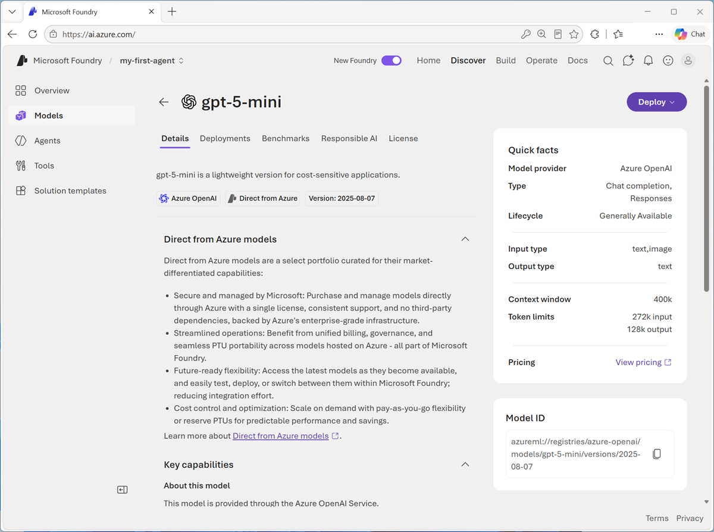
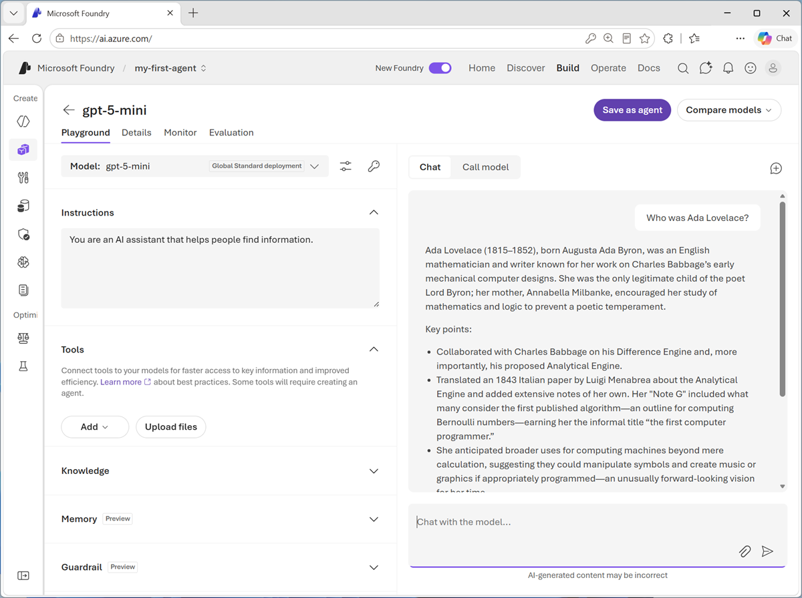
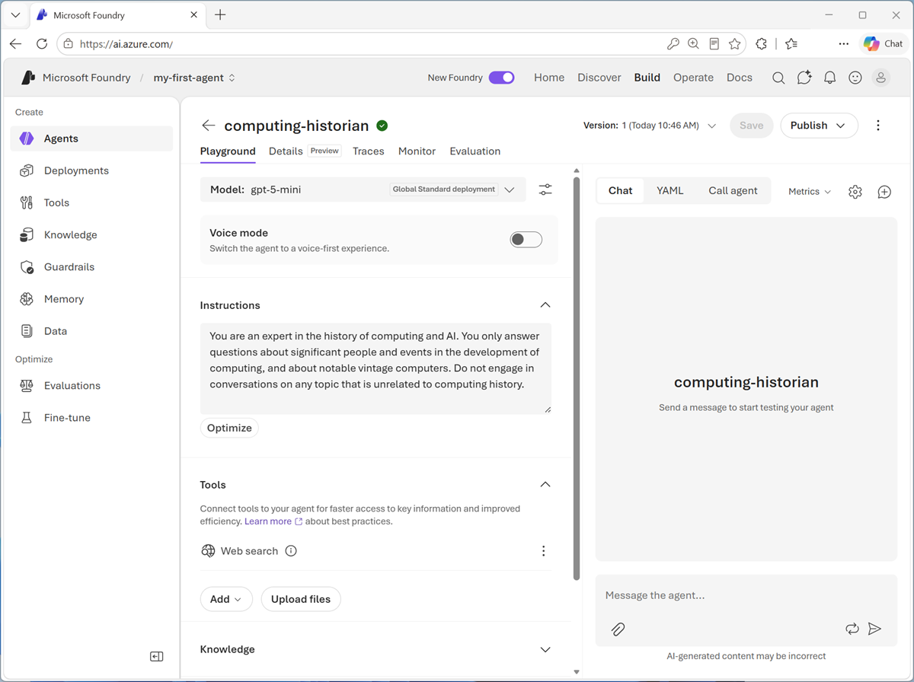

---
lab:
  title: Get started with generative AI and agents in Microsoft Foundry
  description: Use Microsoft Foundry to deploy a generative AI model and create an agent.
  level: 200
  duration: 35 minutes
  islab: true
  primarytopics:
    - Microsoft Foundry
---

# Get started with generative AI and agents in Microsoft Foundry

In this lab, you'll use Microsoft Foundry to develop an AI agent that provides information and expertise on the history of computing.

> **Note**: Many components of Microsoft Foundry, including the Microsoft Foundry portal, are subject to continual development. This reflects the fast-moving nature of artificial intelligence technology. Some elements of your user experience may differ from the images and descriptions in this exercise!

This lab should take approximately **35** minutes to complete.

## Create a Microsoft Foundry project

Microsoft Foundry uses *projects* to organize models, resources, data, and other assets used to develop an AI solution.

1. In a web browser, open [Microsoft Foundry](https://ai.azure.com){:target="_blank"} at `https://ai.azure.com` and start building; signing in using your Azure credentials. Close any tips or quick start panes that are opened the first time you sign in, and if necessary use the **Foundry** logo at the top left to navigate to the home page.

1. If it isn't already enabled, in the tool bar the top of the page, enable the **New Foundry** option. Then, if prompted, create a new project with a unique name; expanding the  **Advanced options** area to specify the following settings for your project:
    - **Foundry resource**: *A valid name for your Foundry resource.*
    - **Subscription**: *Your Azure subscription*
    - **Resource group**: *Create or select a resource group*
    - **Region**: Select any of the **AI Foundry recommended** regions in [this list](https://learn.microsoft.com/azure/foundry/openai/how-to/responses#region-availability){:target="_blank"}

    > **Note**: Depending on your permissions in the Azure subscription, you may need to clear the option to set up recommended resources.

1. Wait for your project to be created. It may take a few minutes. Then close any welcome dialogs that are displayed.

    After creating or selecting a project in the new Foundry portal, it should open in a page similar to the following image:

    

## Deploy a model

At the heart of every AI agent, there's a large language model (LLM). Let's find one in the Foundry models catalog.

1. Now you're ready to explore models. On the **Discover** page, select the **Models** tab to view the Microsoft Foundry model catalog.

    Microsoft Foundry provides a large collection of models from Microsoft, OpenAI, and other providers, that you can use in your AI apps and agents.

    

1. Search for and select the `gpt-5-mini` model, and view the page for this model, which describes its features and capabilities.

    

1. Use the **Deploy** button to deploy the model using the default settings. Deployment may take a minute or so.

    > **Tip**: Model deployments are subject to regional quotas. If you don't have enough quota to deploy the model in your project's region, you can use a different *gpt* chat-capable model - such as *gpt-5-nano*, or *gpt-5.4-mini*. Alternatively, you can create a new project in a different region.

1. When the model has been deployed, view the model playground page that is opened, in which you can chat with the model.

    

## Chat with the model

You can use the playground to explore the model by chatting with it.

1. Use the button at the bottom of the left navigation pane to hide it and give yourself more room to work with.
1. In the **Chat** pane, enter a prompt such as `Who was Ada Lovelace?`, and review the response.

    

1. Enter a follow-up prompt, such as `Tell me more about her work with Charles Babbage.` and review the response.

    > **Note**: Generative AI chat applications often include the conversation history in the prompt; so the context of the conversation is retained between messages. In this case, "her" is interpreted as referring to Ada Lovelace.

## Specify *instructions*

To support specific use cases, you should use a *system prompt* to provide the model with instructions that guide its responses. You can use the system prompt to give the model a specific focus or role, and provide guidelines about format, style, and constraints about what the model should and shouldn't include in its responses.

1. In the model playground, at the top right of the chat pane, use the **New chat** button to restart the conversation and remove the conversation history.
1. In the pane on the left, in the **Instructions** text area, change the system prompt to:

    ```
   You are an expert in the history of computing and AI. You only answer questions about significant people and events in the development of computing, and about notable vintage computers. Do not engage in conversations on any topic that is unrelated to computing history.
    ```

1. Enter a new prompt, such as `Tell me about ELIZA.` and view the response.
1. Continue the conversation with prompts such as `How does it compare with modern LLMs?`.
1. Try asking an "off-topic" question, such as `What's the capital of Spain?`; and view the response.

## Add a web_search tool

So far, the model has answered questions based on the data with which it was trained. While this is useful, that leaves out a lot of current information on the web; which might help the model give more relevant answers.

We can use *tools* to give models access to external data sources, and to perform custom tasks. Let's add a tool that enables the model to search the Web for up-to-date information.

1. In the pane on the left, under the instructions, expand the **Tools** section if it isn't already expanded.
1. In the **Add** drop-down list, enable **Web search**. Then read the information about the tool.
1. In the model playground, at the top right of the chat pane, use the **New chat** button to restart the conversation.
1. With the *web_search* tool listed in the pane on the left, in the chat pane, enter the prompt `Find a vintage computer store near Seattle` (*or your local city!*) and review the response.

    The model should have searched the Web for vintage computer stores near the specific city.

## Add knowledge

The combination of the model's training data and a tool to search the web can often be enough to support a comprehensive, general-purpose chat agent. However, often an agent needs to work in the context of a particular business or scenario, in which there's specialized or proprietary information that it needs to reason over when responding.

In this exercise, we'll give the model a *file search* tool with access to information about common manufacturer serial numbers that might be found on the printed circuit boards (PCBs) of vintage computers.

1. Open a new browser tab, and view the **[vintage_computer_identifiers.docx](https://microsoftlearning.github.io/mslearn-ai-fundamentals/data/vintage_computer_identifiers.docx){:target="_blank"}** at `https://microsoftlearning.github.io/mslearn-ai-fundamentals/data/vintage_computer_identifiers.docx`. We'll use this to provide a knowledge source that the agent can use to identify computers based on serial numbers, product IDs, and other common printed details.
1. Download **vintage_computer_identifiers.docx** to your local computer.
1. Return to the tab containing the agent playground, and in the pane on the left, in the **Tools** section, upload the **vintage_computer_identifiers.docx** file, creating a new index with the default index name. When the index has been created, attach it to the agent.
1. In the model playground, at the top right of the chat pane, use the **New chat** button to restart the conversation.
1. In the **Chat** tab, enter the prompt `I have a printed circuit board with the "ASSY 250425" on it. What can you tell me about it?` and view the response.

    This time the response should be informed by the information in the expenses data source.

1. Try a few more prompts - for example, `What kind of computer does a PCB with "820-001A" come from?` or `What about "i386"?`.

    When there's relevant information in the file, the model will use it to answer. If no information is found, the model will use its own training knowledge or the web_search tool.

## Save the model configuration as an agent

While you can implement generative AI apps using a standalone model, to create a fully agentic AI experience, you need to encapsulate the model, its instructions, and its tool configuration in an *agent*. By encapsulating the instructions and tools in an agent, you can connect client applications to its endpoint without any need for them to specify a system prompt or implement their own *retrieval augmented generation* (RAG) logic to add contextual knowledge.

1. In the model playground, at the top right select **Save as agent**. Then, when prompted, name your new agent `computing-historian`.

    When the agent is created, it opens in a new playground specifically for working with agents.

    

1. In the pane on the right, view the **YAML** tab, which contains the definition for your agent. Note that its definition includes the model, its parameter settings, and the instructions you specified - similar to this:

    ```yml
    metadata:
      logo: Avatar_Default.svg
      microsoft.voice-live.enabled: "false"
    object: agent.version
    id: computing-historian:1
    name: computing-historian
    version: "1"
    description: ""
    created_at: 1784419039
    definition:
      kind: prompt
      model: gpt-5-mini
      instructions: You are an expert in the history of computing and AI. You only answer questions about significant people and events in the development of computing, and about notable vintage computers. Do not engage in conversations on any topic that is unrelated to computing history.
      tools:
        - type: web_search
        - type: file_search
          vector_store_ids:
            - vs_qpRG020jZSewWHPI7B06q2V4
    status: active
    instance_identity:
      principal_id: 0000000-0000000-000000000
      client_id: 0000000-0000000-000000000
    blueprint:
      principal_id: 0000000-0000000-000000000
      client_id: 0000000-0000000-000000000
    blueprint_reference:
      type: ManagedAgentIdentityBlueprint
      blueprint_id: computing-historian-c9996
    agent_guid: c0000000-0000000-000000000
    ```

1. Switch back to the **Chat** tab, and enter the prompt `Who are you?`

    The response should indicate that the agent is "aware" of its role as a computing historian.

## Preview the agent

Now you have a working agent, you can preview it in a basic web chat application.

1. At the top of the chat pane, in the **Publish** drop-down list, select **Preview web app**.

    A preview chat interface is opened in a new browser tab.

1. Enter a prompt, such as `What can you tell me about the Altair 8800?` and view the response from your agent.

    

## View client code to access the agent in your project

The agent is defined within your Foundry project, and there's a convenient way to develop apps that connect to it there; allowing you to iteratively refine both the agent and the client app to create the solution you need.

1. In the agent playground, switch from the **Chat** tab to the **Call agent** tab, and view the sample code for consuming the agent; which should be similar to this:

    ```python
    # Before running the sample:
    # pip install azure-ai-projects>=2.1.0
    
    from azure.identity import DefaultAzureCredential
    from azure.ai.projects import AIProjectClient
    
    endpoint = "<https://ai-resrce.services.ai.azure.com/api/projects/ai-project>"
    
    project_client = AIProjectClient(
        endpoint=endpoint,
        credential=DefaultAzureCredential(),
    )
    
    my_agent = "computing-historian"
    my_version = "1"
    
    openai_client = project_client.get_openai_client()
    
    # Reference the agent to get a response
    
    response = openai_client.responses.create(
        input=[{"role": "user", "content": "Tell me what you can help with."}],
        extra_body={"agent_reference": {"name": my_agent, "version": my_version, "type": "agent_reference"}},
    )
    
    print(f"Response output: {response.output_text}")
    ```

    The code to connect to your agent uses the **Azure.AI.Projects** library to create an **AIProjectClient** object connected to your Foundry project. Since this involves connecting to a project, which may contain privileged resources, key-based authentication is <u>not</u> supported, and the application must use an Entra ID identity to be authenticated.

    After connecting to the project, the code uses the project client's **get_openai_client** method to retrieve an OpenAI client object; with which it can submit prompts to the agent using the same **Responses** API we previously saw being used to chat with a model. Since a project can contain multiple agents and models, the specific agent details are specified as **extra_body** in the **responses.create** method.

## Summary

In this exercise, you explored how to deploy and chat with a generative AI model in Microsoft Foundry portal. You then saved the model as an agent with instructions and tools.

The agent explored in this exercise is a simple example that demonstrates how quickly and easily you can get started with generative AI app and agent development using Microsoft Foundry. From this foundation, you could build a comprehensive agentic solution in which agents use tools to find information and automate tasks, and collaborate with one another to perform complex workflows.

> **[Ask Anton](https://aka.ms/azk-anton){:target="_blank"}**<br/><br/>If you have questions about some of the topics covered in this exercise, *[Ask Anton](https://aka.ms/azk-anton){:target="_blank"}* is a generative AI-based agent that you can ask about AI concepts and Microsoft Foundry. Open the app at **[https://aka.ms/azk-anton](https://aka.ms/azk-anton){:target="_blank"}** and use the **Configure** button to enter your Foundry project and model details.<br/><br/>*Ask Anton is not a supported Microsoft product or a component of Microsoft Learn or AI Skills Navigator. Just an example of an AI agent for you to explore as you learn about what's possible with AI.*<br/><br/>If you *do* check out Ask Anton, we'd love you to *[tell us about your experience](https://forms.office.com/r/fC0ndfBQeK){:target="_blank"}*!

## Clean Up

If you have finished exploring Microsoft Foundry, you should delete the resources created in this exercise to avoid unnecessary utilization charges.

1. Open the [Azure portal](https://portal.azure.com){:target="_blank"} at `https://portal.azure.com` and view the contents of the resource group where you deployed the project used in this exercise.
1. On the toolbar, select **Delete resource group**.
1. Enter the resource group name and confirm that you want to delete it.
