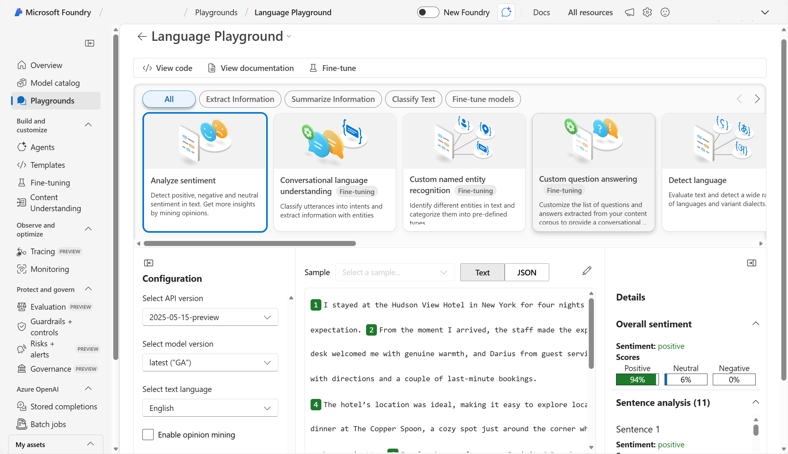
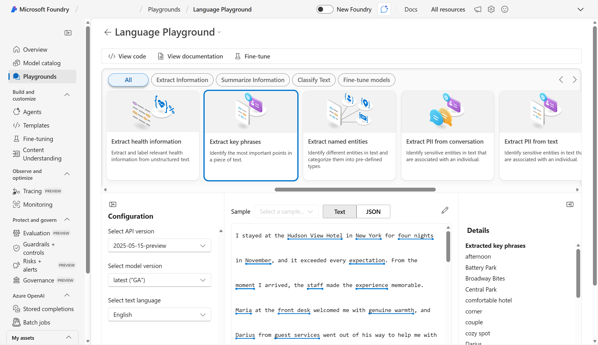
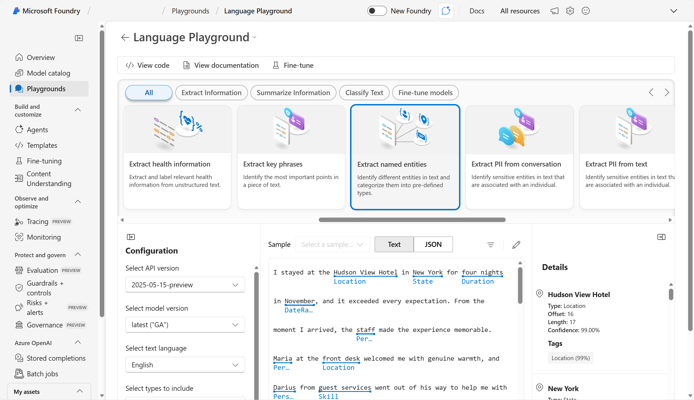
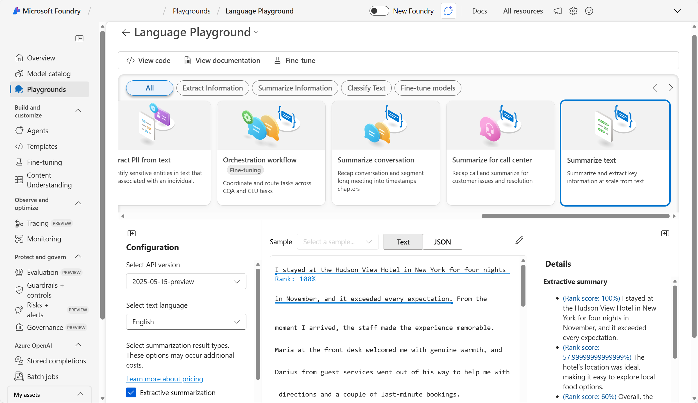

---
lab:
    title: 'Get started with text analysis in Microsoft Foundry'
    description: 'Use Microsoft Foundry to try out different types of text analysis.'
    level: 200
    duration: 20 minutes
---

# Get started with text analysis in Microsoft Foundry

In this exercise, use Azure Language's text analysis features in Microsoft Foundry, Microsoft's platform for creating AI applications. The goal of this exercise is to explore common applications of text analysis techniques.

This exercise takes approximately **20** minutes.

## Create a project in Microsoft Foundry

>**Note**: This exercise uses the **classic** Foundry interface. If you are using the new Foundry interface, you need to toggle back to the classic Foundry interface.  

1. In a web browser, open [Microsoft Foundry](https://ai.azure.com) at `https://ai.azure.com` and sign in using your Azure credentials. Close any tips or quick start panes that are opened the first time you sign in, and if necessary use the **Foundry** logo at the top left to navigate to the home page, which looks similar to the following image (close the **Help** pane if it's open):

    

1. Scroll down to the bottom of the home page and select **Explore Azure AI services**. 

1. On the Azure AI services page, select the **Language + Translator** tile. 

1. Select **Try the Language Playground**. Then in the dialog box click on **Create a new project**. 

1. Create a new project with the following settings:
    - **Project name**: *Enter a valid name for your project.*
    - **Advanced settings**:
        - **Subscription**: *Your Azure subscription*
        - **Resource group**: *Create or select a resource group*
        - **Region**: *Select any **Foundry recommended** region*
        - **Microsoft Foundry resource** *Give the resource a valid name*

1. Select **Create**. Wait for your project to be created. It may take a few minutes.

1. When the project is created, you will be taken to the **Language Playground**. The Language playground is a user interface that enables you to try out some Azure Language capabilities. 

## Prepare for text analysis

1. Download and extract **[text.zip](https://aka.ms/ai-text){:target="_blank"}** at `https://aka.ms/ai-text`. This archive contains multiple text documents that you'll use in this exercise.
1. Return to the Language Playground to try out some of Azure Language's text analysis capabilities.

## Analyze sentiment

**Sentiment analysis** is a common NLP task. It's used to determine whether text conveys a positive, neutral or negative sentiment; which makes it useful for categorizing reviews, social media posts, and other subjective documents.

1. In the Language playground, select **Classify text**. Then select the **Analyze sentiment** tile.
1. Upload **document-1.txt** from the folder where you extracted the downloaded text files.
1. Select **Run**. Review the output.

    >**Tip**: Notice that the analysis produces an overall sentiment score and individual scores for each sentence.

    

1. Select the pencil icon to edit the text. Repeat the analysis for **document-2.txt** and **document-3.txt**.

## Extract key phrases

**Key phrases** are the most important pieces of information in text. Let's use the key phrase extraction capability of Azure Language to pull important information from a review.

1. In the Language playground, select **Extract information**. Then select the **Extract key phrases** tile. 
1. Upload **document-1.txt** from the folder where you extracted the downloaded text files.
1. Select **Run**. Review the output.

    >**Tip**: Notice the different phrases extracted in the *Details* section. These phrases should contribute most to the text's meaning.

    

1. Select the pencil icon to edit the text. Repeat the analysis for **document-2.txt** and **document-3.txt**.

## Extract named entities

**Named entities** are words that describe people, places, and objects with proper names. Let's use the named entity extraction capability of Azure Language to identify types of information in a review.

1. In the Language playground, select **Extract information**. Then select the **Extract named entities** tile. 
1. Upload **document-1.txt** from the folder where you extracted the downloaded text files.
1. Select **Run**. Review the output.

    >**Tip**: Notice in the *Details* section how the extracted entities come with additional information such as type and confidence scores. The confidence score represents the likelihood that the type identified actually belongs to that category.

    

1. Select the pencil icon to edit the text. Repeat the analysis for **document-2.txt** and **document-3.txt**.

## Summarize text

**Summarization** is a way to distill the main points in a document into a shorter amount of text.

1. In the Language playground, select **Summarize information**, then select the **Summarize text** tile.
1. Upload **document-1.txt** from the folder where you extracted the downloaded text files.
1. Select **Run**. Review the output.

    >**Tip**: Notice the *Extractive summary* in *Details* provides rank scores for the most salient sentences.

    

1. Select the pencil icon to edit the text. Repeat the analysis for **document-2.txt** and **document-3.txt**.

#### Review the sample code

1. Select the **View code** tab to view sample code for text summarization. Below is the same sample code in Python for your reference:

```python

# This example requires environment variables named "AZURE_AI_KEY" and "ENDPOINT_TO_CALL_LANGUAGE_API"
key = os.environ.get('AZURE_AI_KEY')
endpoint = os.environ.get('ENDPOINT_TO_CALL_LANGUAGE_API')

from azure.ai.textanalytics import TextAnalyticsClient
from azure.core.credentials import AzureKeyCredential

# Authenticate the client using your key and endpoint 
def authenticate_client():
    ta_credential = AzureKeyCredential(key)
    text_analytics_client = TextAnalyticsClient(
            endpoint=endpoint, 
            credential=ta_credential)
    return text_analytics_client

client = authenticate_client()

# Example method for summarizing text
def sample_extractive_summarization(client):
    from azure.core.credentials import AzureKeyCredential
    from azure.ai.textanalytics import (
        TextAnalyticsClient,
        ExtractiveSummaryAction
    ) 

    document = [
        "The extractive summarization feature uses natural language processing techniques to locate key sentences in an unstructured text document. "
        "These sentences collectively convey the main idea of the document. This feature is provided as an API for developers. " 
        "They can use it to build intelligent solutions based on the relevant information extracted to support various use cases. "
        "Extractive summarization supports several languages. It is based on pretrained multilingual transformer models, part of our quest for holistic representations. "
        "It draws its strength from transfer learning across monolingual and harness the shared nature of languages to produce models of improved quality and efficiency. "
    ]

    poller = client.begin_analyze_actions(
        document,
        actions=[
            ExtractiveSummaryAction(max_sentence_count=4)
        ],
    )

    document_results = poller.result()
    for result in document_results:
        extract_summary_result = result[0]  # first document, first result
        if extract_summary_result.is_error:
            print("...Is an error with code '{}' and message '{}'".format(
                extract_summary_result.code, extract_summary_result.message
            ))
        else:
            print("Summary extracted: 
{}".format(
                " ".join([sentence.text for sentence in extract_summary_result.sentences]))
            )

sample_extractive_summarization(client)

```

> **Tip**: You can copy the code and run it in your preferred Python development environment - for example Visual Studio Code. You will need to create environment variables for your Azure Language endpoint and key; which you can find in the code sample window.

## Clean up

If you have finished exploring Microsoft Foundry, delete any resources that you no longer need. This avoids accruing any unnecessary costs.

1. Open the **Azure portal** at [https://portal.azure.com](https://portal.azure.com) and select the resource group that contains the resources you created.
1. Select **Delete resource group** and then **enter the resource group name** to confirm. The resource group is then deleted.

## Learn more

To learn more about what you can do with this service, see the [Language service page](https://learn.microsoft.com/azure/ai-services/language-service/overview).
