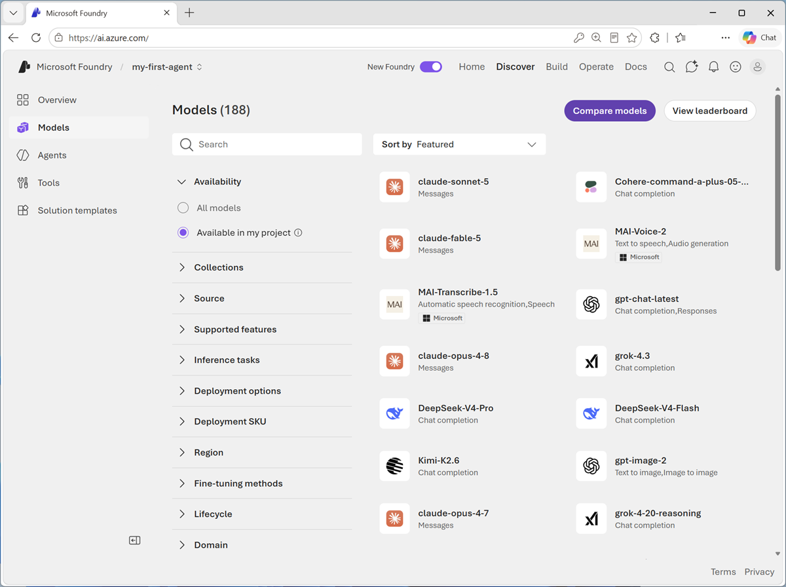
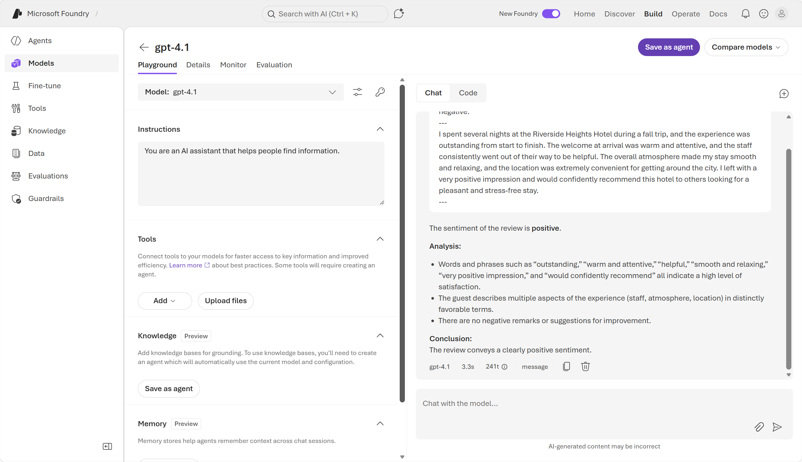
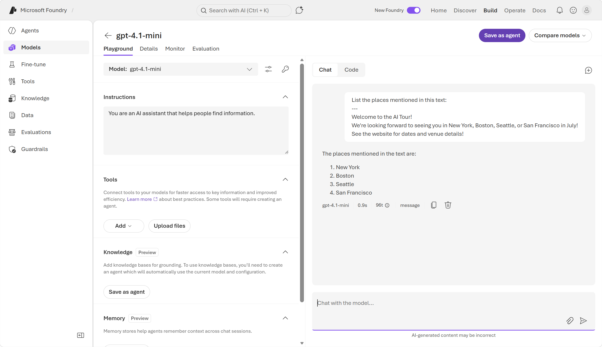
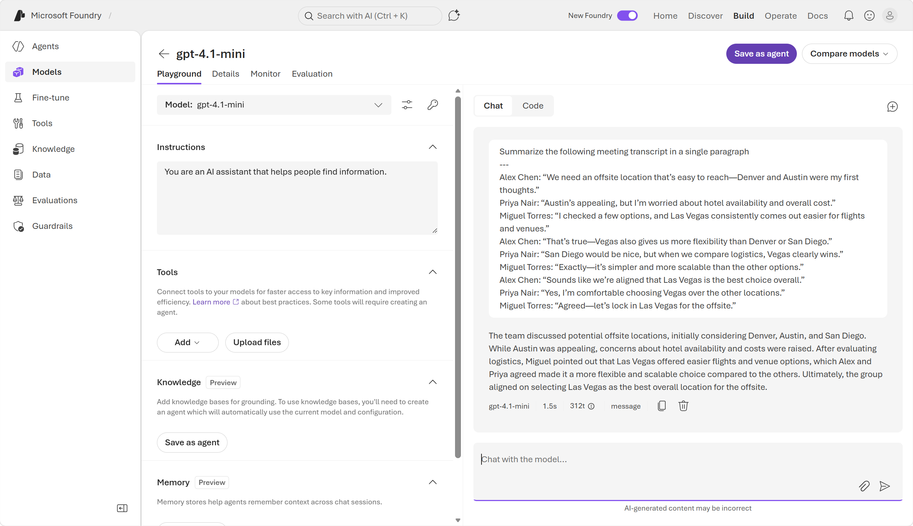
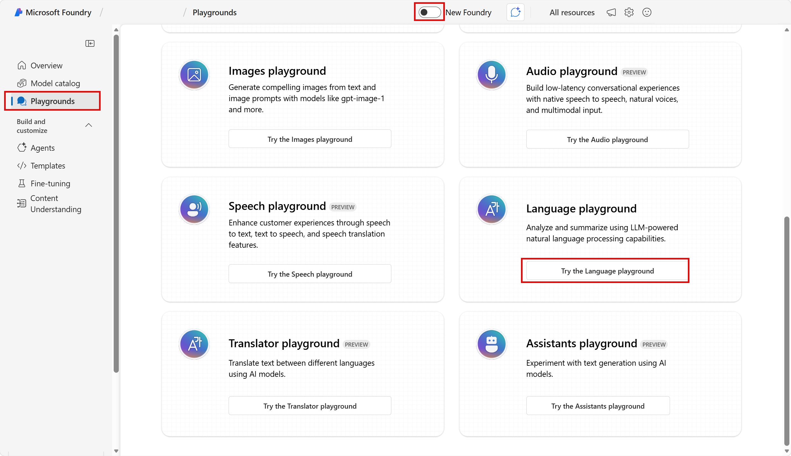
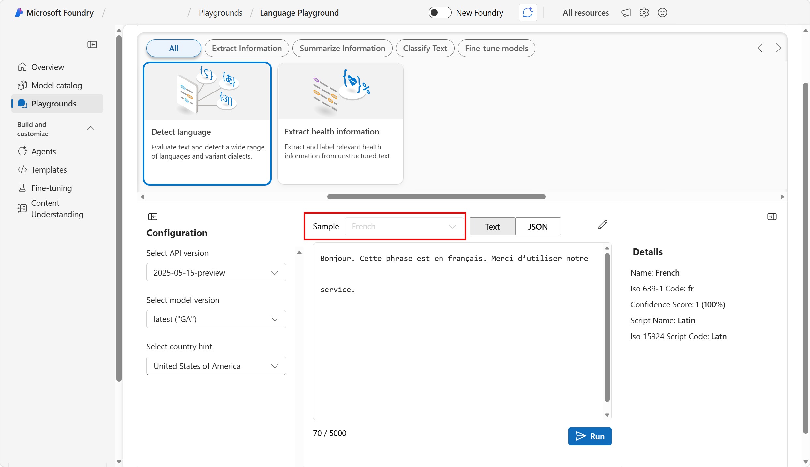
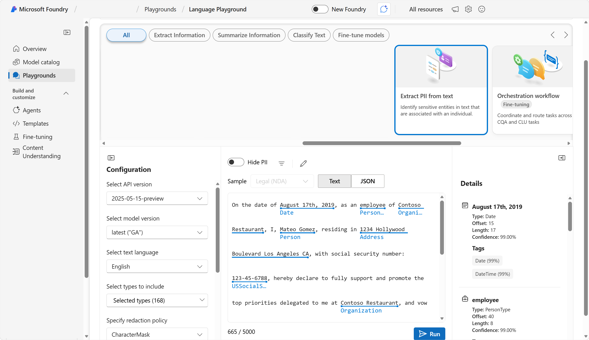

---
lab:
  title: Get started with text analysis in Microsoft Foundry
  description: Use Microsoft Foundry to try out different types of text analysis.
  level: 200
  duration: 20 minutes
  islab: true
  primarytopics:
    - Microsoft Foundry
---

# Get started with text analysis in Microsoft Foundry

In this exercise, you'll use Microsoft Foundry, Microsoft's platform for creating AI applications, to explore common text analysis techniques. 

Foundry offers two approaches to text analysis: general-purpose AI models that handle a broad range of tasks through natural language prompts, and purpose-built language tools that return structured, deterministic results for specific tasks. By exploring both, you'll gain a clearer understanding of when to use each approach.

In the first part of this exercise, you'll use a general purpose AI model in the *new* Foundry portal's chat playground.

In the second part of this exercise, you'll explore Azure Language in Foundry tools in the *classic* Foundry portal. 

This exercise takes approximately **20** minutes.

## Create a project in Microsoft Foundry

1. In a web browser, open [Microsoft Foundry](https://ai.azure.com){:target="_blank"} at `https://ai.azure.com` and sign in using your Azure credentials. Close any tips or quick start panes that are opened the first time you sign in, and if necessary use the **Foundry** logo at the top left to navigate to the home page.

2. If it is not already enabled, in the tool bar the top of the page, enable the **New Foundry** option. Then, if prompted, create a new project with a unique name; expanding the  **Advanced options** area to specify the following settings for your project:
    - **Foundry resource**: *Enter a valid name for your AI Foundry resource.*
    - **Subscription**: *Your Azure subscription*
    - **Resource group**: *Create or select a resource group*
    - **Region**: Select any of the **AI Foundry recommended** regions

3. Select **Create**. Wait for your project to be created. It may take a few minutes. After creating or selecting a project in the new Foundry portal, it should open in a page similar to the following image:

    

## Part 1: Explore Foundry model text analysis capabilities

In this part of the exercise, you'll use the **new** Foundry portal and a general-purpose large language model (LLM) to perform text analysis through natural language prompts. An LLM can handle a wide variety of tasks through prompting alone.

1. From the Foundry home page in the **new** Foundry portal interface, select **Start building**. Then select **Find models** to view the Microsoft Foundry model catalog.

    

2. Search for and select the `gpt-4.1-mini` model, and view the page for this model, which describes its features and capabilities.

    

3. Use the **Deploy** button to deploy the model using the default settings. Wait for the deployment to complete. After the deployment is complete, you are taken to a chat playground.

### Analyze sentiment

Sentiment analysis is a common NLP task. It's used to determine whether text conveys a positive, neutral or negative sentiment; which makes it useful for categorizing reviews, social media posts, and other subjective documents.

1. In the chat playground, enter the following prompt:

    ```
    Analyze the following review, and determine whether the sentiment is positive or negative:
    ---
    I stayed at the Hudson View Hotel in New York for four nights in November, and it exceeded every expectation. From the moment I arrived, the staff made the experience memorable.
    Overall, the Hudson View Hotel made my trip to New York feel effortless and enjoyable. Highly recommended for anyone wanting friendly service and a great location.
    ---
    ```

1. Review the response, which should include an analysis of the text's sentiment.

    

1. Enter the following prompt to analyze a different review:

    ```

    What about this one?
    ---
    I had a terrible stay at the Sunset Palms Hotel in September. Check‑in was slow, and most of the staff seemed overwhelmed and uninterested. Between the thin walls, unreliable Wi‑Fi, and general lack of cleanliness, I wouldn’t stay at Sunset Palms again.
    ---
    ```

    You can experiment further by creating your own prompts. The results may vary due to the small language model used in this lightweight app.

### Extract named entities

Named entities are the people, places, dates, and other important items mentioned in text.

1. At the top of the chat pane, use the **New chat** (&#128172;) button to restart the conversation. This removes all conversation history.

2. Enter the following prompt, and review the results:

    ```
    List the places mentioned in this text:
    ---
    Welcome to the AI Tour!
    We're looking forward to seeing you in New York, Boston, Seattle, or San Francisco in July!
    See the website for dates and venue details!
    ```

    The model should identify the specific places mentioned in the text.

    

### Summarize text

Summarization is a way to distill the main points in a document into a shorter amount of text.

1. At the top of the chat pane, use the **New chat** (&#128172;) button to restart the conversation. This removes all conversation history.
1. Enter the following prompt, and review the results:

    ```

    Summarize the following meeting transcript in a single paragraph
    ---
    Alex Chen: “We need an offsite location that’s easy to reach—Denver and Austin were my first thoughts.”
    Priya Nair: “Austin’s appealing, but I’m worried about hotel availability and overall cost.”
    Miguel Torres: “I checked a few options, and Las Vegas consistently comes out easier for flights and venues.”
    Alex Chen: “That’s true—Vegas also gives us more flexibility than Denver or San Diego.”
    Priya Nair: “San Diego would be nice, but when we compare logistics, Vegas clearly wins.”
    Miguel Torres: “Exactly—it’s simpler and more scalable than the other options.”
    Alex Chen: “Sounds like we’re aligned that Las Vegas is the best choice overall.”
    Priya Nair: “Yes, I’m comfortable choosing Vegas over the other locations.”
    Miguel Torres: “Agreed—let’s lock in Las Vegas for the offsite.”
    ```

    The model should generate a summary of the text.

    

## Part 2: Use a specialized language analysis tool

While a large language model that's trained for general generative AI workloads can often do a great job of text analysis, sometimes a more specialized tool can be used by an agent to get more predictable results.

>**Note**: This section uses a standalone language analysis tool associated with the **classic** Foundry portal. The Azure Language service provides purpose-built analyzers that use statistical techniques to return structured, deterministic results — ideal for consistent output in automated pipelines.

1. Navigate to the **classic** Foundry portal by changing the toggle at the top of the screen. If asked for feedback, select *continue without feedback*.  
2. In the *classic* Foundry portal, navigate to the left-side menu and select **Playgrounds**. Then select **Try the Language playground**. 

    

The Language Playground app uses statistical text analysis techniques to perform two common NLP tasks: language detection and personally identifiable information (PII) redaction.

### Detect language

In scenarios where text could potentially be in one of multiple languages, the first step in an analysis workflow is often to determine the primary language so the text can be routed to the most appropriate model or agent for the subsequent processing.

1. In the Language Playground, select the **Language detection** analyzer.
2. In the **Input text** list, select one of the provided sample documents. Then use the **Detect** button to detect the language in which the sample is written.

    

3. After reviewing the detected language details, click on the **Edit** pencil icon to make the input text editable again. Now you can:
    - Select another sample.
    - Type your own text.
    - Upload a text file.

    For example, enter the following input text and detect the language it is written in:

    ```
    ¡Hola! Me llamo Josefina y vivo en Madrid, España. Soy doctora en un hospital, ¡lo que me mantiene muy ocupada!
    ```

4. Experiment with input of your own. The Language Playground app is designed to support detection of the following languages:

    - English
    - French
    - Spanish
    - Portuguese
    - German
    - Italian
    - Simplified Chinese
    - Japanese
    - Hindi
    - Arabic
    - Russian

    > **Tip**: You can use the [Bing Translator](https://www.bing.com/translator){:target="_blank"} at `https://www.bing.com/translator` to generate text in languages you don't speak!

### Identify PII in text

To comply with privacy policies and laws, organizations often need to detect and redact personally identifiable information (PII) such as names, addresses, phone numbers, email addresses, and other personal details.

1. In the Language Playground, select the **Text PII extraction** analyzer.
2. In the **Input text** list, select one of the provided sample documents. Then use the **Detect** button to detect PII values in the text.

    

3. After reviewing the detected PII details, click on the **Edit** pencil icon to make the input text editable again. Now you can:
    - Select another sample.
    - Type your own text.
    - Upload a text file.

    For example, enter the following input text and detect any PII it contains:

    ```
    Maria Garcia called from 020 7946 0958 and asked to send documents to 42 Market Road, London, UK, SW1A 1AA.
    ```

4. Experiment with input of your own. The Language Playground app is designed to support detection of the following types of PII:

    - People names
    - Email addresses
    - Phone numbers
    - Street addresses

    > **Note**: The Language Playground app uses a combination of statistical analysis and regular expression matching to detect potential PII fields. It's <u>not</u> designed as a production-level tool and is likely to detect false positives and fail to detect PII fields in some cases.

### Review the sample code

Foundry often provides sample code for many Azure Language capabilities. You can use the sample code to begin creating your own client application. 

1. Select the **View code** tab to view sample code for PII identification. Below is the same sample code in Python for your reference:

```python

key = "paste-your-key-here"
endpoint = "paste-your-endpoint-here"

from azure.ai.textanalytics import TextAnalyticsClient
from azure.core.credentials import AzureKeyCredential

# Authenticate the client using your key and endpoint 
def authenticate_client():
    ta_credential = AzureKeyCredential(key)
    text_analytics_client = TextAnalyticsClient(
            endpoint=endpoint, 
            credential=ta_credential)
    return text_analytics_client

client = authenticate_client()

# Example method for detecting sensitive information (PII) from text 
def pii_recognition_example(client):
    documents = [
        "The employee's SSN is 859-98-0987.",
        "The employee's phone number is 555-555-5555."
    ]
    response = client.recognize_pii_entities(documents, language="en")
    result = [doc for doc in response if not doc.is_error]
    for doc in result:
        print("Redacted Text: {}".format(doc.redacted_text))
        for entity in doc.entities:
            print("Entity: {}".format(entity.text))
            print("	Category: {}".format(entity.category))
            print("	Confidence Score: {}".format(entity.confidence_score))
            print("	Offset: {}".format(entity.offset))
            print("	Length: {}".format(entity.length))
pii_recognition_example(client)


```

> **Tip**: You can copy the code and run it in your preferred Python development environment - for example Visual Studio Code. You will need to create environment variables for your Azure Language endpoint and key; which you can find in the code sample window.

## Clean up

If you have finished exploring Microsoft Foundry, delete any resources that you no longer need. This avoids accruing any unnecessary costs.

1. Open the **Azure portal** at [https://portal.azure.com](https://portal.azure.com) and select the resource group that contains the resources you created.
1. Select **Delete resource group** and then **enter the resource group name** to confirm. The resource group is then deleted.

