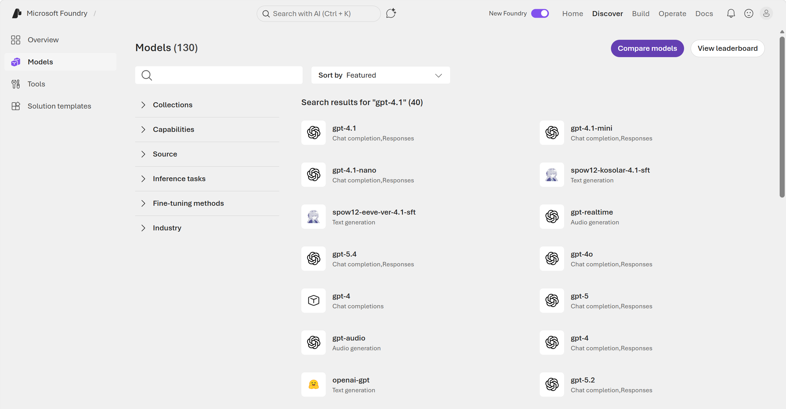
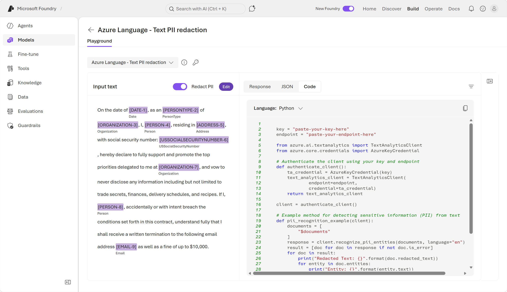

---
lab:
  title: Get started with text analysis in Microsoft Foundry
  description: Use Microsoft Foundry to try out different types of text analysis.
  primarytopics:
    - Microsoft Foundry
---

# Get started with text analysis in Microsoft Foundry

In this exercise, you'll use **Microsoft Foundry**, Microsoft's platform for creating AI applications, to explore common *text analysis techniques*. 

Foundry offers *two approaches* to text analysis: **general-purpose AI models** that handle a broad range of tasks through natural language prompts, and **purpose-built language tools** that return structured, deterministic results for specific tasks. By exploring both, you'll gain a clearer understanding of when to use each approach.

In the first part of this exercise, you'll use a general purpose AI model in the *new* Foundry portal's chat playground. In the second part of this exercise, you'll explore some features of Azure Language in Foundry tools. 

This exercise takes approximately **20** minutes.

## Create a project in Microsoft Foundry

1. In a web browser, open [Microsoft Foundry](https://ai.azure.com){:target="_blank"} at `https://ai.azure.com` and sign in using your Azure credentials. Close any tips or quick start panes that are opened the first time you sign in, and if necessary use the **Foundry** logo at the top left to navigate to the home page.

2. If it is not already enabled, in the tool bar the top of the page, enable the **New Foundry** option. Then, if prompted, create a new project with a unique name; expanding the **Advanced options** area to specify the following settings for your project:
    - **Foundry resource**: *Enter a valid name for your AI Foundry resource.*
    - **Subscription**: *Your Azure subscription*
    - **Resource group**: *Create or select a resource group*
    - **Region**: Select any of the **AI Foundry recommended** regions

3. Select **Create**. Wait for your project to be created. It may take a few minutes. After creating or selecting a project in the new Foundry portal, it should open in a page similar to the following image:

    

    >**Note**: Close any quick start panes in order to access your project's Foundry home page. 

## Part 1: Explore Foundry model text analysis capabilities

In this part of the exercise, you'll use the *new* Foundry portal and a general-purpose language model to perform text analysis through natural language prompts. A language model can handle a wide variety of tasks through prompting alone.

1. From the Foundry home page in the *new* Foundry portal interface, select **Start building**. Then select **Find models** to view the Microsoft Foundry model catalog.

    

2. Search for and select the `gpt-4.1` model, and view the page for this model, which describes its features and capabilities.

    

3. Use the **Deploy** button to deploy the model using the *default settings*. Wait for the deployment to complete. After the deployment is complete, you are taken to a chat playground, where you can test out the model's capabilities. 

### Analyze sentiment

**Sentiment analysis** is a common *natural language processing* (NLP) task. It's used to determine whether text conveys a positive, neutral or negative sentiment; which makes it useful for categorizing reviews, social media posts, and other subjective documents.

1. In the chat playground, enter the following prompt:

    ```
    Analyze the following review, and determine whether the sentiment is positive, neutral, or negative:
    ---
    I spent several nights at the Riverside Heights Hotel during a fall trip, and the experience was outstanding from start to finish. The welcome at arrival was warm and attentive, and the staff consistently went out of their way to be helpful. The overall atmosphere made my stay smooth and relaxing, and the location was extremely convenient for getting around the city. I left with a very positive impression and would confidently recommend this hotel to others looking for a pleasant and stress‑free stay.
    ---
    ```

1. Review the response, which should include an analysis of the text's sentiment.

    

1. Enter the following prompt to analyze a different review:

    ```

    What about this one?
    ---
    I was disappointed with my visit to the Harbor View Inn earlier this year. The front desk process took much longer than expected, and staff responses to questions felt rushed and unhelpful. The room had ongoing maintenance issues, inconsistent internet access, and noticeable noise from the hallway throughout the night. Overall, the experience fell short of expectations, and I would not choose to stay there again.        
    ---
    ```

    You can experiment further by creating your own prompts. 

### Extract named entities

**Named entities** are the people, places, dates, and other important items mentioned in text.

1. At the top of the chat pane, use the **New chat** (&#128172;) button to restart the conversation. This removes all conversation history.

2. Enter the following prompt, and review the results:

    ```
    List the named entities mentioned in this text:
    ---
    Welcome to the Global Innovation Workshop!
    We’re excited to host sessions in London, Toronto, Chicago, and Austin this spring.
    Visit our event page for specific dates, venues, and city details.
    ---
    ```

    The model should identify the specific places mentioned in the text.

    

### Summarize text

**Summarization** is a way to distill the main points in a document into a shorter amount of text.

1. At the top of the chat pane, use the **New chat** (&#128172;) button to restart the conversation. This removes all conversation history.
1. Enter the following prompt, and review the results:

    ```

    Summarize the following meeting transcript in a single paragraph
    ---
    Jordan Lee: “We should pick a retreat location that’s convenient for most people—Chicago and Nashville came to mind first.”
    Anika Sharma: “Chicago is central, but the venue costs there can add up quickly.”
    Carlos Ramirez: “I looked into a few alternatives, and Phoenix seems much easier when it comes to flights and space.”
    Jordan Lee: “That makes sense—Phoenix does offer more flexibility than Chicago or Portland.”
    Anika Sharma: “Portland would be enjoyable, but from a planning standpoint, Phoenix is simpler.”
    Carlos Ramirez: “Exactly. It scales better and avoids some of the pricing issues.”
    Jordan Lee: “So it sounds like Phoenix is our strongest option overall.”
    Anika Sharma: “Yes, I’m comfortable choosing Phoenix over the other cities.”
    Carlos Ramirez: “Agreed—let’s move forward with Phoenix for the retreat.”
    ```

    The model should generate a summary of the text.

    

## Part 2: Use a specialized language analysis tool

While a language model that's trained for general generative AI workloads can often do a great job of text analysis, sometimes a more specialized tool can be used by an agent to get more predictable results.

The **Azure Language in Foundry Tools** provides purpose-built analyzers that use statistical techniques to return structured, deterministic results — ideal for consistent output in automated pipelines.

1. In the *new* Foundry portal, navigate to the menu at the top of the screen and select **Build**. 

2. On the *Build* page, navigate to the menu on the left-side of the screen (you may need to expand it by clicking on the expand icon at the bottom of the menu). From the left-side menu, select **Models**. Then, at the top of the *Models* page, select **AI Services**. 

    

### Detect language

In scenarios where text could potentially be in one of multiple languages, the first step in an analysis workflow is often to determine the primary language so the text can be routed to the most appropriate model or agent for the subsequent processing.

1. From the list of AI services, select the **Azure Language - Language detection** analyzer.
2. In the **Input text** list, select one of the provided sample documents. Then use the **Detect** button to detect the language in which the sample is written.

    

3. After reviewing the detected language details, click on the **Edit** button icon to make the input text editable again. Now you can:
    - Select another sample.
    - Type your own text.
    - Upload a text file.

    For example, enter the following input text and detect the language it is written in:

    ```
    ¡Hola! Me llamo Josefina y vivo en Madrid, España. Soy doctora en un hospital, ¡lo que me mantiene muy ocupada!
    ```

4. Experiment with input of your own. 

    > **Tip**: You can use the [Bing Translator](https://www.bing.com/translator){:target="_blank"} at `https://www.bing.com/translator` to generate text in languages you don't speak!

5. Return to the list of AI services when you are done experimenting. You can click on the back button at the top of the playground screen.

### Identify PII in text

To comply with privacy policies and laws, organizations often need to detect and redact **personally identifiable information (PII)** such as names, addresses, phone numbers, email addresses, and other personal details.

1. In the list of AI services, select the **Azure Language - Text PII extraction** analyzer.
2. In the **Input text** list, select one of the provided sample documents. Then use the **Detect** button to detect PII values in the text.

    

3. After reviewing the detected PII details, click on the **Edit** button to make the input text editable again. Now you can:
    - Select another sample.
    - Type your own text.
    - Upload a text file.

    For example, enter the following input text and detect any PII it contains:

    ```
    Maria Garcia called from 020 7946 0958 and asked to send documents to 42 Market Road, London, UK, SW1A 1AA.
    ```

4. Experiment with input of your own. Azure Language can recognize an extensive list of PII. You can see the full list [here](https://learn.microsoft.com/azure/ai-services/language-service/personally-identifiable-information/concepts/entity-categories-list). A few of those entities include: 

    - People names
    - Email addresses
    - Phone numbers
    - Street addresses

### Review the sample code

Foundry provides sample code for some Azure Language capabilities. You can use the sample code to begin creating your own client application. 

1. Select the **Code** tab on the right to view sample code for PII identification. 

    

>**Tip**: Below is the same sample code in Python for your reference. You can copy the code and run it in your preferred Python development environment - for example Visual Studio Code. You will need to create environment variables for your Azure Language endpoint and key; which you can find in the code sample window.

```python

    key = "paste-your-key-here"
    endpoint = "paste-your-endpoint-here"

    from azure.ai.textanalytics import TextAnalyticsClient
    from azure.core.credentials import AzureKeyCredential

    # Authenticate the client using your key and endpoint 
    def authenticate_client():
        ta_credential = AzureKeyCredential(key)
        text_analytics_client = TextAnalyticsClient(
                endpoint=endpoint, 
                credential=ta_credential)
        return text_analytics_client

    client = authenticate_client()

    # Example method for detecting sensitive information (PII) from text 
    def pii_recognition_example(client):
        documents = [
            "$documents"
        ]
        response = client.recognize_pii_entities(documents, language="en")
        result = [doc for doc in response if not doc.is_error]
        for doc in result:
            print("Redacted Text: {}".format(doc.redacted_text))
            for entity in doc.entities:
                print("Entity: {}".format(entity.text))
                print("	Category: {}".format(entity.category))
                print("	Confidence Score: {}".format(entity.confidence_score))
                print("	Offset: {}".format(entity.offset))
                print("	Length: {}".format(entity.length))
    pii_recognition_example(client)


```

## Clean up

If you have finished exploring Microsoft Foundry, delete any resources that you no longer need. This avoids accruing any unnecessary costs.

1. Open the **Azure portal** at [https://portal.azure.com](https://portal.azure.com) and select the resource group that contains the resources you created.
1. Select **Delete resource group** and then **enter the resource group name** to confirm. The resource group is then deleted.

## Learn more

- Review the [evolution of Foundry](https://learn.microsoft.com/azure/foundry/what-is-foundry#evolution-of-foundry) 
- [What is Azure Language in Foundry Tools?](https://learn.microsoft.com/azure/ai-services/language-service/overview)
- Learn more about [Personally identifiable information (PII) detection](https://learn.microsoft.com/azure/ai-services/language-service/personally-identifiable-information/overview)
