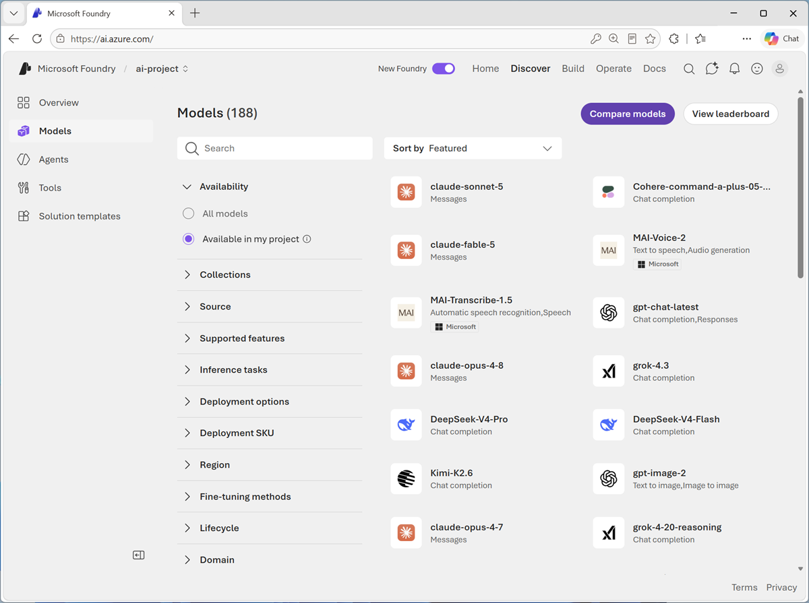
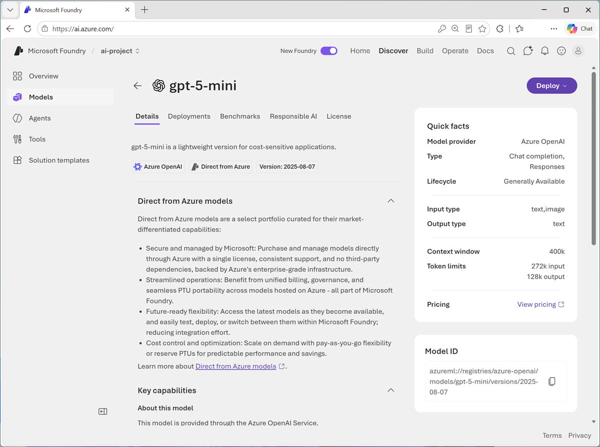
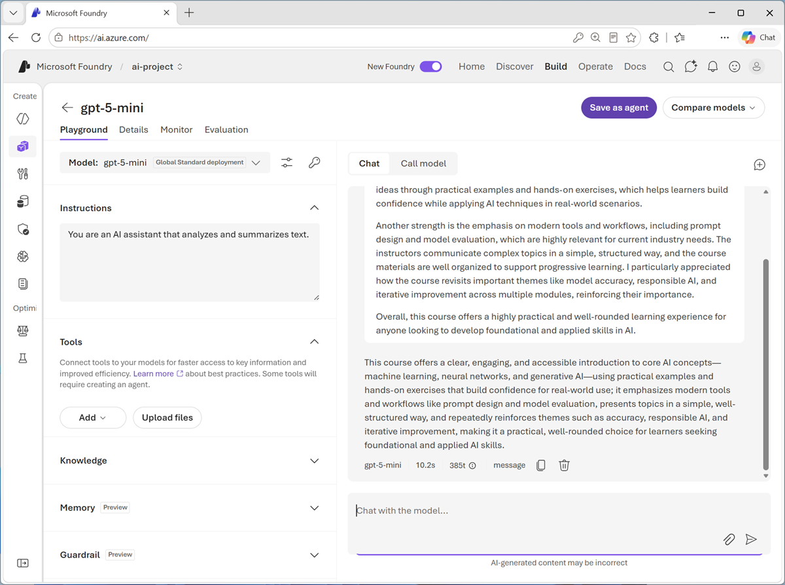
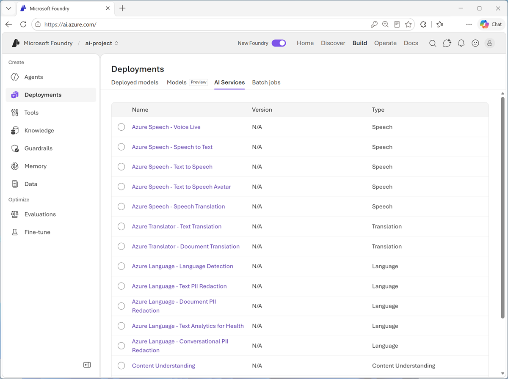
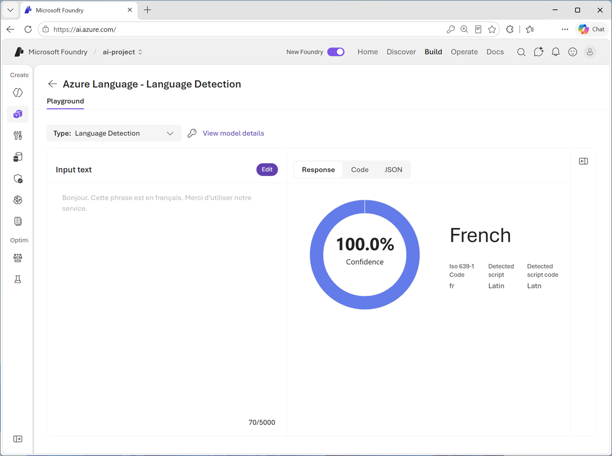
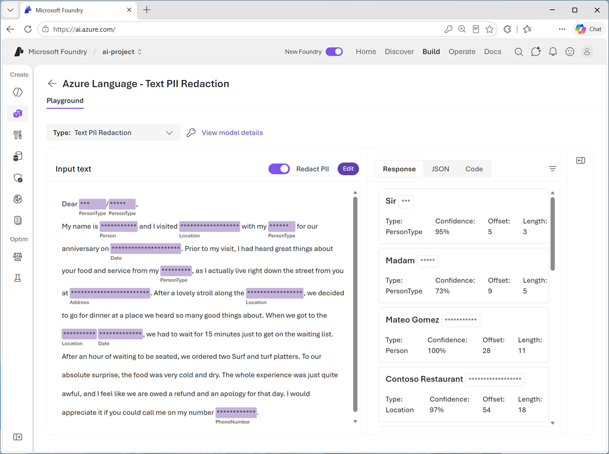

---
lab:
  title: Get started with text analysis in Microsoft Foundry
  description: Use Microsoft Foundry to try out different types of text analysis.
  level: 200
  duration: 25 minutes
  islab: true
  primarytopics:
    - Microsoft Foundry
---

# Get started with text analysis in Microsoft Foundry

In this exercise, you'll use **Microsoft Foundry**, Microsoft's platform for creating AI applications, to explore common *text analysis techniques*.

Foundry offers *two approaches* to text analysis: **general-purpose AI models** that handle a broad range of tasks through natural language prompts, and **purpose-built language tools** that return structured, deterministic results for specific tasks. By exploring both, you'll gain a clearer understanding of when to use each approach.

In the first part of this exercise, you'll use a general purpose AI model in the Foundry portal's chat playground. In the second part of this exercise, you'll explore some features of Azure Language in Foundry tools.

This exercise takes approximately **20** minutes.

## Create a project in Microsoft Foundry

1. In a web browser, open [Microsoft Foundry](https://ai.azure.com){:target="_blank"} at `https://ai.azure.com` to start building; signing in using your Azure credentials.

2. If it isn't already enabled, in the tool bar the top of the page, enable the **New Foundry** option. Then, if prompted, create a new project with a unique name; expanding the **Advanced options** area to specify the following settings for your project:
    - **Foundry resource**: *Enter a valid name for your AI Foundry resource.*
    - **Subscription**: *Your Azure subscription*
    - **Resource group**: *Create or select a resource group*
    - **Region**: Select any of the **AI Foundry recommended** regions in **[this list](https://learn.microsoft.com/azure/foundry/openai/how-to/responses#region-availability)**{:target="_blank"}

    > **Note**: Depending on your permissions in the Azure subscription, you may need to clear the option to set up recommended resources.

3. Select **Create**. Wait for your project to be created. It may take a few minutes. After creating or selecting a project in the new Foundry portal, it should open in a page similar to the following image:

    

    >**Note**: Close any quick start panes in order to access your project's Foundry home page.

## Explore a general-purpose AI model's text analysis capabilities

In this part of the exercise, you'll use a general-purpose language model to perform text analysis through natural language prompts. A language model can handle a wide variety of tasks through prompting alone.

1. Now you're ready to explore models. On the **Discover** page, select the **Models** tab to view the Microsoft Foundry model catalog.

    

2. Search for and select the `gpt-5-mini` model, and view the page for this model, which describes its features and capabilities.

    

3. Use the **Deploy** button to deploy the model using the *default settings*. Wait for the deployment to complete. After the deployment is complete, you're taken to a chat playground, where you can test out the model's capabilities.

### Analyze sentiment

**Sentiment analysis** is a common *natural language processing* (NLP) task. It's used to determine whether text conveys a positive, neutral or negative sentiment; which makes it useful for categorizing reviews, social media posts, and other subjective documents.

1. In the chat playground page, use the button at the bottom of the left navigation pane to hide it and give yourself more room to work with.
1. In the pane on the left, change the default **Instructions** to:

    ```
   You are an AI assistant that analyzes and summarizes text.
    ```

1. In the **Chat** pane, the following prompt (you can press CTRL+ENTER for a new line):

    ```
   Summarize this review as a single, short paragraph:

   This AI training course provides a clear and engaging introduction to core concepts such as machine learning, neural networks, and generative AI, making it accessible even to learners with limited prior experience. The course consistently reinforces key ideas through practical examples and hands-on exercises, which helps learners build confidence while applying AI techniques in real-world scenarios.
    
   Another strength is the emphasis on modern tools and workflows, including prompt design and model evaluation, which are highly relevant for current industry needs. The instructors communicate complex topics in a simple, structured way, and the course materials are well organized to support progressive learning. I particularly appreciated how the course revisits important themes like model accuracy, responsible AI, and iterative improvement across multiple modules, reinforcing their importance.
    
   Overall, this course offers a highly practical and well-rounded learning experience for anyone looking to develop foundational and applied skills in AI.
    ```

    The model should generate a summary of the text.

    

    Large language models (LLMs) are built on machine learning techniques that have their origins in natural language processing and text analysis, so they're good at summarizing text, extracting named entities (such as people and place names), and classifying documents based on sentiment, topic, style, and other factors.

## Use a specialized language analysis tool

While a language model that's trained for general generative AI workloads can often do a great job of text analysis, sometimes a more specialized tool can be used by an agent to get more predictable results.

The **Azure Language in Foundry Tools** provides purpose-built analyzers that use statistical techniques to return structured, deterministic results—ideal for consistent output in automated pipelines.

1. In the Foundry portal, navigate to the menu at the top of the screen and select **Build**.

1. On the *Build* page, navigate to the menu on the left-side of the screen (you may need to expand it). In the menu, select **Services**.

    Microsoft Foundry Tools includes multiple AI Services (formerly known as Microsoft Cognitive Services) that support common speech, translation, language, and content understanding workloads.

    

### Detect language

In scenarios where text could potentially be in one of multiple languages, the first step in an analysis workflow is often to determine the primary language so the text can be routed to the most appropriate model or agent for the subsequent processing.

1. In the list of Services, select the **Azure Language - Language detection** analyzer.
1. In the **Input text** list, select one of the provided sample documents. Then use the **Detect** button to detect the language in which the sample is written.

    

1. After reviewing the detected language details, use the **Edit** button icon to make the input text editable again. Now you can:
    - Select another sample.
    - Type your own text.
    - Upload a text file.

    For example, enter the following input text and detect the language it's written in:

    ```
    ¡Hola! Me llamo Josefina y vivo en Madrid, España. Soy doctora en un hospital, ¡lo que me mantiene muy ocupada!
    ```

1. Experiment with input of your own.

    > **Tip**: You can use the [Bing Translator](https://www.bing.com/translator){:target="_blank"} at `https://www.bing.com/translator` to generate text in languages you don't speak!

### Identify PII in text

To comply with privacy policies and laws, organizations often need to detect and redact **personally identifiable information (PII)** such as names, addresses, phone numbers, email addresses, and other personal details.

1. On the language detection playground page, in the **Type** drop-down list, select **Text PII Redaction** (or return to the list of AI services and select **Azure Language - Text PII Redaction**).
2. In the **Input text** list, select one of the provided sample documents. Then use the **Detect** button to detect PII values in the text.

    

3. After reviewing the detected PII details, use the **Edit** button to make the input text editable again. Now you can:
    - Select another sample.
    - Type your own text.
    - Upload a text file.

    For example, enter the following input text and detect any PII it contains:

    ```
    Maria Garcia called from 020 7946 0958 and asked to send documents to 42 Market Road, London, UK, SW1A 1AA.
    ```

4. Experiment with input of your own. Azure Language can recognize an extensive list of PII. You can see the full list [here](https://learn.microsoft.com/azure/ai-services/language-service/personally-identifiable-information/concepts/entity-categories-list). A few of those entities include:

    - People names
    - Email addresses
    - Phone numbers
    - Street addresses

### Review the sample code

Foundry provides sample code for some Azure Language capabilities. You can use the sample code to begin creating your own client application.

1. Select the **Code** tab on the right to view sample code for PII identification, which should be similar to this:

    ```python
   key = "<your-api-key>"
   endpoint = "https://ai-resrce.cognitiveservices.azure.com/"
    
   from azure.ai.textanalytics import TextAnalyticsClient
   from azure.core.credentials import AzureKeyCredential
    
   # Authenticate the client using your key and endpoint 
   def authenticate_client():
        ta_credential = AzureKeyCredential(key)
        text_analytics_client = TextAnalyticsClient(
                endpoint=endpoint, 
                credential=ta_credential)
        return text_analytics_client
    
   client = authenticate_client()
    
   # Example method for detecting sensitive information (PII) from text 
   def pii_recognition_example(client):
        documents = [
            "$documents"
        ]
        response = client.recognize_pii_entities(documents, language="en")
        result = [doc for doc in response if not doc.is_error]
        for doc in result:
            print("Redacted Text: {}".format(doc.redacted_text))
            for entity in doc.entities:
                print("Entity: {}".format(entity.text))
                print(" Category: {}".format(entity.category))
                print(" Confidence Score: {}".format(entity.confidence_score))
                print(" Offset: {}".format(entity.offset))
                print(" Length: {}".format(entity.length))
   pii_recognition_example(client)
    ```

>**Tip**: You can copy the code and run it in your preferred Python development environment - for example Visual Studio Code. You will need to create environment variables for your Azure Language endpoint and key; which you can find in the code sample window.

## Summary

In this exercise, you explored how to use a generative AI model and the Azure Language tool in Foundry to analyze text. In many scenarios, the native language capabilities of a generative AI model provide all the natural language processing functionality you need. For more specialized scenarios, the Azure Language tool provides a dedicated service for NLP tasks.

> **[Ask Anton](https://aka.ms/azk-anton){:target="_blank"}**<br/><br/>If you have questions about some of the topics covered in this exercise, *[Ask Anton](https://aka.ms/azk-anton){:target="_blank"}* is a generative AI-based agent that you can ask about AI concepts and Microsoft Foundry. Open the app at **[https://aka.ms/azk-anton](https://aka.ms/azk-anton){:target="_blank"}** and use the **Configure** button to enter your Foundry project and model details.<br/><br/>*Ask Anton is not a supported Microsoft product or a component of Microsoft Learn or AI Skills Navigator. Just an example of an AI agent for you to explore as you learn about what's possible with AI.*<br/><br/>If you *do* check out Ask Anton, we'd love you to *[tell us about your experience](https://forms.office.com/r/fC0ndfBQeK){:target="_blank"}*!

## Clean up

If you have finished exploring Microsoft Foundry, delete any resources that you no longer need. This avoids accruing any unnecessary costs.

1. Open the **Azure portal** at [https://portal.azure.com](https://portal.azure.com) and select the resource group that contains the resources you created.
1. Select **Delete resource group** and then **enter the resource group name** to confirm. The resource group is then deleted.
