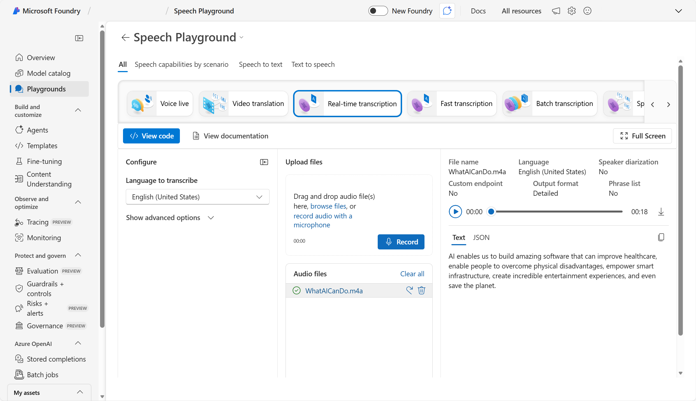
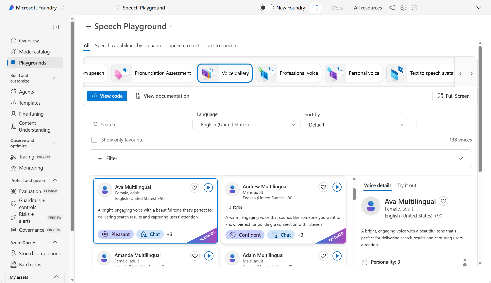

---
lab:
    title: 'Explore speech in Microsoft Foundry'
---

# Explore speech in Microsoft Foundry

Azure Speech transcribes speech into text, and turns text into audible speech. You might use Speech to create an application that can transcribe meeting notes or generate text from the recording of interviews, or to support an interactive AI assistant that can respond to spoken commands and queries.

In this exercise, you will use Azure Speech in Foundry, Microsoft's platform for creating intelligent applications, to explore core Azure Speech capabilities. 

This exercise takes approximately **10** minutes.

## Create a project in Microsoft Foundry

1. In a web browser, open [Microsoft Foundry](https://ai.azure.com) at `https://ai.azure.com` and sign in using your Azure credentials. Close any tips or quick start panes that are opened the first time you sign in, and if necessary use the **Foundry** logo at the top left to navigate to the home page, which looks similar to the following image (close the **Help** pane if it's open):

    

1. Scroll down to the bottom of the home page and select **Explore Azure AI services**. 

1. On the Azure AI services page, select the **Speech** tile. You will be taken to the *Azure-AI-Speech* page.

## Explore speech to text in Foundry

Let's try out *speech to text* in Foundry.

1. In a new browser tab, download **[speech.zip](https://aka.ms/mslearn-speech-files)** from `https://aka.ms/mslearn-speech-files` in a new browser tab. After downloading the file, extract it to a local folder. 

1. Back in Foundry, on the *Azure-AI-Speech* page, select **Real-time transcription**.

1. Under **Upload files**, select **Browse files** and upload **WhatAICanDo.m4a** from the folder to downloaded and extracted.

    The Speech service transcribes and displays the text in real time. If you have audio on your computer, you can listen to the recording as the text is being transcribed.

    

1. Review the output. 

    >*Tip*: To see the full output, you may need to minimize the *Configure* pane. To minimize, select the icon to the right of the *Configure* heading.

    In the output, under **Text**, you can see the audio transcibed into text.

## Explore text to speech in Foundry

Now let's see how Azure Speech can generate audible speech from text.

1. In the Speech playground, select the **Voice gallery**.
1. View the available voices, and select one (such as *Ava Multilingual*).
1. In the **Voice details** pane, select the **Try it out** tab. Then enter some text (for example, `The rain in Spain stays mainly in the plain`) and use the **Play** button to synthesize speech from the text.

    

    The text is spoken using the selected voice. You can try other voices to compare the spoken output.

## Clean up

If you don't intend to do more exercises, delete any resources that you no longer need. This avoids accruing any unnecessary costs.

1. Open the [Azure portal]( https://portal.azure.com) and select the resource group that contains the resource you created.
1. Select **Delete resource group** and then **enter the resource group name** to confirm. The resource group is then deleted.

## Learn more

This exercise demonstrated one of the many capabilities of the Speech service. To learn more about what you can do with this service, see the [Speech page](https://azure.microsoft.com/services/cognitive-services/speech-services).