---
lab:
    title: 'Get started with speech in Microsoft Foundry'
    description: 'Use Microsoft Foundry to try out Azure Speech - Voice Live.'
---

# Get started with speech in Microsoft Foundry

The two fundamental speech capabilities that power voice-enabled applications are speech recognition (converting spoken words to text) and speech synthesis (converting text to natural-sounding speech). 

In this exercise, use Microsoft Foundry, Microsoft's platform for creating AI applications, to interact with a generative AI model using speech. You'll explore speech-to-text (STT) and text-to-speech (TTS) with Azure Speech Voice Live, a service used to build real-time voice-based agents. Voice live in the Speech Playground supports both speech recognition and speech synthesis, enabling you to have a voice-based conversation with the model.

This exercise takes approximately **30** minutes.

## Create a Microsoft Foundry project

Microsoft Foundry uses projects to organize models, resources, data, and other assets used to develop an AI solution.

1. In a web browser, open Microsoft Foundry at https://ai.azure.com and sign in using your Azure credentials. Close any tips or quick start panes that are opened the first time you sign in, and if necessary use the Foundry logo at the top left to navigate to the home page.

1. If it is not already enabled, in the tool bar the top of the page, enable the New Foundry option. Then, if prompted, create a new project with a unique name of your choice, using the default options. After creating or selecting a project in the new Foundry portal, it should open in a page similar to the following image:

    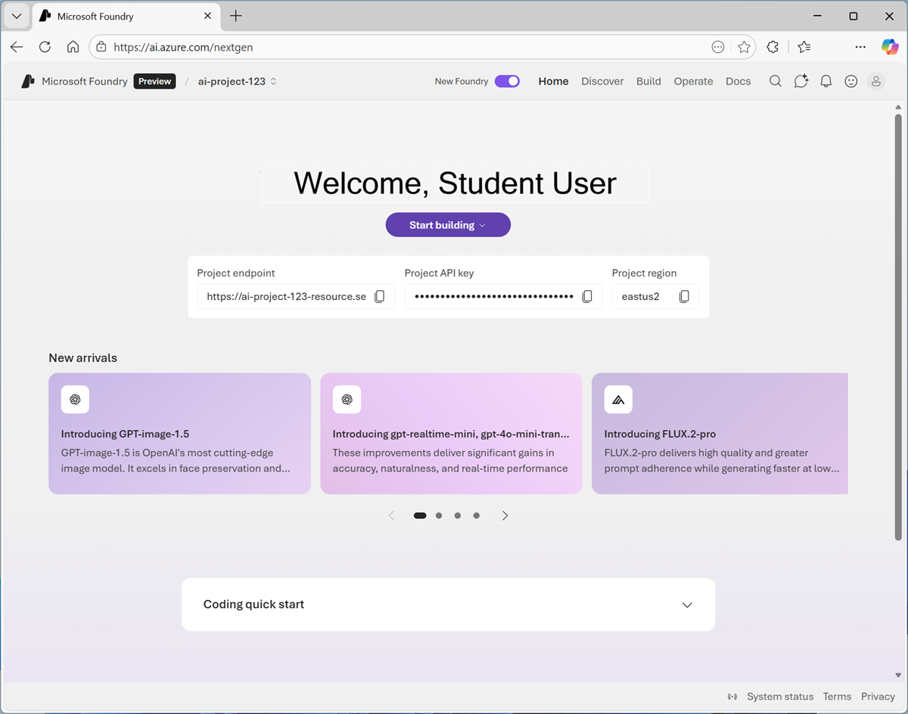

## Navigate to Azure Speech - Voice Live 

1. On the new Foundry home page, navigate to the top right menu (you may need to expand the screen to see the menu options). Select **Build**. 

    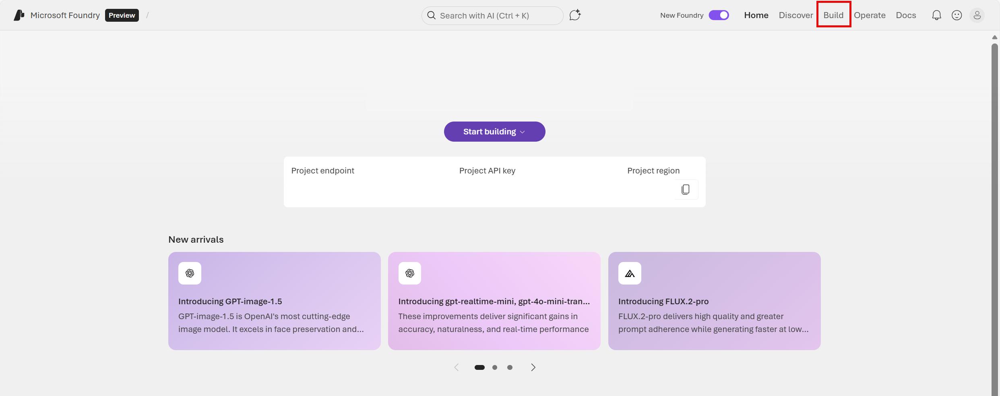
  
1. On the *Build* page, navigate to the left-hand menu (you may need to expand it to see its options). From the menu, select **Models**. On the Models page, select **AI-services**. Note that the list of AI services is a small subset of all the AI capabilities available with Foundry Tools. Several Speech-related services are available for testing, including: 
    - *Azure Speech - Speech to Text*: capabilities used to generate text transcriptions from speech audio. For example, to transcribe calls or meetings, or to create captions for hearing-impaired users.
    - *Azure Speech - Text to Speech*: capabilities used to generate audio from text. For example, to create audio to help people with visual-impairments, or enable bots with natural-sounding speech.

1. From the list, select **Azure Speech - Voice Live** to try out *Voice Live* capabilities in the Speech Playground. 

    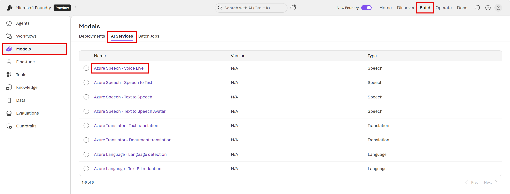

## Open the Speech Playground App

Let's start by chatting with a generative AI model. In this exercise, we'll use a browser-based application to chat with the **GPT-4.1 Mini** model; a small language model that is useful for general chat solutions.

1. In a web browser, the Azure Speech - Voice Live Speech Playground should be open. In the playground settings pane,  click through the samples and select **Start with Blank** to create your own assistant. 
 
1. In the playground settings pane, modify the **Generative AI model** the assistant uses. Select **GPT-4.1 Mini**. Select **Apply changes** to save the updates. 

1. View the Speech Playground app, which should look like this:

    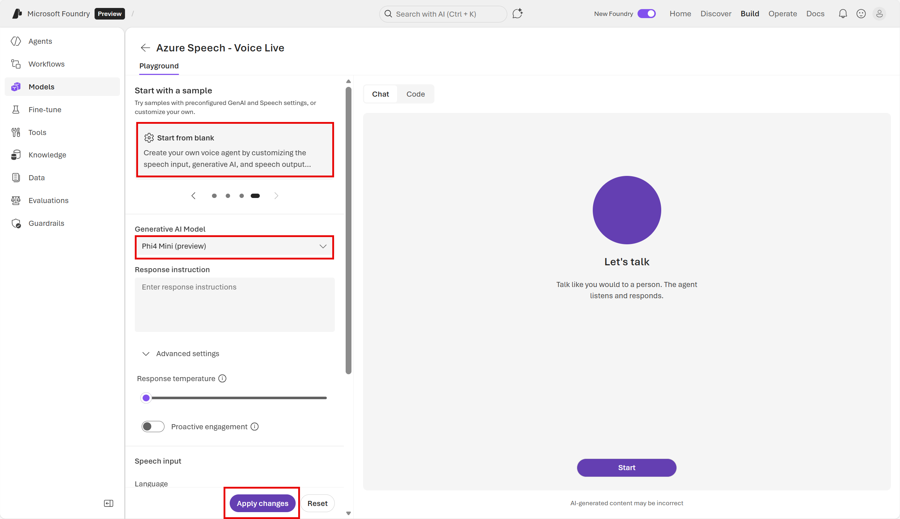 

## Select a voice 

Text-to-speech solutions use voices to control the cadence, pronunciation, timbre, and other aspects of generated speech. The available voices depend on your browser and operating system.

1. In the configuration pane on the left, view the voices in the **Speech output** drop-down list.
 
1. Select any of the available voices, and use the Preview selected voice (▷) button to hear a sample of the voice.
 
1. When you have selected the voice you want to use, use the **Apply changes** button to activate it.

## Use speech to interact with the model

The app supports both speech recognition and speech synthesis, enabling you to have a voice-based conversation with the model.

1. In the Chat pane, use the **Start** button to start a conversation with the model. If prompted, allow access to the system microphone. The agent will introduce itself. 

1. When the app status is **Listening…**, say something like `"How does speech recognition work?"` and wait for a response.

    >**Tip**: If an error occurs or the app can’t detect any speech input, you can enter a text-based prompt. 

1. Verify that the app status changes to **Processing…**. The app will process the spoken input, using speech-to-text to convert your speech to text and submit it to the model as a prompt. 

    >**Tip**: the processing speed may be so fast that you do not actually see the status before it changes back to *Speaking*.

1. When the status changes to **Speaking…**, the app uses text-to-speech to vocalize the response from the model. To see the original prompt and the response as text, select the **cc** button on the bottom of the chat screen.

    >**Tip**: The follow-on prompt is submitted just by speaking. You can even interrupt the agent to keep the interaction focused on what you need done. 
    >**Tip**: You can also use the Stop generation button in the chat pane to stop long-running responses. The button will end the conversation. You will need to start a new conversation to continue using the agent. 

    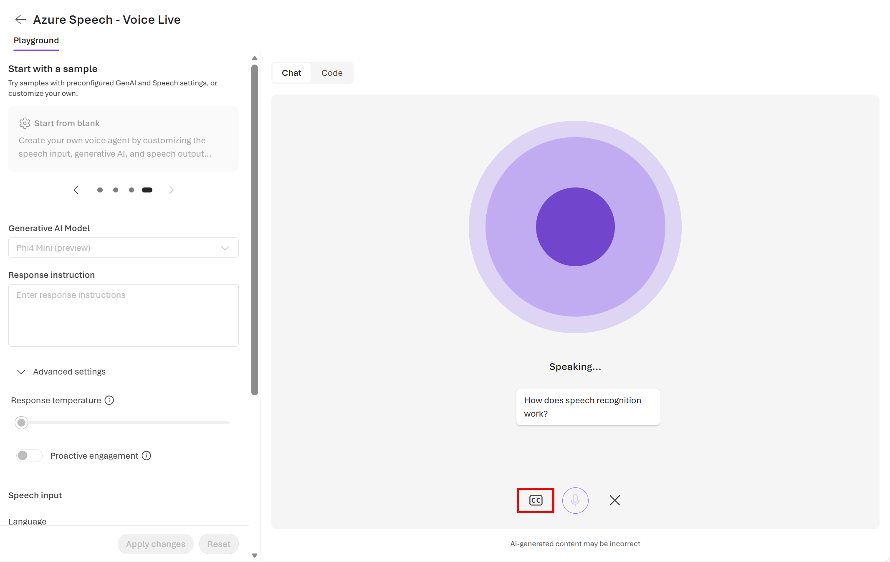

1. To continue the conversation, submit a second spoken prompt, such as `"How does speech synthesis work?"`, and review the response.

## Experiment with system prompts

A system prompt is used to provide the model with instructions that guide its responses. You can use the system prompt to provide guidelines about format, style, and constraints about what the model should and should not include in its responses.

1. In the pane on the left, in the **Instructions** text area, change the system prompt to: `You are an AI assistant that provides short and concise answers using simple language. Limit responses to a single sentence.`

    >**Tip**: Remember to select **Apply changes** before testing any changes. 

1. Now try the same prompt as before (`How does speech synthesis work?`) and review the output.

## Experiment with model parameters

Model parameters control how the model works, and can be useful for restricting the size of its responses (measured in tokens) and controlling how "creative" its responses can be.

#### Generative AI model parameters

1. Review the generative AI model's *Advanced settings*. One way you can affect the model's responses is by configuring the **temperature** of the response. The *temperature* is a parameter that controls the randomness or creativity of the model's responses. When the model is set to a lower temperature, its responses are more predictable and factual. As the temperature increases, more variability and creativity are added. The higher temperature setting is useful for brainstorming, its conversational tone, and generating varied examples. If the temperature is too high however, it can result in responses that do not make much sense and aren't reliable.

1. Experiment by changing the temperature and repeating the same prompt as before (`How does speech synthesis work?`). 

1. Another setting for the model is **proactive engagement**. Activating the toggle **on** means the agent initiates the conversation. Try turning the proactive engagement *on* and starting a new conversation with the agent.  

#### Speech input parameters 

1. Review the speech input's *Advanced settings*. 
- **End of utterance (EOU)**: Detects the end of speaking and stops speech recognition processing, returning results promptly. Currently does not support GPT-4o Realtime or GPT-4o Mini Realtime models.
- **Audio enhancement**: Improves sound quality by reducing noise and boosting clarity, ensuring more accurate and clear speech recognition.

#### Speech output parameters

1. Review the speech output's advanced settings. 
- **Voice temperature**: Controls the style and expressiveness of the spoken audio including intonation, prosody, emphasis, pacing, and emotional variance. 
- **Playback speed**: The speed at which the voice is speaking.
- **Custom lexicon**: Define the pronunciation of specific words, such as company names, medical terms, or emojis. Create a custom lexicon file using the Audio Content Creation tool, and copy its link here to use

1. If you have time, you can also try out an Azure avatar. Activating the avatar toggle will allow you to select a prebuilt avatar or create a custom avatar that visualizes the agent's audio output as an avatar speaking.

## View the client code 

Now let's review the code that makes this web experience possible!

1. Select **Code** at the top of the chat screen. You should see Python code like this:  

    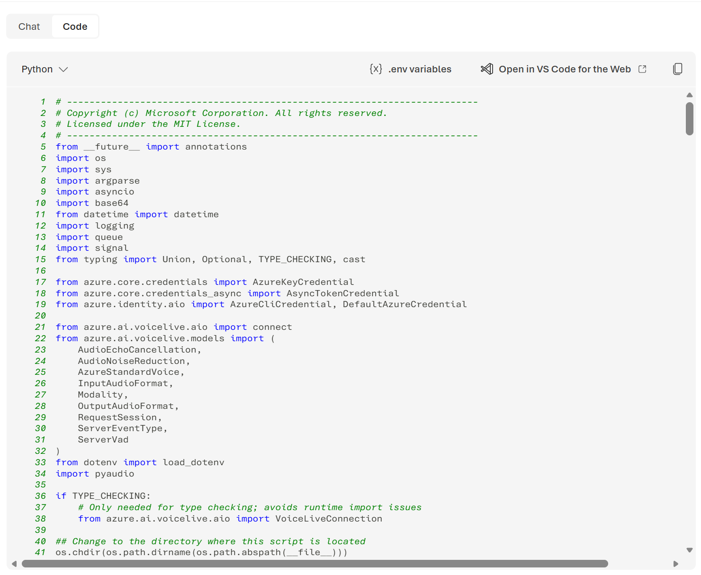

1. In lines `17-32` you can see the specific Azure Speech packages imported. Imported packages provide additional functionality and tools - in this case, additional functions and models that compliment the language model used to respond to the conversation text itself. By importing these packages, you can leverage prebuilt, optimized solutions instead of writing everything from scratch, making code more efficient, readable, and maintainable.  

    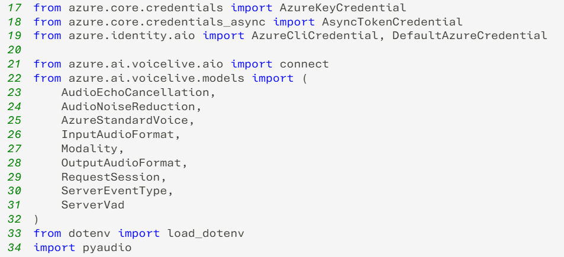
 
1. The web live voice assistant is composed of two major functionalities: the Audio Processor and the Voice Assistant.  In lines `63-238`, you can review the code for the `AudioProcessor` class to see how it handles real-time audio capture and playback. 

    

1. The `BasicVoiceAssistant` class begins on line `240`. The code in this class uses the VoiceLive Python SDK to handle the events from the VoiceLive connection. Notice how the `BasicVoiceAssistant` has a dependency on the `AudioProcessor` class (such as in line `258`).   

    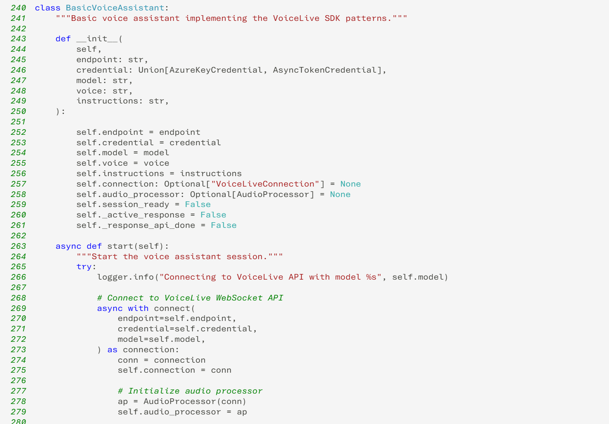

1. The configurations from the playground settings and your credentials (such as AI voice, model, and instructions) are handled by the global `parse_arguments` function that starts on line `417`.

    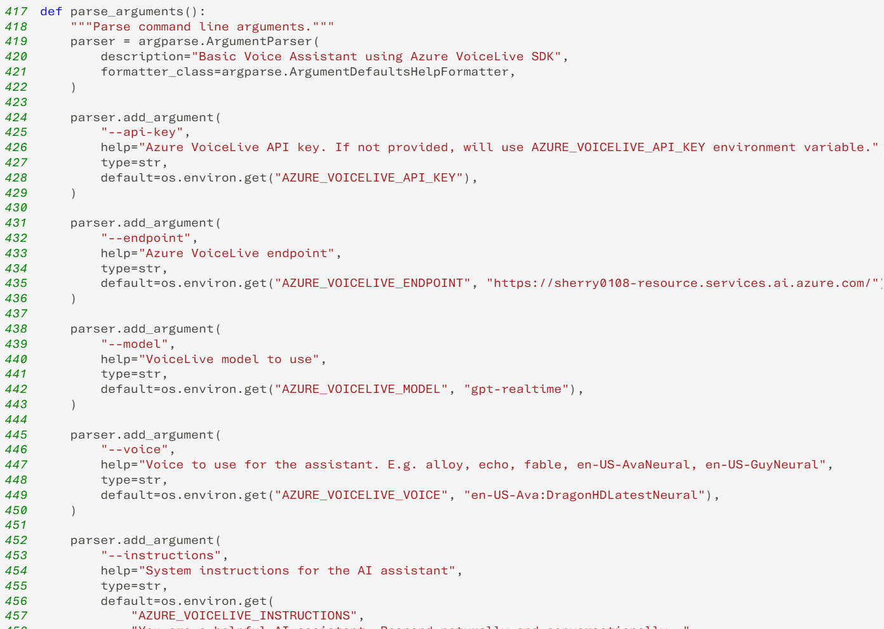

1. Click on **{X}.env variables** at the top of the code screen to your VoiceLive credentials.

    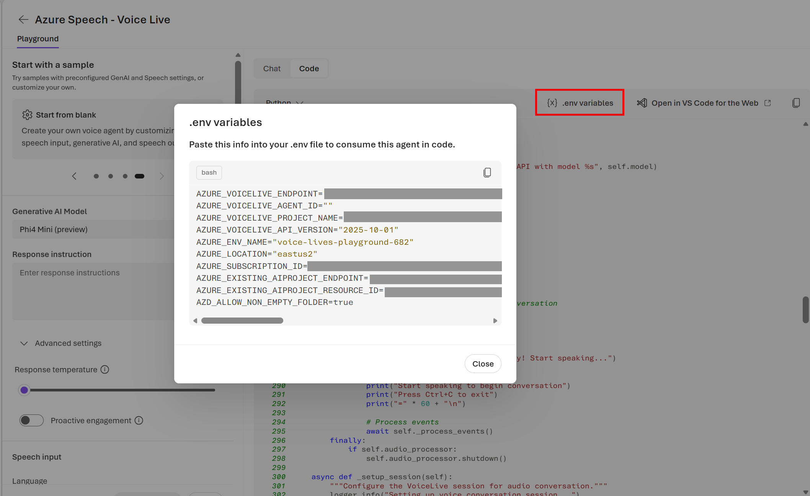

1. Stitched all together, we can understand what is executed with the `main` function that starts on line `472`: 
    - Your Azure credentials are validated (*notice how parse_arguments() is saved to the variable `args`*)
    - Your client is created
    - The voice assistant is created (*notice how the assistant is created on line `497` by calling the `BasicVoiceAssistant`*)
    - The voice assistant is given code for proper shutdown
    - The voice assistant is started 

    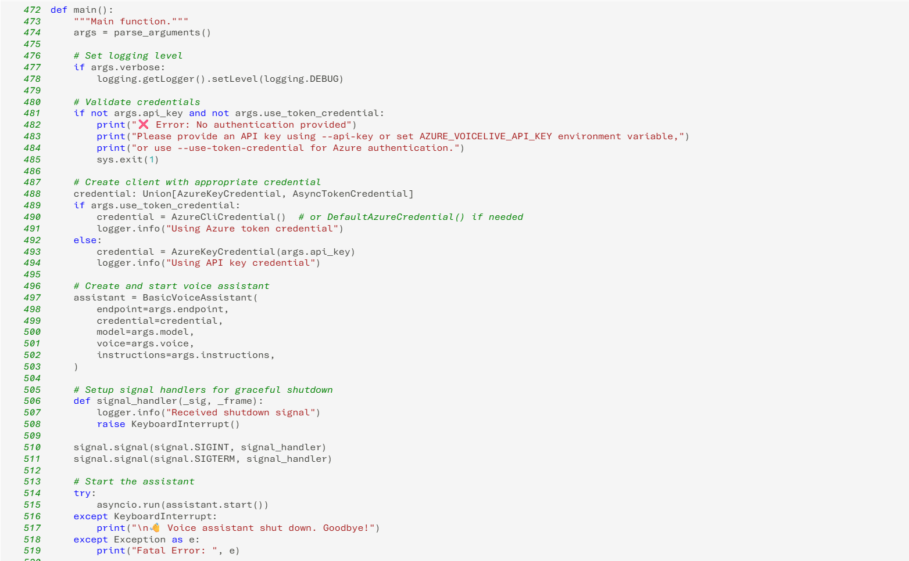

>**Try it out**: Those with a work or school account can click on **Open in VS Code for the Web** at the top of the code window and follow along with the instructions.  
    
## Clean up

If you don’t intend to do more exercises, delete any resources that you no longer need. This avoids accruing any unnecessary costs.

1. Open the **Azure portal** at [https://portal.azure.com](https://portal.azure.com) and select the resource group that contains the resources you created.
1. Select **Delete resource group** and then **enter the resource group name** to confirm. The resource group is then deleted.