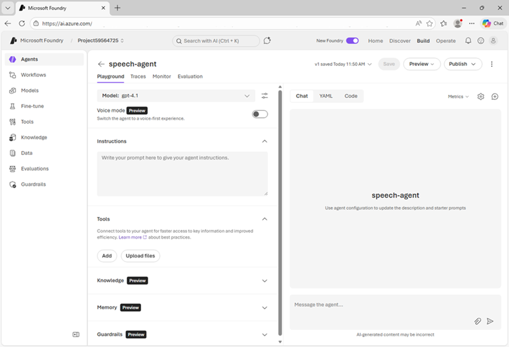

---
lab:
    title: 'Get started with speech in Microsoft Foundry'
    description: 'Use Microsoft Foundry to try out Azure Speech - Voice Live.'
    level: 200
    duration: 25 minutes
---

# Get started with speech in Microsoft Foundry

Speech-capable AI agents enable users to interact conversationally - using spoken command and questions that generate vocal responses.

In this exercise, use Azure Speech in Microsoft Foundry Tools to create a speech-capable agent. You'll use Azure Speech Voice Live, a service used to build real-time voice-based agents.

This exercise takes approximately **25** minutes.

## Create a Microsoft Foundry project

Microsoft Foundry uses projects to organize models, resources, data, and other assets used to develop an AI solution.

1. In a web browser, open Microsoft Foundry at https://ai.azure.com and sign in using your Azure credentials. Close any tips or quick start panes that are opened the first time you sign in, and if necessary use the Foundry logo at the top left to navigate to the home page.

1. If it is not already enabled, in the tool bar the top of the page, enable the **New Foundry** option. Then, if prompted, create a new project with a unique name; expanding the  **Advanced options** area to specify the following settings for your project:
    - **Foundry resource**: *Enter a valid name for your AI Foundry resource.*
    - **Subscription**: *Your Azure subscription*
    - **Resource group**: *Create or select a resource group*
    - **Region**: Select any of the **AI Foundry recommended** regions

1. Select **Create**. Wait for your project to be created. After creating or selecting a project in the new Foundry portal, it should open in a page similar to the following image:

    

## Create an agent

Now let's create an agent.

1. In the **Start building** menu, select **Create agent**; and when prompted, name the agent **speech-agent**.

     When ready, your agent opens in the agent playground.

    

1. In the model drop-down list, ensure that a **gpt-4.1** model has been deployed and selected for your agent.
1. Assign your agent the following **Instructions**:

    ```
   You are an AI agent that provides information about AI and related topics. You answer questions concisely and precisely.
    ```

1. Use the **Save** button to save the changes.
1. Test the agent by entering the following prompt in the **Chat** pane:

    ```
   What can you help me with?
    ```

    The agent should respond with an appropriate answer based on its instructions.

## Configure Azure Speech Voice live

Enabling speech mode for a Foundry agent integrates Azure Speech Voice Live - adding speech capabilities to the agent.

1. In the pane on the left, under the model selection list, enable **Speech mode**.

    If the **Configuration** pane does not open automatically, use the "cog" icon above the chat interface to open it.

1. In the **Configuration** pane, under **Voice Live**, review the default speech input and output configuration. You can try different voices, previewing them until you decide which one to use.
1. Close the **Configuration** pane and use the **Save** button to save the agent.

## Use speech to interact with the agent

Now you're ready to chat with the agent.

1. In the Chat pane, use the **Start session** button to start a conversation with the agent. If prompted, allow access to the system microphone.

    The agent will start a speech session, and listen for your prompt.

    

1. When the app status is **Listening…**, say something like `"How does speech recognition work?"` and wait for a response.

1. Verify that the app status changes to **Processing…**. The app will process the spoken input.

    >**Tip**: The processing speed may be so fast that you do not actually see the status before it changes back to *Speaking*.

1. When the status changes to **Speaking…**, the app uses text-to-speech to vocalize the response from the model. To see the original prompt and the response as text, select the **cc** button on the bottom of the chat screen.

    >**Tip**: The follow-on prompt is submitted just by speaking. You can even interrupt the agent to keep the interaction focused on what you need done. You can also use the **Stop generation** button in the chat pane to stop long-running responses. The button will end the conversation. You will need to start a new conversation to continue using the agent. 

1. To continue the conversation, just ask another question, such as `"How does speech synthesis work?"`, and review the response.
1. When you have finished chatting with the agent, use the **X** icon to end the session. A transcript of the conversation will be displayed.

## View client code

To use your agent in a custom application, you need to write code that uses the Azure Speech Voice Live SDK to handle streaming audio input and output.

1. Select **Code** at the top of the chat screen to view sample code for an agent client.
1. Review the code; noting that it handles:
    - Connectivity to your project to access the agent.
    - Audio streaming for input and output.
    - Use of audio devices, such as microphones and speakers.

## Clean up

If you have finished exploring Microsoft Foundry, delete any resources that you no longer need. This avoids accruing any unnecessary costs.

1. Open the **Azure portal** at [https://portal.azure.com](https://portal.azure.com) and select the resource group that contains the resources you created.
1. Select **Delete resource group** and then **enter the resource group name** to confirm. The resource group is then deleted.
