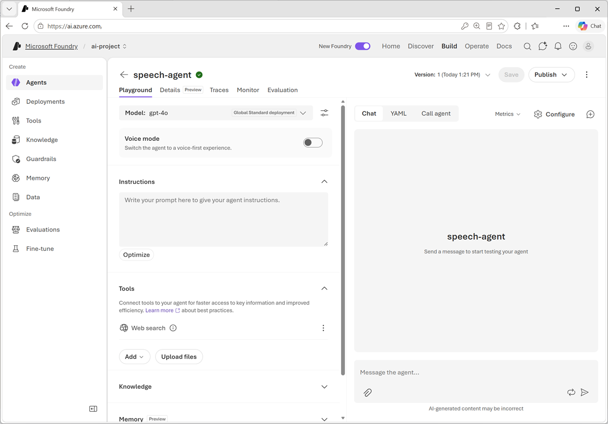

---
lab:
  title: Get started with speech in Microsoft Foundry
  description: Use Microsoft Foundry to try out Azure Speech - Voice Live.
  level: 200
  duration: 25 minutes
  islab: true
  primarytopics:
    - Azure
    - Microsoft Foundry
---

# Get started with speech in Microsoft Foundry

<br/>**Hi, I'm Anton.**<br/>I'll be here to help you with hints and tips as you work through this lab, in which you'll use Azure Speech in Microsoft Foundry Tools to create a speech-capable agent.

You can also interact with me in the *Ask Anton* app.

<details>
<strong><i><a href="https://aka.ms/choose-anton" target="_blank">Ask Anton</a></i></strong> is available in two forms at <code>https://aka.ms/choose-anton</code>:
<ul>
<li><strong>Azure-based</strong>: Best experience <i>(requires an Azure subscription and deployment of a model in a Foundry project)</i>.</li>
<li><strong>Browser-based</strong>: Use a small language model in your browser <i>(reduced functionality - may be slow or work only in "basic" mode in older/lower-spec devices)</i>.</li>
</ul>
<blockquote><i>Ask Anton is <u>not</u> a supported Microsoft product or a component of Microsoft Learn or AI Skills Navigator.</i>
</blockquote>
</details>
<hr/>

This exercise takes approximately **25** minutes.

## Create a Microsoft Foundry project

Microsoft Foundry uses projects to organize models, resources, data, and other assets used to develop an AI solution.

1. In a web browser, open [Microsoft Foundry](https://ai.azure.com){:target="_blank"} at `https://ai.azure.com` to start building; signing in using your Azure credentials.
1. If it isn't already enabled, in the tool bar the top of the page, enable the **New Foundry** option.
1. If you do not have any existing projects, you will be prompted to create one. Create a new project with a unique name; expanding the  **Advanced options** area to specify the following settings for your project (or you can select an existing project if you have one!):
    - **Foundry resource**: *Enter a valid name for your AI Foundry resource.*
    - **Subscription**: *Your Azure subscription*
    - **Resource group**: *Create or select a resource group*
    - **Region**: Select any of the **AI Foundry recommended** regions in **[this list](https://learn.microsoft.com/azure/foundry/openai/how-to/responses#region-availability)**{:target="_blank"}

    > <br/>**Tip**: Depending on your permissions in the Azure subscription, you may need to clear the option to set up recommended resources.

1. Select **Create**. Wait for your project to be created. After creating or selecting a project in the new Foundry portal, it should open in a page similar to the following image:

    

## Create an agent

Now let's create an agent.

1. On the **Home** page, in the **Build an agent** tile, select **Start building** (or on the **Build** page, select the **Agents** tab); and create a new agent named `speech-agent`.

     When ready, your agent opens in the agent playground.

    

1. In the model drop-down list, ensure that a model has been deployed and selected for your agent.
1. Assign your agent the following **Instructions**:

    ```
   You are an AI agent that provides information about AI and related topics. You answer questions concisely and precisely.
    ```

1. Use the **Save** button to save the changes.
1. Test the agent by entering the following prompt in the **Chat** pane:

    ```
   What can you help me with?
    ```

    The agent should respond with an appropriate answer based on its instructions.

## Configure Azure Speech Voice live

Enabling speech mode for a Foundry agent integrates Azure Speech Voice Live - adding speech capabilities to the agent.

1. In the pane on the left, under the model selection list, enable **Voice mode**.

    If the **Configuration** pane doesn't open automatically, use the "cog" icon above the chat interface to open it.

1. In the **Configuration** pane, under **Voice mode**, review the default speech input and output configuration. You can try different voices, previewing them until you decide which one to use.
1. Close the **Configuration** pane and use the **Save** button to save the agent.

## Use speech to interact with the agent

Now you're ready to chat with the agent.

> <br/>**Tip**: Speech input works best in a quiet environment with a microphone or headset.

1. In the Chat pane, use the **Start session** button to start a conversation with the agent. If prompted, allow access to the system microphone.

    The agent will start a speech session, and listen for your prompt.

    

1. When the app status is **Listening…**, say something like `"How does speech recognition work?"` and wait for a response.

1. Verify that the app status changes to **Processing…**. The app will process the spoken input.

    The processing speed may be so fast that you do not actually see the status before it changes back to *Speaking*.

1. When the status changes to **Speaking…**, the app uses text-to-speech to vocalize the response from the model. To see the original prompt and the response as text, select the **cc** button on the bottom of the chat screen.
1. To continue the conversation, just ask another question, such as `"How does speech synthesis work?"`, and review the response.
1. When you have finished chatting with the agent, use the **X** icon to end the session. A transcript of the conversation will be displayed.

## View client code

To use your agent in a custom application, you need to write code that uses the Azure Speech Voice Live SDK to handle streaming audio input and output.

1. Select **Call agent** at the top of the chat screen to view sample code for an agent client.
1. Review the code; noting that it handles:
    - Connectivity to your project to access the agent.
    - Audio streaming for input and output.
    - Use of audio devices, such as microphones and speakers.

## Summary

In this exercise, you explored the Azure Speech Voice Live tool in Microsoft Foundry, and how to use it to build a conversational agent. Azure Speech includes multiple speech capabilities that you can use to build AI applications and agents that transcribe speech, or generate spoken output from text.

## Clean up

If you have finished exploring Microsoft Foundry, delete any resources that you no longer need. This avoids accruing any unnecessary costs.

1. Open the **Azure portal** at [https://portal.azure.com](https://portal.azure.com) and select the resource group that contains the resources you created.
1. Select **Delete resource group** and then **enter the resource group name** to confirm. The resource group is then deleted.

> <br/>If you used the [*Ask Anton*](https://aka.ms/choose-anton){:target="_blank"} app during this lab, we'd love you to [tell us about your experience with it](https://forms.office.com/r/fC0ndfBQeK){:target="_blank"}!
