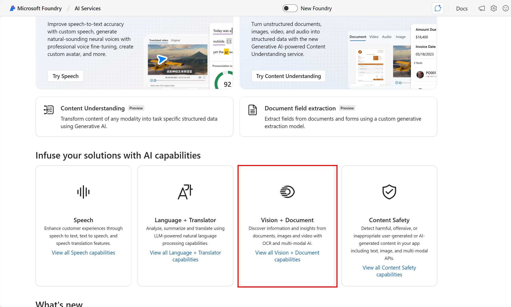
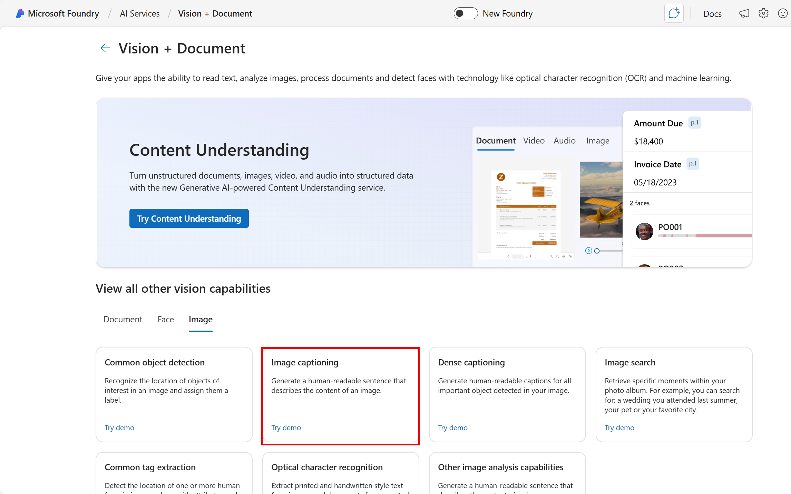
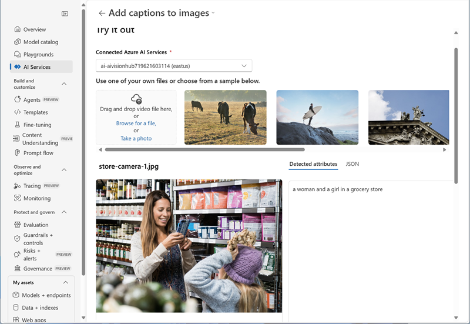
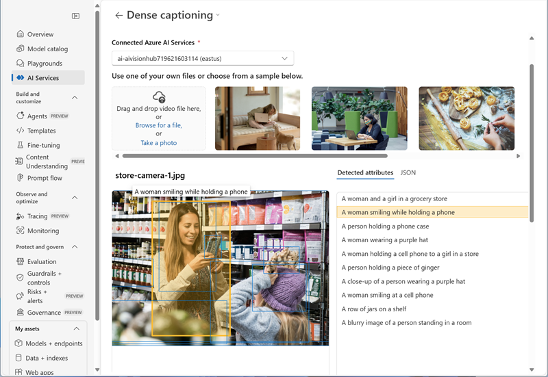
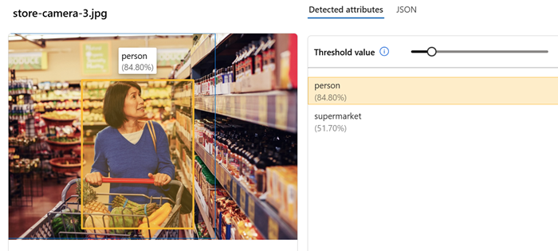

---
lab:
    title: 'Analyze images in Microsoft Foundry'
---

# Analyze images in Microsoft Foundry

**Azure Vision** includes numerous capabilities for understanding image content and context and extracting information from images. In this exercise, you will use Azure Vision in Microsoft Foundry, Microsoft's platform for creating intelligent applications, to analyze images using the built-in try-it-out experiences. 

Suppose the fictitious retailer *Northwind Traders* has decided to implement a "smart store", in which AI services monitor the store to identify customers requiring assistance, and direct employees to help them. By using Azure Vision, images taken by cameras throughout the store can be analyzed to provide meaningful descriptions of what they depict.

This exercise takes approximately **20** minutes.

## Download and extract image files

1. Download **[image-analysis.zip](https://aka.ms/mslearn-images-for-analysis)** from `https://aka.ms/mslearn-images-for-analysis`.
1. Extract the downloaded .zip file to a folder on your computer.

## Create a project in Microsoft Foundry

1. In a web browser, open [Microsoft Foundry](https://ai.azure.com) at `https://ai.azure.com` and sign in using your Azure credentials. Close any tips or quick start panes that are opened the first time you sign in, and if necessary use the **Foundry** logo at the top left to navigate to the home page, which looks similar to the following image (close the **Help** pane if it's open):

    

1. Scroll to the bottom of the page, and select the **Explore Azure AI Services** tile.

    

1. On the Azure AI Services page, select the **Vision + Document** tile.

    

1. On the **Vision + Document** page, view the **Image** tab and select the **Image captioning** tile.

    

1. In the **Add captions to images** pane, use the **select a hub** button to **create a new hub** with the following settings:
    - **Hub name**: *Enter a valid name for your hub.*
    - **Subscription**: *Your Azure subscription*
    - **Resource group**: *Create or select a resource group*
    - **Location**: *Select one of the following locations*/*:
        - East US
        - France Central
        - Korea Central
        - West Europe
        - West US
    - **Connect Azure AI Services**: *Create a new Azure AI Services resource with a valid name*
    - **Connect Azure AI Search**: Skip connecting

    \**At the time of writing, Azure Vision is supported in hubs in these regions*.

1. When the hub is created, you will be prompted to create a project. Enter a suitable project name and select **Create project**.

## Generate captions for an image

Let's use the image captioning functionality of Azure Vision to analyze images taken by a camera in the *Northwind Traders* store. Image captions are available through the **Caption** and **Dense Captions** features.

1. In the task pane on the left, select **AI Services**.

    *Now you need to repeat the steps you used previously to get back to the image captioning interface and use your new hub-based project.*

1. On the **AI Services** page, select the **Vision + Document** tile. Then on the **Vision + Document** page, on the **Image** tab, select the **Image captioning** tile.

1. On the **Add captions to images** page, under the *Connected Azure AI services* selection menu, ensure that the Azure AI services resource you created in your hub is selected.

1. Use the **Browse for a file** link to upload the **store-camera-1.jpg** image from the files you downloaded and extracted earlier.

1. Observe the generated caption text, visible in the **Detected attributes** panel to the right of the image.

    

    The **Caption** functionality provides a single, human-readable English sentence describing the image's content.

1. Next, use the same image to perform **Dense captioning**. Return to the **Vision + Document** page by selecting the **&larr;** *back* arrow at the top of the page; and then on the **Vision + Document** page, on the **Image** tab, selecting the **Dense captioning** tile.

    The **Dense Captions** feature differs from the **Caption** capability in that it provides multiple human-readable captions for an image, one describing the image's content and others, each covering the essential objects detected in the picture. Each detected object includes a bounding box, which defines the pixel coordinates within the image associated with the object.

1. Upload the **store-camera-1.jpg** image again, and view the dense captioning results.

    

    Hover over any of the captions in the **Detected attributes** list and observe that a caption is generated for each object detected in the image.

## Tagging images 

The next feature you will try is the *Extract Tags* functionality. Extract tags is based on thousands of recognizable objects, including living beings, scenery, and actions.

1. Return to the **Vision + Document** page by selecting the **&larr;** *back* arrow at the top of the page. Then on the **Vision + Document** page, on the **Image** tab, select the **Common tag extraction** tile.
1. Upload the **store-camera-2.jpg** file from the folder you extracted previously.
1. Review the list of tags extracted from the image and the confidence score for each in the detected attributes panel. Here the confidence score is the likelihood that the text for the detected attribute describes what is actually in the image. Notice in the list of tags that it includes not only objects, but actions, such as *shopping*, *selling*, and *standing*.

    

## Object detection

In this task, you use the **Object detection** feature of Image Analysis. Object detection detects and extracts bounding boxes based on thousands of recognizable objects and living beings.

1. Return to the **Vision + Document** page by selecting the **&larr;** *back* arrow at the top of the page. Then on the **Image** tab, select the **Common object detection** tile.

1. Upload the **store-camera-3.jpg** file.

1. In the **Detected attributes** box, observe the list of detected objects and their confidence scores.

    

1. Try detecting the objects in **store-camera-4.jpg**

## Clean up

If you don’t intend to do more exercises, delete any resources that you no longer need. This avoids accruing any unnecessary costs.

1. Open the [Azure portal]( https://portal.azure.com) and select the resource group that contains the resources you created. 
1. Select **Delete resource group** and then **enter the resource group name** to confirm. The resource group is then deleted.

## Learn more

To learn more about what you can do with this service, see the [Azure Vision page](https://learn.microsoft.com/azure/ai-services/computer-vision/overview).
