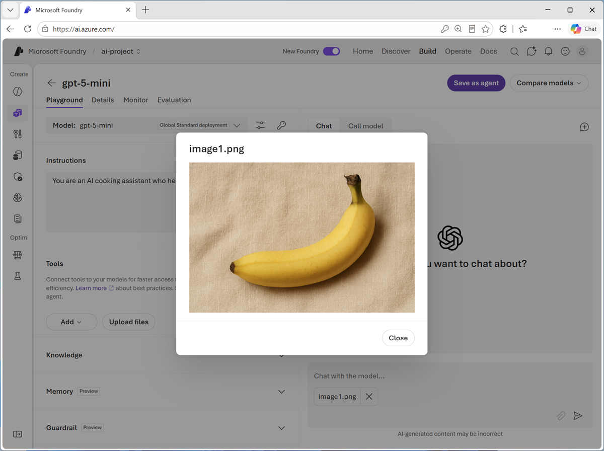
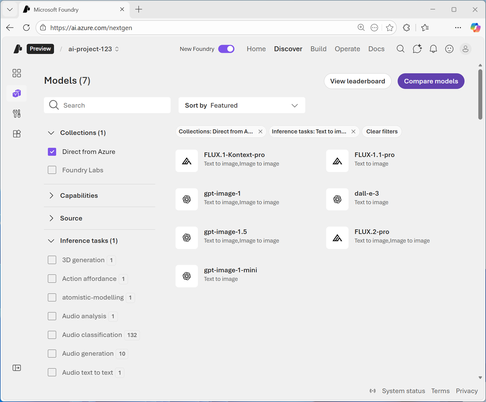
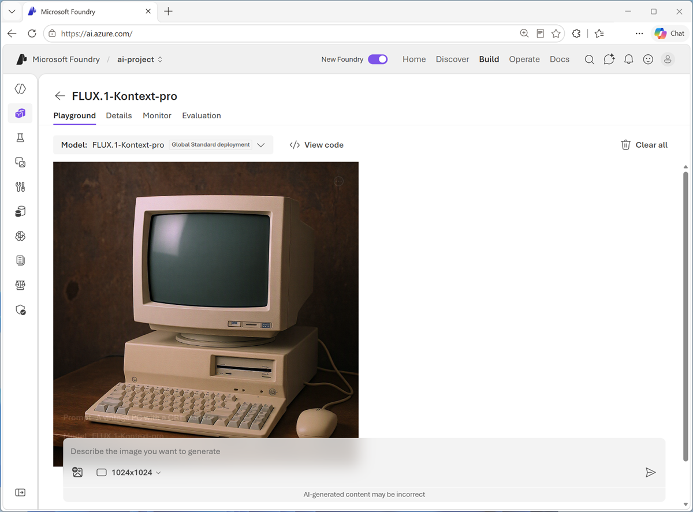
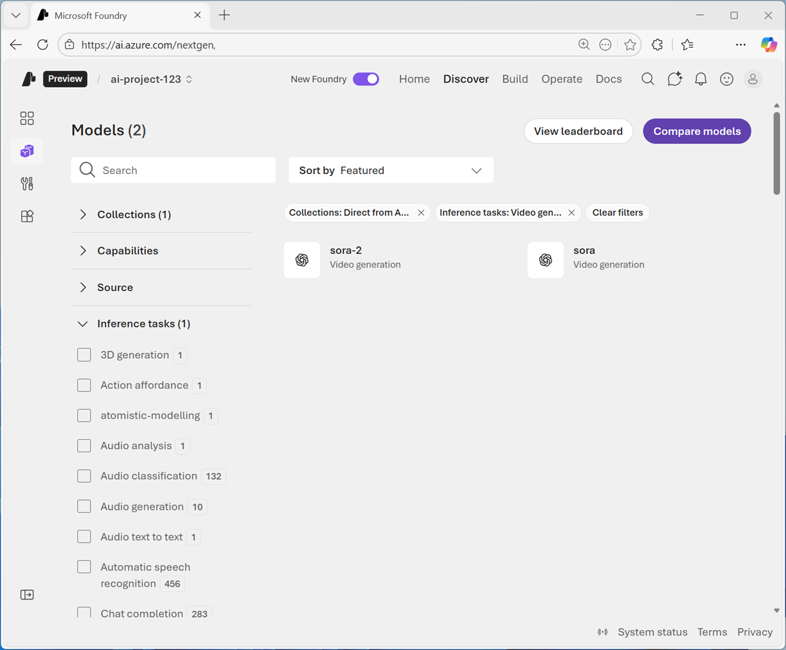
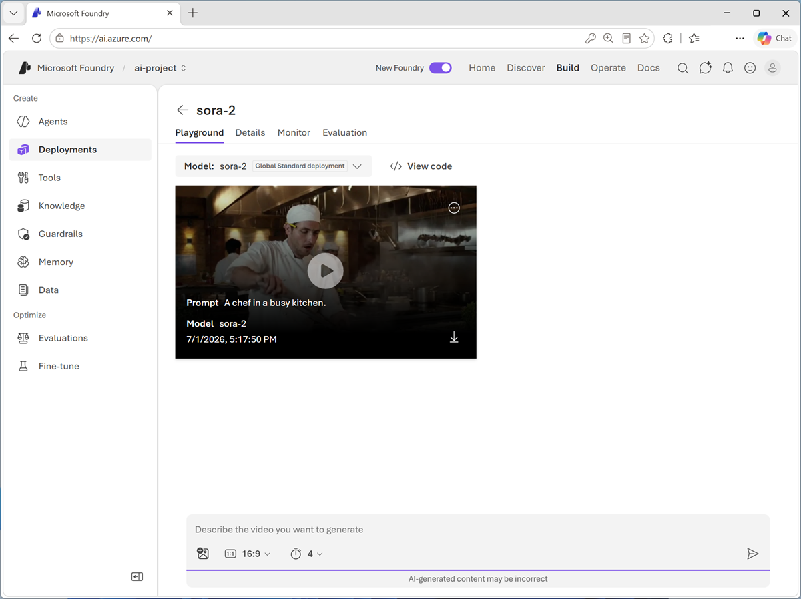

---
lab:
  title: Get started with computer vision in Microsoft Foundry
  description: Use generative AI models to interpret and generate visual data.
  level: 200
  duration: 30 minutes
  islab: true
  primarytopics:
    - Microsoft Foundry
---

# Get started with computer vision in Microsoft Foundry

<br/>**Hi, I'm Anton.**<br/>I'll be here to help you with hints and tips as you work through this lab, in which you'll use generative AI models in Microsoft Foundry to work with visual data.

You can also interact with me in the *Ask Anton* app.

<details>
<strong><i><a href="https://aka.ms/choose-anton" target="_blank">Ask Anton</a></i></strong> is available in two forms at <code>https://aka.ms/choose-anton</code>:
<ul>
<li><strong>Azure-based</strong>: Best experience <i>(requires an Azure subscription and deployment of a model in a Foundry project)</i>.</li>
<li><strong>Browser-based</strong>: Use a small language model in your browser <i>(reduced functionality - may be slow or work only in "basic" mode in older/lower-spec devices)</i>.</li>
</ul>
<blockquote><i>Ask Anton is <u>not</u> a supported Microsoft product or a component of Microsoft Learn or AI Skills Navigator.</i>
</blockquote>
</details>
<hr/>

This exercise should take approximately **30** minutes to complete.

## Create a Microsoft Foundry project

Microsoft Foundry uses *projects* to organize models, resources, data, and other assets used to develop an AI solution.

1. In a web browser, open [Microsoft Foundry](https://ai.azure.com){:target="_blank"} at `https://ai.azure.com` to start building; signing in using your Azure credentials.
1. If it isn't already enabled, in the tool bar the top of the page, enable the **New Foundry** option.
1. If you do not have any existing projects, you will be prompted to create one. Create a new project with a unique name; expanding the  **Advanced options** area to specify the following settings for your project (or you can select an existing project if you have one!):
    - **Foundry resource**: *Enter a valid name for your AI Foundry resource.*
    - **Subscription**: *Your Azure subscription*
    - **Resource group**: *Create or select a resource group*
    - **Region**: Select any of the **AI Foundry recommended** regions in **[this list](https://learn.microsoft.com/azure/foundry/openai/how-to/responses#region-availability)**{:target="_blank"}

    > <br/>**Tip**: Depending on your permissions in the Azure subscription, you may need to clear the option to set up recommended resources.

1. Wait for your project to be created. It may take a few minutes. After creating or selecting a project in the new Foundry portal, it should open in a page similar to the following image:

    

## Use a generative AI model to analyze images

Computer vision models enable AI systems to interpret image-based data, such as photographs, videos, and other visual elements. In this exercise, you'll explore how the computer vision can be used in an agent to help identify vintage computer hardware.

1. In a new browser tab, download **[images.zip](https://microsoftlearning.github.io/mslearn-ai-fundamentals/data/images.zip){:target="_blank"}** `https://microsoftlearning.github.io/mslearn-ai-fundamentals/data/images.zip` to your local computer.
1. Extract the downloaded archive in a local folder to see the files it contains. These files are the images you'll use AI to analyze.
1. Return to the browser tab containing your Microsoft Foundry project.
1. On the **Discover** page, select the **Models** tab to view the Microsoft Foundry model catalog.
1. Search for and deploy the `gpt-5-mini` model using the default settings. Deployment may take a minute or so.

    > <br/>**Tip**: If you already have a *gpt* model deployment, you can use it instead of deploying a new one. Model deployments are subject to regional quotas. If you don't have enough quota to deploy a *gpt-5-mini* model in your project's region, you can use a different *gpt* chat-capable model - such as *gpt-5-nano*, or *gpt-5.4-mini*. Alternatively, you can create a new project in a different region..

1. When the model has been deployed, view the model playground page that is opened, in which you can chat with the model.

    

1. Use the button at the bottom of the left navigation pane to hide it and give yourself more room to work with.
1. In the pane on the left, set the **Instructions** to `You are an AI assistant that helps people identify vintage computer hardware.`
1. In the chat pane, use the **Upload image** button to select one of the images you extracted on your computer. The image is added to the prompt area.

1. Enter prompt text like `What can you tell me about this?` and submit the prompt, which contains both the uploaded image and the text.
1. Review the response, which should include relevant information about the image you uploaded.

    You can select the image you have added to view it.

   

1. Submit prompts that include the other images, such as `What is this?` or `Tell me about this.`

### View code

To develop a client app or agent that can use the model to interpret images, you can use the **OpenAI Responses** API.

1. In the **Chat** pane, select the **Call model** tab to view sample code.
1. Select the following code options:
    - **Language**: Python
    - **Authentication**: Key authentication

    The default sample code includes only a text-based prompt. To submit a prompt that analyzes an image, you can modify the **input** parameter to include both text and image content, as shown here:

    ```python
    from openai import OpenAI
    
    endpoint = "https://your-project-resource.openai.azure.com/openai/v1/"
    deployment_name = "gpt-5-mini"
    api_key = "<your-api-key>"
    
    client = OpenAI(
        base_url=endpoint,
        api_key=api_key
    )
    
    response = client.responses.create(
        model=deployment_name,
        input=[{
            "role": "user",
            "content": [
                {"type": "input_text", "text": "what's in this image?"},
                {"type": "input_image", "image_url": "https://an-online-image.jpg"},
            ],
        }],
    )
    
    print(f"answer: {response.output_text}")
    ```

    > <br/>**Tip**: If you are using a work or school account to sign into Azure, and you have sufficient permissions in the Azure subscription, you can open the sample code in VS Code for Web to experiment with image-based input content. You can obtain the **key** for your service in the **Code** tab of the model playground (above the sample code) and you can use the image **[joystick.png](https://microsoftlearning.github.io/mslearn-ai-fundamentals/data/joystick.png){:target="_blank"}** at `https://microsoftlearning.github.io/mslearn-ai-fundamentals/data/joystick.png`. To learn more about using the OpenAI API to analyze images, see the [OpenAI documentation](https://platform.openai.com/docs/guides/images-vision#analyze-images).

## Use a generative AI model to create new images

So far you've explored the ability of a generative AI model to process visual input. Now let's suppose we want some appropriate images on a web site to support the computing history agent. Let's see how a model can generate visual output.

> <br/>**Tip**: This task requires a subscription that has access to image-generation models.

1. Use the "back" arrow next to the **gpt-5-mini** header (or select the **Models** page in the navigation pane) to view the model deployments in your project.
1. Select **Deploy a base model** to open the model catalog.
1. In the **Collections** drop-down list, select **Direct from Azure**, and in the **Inference tasks** drop-down list, select **Text to image**. Then view the available models for image generation.

   

    > <br/>**Tip**: The available models in your subscription may vary. Additionally, the ability to deploy models depends on regional availability and quota.

1. Select an available text-to-image model, such as **gpt-image-1-mini** or **FLUX.2-pro**, and deploy it.

    *If one of these models is unavailable in your subscription or region, deploy another text-to-image model that's available.*

1. When the model has been deployed, it opens in the image playground.
1. Enter a prompt describing a desired image; for example, `A vintage PC with a CRT monitor.` Then review the generated image.

   

### View code

If you want to develop a client app or agent that generates images using your model, you can use the OpenAI API.

> <br/>**Tip**: Model availability and playground features can vary. Some image-generation models might not show a **View code** or equivalent option. If your selected model doesn't include code samples, you can still complete the exercise by generating an image in the playground, or use another deployed text-to-image model that does expose code samples.

1. If your deployed model includes code samples, in the **Chat** pane, select **View code** to view sample code.
1. Select the following code options:
    - **Language**: Python
    - **SDK**: OpenAI SDK
    - **Authentication**: Key authentication

    The default sample code should look similar to this:

    ```python
    import base64
    from openai import OpenAI
    
    endpoint = "https://your-project-resource.openai.azure.com/openai/v1/"
    deployment_name = "your-text-to-image-model-deployment"
    api_key = "<your-api-key>"
    
    client = OpenAI(
        base_url=endpoint,
        api_key=api_key
    )
    
    img = client.images.generate(
        model=deployment_name,
        prompt="A cute baby polar bear",
        n=1,
        size="1024x1024",
    )
    
    image_bytes = base64.b64decode(img.data[0].b64_json)
    with open("output.png", "wb") as f:
        f.write(image_bytes)
    ```

## Use a generative AI model to create video (*if available*)

<br/>**Tip**: This task requires a subscription that has access to video-generation models.

In addition to static images, you may want to include video content on the computing history agent web site.

1. Use the "back" arrow next to the image-generation model header (or select the **Models** page in the navigation pane) to view the model deployments in your project.
1. Select **Deploy a base model** to open the model catalog.
1. In the **Collections** drop-down list, select **Direct from Azure**, and in the **Inference tasks** drop-down list, select **Video generation**. Then view the available models for video generation.

   

    <br/>**Tip**: The available models in your subscription may vary. Additionally, the ability to deploy models depends on regional availability and quota.

1. Select the **Sora-2** model and deploy it.

    *If the Sora-2 model is available in your subscription, you may need to request access to the latest available model.*

1. When the model has been deployed, it opens in the video playground.
1. Enter a prompt describing a desired video; for example, `A retro computer game.` Then review the generated video.

   

### View code

If you want to develop a client app or agent that generates videos using your model, you can use the REST API.

1. In the **Chat** pane, select **View Code** to view sample code.

    The default sample code uses the *curl* command to call the REST endpoint, and should look similar to this:

    ```bash
    curl -X POST "https://your-project-resource.openai.azure.com/openai/v1/video/generations/jobs" \
    -H "Content-Type: application/json" \
    -H "Authorization: Bearer $AZURE_API_KEY" \
    -d '{
        "prompt" : "A video of a cat",
         "height" : "1080",
         "width" : "1080",
         "n_seconds" : "5",
         "n_variants" : "1",
        "model": "sora"
        }'
    ```

## Summary

in this exercise, you explored the use of vision-enabled models in Microsoft Foundry, including models that can accept vision data as input, models that can generate static images based on text descriptions, and models that can generate video.

## Clean up

If you've finished working with Microsoft Foundry, delete the resources you created in this exercise to avoid incurring unnecessary Azure costs.

1. Open the **Azure portal** at [https://portal.azure.com](https://portal.azure.com) and select the resource group that contains the resources you created.
1. Select **Delete resource group** and then **enter the resource group name** to confirm. The resource group is then deleted.

> <br/>If you used the [*Ask Anton*](https://aka.ms/choose-anton){:target="_blank"} app during this lab, we'd love you to [tell us about your experience with it](https://forms.office.com/r/fC0ndfBQeK){:target="_blank"}!
