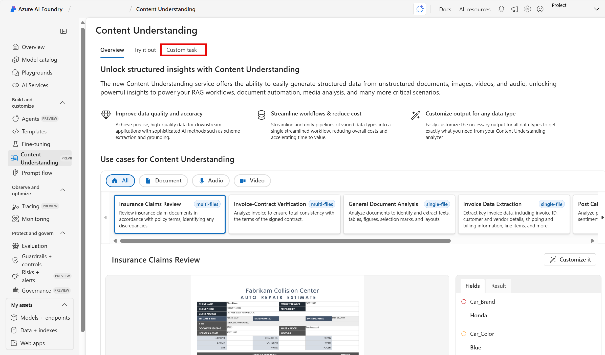
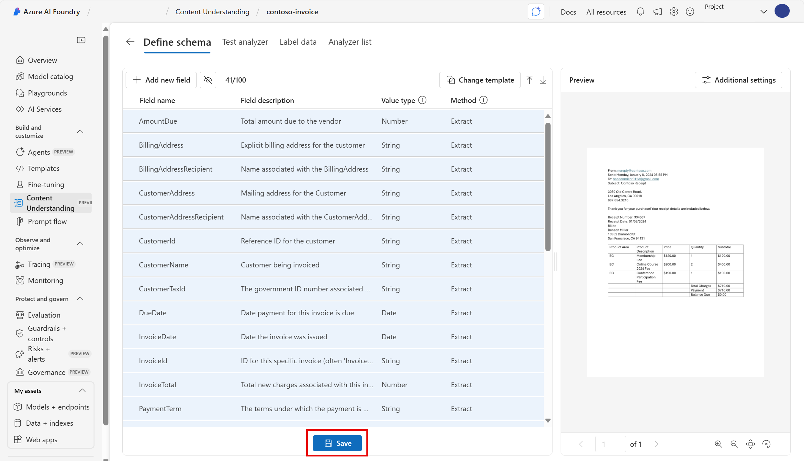
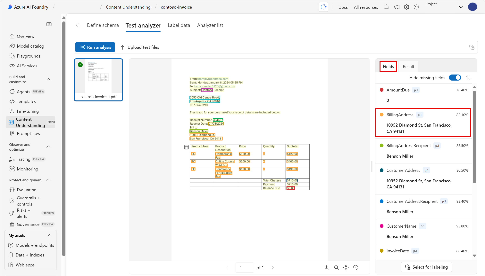
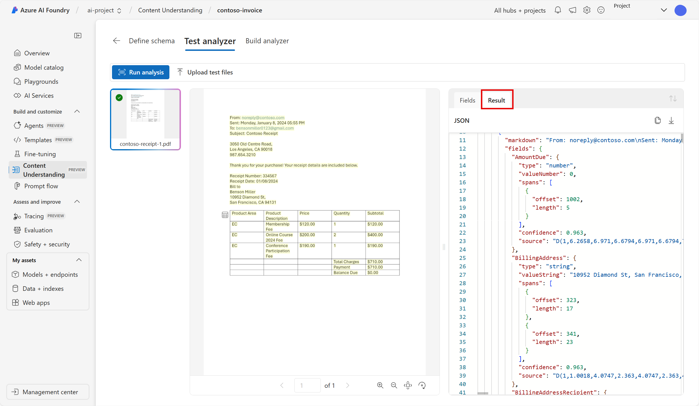
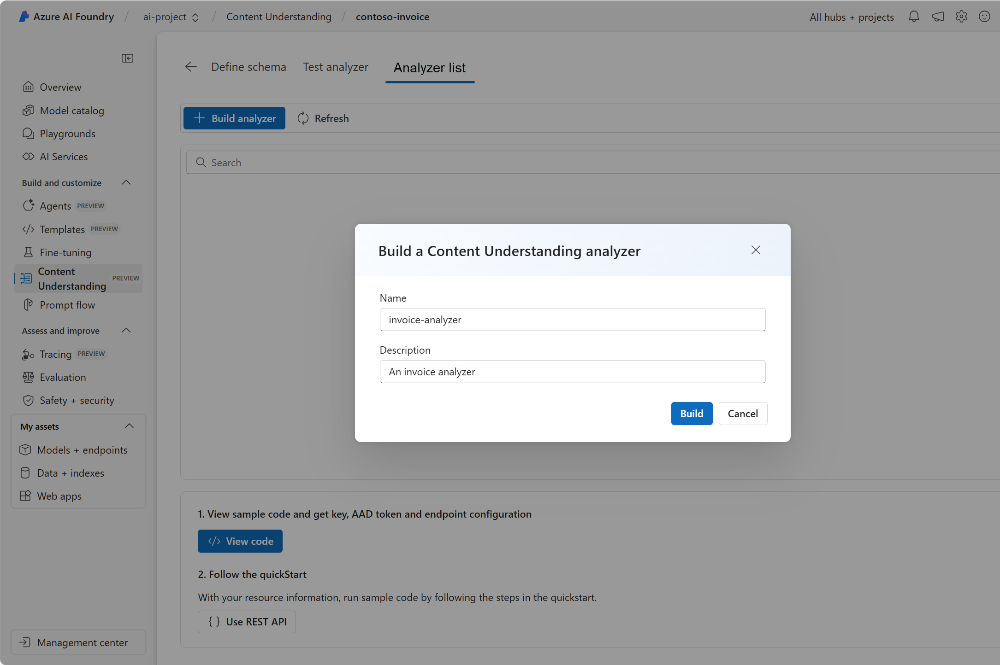
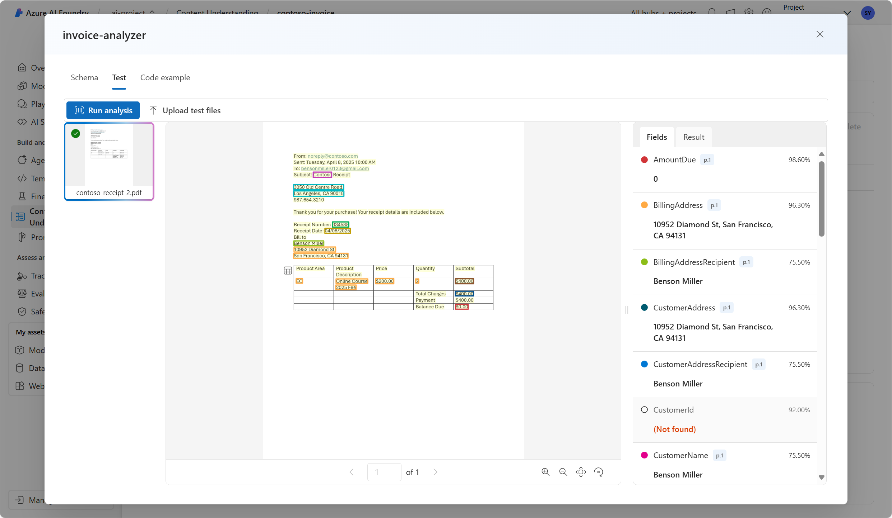

---
lab:
    title: 'Extract data with Content Understanding in Azure AI Foundry portal​'
---

# Extract data with Content Understanding in Azure AI Foundry portal

**Azure AI Content Understanding (preview)** uses generative AI to process content of many types (documents, images, videos, and audio) into a user-defined output format.

In this exercise, you will use Azure AI Content Understanding in Azure AI Foundry portal, Microsoft's platform for creating intelligent applications, to recognize data from invoices. 

This exercise takes approximately **25** minutes.

## Create an Azure AI Foundry project and content understanding task

1. In a web browser, open the [Azure AI Foundry portal](https://ai.azure.com) at `https://ai.azure.com` and sign in using your Azure credentials. Close any tips or quick start panes that are opened the first time you sign in, and if necessary use the **Azure AI Foundry** logo at the top left to navigate to the home page, which looks similar to the following image (close the **Help** pane if it's open):

    

1. In a new browser window, open the [Azure AI services exploration page](https://ai.azure.com/explore/aiservices).

1. On the *AI Services* page, select the *Try Content Understanding* tile.

1. Select **Create a project to start**. 

1. Select **+ Create a project**.

1. In the wizard, enter a valid name for your project. 

1. Select **Advanced options** and specify the following settings:
    - **Azure AI Foundry resource**: *Keep the default name*
    - **Subscription**: *Your Azure subscription*
    - **Resource group**: *Create or select a resource group*
    - **Region**: Select one of the following locations:
        * West US
        * Sweden Central
        * Australia East

1. Select **Create**. Wait for the set up process to complete. It may take a few minutes.

1. On the Content Understanding page, select the **Custom Task** tab. 

    

1. In the custom task tab, select **+ Create**.

1. In the wizard, use the following settings to create a content understanding task:
    - **Task name**: `contoso-invoice`
    - **Description**: `An invoice analysis task`
    - Select **Standard mode - Single-file analysis**
    - **Advanced settings**: *keep the default*.

1. Select **Create**, then wait for your task to be created. You should be taken to your **contoso-invoice** task when it is created.

## Analyze an invoice with Azure AI Content Understanding in Azure AI Foundry 

Suppose you want to extract data from many invoices and put the data into a database. You can use Azure AI Content Understanding to analyze one invoice and build your own analyzer that can analyze other similar invoices. Let's start by defining your schema.

#### Define your schema 

1. Download [contoso-invoice-1.pdf](https://raw.githubusercontent.com/MicrosoftLearning/mslearn-ai-fundamentals/refs/heads/main/data/contoso-invoice-1.pdf) from `https://raw.githubusercontent.com/MicrosoftLearning/mslearn-ai-fundamentals/refs/heads/main/data/contoso-invoice-1.pdf`. 

    >**Note**: To download the file, open a new web browser window and enter in the link. Selecting enter should automatically download the file to the computer's *Downloads* folder.  

1. On Azure AI Foundry's Content Understanding's *Define Schema* page, you can add test files. Upload the *contoso-invoice-1.pdf* file to the **define schema** page. Select the **Invoice data extraction** template. The invoice data extraction template has pre-selected data fields that the analyzer will try to detect. 

    

1. Select **Create**.
 
1. Now you have the ability to modify the schema by adding or deleting fields. When you are done reviewing the fields, select **Save**.

    

1. Wait for the analysis to run. This may take a moment.

#### Test the analyzer 

1. When the analysis is finished, you will be able to see how the analyzer has done in the *Test Analyzer* page. Review the *Fields* tab (*Note*: you may need to expand the window to see the full results). Does this data align with what you see on the invoice? 
    

1. Notice the *confidence score* next to each field. The confidence score represents how confident the model is that its result is accurate. Results with confidence scores closer to 100% indicate greater confidence in the prediction.

1. Review the *Result* tab. The same information that you see rendered in the fields tab is in the results tab in JSON. The JSON shows how the information looks when it is sent to and from a client application. 

    

1. The Content Understanding service should have correctly identified the text that corresponds to the fields in the schema. If it had not done so, you could use the *Label data* page to upload another sample form and explicitly identify the correct text for each field. When you are satisfied with how well the analyzer is able to detect the data in the invoice, select the **Analyzer list** tab. 

#### Build your analyzer 

Now that you have trained a model to extract fields from your sample invoice, you can build an analyzer to use with similar forms. By building an analyzer, you can deploy the model and use it to automate other invoice tasks.

1. In the *Analyzer list* tab, select **+ Build Analyzer**. Enter the following: 
    - **Name**: `invoice-analyzer`
    - **Description**: `An invoice analyzer`

    

1. Select **Build**. Wait for the new analyzer to be ready (use the Refresh button to check). Your analyzer uses a predictive model that is based on the schema you have defined and tested in previous steps. 

1. Once your new analyzer is ready, select its invoice-analyzer link. 

1. In the invoice-analyzer page, select *Test*.

1. Download a different invoice from Contoso [contoso-invoice-2.pdf](https://raw.githubusercontent.com/MicrosoftLearning/mslearn-ai-fundamentals/refs/heads/main/data/contoso-invoice-2.pdf) from `https://raw.githubusercontent.com/MicrosoftLearning/mslearn-ai-fundamentals/refs/heads/main/data/contoso-invoice-2.pdf`.

1. On Azure AI Foundry Content Understanding's *Analyzer list* page, use the **+ Upload test files** button to upload *contoso-receipt-2.pdf*. 

1. Select **Run analysis** to extract field data from the test form. Review the results of the test.

    

1. Select the *Code example* tab. Look for the *endpoint* in the code. In the *Build analyzer* phase of the process, you deployed your content understanding model to an endpoint. The endpoint can be used in code similar to what you see in the example to incorporate the model into a repeatable process in an application.  

    

## Clean up

If you’ve finished working with the Content Understanding service, you should delete the resources you have created in this exercise to avoid incurring unnecessary Azure costs.

- In the Azure AI Foundry portal, navigate to the contoso-receipt project and delete it.
- In the Azure portal, delete the resource group you created in this exercise.
