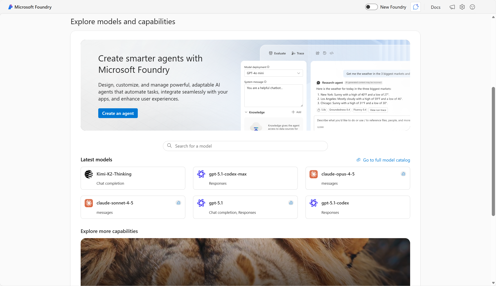
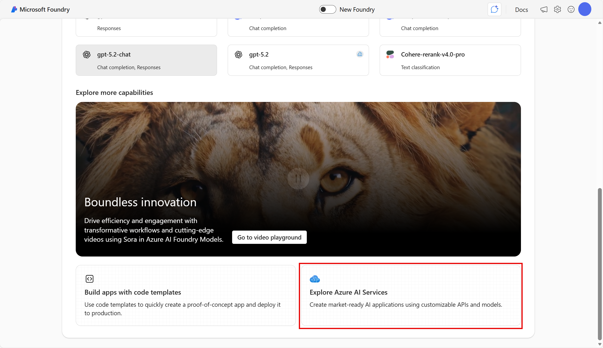
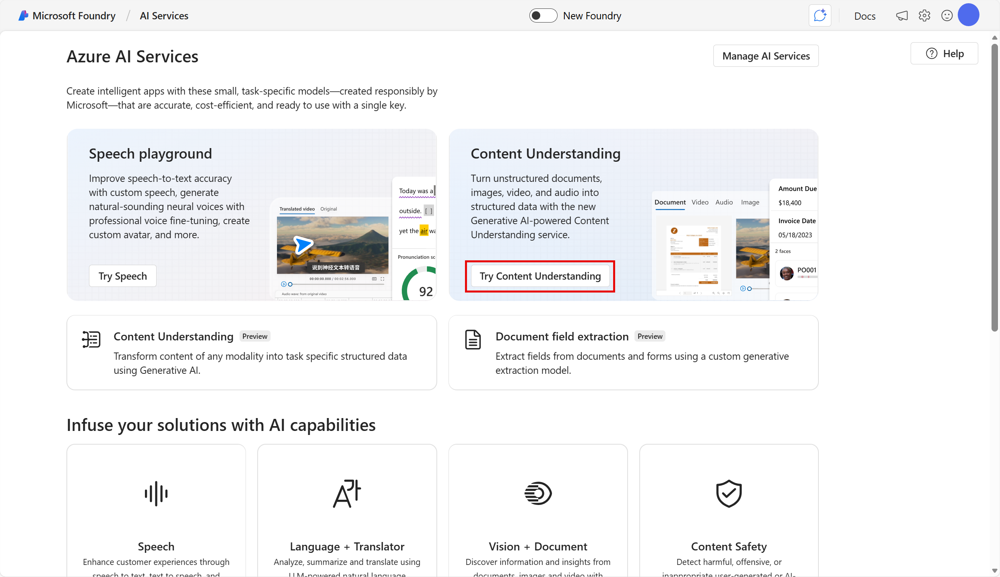
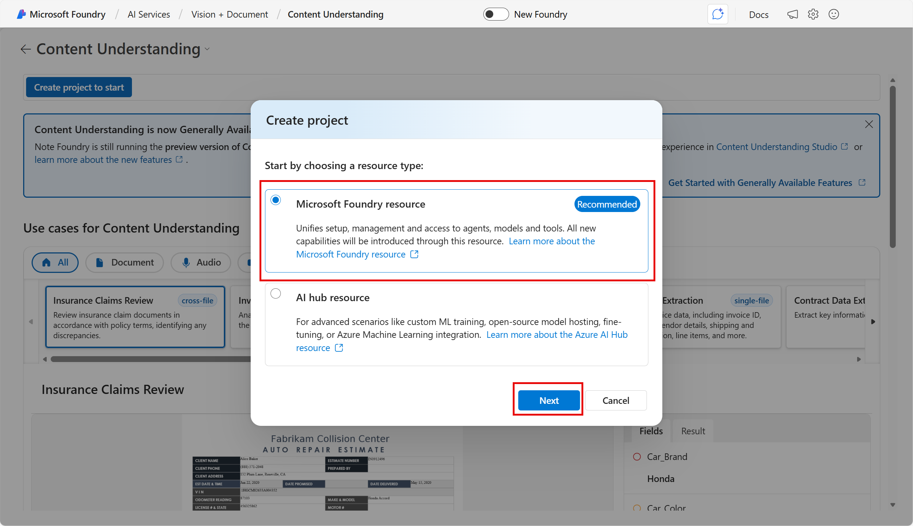
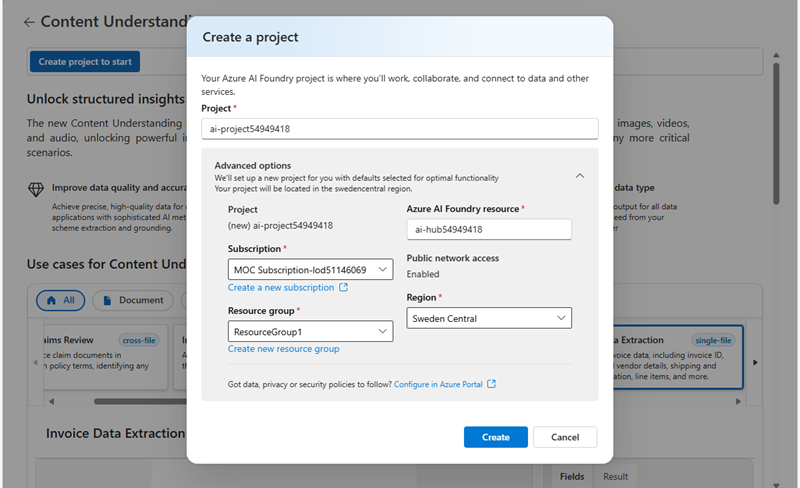
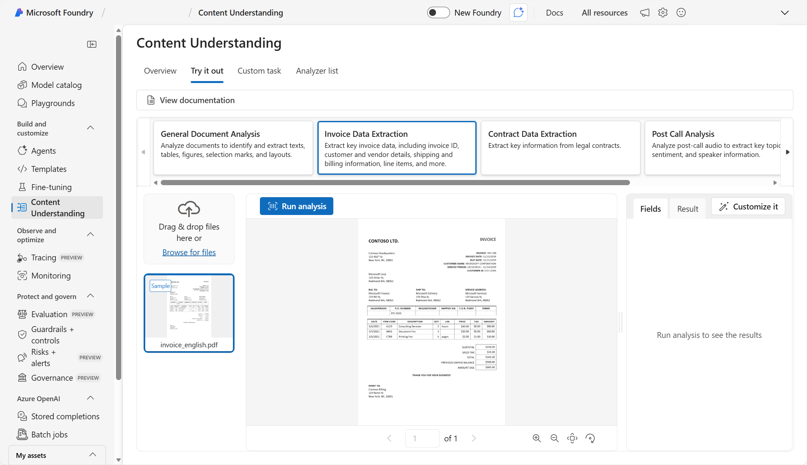
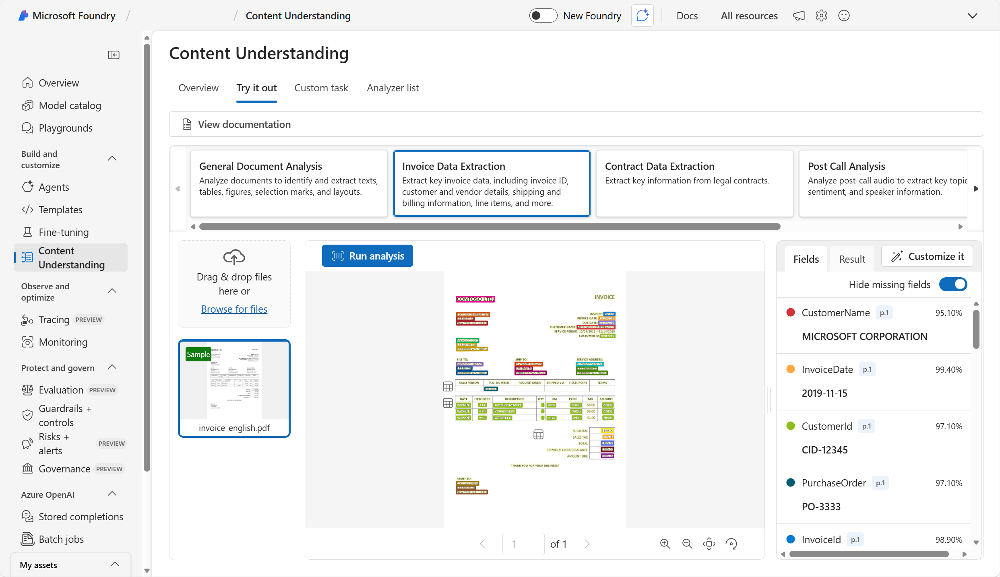
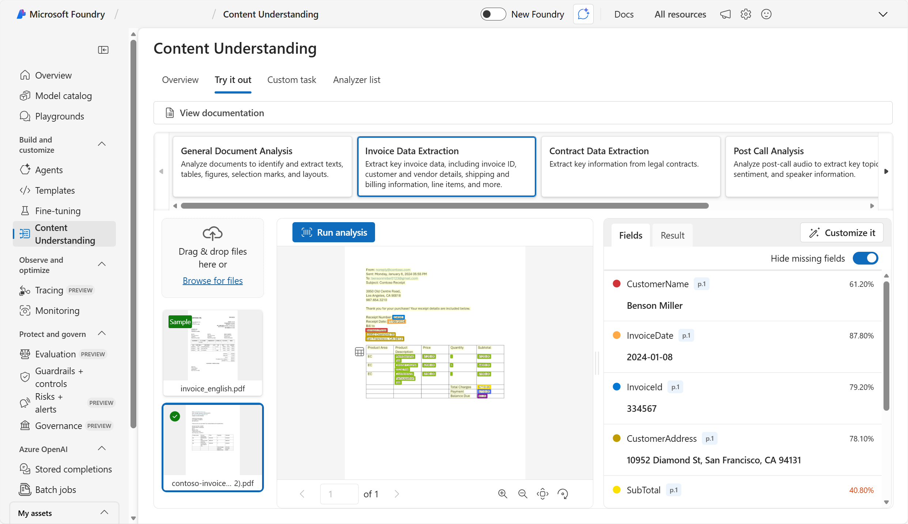
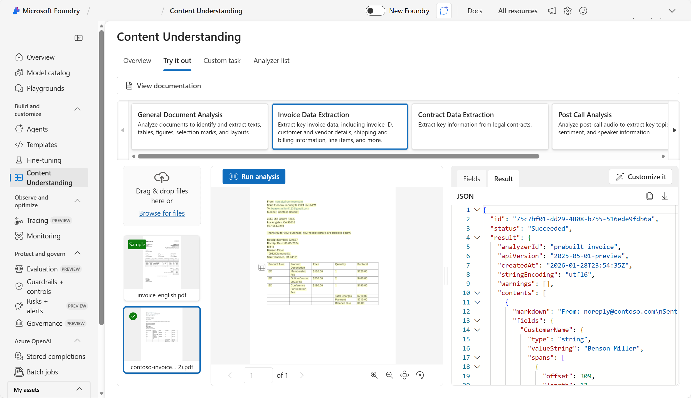

---
lab:
    title: 'Get started with information extraction in Microsoft Foundry​'
    description: 'Use AI models to extract information from visual data.'    
---

# Get started with information extraction in Microsoft Foundry

Azure Content Understanding provides multi-modal analysis of documents, audio files, video, and images to extract information.

In this exercise, you will use Azure Content Understanding in Foundry, Microsoft's platform for creating intelligent applications, to extract information from invoices. Then you will try out using Azure Content Understanding in Foundry Tools with the REST API.

This exercise takes approximately **40** minutes.

## Create a Microsoft Foundry project for content understanding

1. In a web browser, open [Microsoft Foundry](https://ai.azure.com) at `https://ai.azure.com` and sign in using your Azure credentials. Close any tips or quick start panes that are opened the first time you sign in, and if necessary use the **Foundry** logo at the top left to navigate to the home page, which looks similar to the following image (close the **Help** pane if it's open):

    

1. Scroll to the bottom of the page, and select the **Explore Azure AI Services** tile.

    

1. On the Azure AI Services page, select **Try Content Understanding**.

    

1. In the Content Understanding page, select **Create a project to start**. Then in the **Create project** dialog, select the recommended resource type (**Foundry resource**):

    

1. On the **Next** page, enter a valid name for your project. Then Select **Advanced options** and specify the following settings:
    - **Foundry resource**: *A valid name for your Foundry resource*
    - **Subscription**: *Your Azure subscription*
    - **Resource group**: *Create or select a resource group*
    - **Region**: Select one of the following locations\*:
        * East US 
        * West US
        * Sweden Central
        * Australia East
        * Southeast Asia

    \**At the time of writing, Content Understanding is supported in these regions.*

    

1. Select **Create**. Wait for the set up process to complete. It may take a few minutes.

## Extract information from an invoice in Foundry portal (classic)

1. Download **[contoso-invoice-1.pdf](https://raw.githubusercontent.com/MicrosoftLearning/mslearn-ai-fundamentals/refs/heads/main/data/content-understanding/contoso-invoice-1.pdf){:target="_blank"}** from `https://raw.githubusercontent.com/MicrosoftLearning/mslearn-ai-fundamentals/refs/heads/main/data/content-understanding/contoso-invoice-1.pdf`. 

1. On the Content Understanding page, select the **Try it out** tab, and then select the **Invoice Data Extraction** tile.

    

    A sample invoice is provided.

1. Select the sample invoice and use the **Run analysis** button to extract information from it. When analysis is complete, view the results.

    

1. Use the **Browse for files** link to upload the **contoso-invoice-1.pdf** document you downloaded previously, and run analysis on that file.

    

    Note that the Content Understanding analyzer is able to extract information from this invoice, even though it is formatted diffferently from the sample.

1. In the pane on the right where the extracted fields are displayed, view the **Result** tab to see the JSON response that would be sent to a client application. A developer would write code to process this response and utilize the extracted fields.

    

## Extract information with the REST API

To develop a client app or agent that extracts information, you can use several Foundry models and the REST API.

>**Note**: This section of the exercise requires you to have access to Visual Studio Code (VS Code).  

1. Identify your Foundry resource key and endpoint. In the Foundry portal, in the left-side menu, select **Overview** to navigate to your Foundry project's home page. On the project home page, you will either be able to copy and paste a project API key, or see a note that your subscription does not have those permissions. Keep the page open for your reference. 

>**Note**: To execute this section of the exercise, you will need an Azure subscription with permission to use the API Key. If you do not have permission, you will not be able to test out the models yourself. However, you can still read through the rest of the exercise to review the steps. 

1. Copy this repo URL: .... . Open Visual Studio Code (VS Code). 

1. In VS Code, press **Ctrl + Shift + P** (Windows/Linux) or **Cmd + Shift + P** (Mac) to open the command palette. Type **Git: Clone** and select it. Paste the repo URL and press **Enter**.  

1. Select a local folder where the repository will be cloned. When prompted, click **Open** to start working on the cloned project in VS code.

1. In VS code, open the **.env** file. Copy and paste your Foundry project API key. Copy and paste your Foundry project endpoint. Edit the endpoint by deleting the text after *ai.azure.com*. Your endpoint should look like this `https://...ai.azure.com`. Save the file. 

1. In the (classic) Foundry portal, create Foundry Model deployments of GPT-4.1, GPT-4.1-mini, and text-embedding-3-large in your Foundry resource. Select **Models and endpoints** from the menu on your left. In the **Model deployments** screen, select **+ Deploy a model**, then select **Deploy base model**. Search for and select **GPT-4.1**, then select **Confirm**. Keep the default name and default deployment type. Select **Deploy**. Repeat for **GPT-4.1-mini** and **text-embedding-3-large**. Once the models are deployed, note the names of the models (they should be GPT-4.1, GPT-4.1-mini, and text-embedding-3-large unless you customized the names). 

1. In VS Code, in your **.env** file, make sure the names of the models are the same as the ones you deployed. If you make changes, remember to save them. 

1. To extract information from content using Content Understanding, you can use the *curl* command to call the REST endpoint. You will need to make three calls: 
    a. To set up a connection between Content Understanding and your Foundry models 
    b. To analyze the content 
    c. To retrieve the result of the analysis  

1. In VS Code, open a new bash terminal. Press **Ctrl+Shift+P** (or Command Palette from View menu). Type: **Terminal: Create New Terminal (With Profile)**. Choose the **Git Bash** profile from the list. Your terminal will appear at the bottom of the VS Code screen. 

1. Set up a connection between Content Understanding and Foundry models in your Foundry resource. Open the **set-up-connection.sh** file. Note where variables for your project endpoint, key, and model deployment names are included in the script. The script should look similar to this:

    ```bash
    curl -i -X PATCH "{endpoint}/contentunderstanding/defaults?api-version=2025-11-01" \
      -H "Ocp-Apim-Subscription-Key: {key}" \
      -H "Content-Type: application/json" \
      -d '{
            "modelDeployments": {
              "gpt-4.1": "{myGPT41Deployment}",
              "gpt-4.1-mini": "{myGPT41MiniDeployment}",
              "text-embedding-3-large": "{myEmbeddingDeployment}"
            }
          }'
    ```

1. Run the script by entering `bash set-up-connection.sh` in the Git Bash terminal. 

1. We will analyze the same document as we did with the portal earlier in the exercise from `https://raw.githubusercontent.com/MicrosoftLearning/mslearn-ai-fundamentals/refs/heads/main/data/content-understanding/contoso-invoice-1.pdf`. 

1. Use the prebuilt-invoice analyzer to extract structured data from an invoice document. Open the **extract-data.sh** file. Note where variables for your project endpoint and key are included in the script. Identify where the document url is included in the inputs. The script should look similar to this:

    ```bash
    curl -i -X POST "{endpoint}/contentunderstanding/analyzers/prebuilt-invoice:analyze?api-version=2025-11-01" \
      -H "Ocp-Apim-Subscription-Key: {key}" \
      -H "Content-Type: application/json" \
      -d '{
            "inputs":[{"url": "https://github.com/Azure-Samples/azure-ai-content-understanding-python/raw/refs/heads/main/data/invoice.pdf"}]
          }'
    ```
1. Run the script by entering `bash extract-data.sh` in the Bash terminal. 

1. The POST response should look something like this: 

    ```bash
    HTTP/1.1 202 Accepted
    Transfer-Encoding: chunked
    Content-Type: application/json
    request-id: aaa-bbb-ccc-ddd
    x-ms-request-id: aaa-bbb-ccc-ddd
    Operation-Location: {endpoint}/contentunderstanding/analyzerResults/{request-id}?api-version=2025-11-01
    api-supported-versions: 2024-12-01-preview,2025-05-01-preview,2025-11-01
    x-envoy-upstream-service-time: 800
    apim-request-id: {request-id}
    Strict-Transport-Security: max-age=31536000; includeSubDomains; preload
    x-content-type-options: nosniff
    x-ms-region: West US
    Date: Fri, 31 Oct 2025 05:30:17 GMT
    Connection: close
    ```    

1. Copy the `request-id` from the POST response. 

1. Open **get-results.sh** and review the file. Note where variables for your project endpoint and key are included in the script. Edit the script by updating the `request-id`. In the file, delete `{request-id}` and paste the `request-id` from the POST response. Remember to save the file. 

    ```bash
    curl -i -X GET "{endpoint}/contentunderstanding/analyzerResults/{request-id}?api-version=2025-11-01" \
      -H "Ocp-Apim-Subscription-Key: {key}"
    ```

1. Run the GET results script by entering `bash get-results.sh` in the Git Bash terminal. By using the `request-id` from the POST response, you are able to retrieve the result of the analysis.
 
1. Review the JSON returned. See how it provides the same information you saw from the *Results* tab in the Foundry portal after analyzing the same document.

## Clean up

If you’ve finished working with the Content Understanding service, you should delete the resources you have created in this exercise to avoid incurring unnecessary Azure costs.

- In the Azure portal, delete the resource group you created in this exercise.
