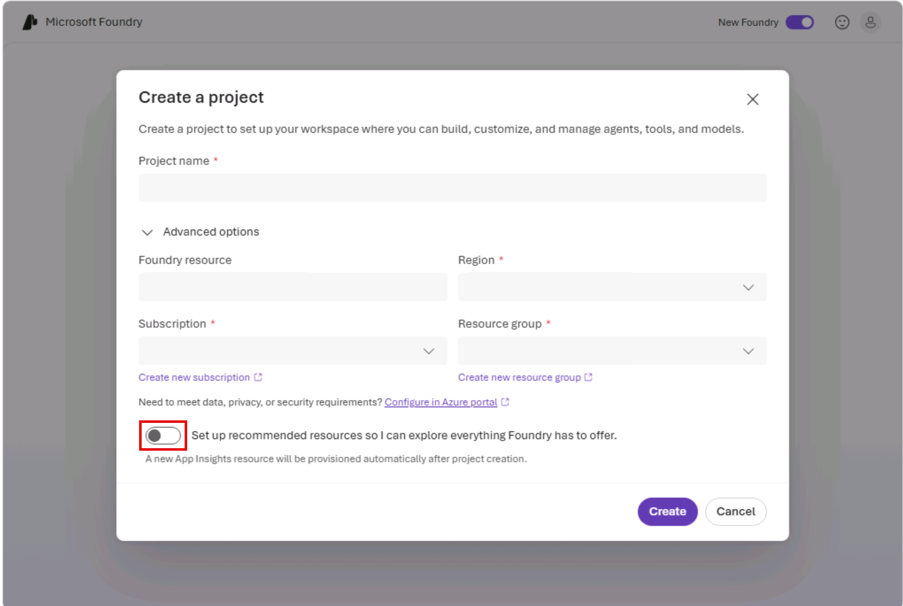
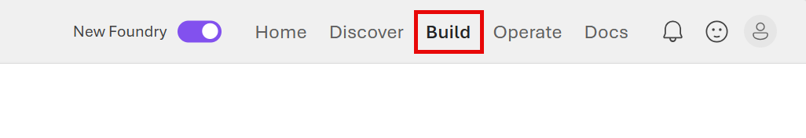
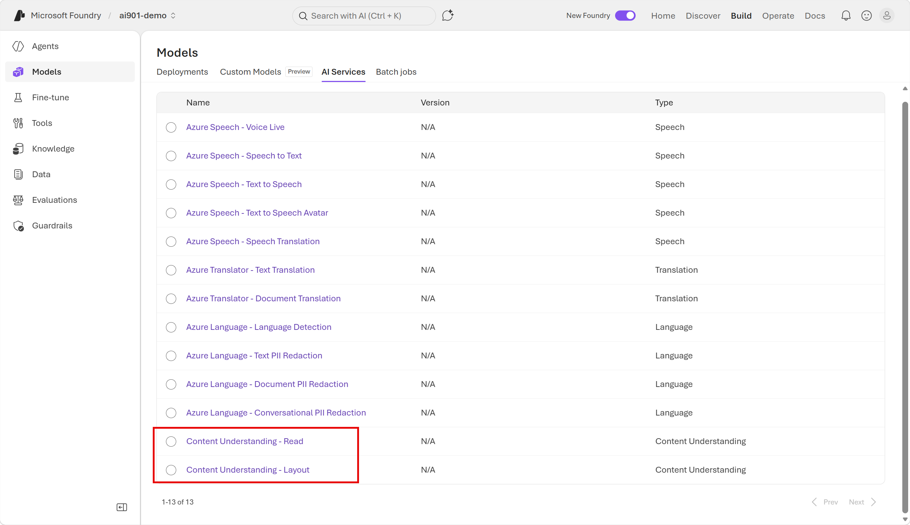
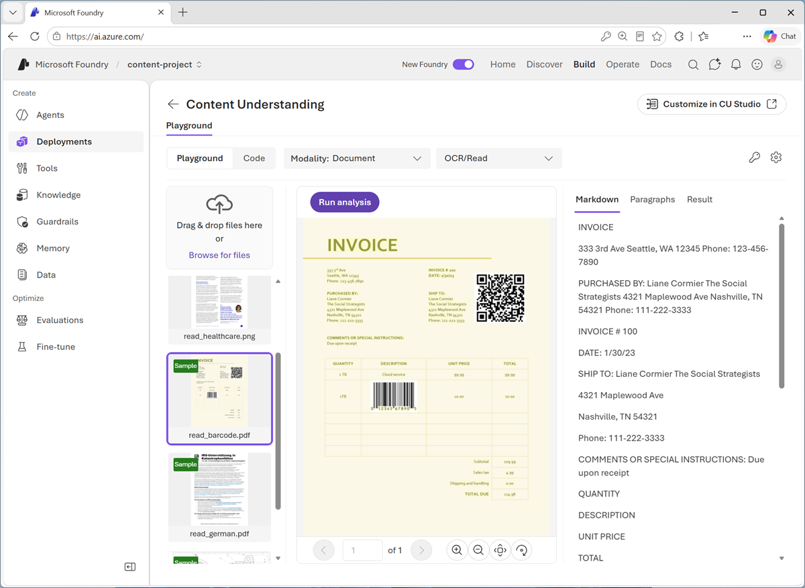
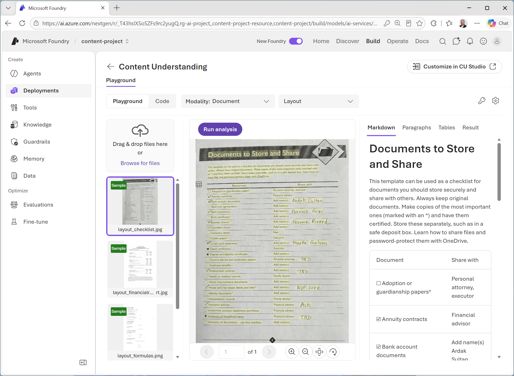
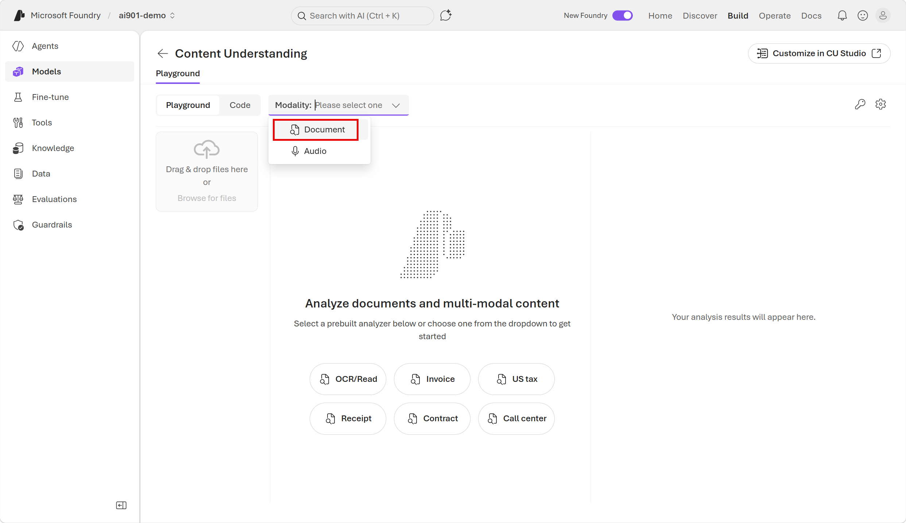
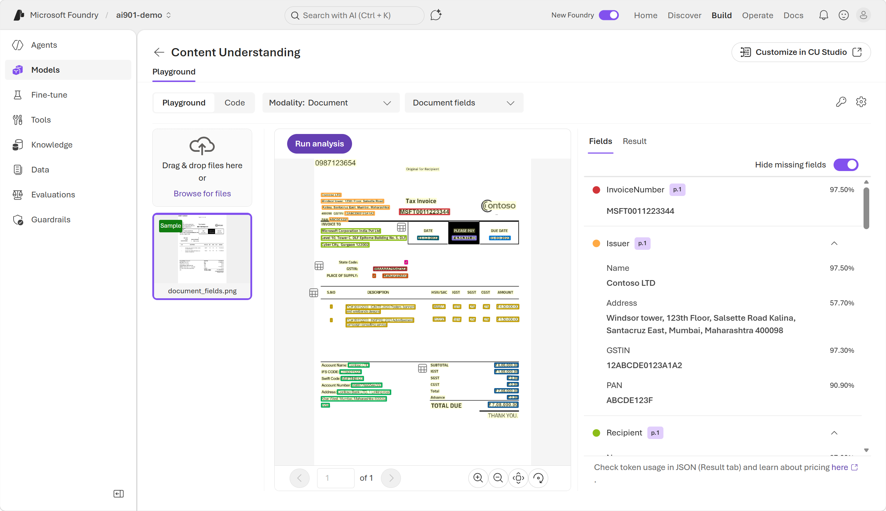
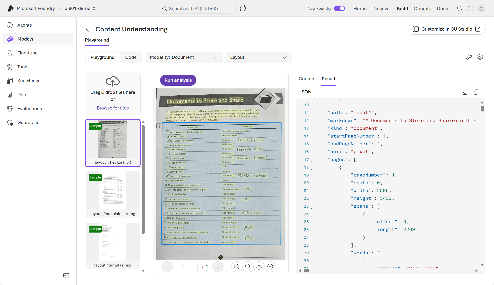
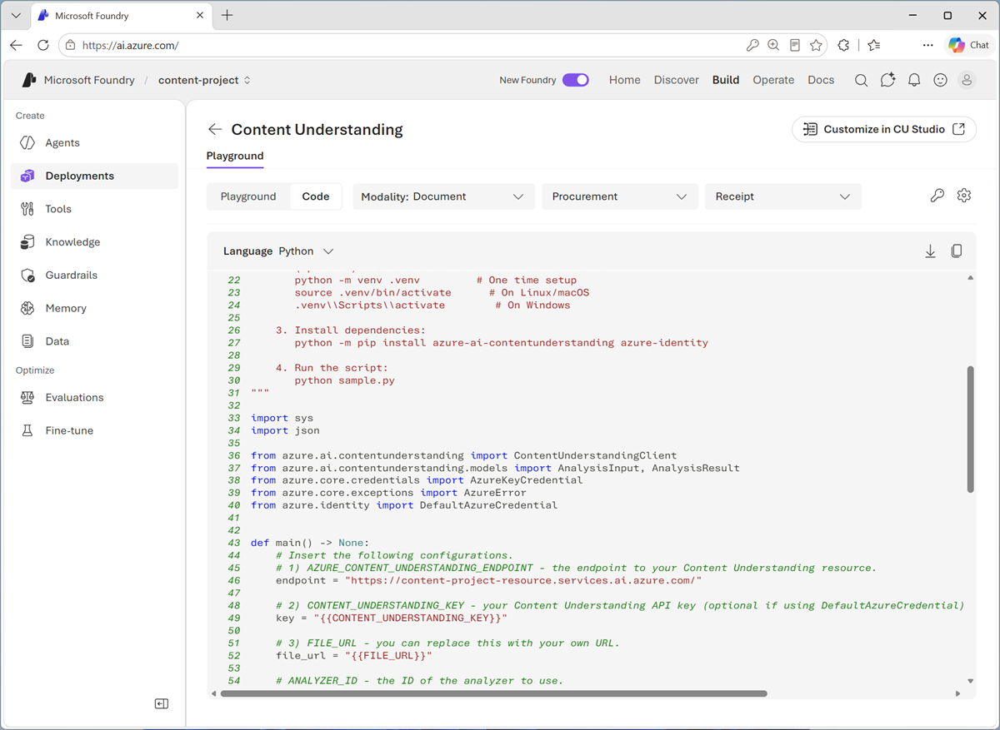

---
lab:
  title: Get started with information extraction in Microsoft Foundry​
  description: Use AI models to extract information from visual data.
  level: 200
  duration: 25 minutes
  islab: true
  primarytopics:
    - Microsoft Foundry
---

# Get started with information extraction in Microsoft Foundry

In this exercise, you will use Azure Content Understanding in Foundry, Microsoft's platform for creating intelligent applications.

Azure Content Understanding is a Foundry service that uses AI models to turn unstructured, multimodal content (documents, images, video, audio) into structured, usable outputs like JSON. It processes content by extracting, classifying, and generating fields with confidence scores and source grounding.

This exercise takes approximately **25** minutes.

>**Note**: This exercise utilizes the *new* Foundry portal experience.

## Create a Microsoft Foundry project

1. In a web browser, open [Microsoft Foundry](https://ai.azure.com){:target="_blank"} at `https://ai.azure.com`  and sign in using your Azure credentials. Close any tips or quick start panes that are opened the first time you sign in (also, close the **Help** pane if it's open).

2. If it is not already enabled, in the tool bar the top of the page, enable the **New Foundry** option. Then, if prompted, create a *new project* with a unique name; expanding the **Advanced options** area to specify the following settings for your project:
    - **Foundry resource**: *Enter a valid name for your AI Foundry resource.*
    - **Subscription**: *Your Azure subscription*
    - **Resource group**: *Create or select a resource group*
    - **Region**: Select *West US*, *Sweden Central*, *Australia East*, or any of the regions in **[this list](https://learn.microsoft.com/azure/ai-services/content-understanding/language-region-support)**{:target="_blank"}

3. Deselect the option to *Set up recommended resources...*. Then select **Create**.

    

4. Wait for your project to be created. It may take a few minutes. After creating or selecting a project in the *new* Foundry portal, it should open in a page similar to the following image:

    

## Extract information from documents in the new Foundry portal

1. In the *new* Foundry portal, navigate to the tool bar at the top of the screen and select **Build**.

    

2. On the *Build* page, navigate to the menu on the left-side of the screen (you may need to expand it by clicking on the expand icon at the bottom of the menu). From the left-side menu, select **Models**. Then, at the top of the *Models* page, select **AI Services**.

    

3. Identify the **Content Understanding** capabilities you can try out in a Foundry playground setting:
   - *Content Understanding - Read*: Raw text extraction only. Answers the question, "What text is here?"
   - *Content Understanding - Layout*: Adds structure, hierarchy, and positioning. Answers the question, "How is this content organized?"
   - *Content Understanding*: offers the full analyzer capability by extracting fields and structure and generating insights. Answers the question, "What does this content mean and what should I do with it?"

#### Try out Content Understanding's *Read* capabilities

1. Select **Content Understanding - Read**. The *Read* capability is the first step in content understanding—it reads and extracts text, but doesn’t try to understand structure or meaning yet.

2. Select the sample **read_barcode.pdf** and use the **Run analysis** button to extract information from the document. When analysis is complete, view the results.

    

3. Select the back button to return to the previous page to test out other capabilities.

#### Try out Content Understanding's *Layout* capabilities

1. From the *Build - Models* page and *AI Services* tab, select **Content Understanding - Layout**.

2. Select the sample **layout_checklist.jpg** and use the **Run analysis** button to extract information from it. When analysis is complete, view the results.

    

3. In the content output, select the **Tables** tab. Review how the *Layout* analyzer is able to capture both the text and structure of the content.

    

4. Select the back button to return to the previous page to test out other capabilities.

#### Try out Content Understanding's other analyzer capabilities

1. From the *Build - Models* page and *AI Services* tab, select **Content Understanding** to test another one of Azure Content Understanding analyzers.

2. On the *Content Understanding* page, select the **Document** modality.

    

3. Next to the *Document* modality, select *Document fields* from the dropdown menu. If asked to deploy models that aren't configured yet, select **Deploy models**.

    >**Tip**: *document fields* and other complex extraction needs require deploying multiple AI models, since each deployment is tied to a specific model version or capability. Using multiple models in Azure AI Foundry lets you handle different types of processing tasks more effectively, with flexibility to choose the right model for each need.

4. Select a recommended *Chat completion model* and *Embedding model* from the drop-down menus. Then select **Apply changes**. Once the changes are applied, you can close the *Configure* panel.

5. Let's try to use the full analyzer with our own invoice. Open a new browser window. Enter the following URL: `https://raw.githubusercontent.com/MicrosoftLearning/mslearn-ai-fundamentals/refs/heads/main/data/content-understanding/contoso-invoice-1.pdf` to download **[contoso-invoice-1.pdf](https://raw.githubusercontent.com/MicrosoftLearning/mslearn-ai-fundamentals/refs/heads/main/data/content-understanding/contoso-invoice-1.pdf){:target="_blank"}** .

6. Use the **Browse for files** link to upload the **contoso-invoice-1.pdf** document you just downloaded. Select **Run analysis** and review the results. Notice that not only is the text rendered, but its layout is captured, and the fields are organized into cohesive categories.  

    

7. In the pane on the right where the extracted fields are displayed, view the **Result** tab to see the raw results in JSON. Identify the **analyzerID** field, which contains the type of analyzer used. You can find a list of prebuilt Content Understanding analyzers [here](https://learn.microsoft.com/azure/ai-services/content-understanding/concepts/prebuilt-analyzers).

     

>**Tip**: Consider this: the *Fields* tab displays the information from the raw JSON in the *Results* tab in a user-friendly way.

## Understand how to extract content with the REST API

1. Developers can use the REST API to build an app that submits a document for analysis with Content Understanding analyzers using a POST operation. For example, the following cUrl command could be used to analyze an invoice:

    ```bash
   curl -i -X POST "{endpoint}/contentunderstanding/analyzers/{analyzerId}:analyze?api-version=2025-11-01" \
      -H "Ocp-Apim-Subscription-Key: {key}" \
      -H "Content-Type: application/json" \
      -d '{
            "inputs":[
              {
                "url": "https://{url_path}/invoice.png"
              }          
            ]
          }'
    ```

1. Consider what you would need to specify in the cUrl command:
   - *analzyerID*
   - *endpoint*
   - *key*
   - *url_path* to the document

1. When you run the command, you receive a response in JSON. The analysis is performed asynchronously, so the response includes an **id** value specific to the analysis job that can be used to poll for the results:

    ```json
   {
      "id": {resultId},
      "status": "Running",
      "result": {
        "analyzerId": {analyzerId},
        "apiVersion": "2025-11-01",
        "createdAt": "YYYY-MM-DDTHH:MM:SSZ",
        "warnings": [],
        "contents": []
      }
    }
    ```

>**Tip**: Polling for results in an asynchronous call means repeatedly checking the status of a request at intervals until the operation is complete and the final result is available. The final result in this case is that the analysis is complete. After the result is returned, another call should be made to retrieve the results.

1. In order to retrieve the results using the ID, the client must submit a GET request:

    ```bash
   curl -i -X GET "{endpoint}/contentunderstanding/analyzerResults/{resultId}?api-version=2025-11-01" \
      -H "Ocp-Apim-Subscription-Key: {key}"
    ```

1. Consider what you would need to specify in the cUrl command:
   - *resultID*
   - *endpoint*
   - *key*

## Understand how to extract content with the Python SDK

1. Alternatively, as a developer, you can also use code to submit a document for analysis to the *Document Fields* analyzer. The Foundry playground provides code samples. Select the **Code** tab to review the code you could use to process this response and utilize the extracted fields.

    

## Summary

In this exercise, you explored Azure Content Understanding in Foundry and learned how it transforms unstructured content into structured, usable data. You tried out three analyzers, each building on the previous one in capability:

- **Read**: Extracts raw text from documents without interpreting structure or meaning—answering, "What text is here?"
- **Layout**: Goes a step further by capturing structure, hierarchy, and positioning—including tables—answering, "How is this content organized?"
- **Document fields**: an analyzer that uses a combination of capabilities to extract fields, organize them into cohesive categories, and generate insights—answering, "What does this content mean and what should I do with it?" Content Understanding analyzers like this one sometimes require deploying additional AI models (such as chat completion and embedding models) to handle complex extraction needs.

You also learned how developers can integrate Content Understanding into applications using the **REST API** (submitting documents via a POST request and polling for results with a GET request) or the **Python SDK**, both of which enable programmatic analysis of documents outside the Foundry playground.

> **[Ask Anton](https://aka.ms/azk-anton){:target="_blank"}**<br/><br/>If you have questions about some of the topics covered in this exercise, *[Ask Anton](https://aka.ms/azk-anton){:target="_blank"}* is a generative AI-based agent that you can ask about AI concepts and Microsoft Foundry. Open the app at **[https://aka.ms/azk-anton](https://aka.ms/azk-anton){:target="_blank"}** and use the **Configure** button to enter your Foundry project and model details.<br/><br/>*Ask Anton is not a supported Microsoft product or a component of Microsoft Learn or AI Skills Navigator. Just an example of an AI agent for you to explore as you learn about what's possible with AI.*<br/></br>If you *do* check out Ask Anton, we'd love you to *[tell us about your experience](https://forms.office.com/r/fC0ndfBQeK){:target="_blank"}*!

## Clean up

If you’ve finished working with the Content Understanding service, you should delete the resources you have created in this exercise to avoid incurring unnecessary Azure costs.

- In the Azure portal, delete the resource group you created in this exercise.
