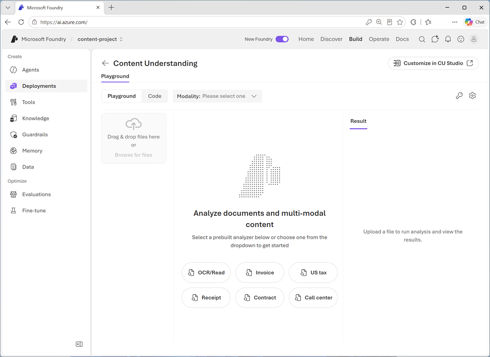
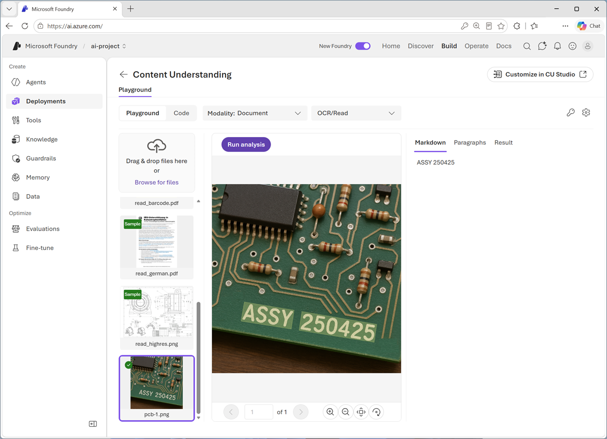
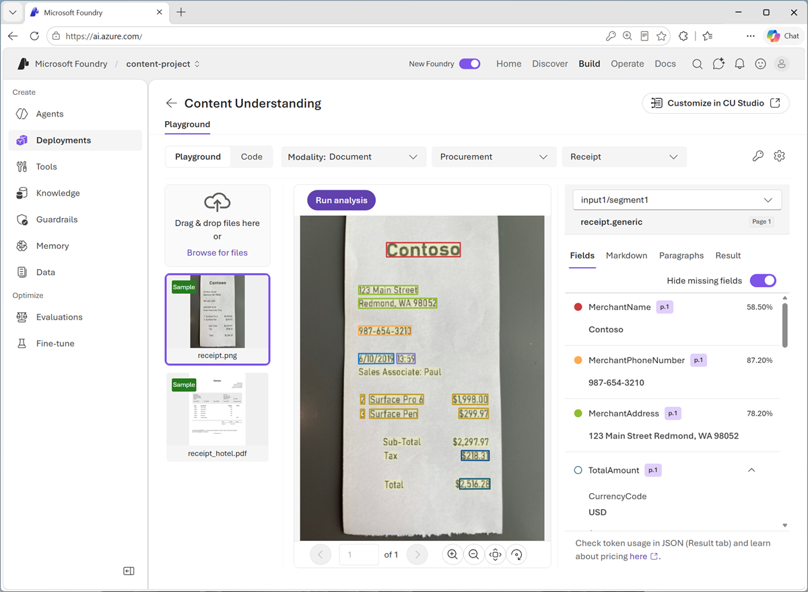

---
lab:
  title: Get started with information extraction in Microsoft Foundry​
  description: Use AI models to extract information from visual data.
  level: 200
  duration: 25 minutes
  islab: true
  primarytopics:
    - Microsoft Foundry
---

# Get started with information extraction in Microsoft Foundry

In this exercise, you'll use Azure Content Understanding in Foundry, Microsoft's platform for creating intelligent applications.

This exercise takes approximately **25** minutes.

## Create a Microsoft Foundry project

1. In a web browser, open [Microsoft Foundry](https://ai.azure.com){:target="_blank"} at `https://ai.azure.com` to start building; signing in using your Azure credentials.

2. If it isn't already enabled, in the tool bar the top of the page, enable the **New Foundry** option. Then, if prompted, create a *new project* with a unique name; expanding the **Advanced options** area to specify the following settings for your project:
    - **Foundry resource**: *Enter a valid name for your AI Foundry resource.*
    - **Subscription**: *Your Azure subscription*
    - **Resource group**: *Create or select a resource group*
    - **Region**: Select *West US*, *Sweden Central*, *Australia East*, or any of the regions in **[this list](https://learn.microsoft.com/azure/ai-services/content-understanding/language-region-support)**{:target="_blank"}

    > **Note**: Depending on your permissions in the Azure subscription, you may need to clear the option to set up recommended resources.

3. Wait for your project to be created. It may take a few minutes. After creating a project in the *new* Foundry portal, it should take you to a list of your projects (*note*: you may need to refresh the page to see your newly created project). Select the project you just created to open a page similar to the following image:

    

    >**Tip**: Close any suggestions or tips that may appear on the home page.

## Use *Content Understanding* to extract information from documents

Azure Content Understanding is a Foundry service that uses AI models to turn unstructured, multimodal content (documents, images, video, audio) into structured, usable outputs like JSON. It processes content by extracting, classifying, and generating fields with confidence scores and source grounding.

### Open the Content Understanding playground in Foundry portal

1. In the Foundry portal, navigate to the tool bar at the top of the screen and select **Build**.
2. On the *Build* page, in the menu on the left-side of the screen (which you may need to expand), select **Deployments**. Then, at the top of the *Deployments* page, select **AI Services**.
3. Select **Content Understanding** to open the *Content Understanding* tool playground.

    

### Use OCR to read text in an image

Suppose you want to find information related to a piece of computer hardware or some other item with information printed on it. A first step might be to digitize the text so you can use it to look up details on the Internet or in an AI assistant. You can use an AI technique called optical character recognition (OCR) to "read" text in images.

1. Select **OCR/Read**, and ensure that **Document** is selected in the **Modality** list, and **OCR/Read** is selected in the list of analyzers.

1. Select any sample image, and use the **Run analysis** button to extract text from it. When analysis is complete, view the results.

    

1. In the pane on the right, review the **Markdown**, **Paragraphs**, and **Result** tabs to see the data that has been read from the document by the analyzer.

1. In a new browser tab, download **[pcbs.zip](https://aka.ms/pcb-images){:target="_blank"}** from `https://aka.ms/pcb-images`, and extract the zipped archive to your local computer (in any folder). These files are images of printed circuit boards that contain text.
1. Upload any of the PCB images, and view it in the main content area of the app.
1. Run analysis on the uploaded image and review the results.

    

1. Repeat the process to analyze the other PCB image you downloaded.

    > **Tip**: Try uploading any images that contain legible text.

    The *OCR/Read* analyzer extracts text from images. However, sometimes it may be useful to extract additional information about the *layout* of the text in the image.

1. In the list of analyzers, select **Layout**. Then select any of the sample images and use the **Run analysis** button to extract information from it. When analysis is complete, review the **Markdown**, **Paragraphs**, **Tables**, and **Result** tabs to see the ways in which the layout of the data in the document has been interpreted by the analyzer.

    Extacting the text and page layout is useful when the documents need to scan have a consistent, well-defined structure. In many cases though, you need to be able to identify which text values map to which data fields; so a more specific analyzer is needed.

### Extract fields from documents

Now suppose you need to extract data fields from scanned receipts to help automate an expense claim solution. You can use OCR to identify text and its location in images, and then use a generative AI model to associate individual text values with specific data fields - such as company names, phone numbers, dates, amounts, and so on.

1. In the list of analyzer types, select **Procurement**, and then select the **Receipt** analyzer.

    > **Tip**: Field extraction requires a custom model, so you may be prompted to deploy models during this process. Click **Cancel** when this happens.<br><br>Do <u>not</u> run analysis - we'll review the pre-prepared analysis results.

    

1. In the pane on the right, review the **Fields**, **Markdown**, **Paragraphs**, and **Result** tabs to see the data extracted from the document by the analyzer.

    The **Fields** tab displays a user-friendly version of the information from the raw JSON in the **Results** tab, which is how a client application would receive the results of analysis.

## Understand how to extract content with the Python SDK

As a developer, you can also use code to extract meaning from content. The Foundry playground provides various code samples to get you started with information extraction with Azure Content Understanding.


1. Let's take a closer look at the Python code for document layout analysis. In the Content Understanding playground, while viewing the results of the **Receipt** analyzer, select the **Code** tab. The following code is provided:

    ```python  
    import sys
    import json
    
    from azure.ai.contentunderstanding import ContentUnderstandingClient
    from azure.ai.contentunderstanding.models import AnalysisInput, AnalysisResult
    from azure.core.credentials import AzureKeyCredential
    from azure.core.exceptions import AzureError
    from azure.identity import DefaultAzureCredential
    
    def main() -> None:
        # Insert the following configurations.
        # 1) AZURE_CONTENT_UNDERSTANDING_ENDPOINT - the endpoint to your Content Understanding resource.
        endpoint = "<https://content-project-resource.services.ai.azure.com/>"
    
        # 2) CONTENT_UNDERSTANDING_KEY - your Content Understanding API key (optional if using DefaultAzureCredential).
        key = "{{CONTENT_UNDERSTANDING_KEY}}"
    
        # 3) FILE_URL - you can replace this with your own URL.
        file_url = "{{FILE_URL}}"
    
        # ANALYZER_ID - the ID of the analyzer to use.
        analyzer_id = "prebuilt-receipt"
    
        # API_VERSION - the API version to use.
        api_version = "2025-11-01"
    
        # Set up Content Understanding client.
        credential = AzureKeyCredential(key) if key and "{{CONTENT_UNDERSTANDING_KEY}}" not in key else DefaultAzureCredential()
        client = ContentUnderstandingClient(endpoint=endpoint, credential=credential, api_version=api_version)
    
        # [START analyze]
        print(f"Analyzing with {analyzer_id} analyzer...")
        print(f"  File URL: {file_url}\n")
    
        try:
            poller = client.begin_analyze(
                analyzer_id=analyzer_id,
                inputs=[AnalysisInput(url=file_url)],
            )
            result: AnalysisResult = poller.result()
        except AzureError as err:
            print(f"[Azure Error]: {err.message}")
            sys.exit(1)
        except Exception as ex:
            print(f"[Unexpected Error]: {ex}")
            sys.exit(1)
        # [END analyze]
    
        # [START output_result]
        print("=" * 50)
        print("Analysis result:")
        print("=" * 50 + "\n")
    
        max_display_lines = 50
        result_str = json.dumps(result.as_dict(), indent=2)
        ret_lines = result_str.splitlines()
    
        if len(ret_lines) > max_display_lines:
            print("\n".join(ret_lines[:max_display_lines]))
            print(f"\n {len(ret_lines) - max_display_lines} more lines to be displayed...\n")
        else:
            print(result_str)
        # [END output_result]
    
    if **name** == "**main**":
        main()
    ```

    The code connects to the Content Understanding tool in your Foundry resource, and submits a document file to the *prebuilt-receipt* analyzer. The analyzer runs asynchronously, and returns the results of the analysis in the JSON format you saw in the **Result** tab.

## Summary

In this exercise, you explored Azure Content Understanding in Foundry and learned how it transforms unstructured content into structured, usable data. You tried out three analyzers, each building on the previous one in capability:

- **Read**: Extracts raw text from documents without interpreting structure or meaning.
- **Layout**: Goes a step further by capturing structure and hierarchy.
- **Receipt**: A document -specific analyzer that uses a combination of capabilities to extract text values and map them to data fields.

You also learned how developers can integrate Content Understanding into applications using the **Python SDK**, which enables programmatic analysis of documents outside the Foundry playground.

> **[Ask Anton](https://aka.ms/azk-anton){:target="_blank"}**<br/><br/>If you have questions about some of the topics covered in this exercise, *[Ask Anton](https://aka.ms/azk-anton){:target="_blank"}* is a generative AI-based agent that you can ask about AI concepts and Microsoft Foundry. Open the app at **[https://aka.ms/azk-anton](https://aka.ms/azk-anton){:target="_blank"}** and use the **Configure** button to enter your Foundry project and model details.<br/><br/>*Ask Anton is not a supported Microsoft product or a component of Microsoft Learn or AI Skills Navigator. Just an example of an AI agent for you to explore as you learn about what's possible with AI.*<br/><br/>If you *do* check out Ask Anton, we'd love you to *[tell us about your experience](https://forms.office.com/r/fC0ndfBQeK){:target="_blank"}*!

## Clean up

If you’ve finished working with the Content Understanding service, you should delete the resources you have created in this exercise to avoid incurring unnecessary Azure costs.

- In the Azure portal, delete the resource group you created in this exercise.
