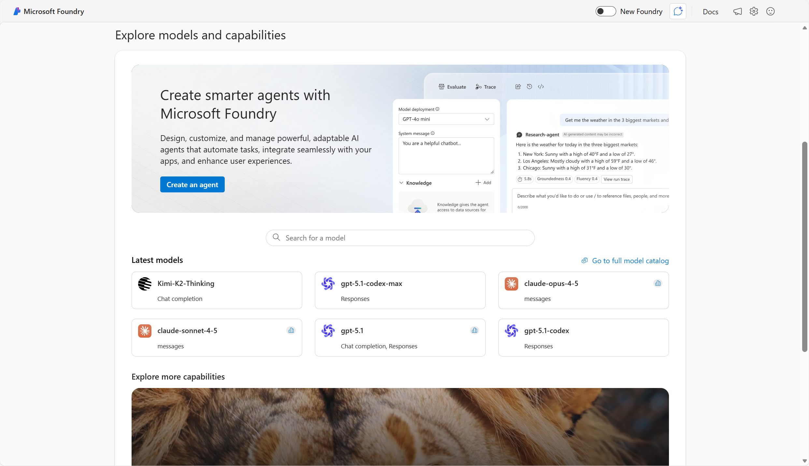
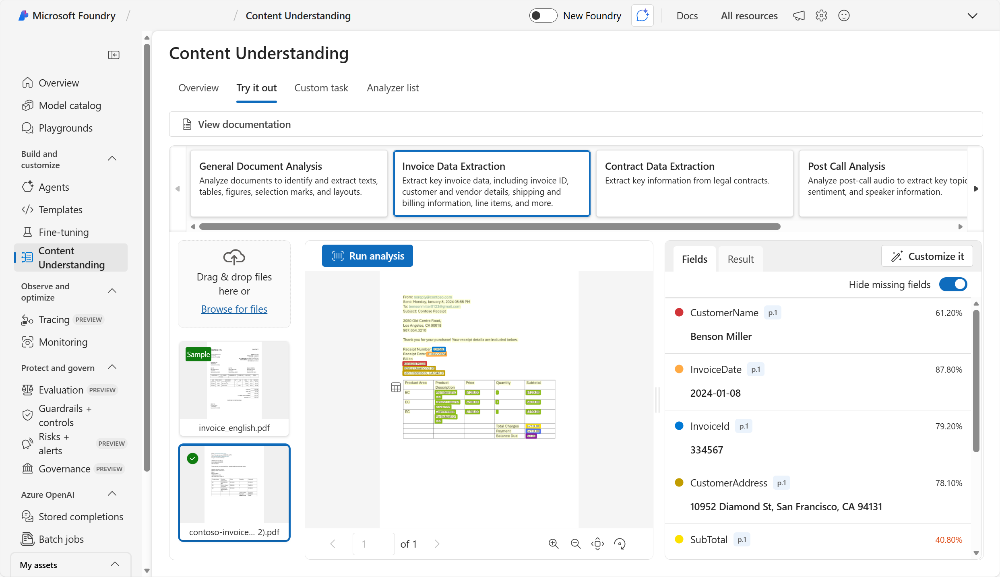

---
lab:
  title: Get started with Content Understanding in Microsoft Foundry​
  description: Use AI models to extract information from visual data.
  level: 200
  duration: 25 minutes
  islab: true
  primarytopics:
    - Microsoft Foundry
---

# Get started with information extraction in Microsoft Foundry

Azure Content Understanding provides multi-modal analysis of documents, audio files, video, and images to extract information.

In this exercise, you will use Azure Content Understanding in Foundry, Microsoft's platform for creating intelligent applications, to extract information from invoices. 

This exercise takes approximately **20** minutes.

>**Note**: This exercise utilizes the new Foundry portal experience. If you are using the classic Foundry portal, you need to toggle to *new*.

## Create a Microsoft Foundry project

1. In a web browser, open [Microsoft Foundry](https://ai.azure.com){:target="_blank"} at `https://ai.azure.com`  and sign in using your Azure credentials. Close any tips or quick start panes that are opened the first time you sign in, and if necessary use the **Foundry** logo at the top left to navigate to the home page, which looks similar to the following image (close the **Help** pane if it's open).

    Ensure the **New Foundry** option is selected.

    

2. If it is not already enabled, in the tool bar the top of the page, enable the **New Foundry** option. Then, if prompted, create a new project with a unique name; expanding the  **Advanced options** area to specify the following settings for your project:
    - **Foundry resource**: *Enter a valid name for your AI Foundry resource.*
    - **Subscription**: *Your Azure subscription*
    - **Resource group**: *Create or select a resource group*
    - **Region**: Select *West US*, *Sweden Central*, *Australia East*, or any of the **AI Foundry recommended** regions in **[this list](https://learn.microsoft.com/azure/ai-services/content-understanding/language-region-support)**{:target="_blank"}

3. Wait for your project to be created. It may take a few minutes. After creating or selecting a project in the new Foundry portal, it should open in a page similar to the following image:

    

## Extract information from documents in Foundry portal (new)

1. In the *new* Foundry portal, navigate to the menu at the top of the screen and select **Build**.

2. On the *Build* page, navigate to the menu on the left-side of the screen (you may need to expand it by clicking on the expand icon at the bottom of the menu). From the left-side menu, select **Models**. Then, at the top of the *Models* page, select **AI Services**.

    

#### Try out Content Understanding's *Read* capabilities 

1. Select **Content Understanding - Read**. 

2. Select the sample **read_barcode.pdf** and use the **Run analysis** button to extract information from it. When analysis is complete, view the results.

    

1. Now let's try with our own invoice.  Open a new browser window. Enter the following URL to download **[contoso-invoice-1.pdf](https://raw.githubusercontent.com/MicrosoftLearning/mslearn-ai-fundamentals/refs/heads/main/data/content-understanding/contoso-invoice-1.pdf){:target="_blank"}** from `https://raw.githubusercontent.com/MicrosoftLearning/mslearn-ai-fundamentals/refs/heads/main/data/content-understanding/contoso-invoice-1.pdf`.

1. In Foundry, use the **Browse for files** link to upload the **contoso-invoice-1.pdf** document you downloaded previously, and run analysis on that file.

    

    Note that the Content Understanding analyzer is able to extract information from this invoice, even though it is formatted diffferently from the sample.

1. Select the back button to return to the previous page to test out other capabilities.

##### Try out Content Understanding's *Layout* capabilities 

1. From the *Build - Models* page and *AI Services* tab, select **Content Understanding - Layout**. 

2. Select the sample **layout_checklist.jpg** and use the **Run analysis** button to extract information from it. When analysis is complete, view the results.

    

    

3. In the pane on the right where the extracted fields are displayed, view the **Result** tab to see the JSON response that would be sent to a client application. A developer would write code to process this response and utilize the extracted fields.

    

    Developers can use the REST API to build an app that submits a document for analysis using a POST operation. For example, the following cUrl command could be used to analyze an invoice:

    ```bash
   curl -i -X POST "{endpoint}/contentunderstanding/analyzers/{analyzerId}:analyze?api-version=2025-11-01" \
      -H "Ocp-Apim-Subscription-Key: {key}" \
      -H "Content-Type: application/json" \
      -d '{
            "inputs":[
              {
                "url": "https://{url_path}/invoice.png"
              }          
            ]
          }'
    ```

    The analysis is performed asynchronously, so the response includes an **id** value that can be used to poll for the results:

    ```json
   {
      "id": {resultId},
      "status": "Running",
      "result": {
        "analyzerId": {analyzerId},
        "apiVersion": "2025-11-01",
        "createdAt": "YYYY-MM-DDTHH:MM:SSZ",
        "warnings": [],
        "contents": []
      }
    }
    ```

    To retrieve the results using the ID, the client must submit a GET request:

    ```bash
   curl -i -X GET "{endpoint}/contentunderstanding/analyzerResults/{resultId}?api-version=2025-11-01" \
      -H "Ocp-Apim-Subscription-Key: {key}"
    ```

## Clean up

If you’ve finished working with the Content Understanding service, you should delete the resources you have created in this exercise to avoid incurring unnecessary Azure costs.

- In the Azure portal, delete the resource group you created in this exercise.
