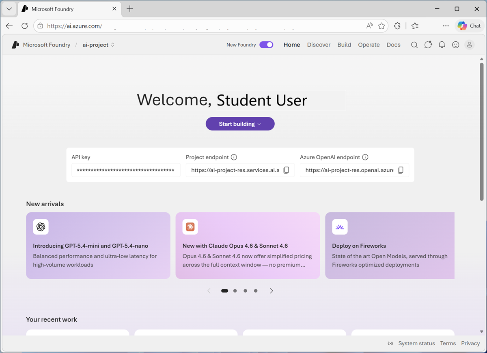
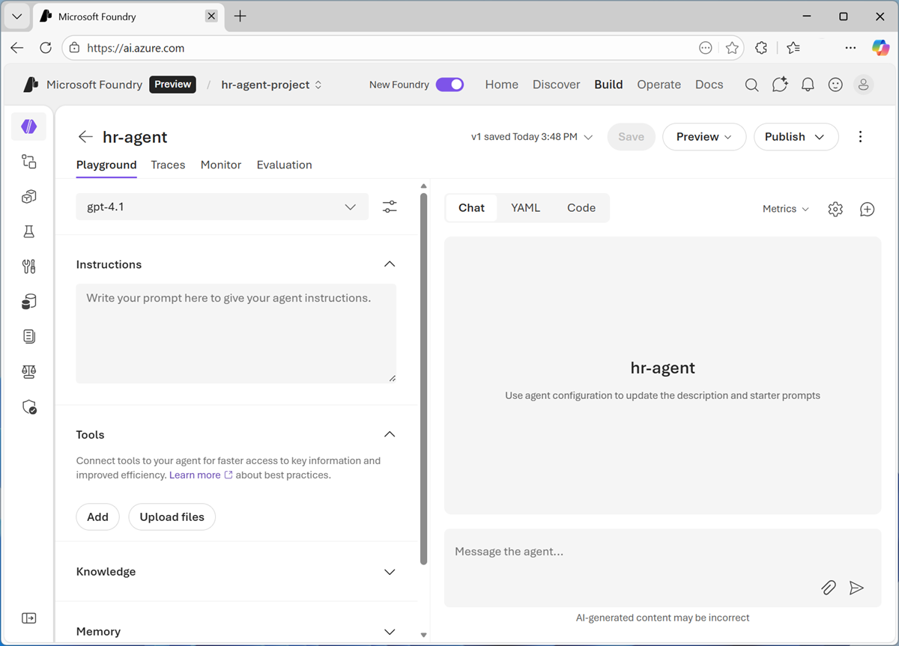
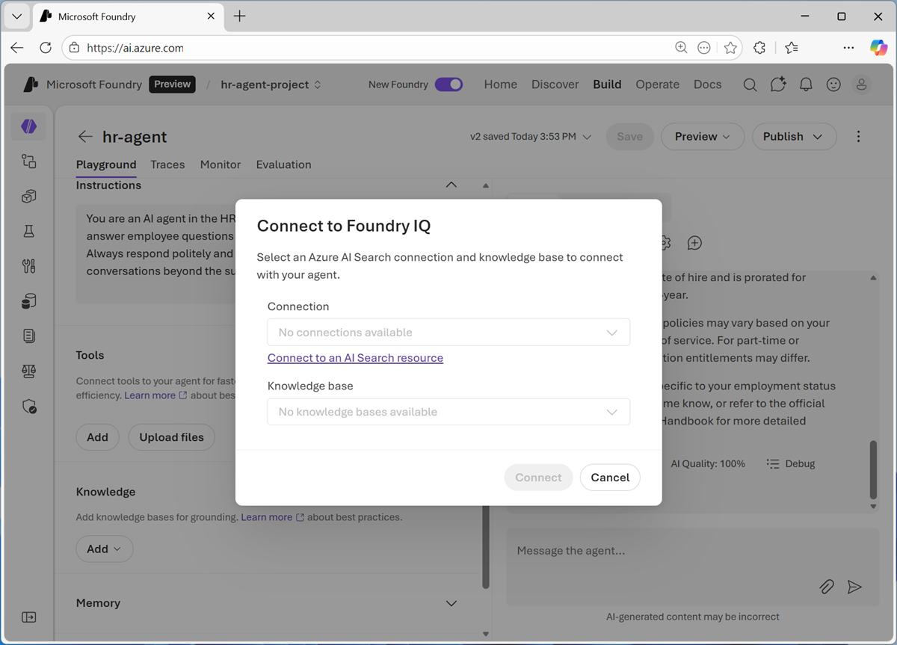
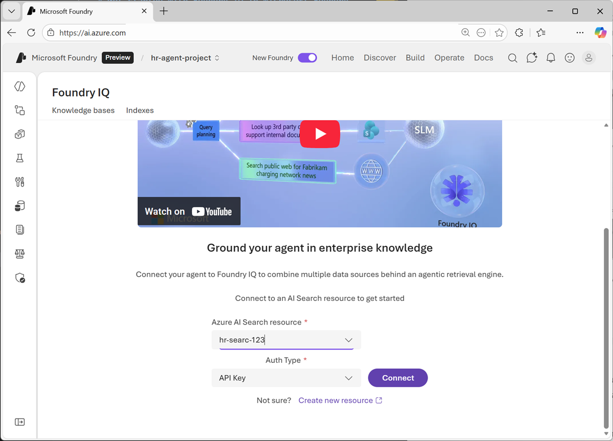
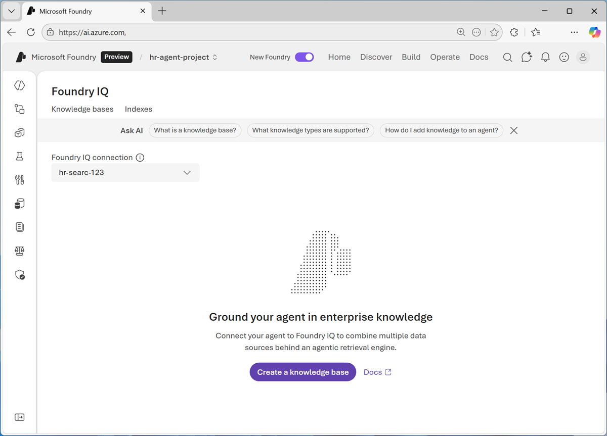
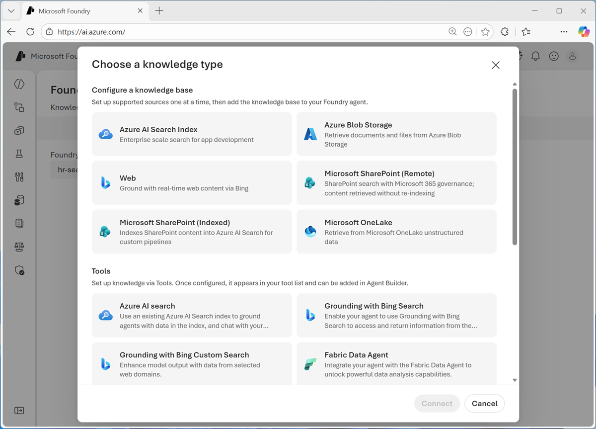
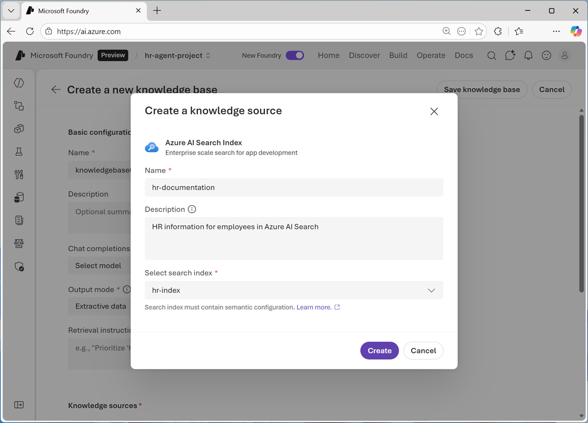
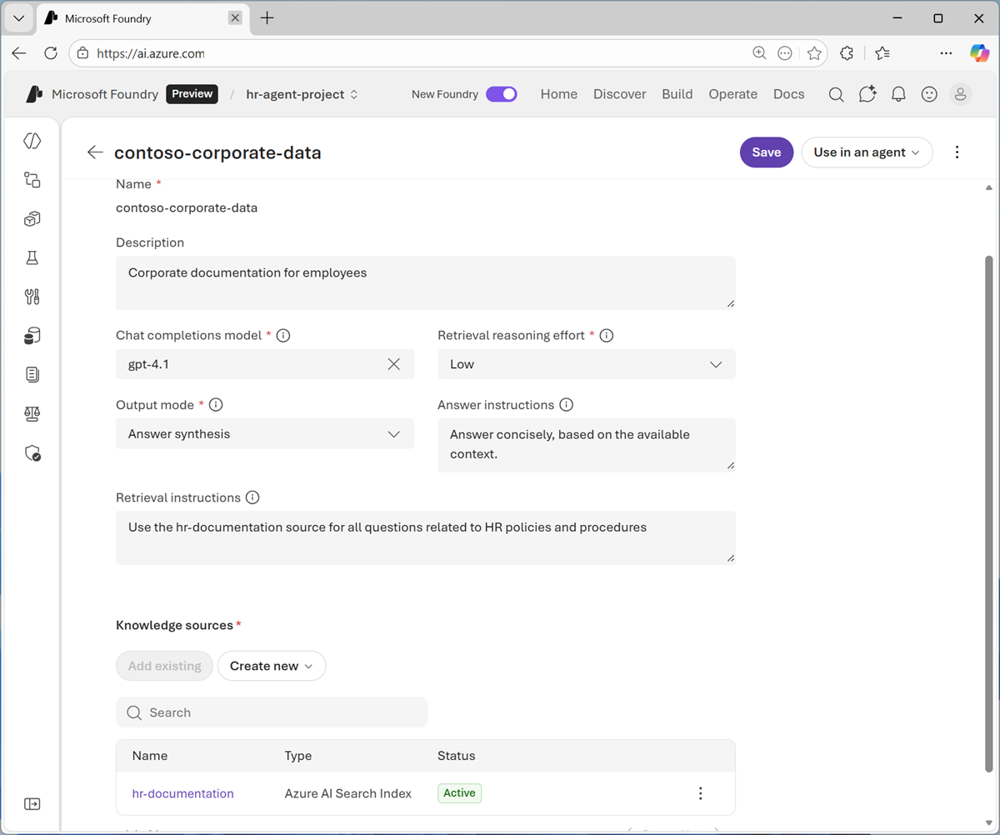
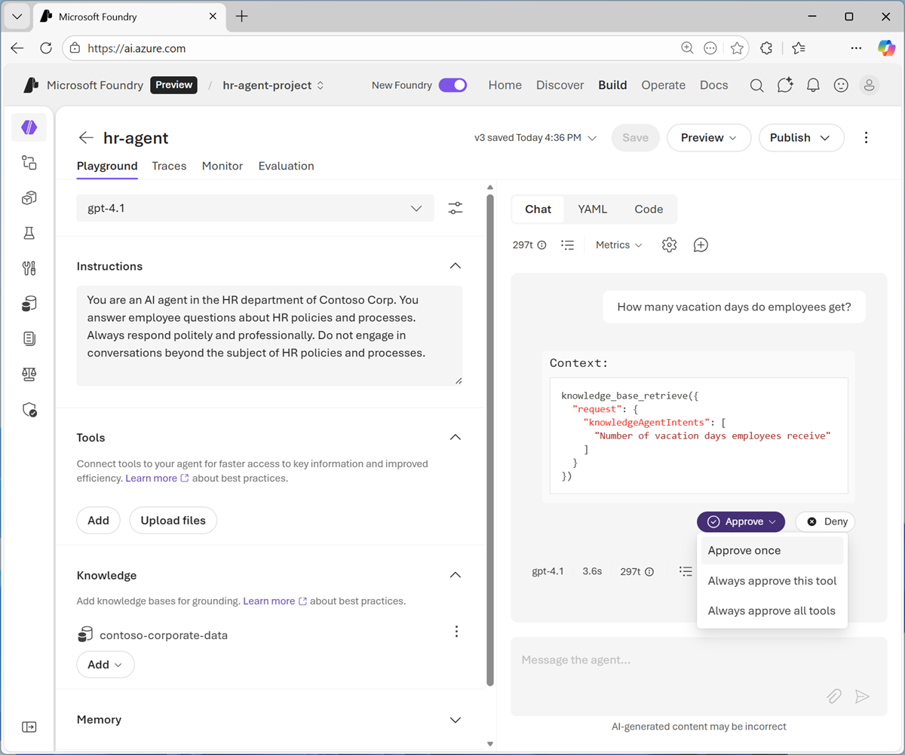
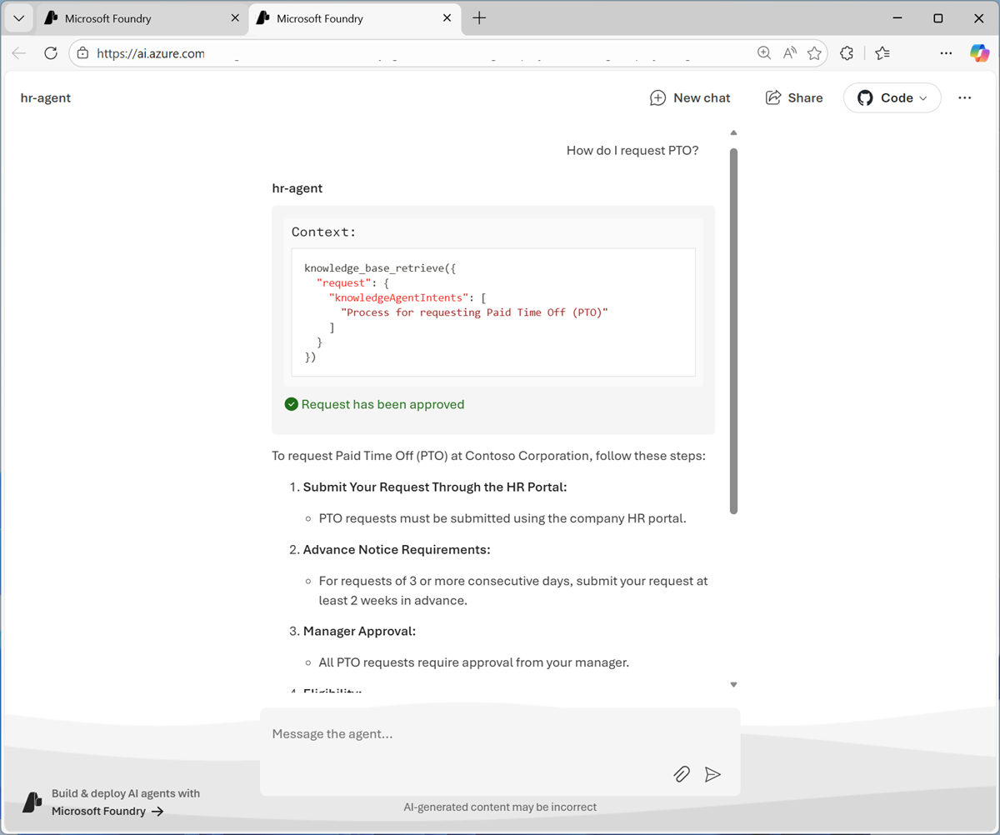

---
lab:
    title: 'Get started with Foundry IQ in Microsoft Foundry'
    description: 'Use Foundry IQ to connect an agent to knowledge.'
    level: 100
    Duration: 20 minutes
---

# Get started with Foundry IQ in Microsoft Foundry

The HR department at Contoso Corp wants to reduce employee support effort and empower employees by providing a self-service solution for queries about HR polices and procedures.

In this exercise, you'll use Microsoft Foundry IQ to create an AI agent that uses knowledge contained in HR documentation to advise employees on HR-related issues.

This exercise should take approximately **20** minutes to complete.

> **Note**: To complete this exercise, you need credentials for an Azure subscription in which you have sufficient permissions to create the required  resources.

## Set up a data source

Let's start by setting up an enterprise data source for HR policy and procedure documentation. In this scenario, the HR department at Contoso Corp. uses Azure AI Search to index HR documentation, so that it can be easily searched.

> **Note**: To keep things simple, we'll use a single Azure AI Search resource in this exercise. This obviously does not represent a real-world volume or variety of data; but will serve to illustrate the principle.

1. In a web browser, open the [Azure portal](https://portal.azure.com){:target="_blank"} at `https://portal.azure.com`. If prompted, sign in using your Azure credentials.

   Close any welcome notifications to see the Azure portal home page.

1. Use the **[\>_]** button to the right of the search bar at the top of the page to create a new Cloud Shell in the Azure portal, selecting a ***Bash*** environment with no storage in your subscription.

    The cloud shell provides a command-line interface in a pane at the bottom of the Azure portal. You can resize or maximize this pane to make it easier to work in.

    > **Note**: If you have previously created a cloud shell that uses a *PowerShell* environment, switch it to ***Bash***.

1. In the cloud shell pane, enter the following commands to clone the GitHub repo containing the code files for this exercise (type the commands, or copy them to the clipboard and then right-click in the command line and paste as plain text):

    ```
   rm -r labfiles -f
   git clone https://github.com/microsoftlearning/mslearn-ai-fundamentals labfiles
   cd labfiles/setup

    ```

1. After the repo has been cloned, enter the following command to run a setup script that deploys the necessary resources:

    ```
   bash ./labfiles/setup/deploy-search.sh
    
    ```

1. When prompted, enter:
    - The resource group where you want to deploy Azure AI Search
    - The region where you want to deploy Azure AI Search
    - A unique name for your Azure AI Search resource

1. Wait for the script to deploy Azure AI Search and create the index you will use in this exercise.
1. When the script has finished, close the cloud shell pane and in the Azure portal home page, select **Resource groups**. Then open the resource group you specified and verify that it contains an Azure AI Search resource with the name you specified.

## Create an AI agent

Now that you have the necessary infrastructure in place, you're ready to create an AI agent that can search the HR documentation for answers to employee questions.

1. In your web browser, open [Microsoft Foundry](https://ai.azure.com){:target="_blank"} at `https://ai.azure.com` and sign in using your Azure credentials. Close any tips or quick start panes that are opened the first time you sign in, and if necessary use the **Foundry** logo at the top left to navigate to the home page.
1. If it is not already enabled, in the tool bar the top of the page, enable the **New Foundry** option. Then, when prompted, create a new project with a unique name; expanding the  **Advanced options** area to deploy the project in the resource group where you deployed Azure AI Search.

     After creating a project in the new Foundry portal, it should open in a page similar to the following image:

    
.

1. In the **Start building** menu, select **Create agent**; and when prompted, name the agent **hr-Agent**.

     When ready, your agent opens in the agent playground.

    

1. In the model drop-down list, ensure that a **gpt-41** model has been deployed and selected for your agent.
1. Assign your agent the following **Instructions**:

    ```
   You are an AI agent in the HR department of Contoso Corp. You answer employee questions about HR policies and processes. Always respond politely and professionally. Do not engage in conversations beyond the subject of HR policies and processes.
    ```

1. Use the **Save** button to save the changes.
1. Test the agent by entering the following prompt in the **Chat** pane:

    ```
   What can you help me with?
    ```

    The agent should respond with an appropriate answer based on its instructions.

1. Try this prompt:

    ```
   What is the capital of France?
    ```

    The agent should not engage in a conversation about European capitals! It should redirect the topic to HR policies and procedures.

1. Now try this:

    ```
   How many vacation days do employees get?
    ```

    The agent may respond with what *seems* like a correct answer. However, the agent currently has no knowledge of Contoso's HR policies and procedures; so the answer is not grounded in accurate information.

    Let's fix that!

## Add a Foundry IQ knowledge base

Foundry IQ is a central connection point for data sources that agents can use as knowledge bases. It enables you to create and manage a collection of knowledge that multiple agents can use, without the need to code data access and query logic in each agent.

### Configure Foundry IQ

1. In the pane on the left of the playground, expand **Knowledge**. Then in the **Add** list, select **Connect to Foundry IQ**.

    You should be prompted to connect to a search resource:

    

1. Select **Connect to an AI Search resource** to open the Foundry IQ page. Then, in the list of available AI Search resources, select your Azure AI Search resource and specify the **API Key** auth type.

    

    > **Important**: In a production solution, you should generally use Microsoft Entra ID authentication. We're using key-based authentication in this exercise for convenience.

1. Connect the Azure AI Search resource. After a moment, it will be opened so you can create knowledge bases in it.

    

    > **Note**: We've added an Azure AI Search resource to the Foundry project so it can support Foundry IQ knowledge stores. It's important to understand that Foundry IQ <u>*always*</u> uses an Azure AI Search resource to create vector indexes for one or more knowledge bases - regardless of the location of the data being accessed. In this case, the data happens to be in an Azure AI Search index; but even if it were in a data lake, SharePoint site, or other location, we'd still need to attach an Azure AI Search resource to the Foundry project!

### Create a knowledge base

1. Select **Create a knowledge base**, and view the available knowledge base types. These represent the different kinds of data source you can use for knowledge bases in Foundry IQ. 

    

1. Select **Azure AI Search index** and **connect**.

1. When prompted, create a knowledge source named `hr-documentation` with an appropriate description, based on the **hr-index** in your Azure AI Search resource. 

    

1. After adding the knowledge source, complete the configuration of the knowledge base by assigning the following values:
    - **Name**: `contoso-corporate-data`
    - **Description**: `Corporate documentation for employees`
    - **Chat completions model**: gpt-4.1
    - **Retrieval reasoning effort**: Low
    - **Output mode**: Answer synthesis
    - **Answer instructions**: `Answer concisely, based on the available context`
    - **Retrieval instructions**: `Use the hr-documentation source for all questions related to HR policies and procedures`

    

    > **Note**: The *output mode* determines how Foundry IQ returns knowledge to the agent. *exractive data* returns verbatim text from the knowledge source while *answer synthesis* uses a generative AI model to compose a suitable response. *Answer instructions* act as a system prompt to specify formatting of the response, and *retrieval instructions* are used by Foundry IQ to guide how knowledge is searched for in the available knowledge bases (in this case, there's only one knowledge base; but there could be more!)

1. Save the knowledge store.

## Use the knowledge store in the HR agent

Now you're ready to use the new knowledge store in the HR agent.

1. When you've saved the knowledge store, in the **use in an agent** drop-down list, select your HR agent.

    The agent is opened in the agent playground, with the knowedge store attached.

1. In the chat pane, enter the following query:

    ```
   How many vacation days do employees get?
    ```

    If the agent determines that it should use Foundry IQ to find context for its answer, you will be prompted to approve access. You can choose how to control tool access for the agent (once, always, or approve all tools). 

    

1. Review the response from the agent, and note that at the bottom of the response, a knowledge base with a name similar to *kb_contoso_corporate_d_a12bc* is cited - this confirms that the agent used the knowledge source you created in Foundry IQ.

### Preview the agent UI for employees

Employees will consume the agent through a web application in the company's internal HR site. Let's see how it might look and behave in production.

1. At the top of the agent playground, in the **Preview** list, select **Preview agent**.

    The agent opens in a new browser tab.

1. Enter the following prompt:

    ```
   How do I request PTO?
    ```

    When prompted, approve access to the tool, and then review the response.

    

1. Try asking about other HR topics (such as remote or hybrid work policy, or employee benefits).

## Summary

In this exercise, you explored how to use Foundry IQ to connect an agent to a knowledge source. While the example in this exercise is simple, it demonstrates the ability to ground agents in contextual knowledge to improve the accuracy and relevance of responses.

Using Foundry IQ offers many advantages over a custom implementation of the retrieval augmented generation (RAG) pattern that is prevalent in generative AI solutions. By centralizing access to knowledge in a single tool, you can offload the data source selection and retrieval logic to Foundry IQ, and reuse knowledge sources across multiple agents without the need to duplicate code or data access logic.

## Clean Up

If you have finished exploring Microsoft Foundry, you should delete the resources created in this exercises to avoid unnecessary utilization charges.

1. Open the [Azure portal](https://portal.azure.com){:target="_blank"} at `https://portal.azure.com` and view the contents of the resource group where you deployed the project used in this exercise.
1. On the toolbar, select **Delete resource group**.
1. Enter the resource group name and confirm that you want to delete it.