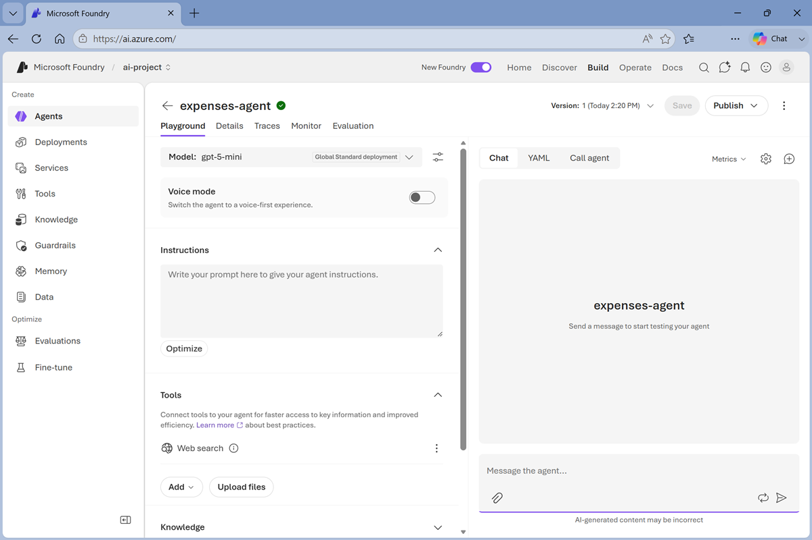
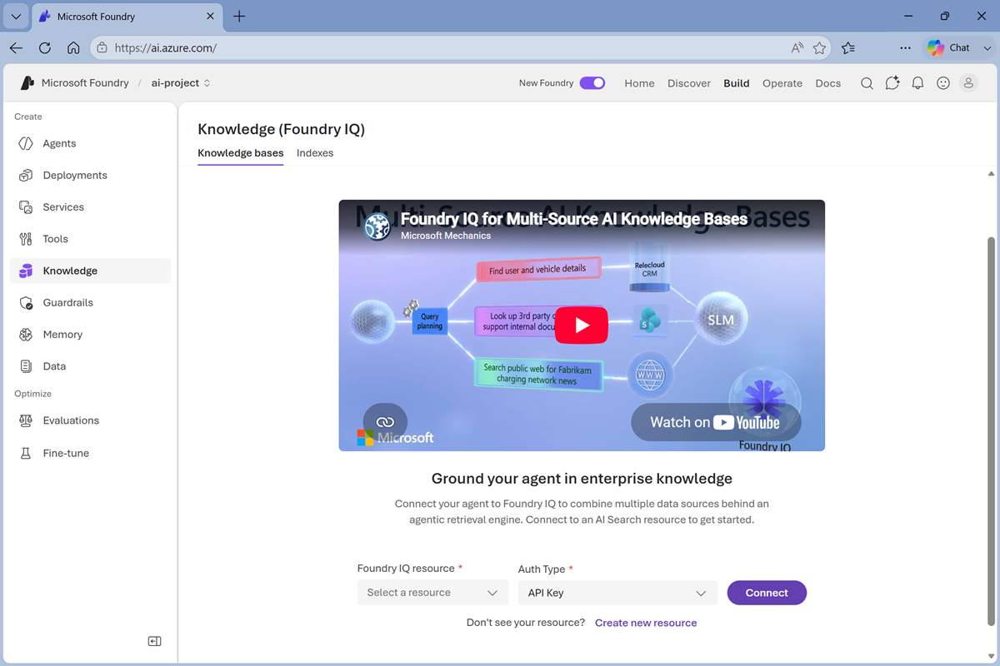
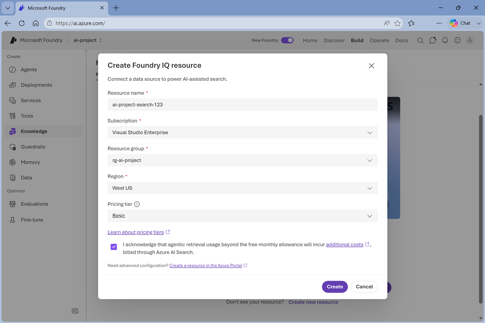
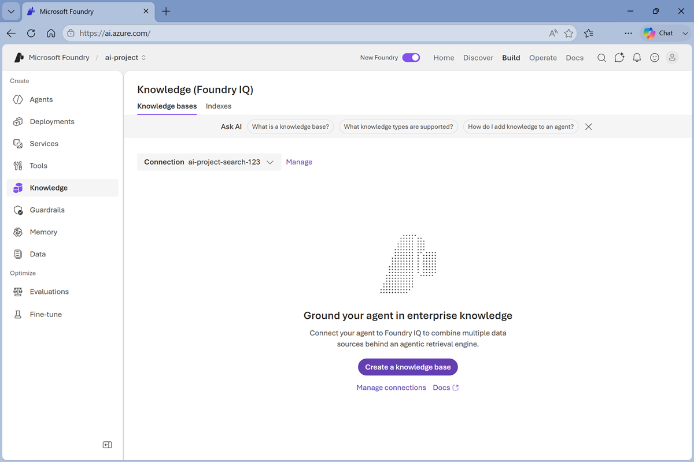
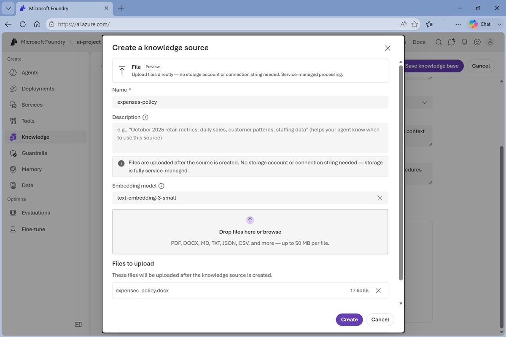
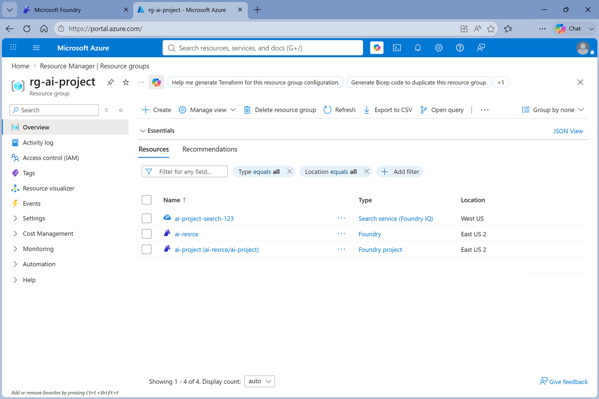
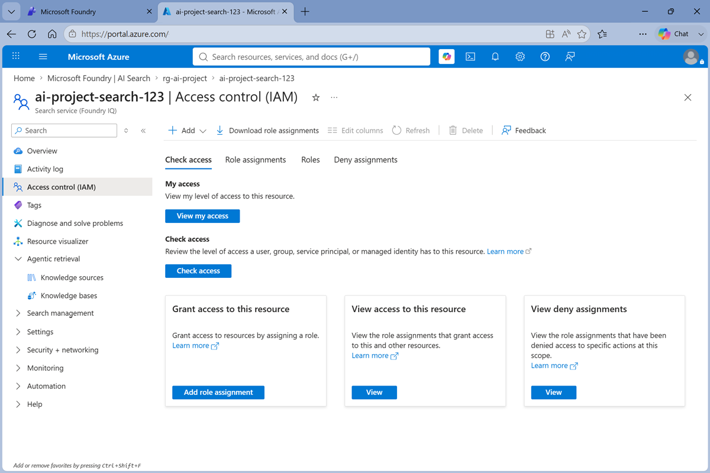
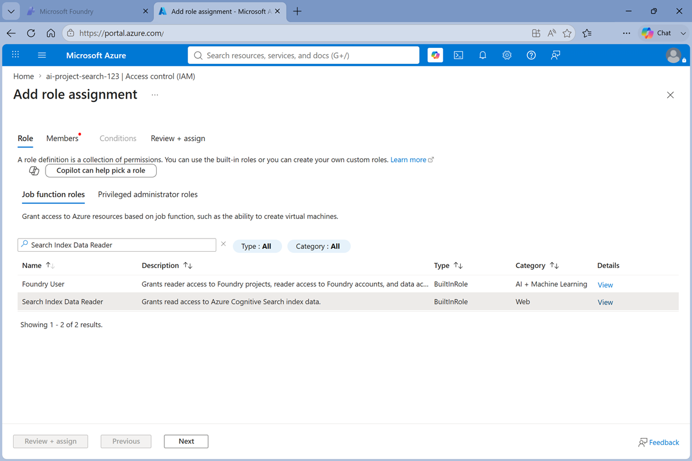
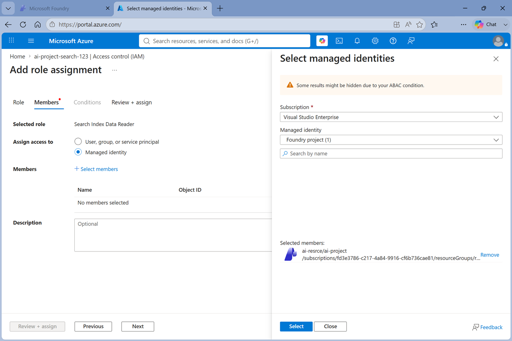
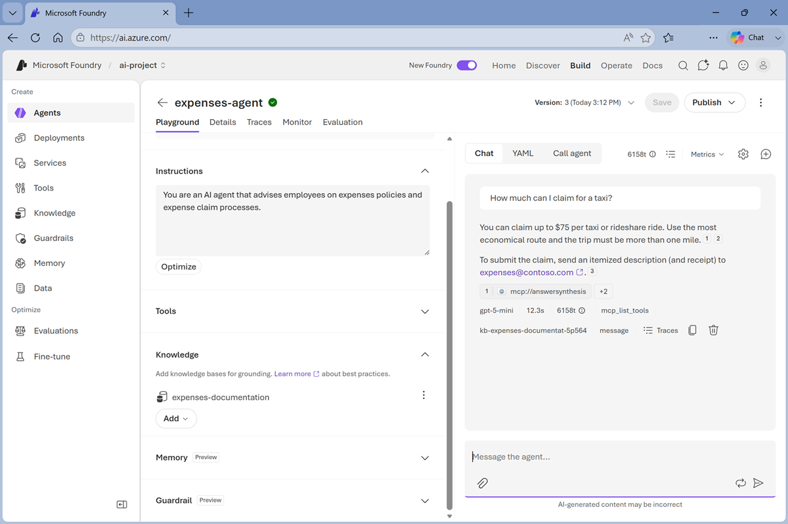

---
lab:
  title: Get started with Foundry IQ in Microsoft Foundry
  description: Use Foundry IQ to connect an agent to knowledge.
  level: 200
  duration: 20 minutes
  islab: true
  primarytopics:
    - Microsoft Foundry
---

# Get started with Foundry IQ in Microsoft Foundry

<br/>**Hi, I'm Anton.**<br/>I'll be here to help you with hints and tips as you work through this lab; in which you'll use Microsoft Foundry IQ to create an AI agent that uses knowledge contained in expenses policy documentation to advise employees on expense claim guidelines and procedures.

If you want more interactive help, you can chat with me in the *[Ask Anton](https://aka.ms/choose-anton){:target="_blank"}* app.

<details>
<strong><i><a href="https://aka.ms/choose-anton" target="_blank">Ask Anton</a></i></strong> is a generative AI agent that can answer questions about AI concepts and Microsoft Foundry technologies. It's available in two versions at <code>https://aka.ms/choose-anton</code>:
<ul>
<li><strong>Azure-based</strong>: Best experience <i>(requires an Azure subscription and deployment of a model in a Foundry project)</i>.</li>
<li><strong>Browser-based</strong>: Use a small language model in your browser <i>(reduced functionality - may be slow or work only in "basic" mode in older/lower-spec devices)</i>.</li>
</ul>
<blockquote><i>Ask Anton is <u>not</u> a supported Microsoft product or a component of Microsoft Learn or AI Skills Navigator.</i>
</blockquote>
</details>
<hr/>

This exercise should take approximately **20** minutes to complete.

> **Note**: Many components of Microsoft Foundry, including the Microsoft Foundry portal, are subject to continual development. This reflects the fast-moving nature of artificial intelligence technology. Some elements of your user experience may differ from the images and descriptions in this exercise!

## Create a Microsoft Foundry project

Microsoft Foundry uses *projects* to organize models, resources, data, and other assets used to develop an AI solution.

1. In a web browser, open [Microsoft Foundry](https://ai.azure.com){:target="_blank"} at `https://ai.azure.com` and start building; signing in using your Azure credentials. Close any tips or quick start panes that are opened the first time you sign in, and if necessary use the **Foundry** logo at the top left to navigate to the home page.
1. If it isn't already enabled, in the tool bar the top of the page, enable the **New Foundry** option.
1. If you do not have any existing projects, you will be prompted to create one. Create a new project with a unique name; expanding the  **Advanced options** area to specify the following settings for your project (or you can select an existing project if you have one!):
    - **Foundry resource**: *A valid name for your Foundry resource.*
    - **Subscription**: *Your Azure subscription*
    - **Resource group**: *Create or select a resource group*
    - **Region**: Select any of the **AI Foundry recommended** regions in [this list](https://learn.microsoft.com/azure/foundry/openai/how-to/responses#supported-regions){:target="_blank"}

    > <br/>**Tip**: Depending on your permissions in the Azure subscription, you may need to clear the option to set up recommended resources.

1. Wait for your project to be created. It may take a few minutes. Then close any welcome dialogs that are displayed.

    After creating or selecting a project in the new Foundry portal, it should open in a page similar to the following image:

    


## Create an AI agent

Now you're ready to create an agent that can help employees with expense claims.

1. On the **Home** page, in the **Build an agent** tile, select **Start building** (or on the **Build** page, select the **Agents** tab); and create a new agent named `expenses-agent`.

     When ready, your agent opens in the agent playground.

    

1. In the model drop-down list, ensure that a model has been deployed and selected for your agent.
1. Assign your agent the following **Instructions**:

    ```
   You are an AI agent that advises employees on expenses policies and expense claim processes.
    ```

1. Use the **Save** button to save the changes.
1. Test the agent by entering the following prompt in the **Chat** pane:

    ```
   What can you help me with?
    ```

    The agent should respond with an appropriate answer based on its instructions.

1. Now try this:

    ```
   How much can I claim for a taxi?
    ```

    The agent may respond with what *seems* like a correct answer. However, the agent currently has no knowledge of your company's expense policies and procedures; so the answer isn't grounded in accurate information.

    Let's fix that!

## Add a Foundry IQ knowledge base

Foundry IQ is a central connection point for data sources that agents can use as knowledge bases. It enables you to create and manage a collection of knowledge that multiple agents can use, without the need to code data access and query logic in each agent.

### Download expenses policy documentation

1. Open a new browser tab, and navigate to the **[expenses_policy.docx](https://microsoftlearning.github.io/mslearn-ai-fundamentals/data/expenses_policy.docx){:target="_blank"}** at `https://microsoftlearning.github.io/mslearn-ai-fundamentals/data/expenses_policy.docx`. We'll use this to provide a knowledge source that the agent can use to answer questions about expense claims.

    > <br/>**Tip**: This is a very small document for the purposes of this lab. In reality, an enterprise knowedge base would likely consist of a large volume of data - often in one or more databases or other enterprise systems.

1. Download **expenses_policy.docx** to your local computer (it doesn't matter where).

### Configure Foundry IQ

1. Return to the browser tab containing the Foundry portal agent playground, and in the main navigation pane on the left, select **Knowledge** to open the Foundry IQ page.

    

1. At the bottom of the page, select the **Create a new resource** link to create a new Foundry IQ (Azure AI Search) resource in your Azure subscription.

    

    Enter the following values, accept the cost aknowledgement, and create your resource:

    - **Resource name**: *A unique name for your Foundry IQ resource.*
    - **Subscription**: *Your Azure subscription.*
    - **Resource group**: *The resource group containing your Microsoft Foundry resource.*
    - **Region**: Any available region.
    - **Pricing tier**: Basic

1. Wait for the Foundry IQ resource to be created and configured for secure access.

    When your Foundry IQ resource is ready, the page will list your knowledge bases (currently there are none).

    

### Create a knowledge base

1. Select **Create a knowledge base**, and complete the basic configuration of the knowledge base by assigning the following values:
    - **Name**: `expenses-documentation`
    - **Description**: `Expense guidelines for employees`
    - **Chat completions model**: *Select the existing model deployment*
    - **Retrieval reasoning effort**: Low
    - **Output mode**: Answer synthesis
    - **Answer instructions**: `Answer concisely, based on the available context`
    - **Retrieval instructions**: `Use the expenses-documentation source for all questions related to expense claim policies and procedures`

    > **Note**: The *output mode* determines how Foundry IQ returns knowledge to the agent. *exractive data* returns verbatim text from the knowledge source while *answer synthesis* uses a generative AI model to compose a suitable response. *Answer instructions* act as a system prompt to specify formatting of the response, and *retrieval instructions* are used by Foundry IQ to guide how knowledge is searched for in the available knowledge bases (in this case, there's only one knowledge base; but there could be more!)

1. In the **Add knowledge sources** pane, select **Upload files** and upload the **expenses_policy.docx** file you previously downloaded to your computer; assigning the name `expenses-policy` and using he default embedding model.

    

1. Wait for the file to be uploaded and processed, and then save the knowledge base.

### Configure access permissions

1. Open a new browser tab and navigate to the [Azure portal](https://portal.azure.com){:target="_blank"} at `https://portal.azure.com`; signing in with your Azure credentials.
1. Browse to the resource group where you created your Foundry IQ resource, and verify that it is listed along with your Microsoft Foundry resource and project.

    

1. Select the Foundry IQ search service resource to open it, and view its **Access control (IAM)** page.

    

1. In the **Add** drop-down list, select **Add role assignment**. Then, on the **Role** tab, search for and select the `Search Data Index Reader` role, and then select **Next**.

    

1. On the **Members** tab, select **Managed identity**, and then use the **+Select members** link to search for and select your **Foundry project** identity.

    

1. Complete the process to **Review and assign** the role membership to add you Foundry project's managed identity to the *Search Data Index Reader* role. your Foundry IQ search resource.
1. Close the tab containing the Azure portal and return to the Foundry portal; where your knowledge store page should still be open.

## Use the knowledge store in the expenses agent

Now you're ready to use the new knowledge store in the expenses agent.

1. In the page for your saved knowledge store, in the **Use in an agent** drop-down list, select your expenses agent.

    The agent is opened in the agent playground, with the knowledge store attached.

1. In the chat pane, enter the following query:

    ```
   How much can I claim for a taxi?
    ```

1. Review the response from the agent, and note that at the bottom of the response, a citation for the expenses documentation is listed.

    

    The expenses agent is now using Foundry IQ to access the expenses documentation knowledge store when needed to answer a user's question.

## Summary

In this exercise, you explored how to use Foundry IQ to connect an agent to a knowledge source. While the example in this exercise is simple, it demonstrates the ability to ground agents in contextual knowledge to improve the accuracy and relevance of responses.

Using Foundry IQ offers many advantages over a custom implementation of the retrieval augmented generation (RAG) pattern that's prevalent in generative AI solutions. By centralizing access to knowledge in a single tool, you can offload the data source selection and retrieval logic to Foundry IQ, and reuse knowledge sources across multiple agents without the need to duplicate code or data access logic.

## Clean Up

If you have finished exploring Microsoft Foundry, you should delete the resources created in this exercise to avoid unnecessary utilization charges.

1. Open the [Azure portal](https://portal.azure.com){:target="_blank"} at `https://portal.azure.com` and view the contents of the resource group where you deployed the project used in this exercise.
1. On the toolbar, select **Delete resource group**.
1. Enter the resource group name and confirm that you want to delete it.

> <br/>If you used the [*Ask Anton*](https://aka.ms/choose-anton){:target="_blank"} app during this lab, we'd love you to [tell us about your experience with it](https://forms.office.com/r/fC0ndfBQeK){:target="_blank"}!