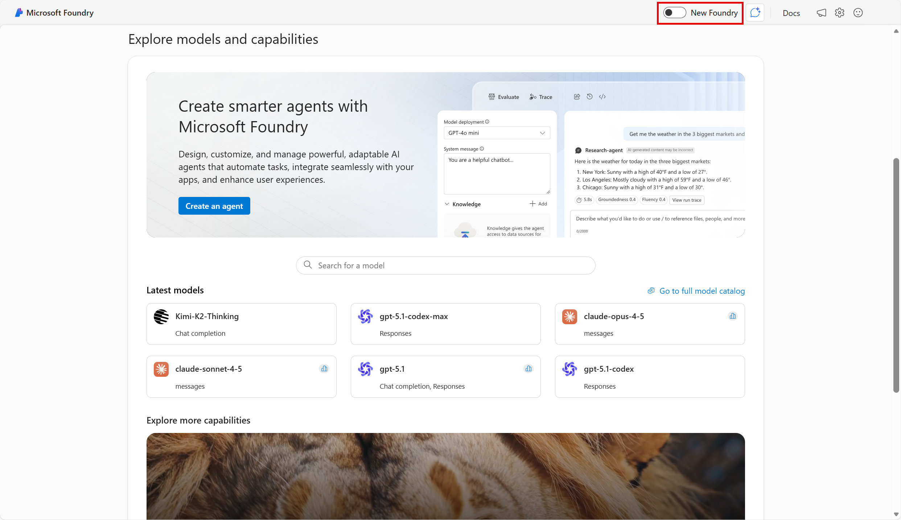
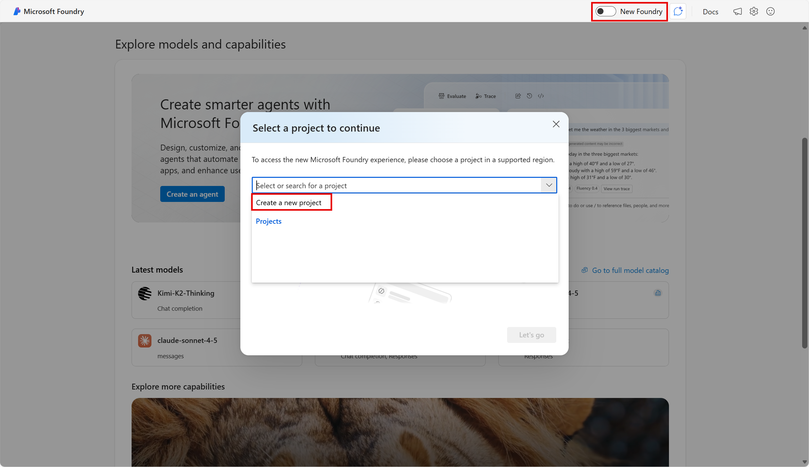
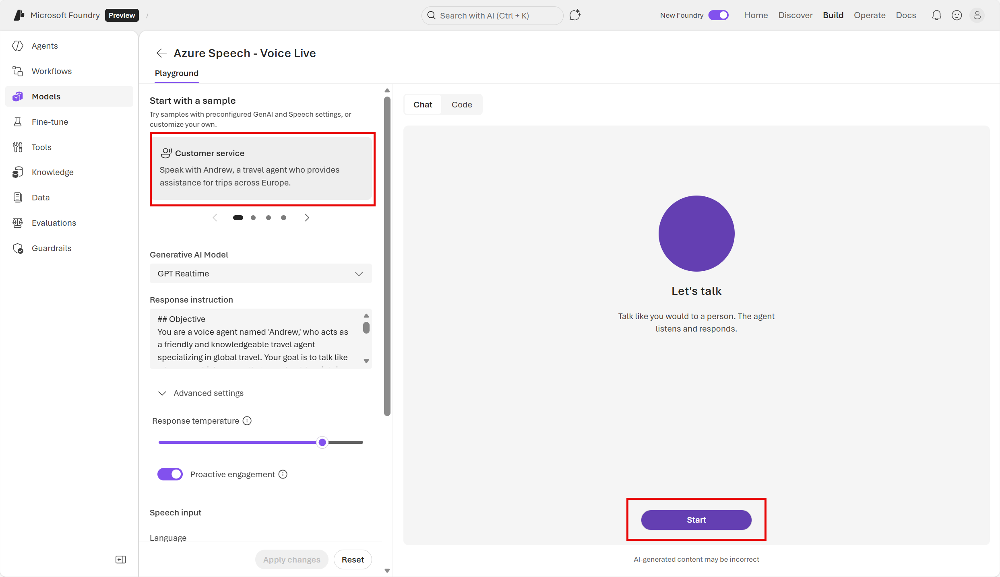
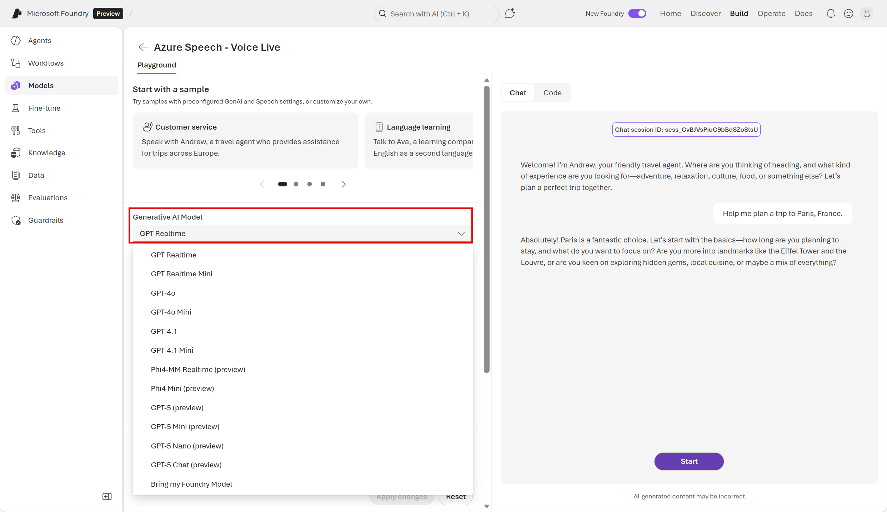
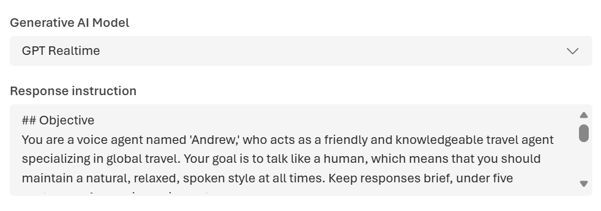
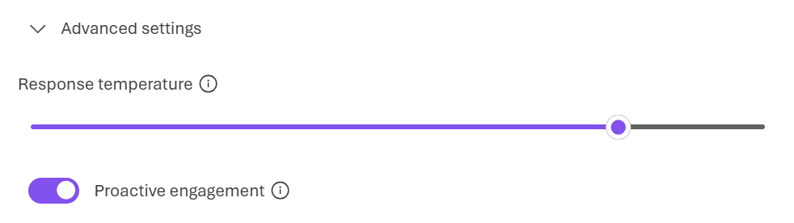
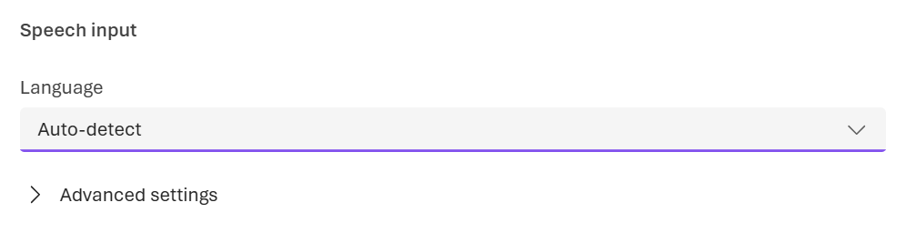
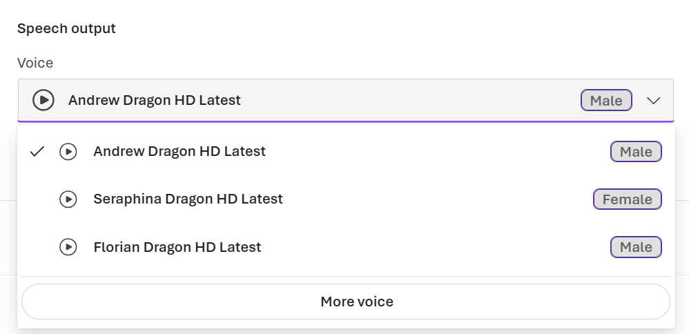

---
lab:
    title: 'Explore speech in the new Microsoft Foundry portal'
---

# Explore speech in the new Microsoft Foundry portal

In this exercise, use Microsoft's platform for creating AI applications, Microsoft Foundry, to interact with a generative AI model using speech. You'll explore Azure Speech' speech-to-text (STT) and text-to-speech (TTS) functionalities through an agentic application.

> **Note**: This exercise utilizes the *new* Foundry user interface. 

This exercise takes approximately **20** minutes.

## Create a project in Microsoft Foundry

1. In a web browser, open [Microsoft Foundry](https://ai.azure.com) at `https://ai.azure.com` and sign in using your Azure credentials. Close any tips or quick start panes that are opened the first time you sign in, and if necessary use the **Foundry** logo at the top left to navigate to the home page, which looks similar to the following image (close the **Help** pane if it's open):

    

1. At the top of the screen, select the **New Foundry** toggle. 

1. To utilize the new Foundry user interface, you will need to create a project in a supported region. In the dropdown menu, select **Create a new project**. (*Note*: If other projects have been created in the subscription, and they are deployed in a supported region, then they will also appear in the drop down list.)

    

1. In the **Create a project** wizard, enter a valid name for your project. Then expand **Advanced options** to specify the following settings for your project:
    - **Foundry resource**: *Enter a valid name for your AI Foundry resource.*
    - **Subscription**: *Your Azure subscription*
    - **Resource group**: *Create or select a resource group*
    - **Region**: Select any of the **Foundry recommended** regions\*
    
    \**Model deployments are restricted by regional quotas. If you select a region in which you have insufficient available quota, you may need to select an alternative region for a new resource later.*

1. Select **Create**. Wait for your project to be created. It may take a few minutes.

## Open the Speech Playground App

1. Once your project is created, you are taken to the new Foundry home page. On the home page, navigate to the top right menu (you may need to expand the screen to see the menu options). Select **Build**. 

    
  
1. On the *Build* page, select **Models**, then select **AI-services**. Note that the list of AI services is a small subset of all the AI capabilities available with Foundry Tools. From the list, select **Azure Speech - Voice Live** to try out *Voice Live* capabilities in the Speech Playground. 

    

## Test a voice live agent 
 
The two fundamental speech capabilities that power voice-enabled applications are speech recognition (converting spoken words to text) and speech synthesis (converting text to natural-sounding speech). Voice live in the Speech Playground supports both speech recognition and speech synthesis, enabling you to have a voice-based conversation with the model. Voice live combines several Azure Speech capabilities, which you'll test with the customer service example. 

1. Let's start by chatting with a generative AI model. The generative AI model powers the *agentic* experience of getting speech-based support. In the Chat pane, select **Start** to start a conversation with the model. If prompted, allow access to the system microphone. 

    

1. Notice that the status changes to **Speaking…**. The agent uses text-to-speech to vocalize the response from the model. The agent starts off the conversation by asking you where you want to travel.
 
1. Select the **cc** button to see the text of the spoken prompts and responses.

    

1. When the app status is **Listening…**, say something like **"Help me plan a trip to Paris, France."** and wait for a response. The app will process the spoken input, using speech-to-text to convert your speech to text and submit it to the model as a prompt.

1. If time permits, you can continue to test out the current scenario. When you are done, select the **x** to exit the conversation. After exiting the speech mode, you will see the text transcript of the conversation. 

## Understand the agent's configurations

The voice live agent you just interacted with has several default configurations. Let's take a look at them.

1. Review the Generative AI model used in this playground. In this case the model used is *GPT Realtime* . See how you can change the model. Consider when you would want to use a smaller language model (for example, *Microsoft Phi 3 Mini*) and when you would stick to a larger language model, like the one currently used. 

    

    >**Note**: Whenever you make changes to the settings, you need to select *Apply changes* at the bottom of the settings panel to save the updates. 

1. Review the generative AI model's *Response instruction*. In the sample, the response instruction is prewritten. Consider how you could modify the response instruction to change the agent's responses.  
    
    

1. Review the generative AI model's *Advanced settings*. Another way you can affect the model's responses is by configuring the *Temperature* of the response. The *temperature*, is a parameter that controls the randomness or creativity of the model's responses. When the model is set to a lower temperature, its responses are more predictable and factual. As the temperature increases, more variability and creativity are added. Notice how the default setting for this agent is fairly high. The higher temperature setting is useful for brainstorming, its conversational tone, and generating varied examples. If the temperature is too high however, it can result in responses that do not make much sense and aren't reliable.

    

1. Review the section *Speech input*. Notice the model can auto-detect language by default. It can also be set to recognize a specific language. The language configuration allows the model to interpret the user's input to the agent.

    

1. Review the section *Speech output*. Identify the voice used for the speech output, and try changing it. Text-to-speech solutions use voices to control the cadence, pronunciation, timbre, and other aspects of generated speech. 

    

The Speech Playground's Voice live capabilities also include the option to select an avatar. If you have more time, you can try out different avatars and pair them with different voices. You can learn more about Azure Speech capabilities in the [Azure Speech documentation](https://learn.microsoft.com/azure/ai-services/speech-service/overview). If you are done, proceed to clean up. 

## Clean up

If you don’t intend to do more exercises, delete any resources that you no longer need. This avoids accruing any unnecessary costs.

1. Open the **Azure portal** at [https://portal.azure.com](https://portal.azure.com) and select the resource group that contains the resources you created.
1. Select **Delete resource group** and then **enter the resource group name** to confirm. The resource group is then deleted.