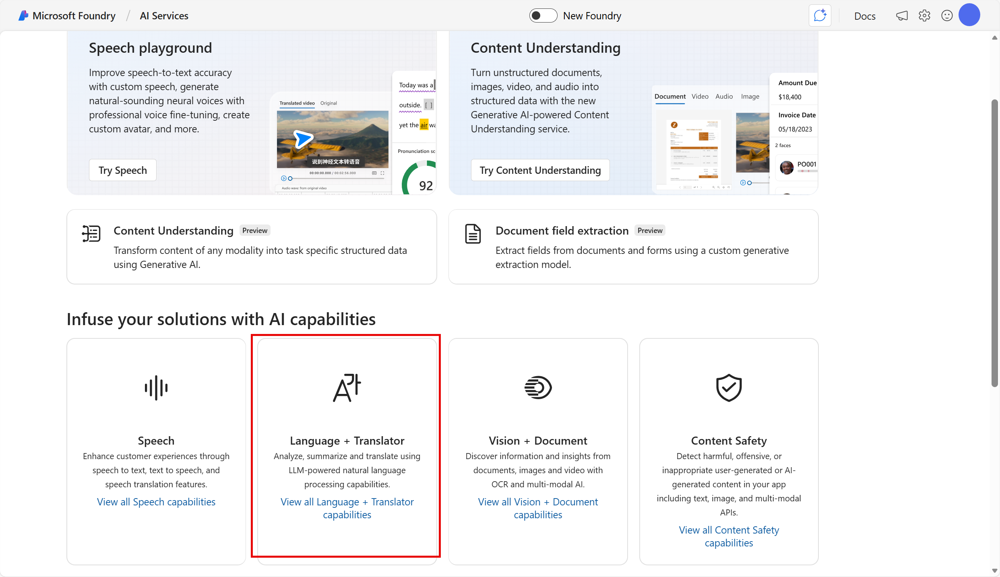

---
lab:
    title: 'Analyze text in Microsoft Foundry - NEW'
---

# Analyze text in Microsoft Foundry - NEW

Azure Language includes Text Analytics, with capabilities such as entity recognition, key phrase extraction, summarization, and sentiment analysis. In this exercise, use Microsoft Foundry, Microsoft's platform for creating AI applications, to use AI to analyze text. You'll use Azure Language's natural language processing functionalities to analyze text. The goal of this exercise is to explore common applications of text analysis techniques.

This exercise takes approximately **20** minutes.

## Create a project in Microsoft Foundry

1. In a web browser, open [Microsoft Foundry](https://ai.azure.com) at `https://ai.azure.com` and sign in using your Azure credentials. Close any tips or quick start panes that are opened the first time you sign in, and if necessary use the **Foundry** logo at the top left to navigate to the home page, which looks similar to the following image (close the **Help** pane if it's open):

    

1. Scroll to the bottom of the page, and select the **Explore Azure AI Services** tile.

    

1. On the Azure AI Services page, select the **Language + Translator** tile.

    

1. On the **Language + Translator** page, select **Try the Language playground**. Then, when prompted, create a new project with the following settings:
    - **Project name**: *Enter a valid name for your project.*
    - **Advanced settings**:
        - **Subscription**: *Your Azure subscription*
        - **Resource group**: *Create or select a resource group*
        - **Region**: *Select any **Foundry recommended** region*
        - **AI Foundry or Azure OpenAI** *Create a new Foundry resource with a valid name*

1. Select **Create**. Wait for your project to be created. It may take a few minutes.

1. When the project is created, you will be taken to an **Language** playground (if not, in the task pane on the left, select **Playgrounds** and open the Language playground from there.)

    The Language playground is a user interface that enables you to try out some Azure Language capabilities.  

## Prepare for text analysis

1. Download and extract **[text.zip](https://aka.ms/ai-text){:target="_blank"}** at `https://aka.ms/ai-text`. This archive contains multiple text documents that you'll use in this exercise.
1. Return to the Language Playground to try out some of Azure Language's text analysis capabilities.

## Analyze sentiment

**Sentiment analysis** is a common NLP task. It's used to determine whether text conveys a positive, neutral or negative sentiment; which makes it useful for categorizing reviews, social media posts, and other subjective documents.

1. In the Language playground, select **Classify text**. Then select the **Analyze sentiment** tile.
1. Upload **document-1.txt** from the folder where you extracted the downloaded text files.
1. Select **Run**. Review the output.

    >**Tip**: Notice that the analysis produces an overall sentiment score and individual scores for each sentence.

    

1. Repeat the analysis for **document-2.txt** and **document-3.txt**.

#### Review the sample code

## Extract key phrases

**Key phrases** are the most important pieces of information in text. Let's use the key phrase extraction capability of Azure Language to pull important information from a review.

1. In the Language playground, select **Extract information**. Then select the **Extract key phrases** tile. 
1. Upload **document-1.txt** from the folder where you extracted the downloaded text files.
1. Select **Run**. Review the output.

    >**Tip**: Notice the different phrases extracted in the *Details* section. These phrases should contribute most to the text's meaning.

    

1. Repeat the analysis for **document-2.txt** and **document-3.txt**.

#### Review the sample code

## Extract named entities

**Named entities** are words that describe people, places, and objects with proper names. Let's use the named entity extraction capability of Azure Language to identify types of information in a review.

1. In the Language playground, select **Extract information**. Then select the **Extract named entities** tile. 
1. Upload **document-1.txt** from the folder where you extracted the downloaded text files.
1. Select **Run**. Review the output.

    >**Tip**: Notice in the *Details* section how the extracted entities come with additional information such as type and confidence scores. The confidence score represents the likelihood that the type identified actually belongs to that category.

    

1. Repeat the analysis for **document-2.txt** and **document-3.txt**.

#### Review the sample code

## Summarize text

**Summarization** is a way to distill the main points in a document into a shorter amount of text.

1. In the Language playground, select **Summarize information**, then select the **Summarize text** tile.
1. Upload **document-1.txt** from the folder where you extracted the downloaded text files.
1. Select **Run**. Review the output.

    >**Tip**: Notice the *Extractive summary* in *Details* provides rank scores for the most salient sentences.

    

1. Repeat the analysis for **document-2.txt** and **document-3.txt**.

#### Review the sample code

## Clean up

If you don’t intend to do more exercises, delete any resources that you no longer need. This avoids accruing any unnecessary costs.

1. Open the **Azure portal** at [https://portal.azure.com](https://portal.azure.com) and select the resource group that contains the resources you created.
1. Select **Delete resource group** and then **enter the resource group name** to confirm. The resource group is then deleted.

## Learn more

To learn more about what you can do with this service, see the [Language service page](https://learn.microsoft.com/azure/ai-services/language-service/overview).