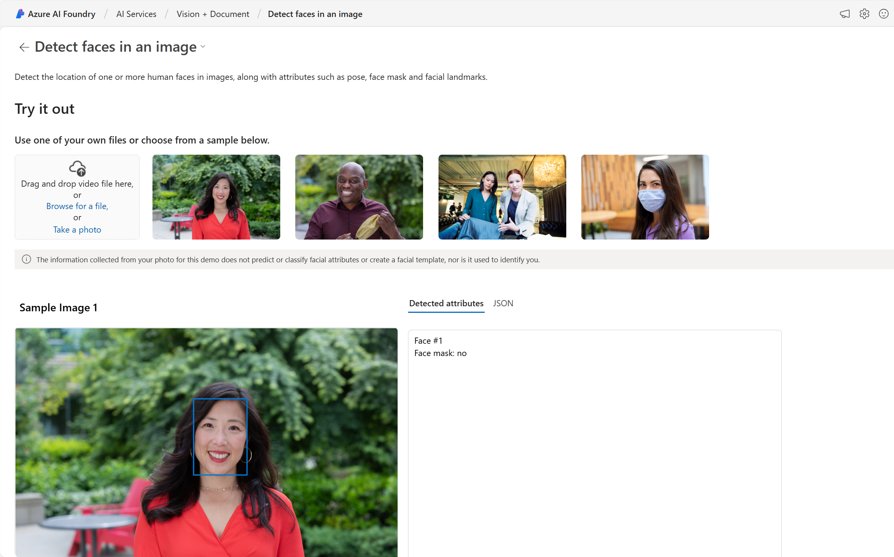
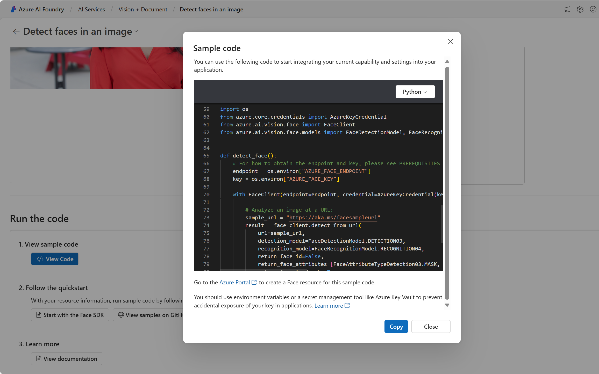

---
lab:
    title: 'Explore Azure AI Services'
---

# Explore Azure AI Services

Azure AI services help users create AI applications with out-of-the-box and pre-built and customizable APIs and models. In this exercise you will create a resource in the Azure portal and try out Azure AI services. The goal of this exercise is to get a general sense of how Azure AI services are provisioned and used.

## Create an *Azure AI services* resource in the Azure portal

1. In a browser tab, open the Azure portal at [https://portal.azure.com](https://portal.azure.com?azure-portal=true), signing in with the Microsoft account associated with your Azure subscription.

1. Click the **&#65291;Create a resource** button and search for *Azure AI services*. Select **create** an **Azure AI services** plan. You will be taken to a page to create an Azure AI services resource. Configure it with the following settings:
    - **Subscription**: *Your Azure subscription*.
    - **Resource group**: *Select or create a resource group with a unique name*.
    - **Region**: *Select the closest geographical region. If in eastern US, use "East US 2"*.
    - **Name**: *Enter a unique name*.
    - **Pricing tier**: *Standard S0.*
    - **By checking this box I acknowledge that I have read and understood all the terms below**: *Selected*.

1. Select **Review + create** then **Create** and wait for deployment to complete.

    *Congrats! You've just created, or provisioned, an Azure AI services resource. The one you provisioned in particular is a multi-service resource.*

1. Once the deployment is complete, select *Go to resource*. 

## Check out the keys and endpoint

In order to incorporate Azure AI services into applications, developers need a service key and endpoint. The keys and endpoint used for application development can be found in the Azure Portal. 

1. In the Azure Portal, select your resource. On the left-hand menu, look under *Resource Management* for *Keys and Endpoints*. Select **Keys and Endpoints** to view the endpoint and keys for your resource. 

## See Azure AI services in action

Let's start by creating an Azure AI Foundry project.

1. In a web browser, open the [Azure AI Foundry portal](https://ai.azure.com) at `https://ai.azure.com` and sign in using your Azure credentials. Close any tips or quick start panes that are opened the first time you sign in.
 
1. In a new browser window, open the [Azure AI services exploration page](https://ai.azure.com/explore/aiservices).

1. On the *AI Services* page, select the *Vision + Document* tile to try out Azure AI Vision and Document capabilities.

    

1. Under *View all Vision capabilities* select the **Face** tab. 

1. Select the *Detect faces in an image* demo tile. 

1. Try out the Face service, which is one of many Azure AI services. Click on an image and check out the detected attributes. 

    

1. Scroll down to the **Run the code** section. Select **View Code**. Scroll down to the section that starts with *import os*. In the sample code provided, you'll see placeholders where you could put a key and endpoint.

     

1. If you were to build an application that used Azure AI services, you could start with the provided code. By replacing the placeholders with your own service's key and endpoint, your application would be able to send requests and receive responses that utilize Azure AI services. In the case of the Face service, the *request* is for the Face service to analyze the image. The *response* is the detected attributes. 

    >**Note**
    >You do not need to know programming to complete any of the exercises in this course. We will continue to take a look at Azure AI services in action through the Azure AI Foundry portal.  
 
## Clean up 

After you have finished, you can delete the Azure AI services resource from the Azure Portal. Deleting the resource is a way to reduce costs that accrue when the resource exists in the subscription. To do this, navigate to the **Overview** page of your Azure AI services resource. Select **Delete** at the top of the screen.

