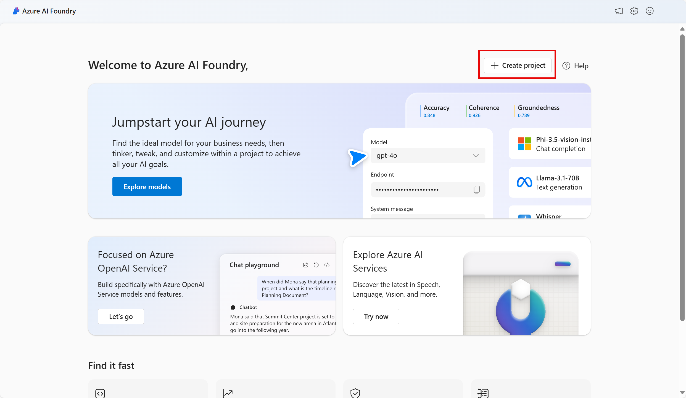
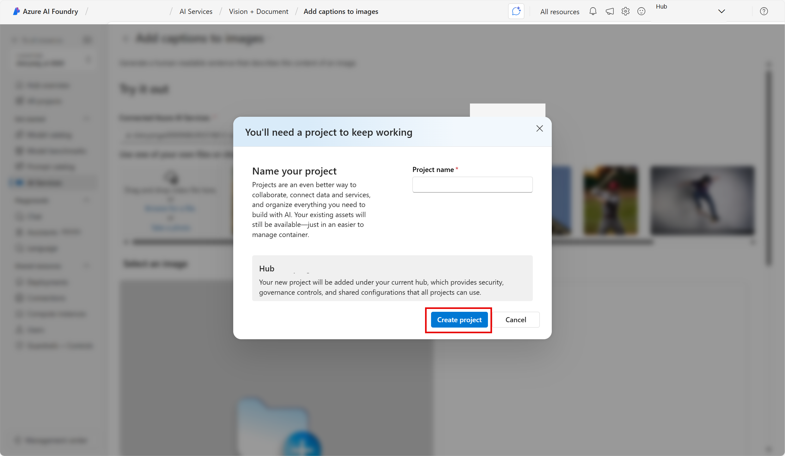
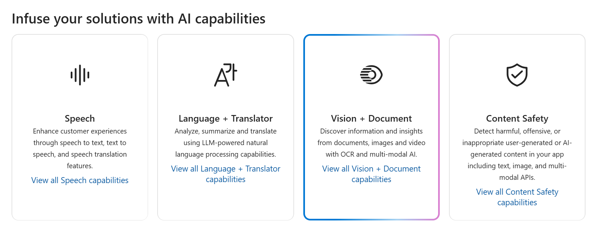
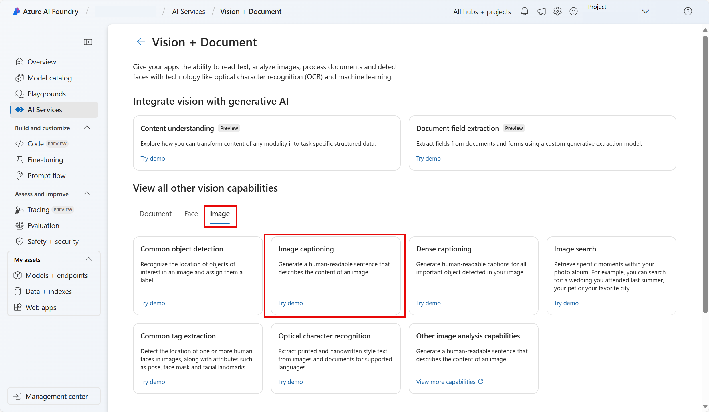
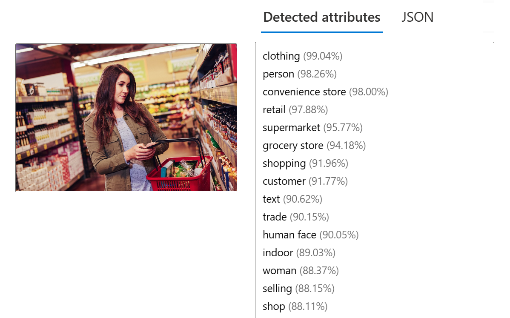

---
lab:
    title: 'Analyze images in Azure AI Foundry portal'
---

# Analyze images in Azure AI Foundry portal

**Azure AI Vision** includes numerous capabilities for understanding image content and context and extracting information from images. In this exercise, you will use Azure AI Vision in Azure AI Foundry portal, Microsoft's platform for creating intelligent applications, to analyze images using the built-in try-it-out experiences. 

Suppose the fictitious retailer *Northwind Traders* has decided to implement a "smart store", in which AI services monitor the store to identify customers requiring assistance, and direct employees to help them. By using Azure AI Vision, images taken by cameras throughout the store can be analyzed to provide meaningful descriptions of what they depict.

## Create a project in Azure AI Foundry portal

1. In a browser tab, navigate to [Azure AI Foundry](https://ai.azure.com?azure-portal=true).

1. Sign in with your account. 

1. On the Azure AI Foundry portal home page, select **Create a project**. In Azure AI Foundry, projects are containers that help organize your work.  

    

1. On the *Create a project* pane, you will see a generated project name, which you can keep as-is. Depending on whether you have created a hub in the past, you will either see a list of *new* Azure resources to be created or a drop-down list of existing hubs. If you see the drop-down list of existing hubs, select *Create new hub*, create a unique name for your hub, and select *Next*.  
 
    

    > **Important**: You will need an Azure AI services resouce provisioned in a specific location to complete the rest of the lab.

1. In the same *Create a project* pane, select **Customize** and select one of the following **Locations**: East US, France Central, Korea Central, West Europe, or West US to complete the rest of the lab. Then select **create**. 

1. Take note of the resources that are created: 
    - Azure AI services
    - Azure AI hub
    - Azure AI project
    - Storage account
    - Key vault
    - Resource group  
 
1. After the resources are created, you will be brought to your project's *Overview* page. On the left-hand menu on the screen, select **AI Services**.
 
      

1. On the *AI Services* page, select the *Vision + Document* tile to try out Azure AI Vision and Document capabilities.

    

## Generate captions for an image

Let's use the image captioning functionality of Azure AI Vision to analyze images taken by a camera in the *Northwind Traders* store. Image captions are available through the **Caption** and **Dense Captions** features.

1. On the *Vision + Document* page, scroll down and select **Image** under *View all other vision capabilities*. Then select the **Image captioning** tile.

    

1. On the **Add captions to images** page, review the resource you are connected to which is listed under the **Try It Out** subheading. You should not have to make changes. (*Note*: if you did not customize a valid resource location earlier during resource creation, you may be asked to create a new Azure AI services resource that is in a valid region. You will need to create the new resource to continue with the lab.)  

1. Select [**https://aka.ms/mslearn-images-for-analysis**](https://aka.ms/mslearn-images-for-analysis) to download **image-analysis.zip**. Open the folder on your computer and locate the file named **store-camera-1.jpg**; which contains the following image:

    

1. Upload the **store-camera-1.jpg** image by dragging it to the **Drag and drop files here** box, or by browsing to it on your file system.

1. Observe the generated caption text, visible in the **Detected attributes** panel to the right of the image.

    The **Caption** functionality provides a single, human-readable English sentence describing the image's content.

1. Next, use the same image to perform **Dense captioning**. Return to the **Vision + Document** page by selecting the *back* arrow at the top of the page. On the *Vision + Document* page, select the **Image** tab, then select the **Dense captioning** tile.

    The **Dense Captions** feature differs from the **Caption** capability in that it provides multiple human-readable captions for an image, one describing the image's content and others, each covering the essential objects detected in the picture. Each detected object includes a bounding box, which defines the pixel coordinates within the image associated with the object.

1. Hover over one of the captions in the **Detected** attributes list and observe what happens within the image.

    

    Move your mouse cursor over the other captions in the list, and notice how the bounding box shifts in the image to highlight the portion of the image used to generate the caption.

## Tagging images 

The next feature you will try is the **Extract Tags** functionality. Extract tags is based on thousands of recognizable objects, including living beings, scenery, and actions.

1. Return to the *Vision + Document* page of Azure AI Foundry, then select the **Image** tab, and select the **Common tag extraction** tile.

2. In the **Choose the model you want to try out**, leave **Prebuilt product vs. gap model** selected. In the **Choose your language**, select **English** or a language of your preference.

3. Open the folder containing the images you downloaded and locate the file named **store-image-2.jpg**, which looks like this:

    

4. Upload the **store-camera-2.jpg** file.

5. Review the list of tags extracted from the image and the confidence score for each in the detected attributes panel. Here the confidence score is the likelihood that the text for the detected attribute describes what is actually in the image. Notice in the list of tags that it includes not only objects, but actions, such as *shopping*, *selling*, and *standing*.

    

## Object detection

In this task, you use the **Object detection** feature of Image Analysis. Object detection detects and extracts bounding boxes based on thousands of recognizable objects and living beings.

1. Return to the *Vision + Document* page of Azure AI Foundry, then select the **Image** tab, and select the **Common object detection** tile.

1. In the **Choose the model you want to try out**, leave **Prebuilt product vs. gap model** selected.

1. Open the folder containing the images you downloaded and locate the file named **store-camera-3.jpg**, which looks like this:

    

1. Upload the **store-camera-3.jpg** file.

1. In the **Detected attributes** box, observe the list of detected objects and their confidence scores.

1. Hover your mouse cursor over the objects in the **Detected attributes** list to highlight the object's bounding box in the image.

1. Move the **Threshold value** slider until a value of 70 is displayed to the right of the slider. Observe what happens to the objects in the list. The threshold slider specifies that only objects identified with a confidence score or probability greater than the threshold should be displayed.

## Clean up

If you don’t intend to do more exercises, delete any resources that you no longer need. This avoids accruing any unnecessary costs.

1.	Open the [Azure portal]( https://portal.azure.com) and select the resource group that contains the resources you created. 
1.	Select the resource and select **Delete** and then **Yes** to confirm. The resource is then deleted.

## Learn more

To learn more about what you can do with this service, see the [Azure AI Vision page](https://learn.microsoft.com/azure/ai-services/computer-vision/overview).
