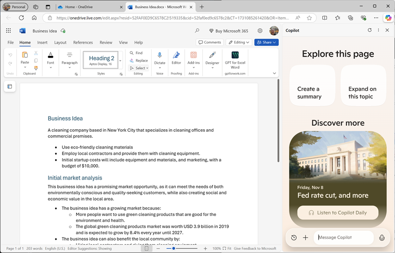
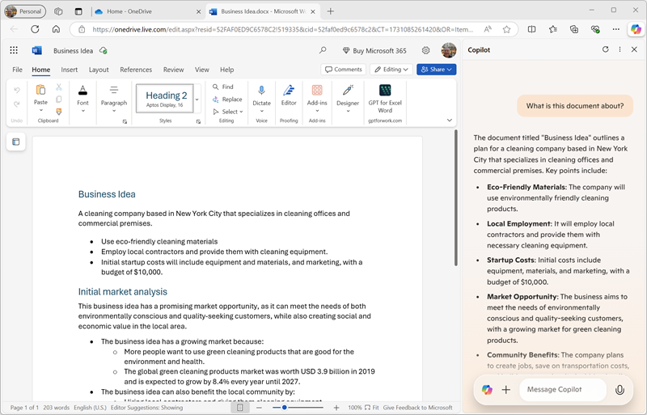
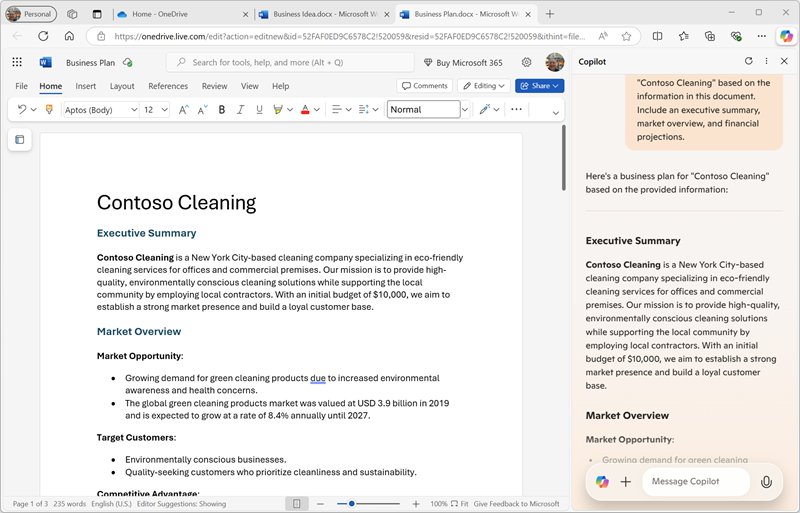
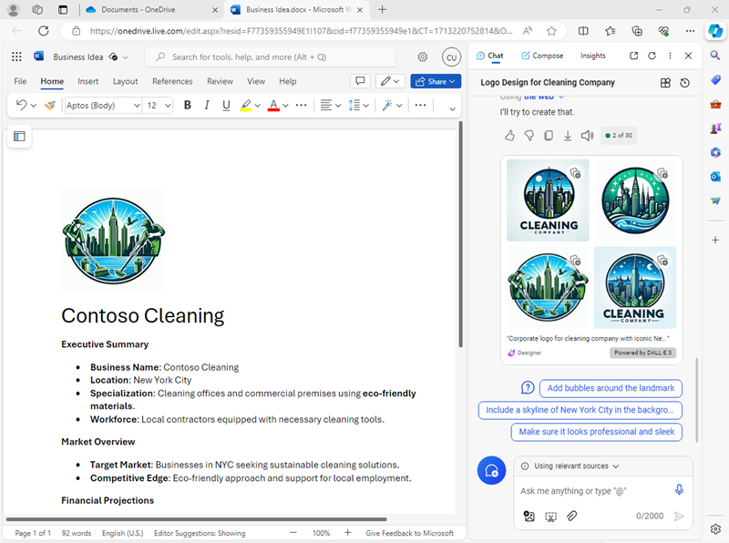
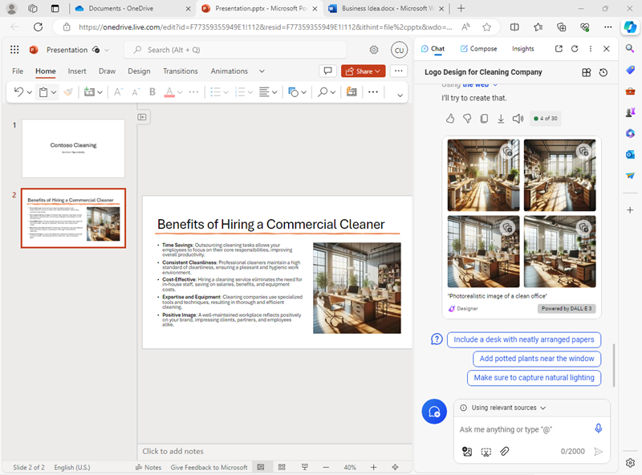
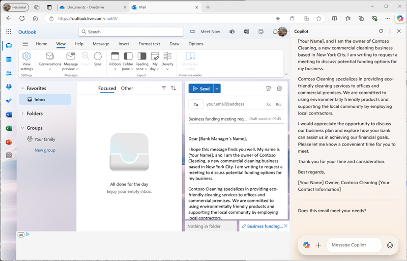

---
lab:
    title: 'Explore Copilot in Microsoft Edge'
---
# Explore Microsoft Copilot in Microsoft Edge

In this exercise you will explore some of the ways in which Microsoft Copilot can use generative AI to help you be more productive when creating new content. In the scenario for this exercise, you will start with some high-level notes for a business idea, and use Copilot in Microsoft Edge to help you develop a business plan and a presentation for potential investors.

## Before you start

This exercise requires a free Microsoft account (for example an *outlook.com*, *live.com*. or *hotmail.com* account), and the Microsoft Edge web browser.

1. If you don't already have Microsoft Edge installed, download and install it for free from [https://www.microsoft.com/edge/download](https://www.microsoft.com/edge/download).
1. If you don't already have a Microsoft account, sign up for one at [https://signup.live.com](https://signup.live.com).
1. Sign into Microsoft Edge using your Microsoft account.

    > **Tip**: If you did not sign into Edge after creating your account, use the user account icon (&#128100;) on the Edge toolbar to sign in using a *personal* account.

## Use Copilot to explore a document and research an idea

To start your exploration of generative AI, let's use Microsoft Copilot in Edge to examine an existing document and extract some insights from it.

1. In Microsoft Edge, browse to [OneDrive](https://onedrive.live.com) at `https://onedrive.live.com` and sign in using your personal Microsoft account - closing any welcome messages or offers that are displayed.
1. In another browser tab, open the document [Business Idea.docx](https://github.com/MicrosoftLearning/mslearn-ai-fundamentals/raw/main/data/generative-ai/Business%20Idea.docx) from `https://github.com/MicrosoftLearning/mslearn-ai-fundamentals/raw/main/data/generative-ai/Business%20Idea.docx`. Then, when the document opens in Edge, select the option to **Save a copy to OneDrive** and save the document in your **Documents** folder in OneDrive. The document should then open in Microsoft Word online automatically.

    > **Tip**: If you don't see the option to save a copy of the file to OneDrive, download it to your local computer. Then, in OneDrive, open the **Documents** folder and use the **+ Add new** button to upload the **Business Idea.docx** file from your local computer to OneDrive.

1. View the text in **Business Idea.docx**, which describe some high -level ideas for a cleaning business in New York City.
1. Use the **Copilot** icon on the Edge toolbar to open the Copilot pane, as shown here:

    

1. In the Copilot pane, scroll down to see all of the contents as necessary, and ensure that the **Chat** tab is selected and that the conversational style is set to **More Balanced** - this will ensure that Copilot responds with a balance of creativity and factual precision.
1. In the chat box at the bottom of the Copilot pane, enter following the prompt:

    ```
    What is this document about?
    ```

    If prompted, confirm that you want to allow Copilot to access the page and acknowledge that the conversation will not be saved (note that Copilot protects the privacy of the conversation because it includes information from a personal document in your OneDrive).

1. Review the response from Copilot, which should summarize the main points in the document, as shown here:

    

    > **Note**: The specific response may vary.

1. Enter the following prompt

    ```
    What's the market opportunity for this business idea?
    ```

1. Review the response, which should provide some insights from the Web that may be useful when planning a new cleaning business in New York.
1. Enter the following prompt:

    ```
    How do I go about setting up a business in New York?
    ```

1. Review the response, which should contain some advice and links to resource to help you get started setting up a business in New York, and may include some suggested follow-up prompts to get more information.

    > **Important**: The AI-generated response is based on information publicly on the Web. While it may be useful to help you understand the steps required to set up a business, it is not guaranteed to be 100% accurate and does not replace the need for professional advice!

## Use Copilot to create content for a business plan

Now that you've done some initial research, let's have Copilot help you develop a business plan for your cleaning company.

1. With the **Business Idea.docx** document still open in Microsoft Edge, in the Copilot pane, enter the following prompt:

    ```
    Suggest a name for my cleaning business
    ```

1. Review the suggestions and select a name for your cleaning company (or continue prompting to find a name you like).
1. Enter the following prompt, replacing *Contoso Cleaning* with the company name of your choice:

    ```
    Write a business plan for "Contoso Cleaning" based on the information in this document. Include an executive summary, market overview, and financial projections.
    ```

1. Review the response, and under the output use the **Copy** (&#128461;) icon to copy it to the clipboard. Then select all of the text in the **Business Ideas.docx** document and paste the copied text into the document to replace it. Finally, tidy up the pasted text by replacing the initial text in the response (in which Copilot acknowledged the instruction) with a heading for your cleaning company name. You should end up with a business plan document, similar to this:

    

1. In the Copilot pane, enter the following prompt:

    ```
    Create a corporate logo for the cleaning company. The logo should be round and include an iconic New York landmark.
    ```

1. Review the response, which should present four options for a logo created by Microsoft Designer.
1. Use more prompts to iterate on the design (for example, `Make it green and blue`) until you have a logo with which you are happy.
1. Right-click the logo design you prefer and copy it to the clipboard. Then paste it into the top of the business plan document, like this:

    

1. Close the Microsoft Word tab and return to the **Documents** folder in your OneDrive.

## Use Copilot to create content for a presentation

With Copilot's help, you've created a draft of a business plan for the cleaning business idea. Now you'll need an effective presentation to convince an investor to lend you the funding to start the business.

1. In the **Documents** folder in OneDrive, add a new **PowerPoint presentation**.

    If the **Designer** pane opens automatically, close it.

1. On the title slide for the presentation, enter the the name of your cleaning company as the title, and `Investor Opportunity` as the subtitle.
1. Add a new slide, using the **Two Content** slide layout (which includes a title and two placeholders for content).
1. Change the slide title to `Benefits of Hiring a Commercial Cleaner`.
1. In the Copilot pane, enter the following prompt:

    ```
    Write a summary of the benefits of using a corporate cleaning company for your business. The summary should consist of five short bullet points.
    ```

1. Copy Copilot's response to the clipboard, and paste it into the left content placeholder. Then delete the initial sentence acknowledging the request and reformat the text in the placeholder until you are satisfied.
1. In the Copilot pane, enter the following prompt:

    ```
    Create a photorealistic image of a clean office.
    ```

1. When Copilot has generated an image you like, copy it to the clipboard and paste it into the content placeholder on the right of the slide.

    If the **Designer** pane opens automatically, select a slide design you like. Then close the **Designer** pane.

1. Apply any additional reformatting you think is required until you have a slide that looks similar to this:

    

1. On the PowerPoint title bar, select the default presentation name (**Presentation**) and rename it to `Business Presentation.pptx`.
1. Close the PowerPoint tab and return to the **Documents** folder in your OneDrive.

## Use Copilot to compose an email

You've created some collateral to help you get your business started. Now it's time to reach out to an investor seeking some startup funding.

1. Use the **App Launcher** at the left end of the OneDrive title bar to open **Outlook**.
1. Create a new email, and fill in the **To** box with your own email address.
1. In the Copilot pane, select the **Compose** tab. Then set the following options to compose new content:
    - **Write about**: `Request a meeting with an investment bank to discuss funding for a commercial cleaning business.`
    - **Tone**: Professional
    - **Format**: Email
    - **Length**: Medium
1. Select **Generate draft**, and review the output that is generated.
1. Use the generated content to complete your email, as shown here:

    

    You can send the email to yourself if you wish!

## Challenge

Now you've seen how to use Copilot to research ideas and generate content, why not try exploring further? To start a new Copilot session, on the **Chat** tab, select the **New topic** icon next to the prompt box, and then try using Copilot to plan an event to promote children's literacy at a local library. Some things you could try include:

- Research some tips for encouraging children to read at an early age.
- Create a flyer or poster for the event.
- Compose an email for a campaign to invite local children's authors to come and speak at the event.
- Create a presentation to start the event.

Be as inventive as you like, and explore how Copilot can help you by finding information, generating and refining text, creating images, and answering questions.


## Conclusion

In this exercise, you've used Copilot in Microsoft Edge to find information and generate content. Hopefully you've seen how using generative AI in a copilot can help with productivity and creativity.

While the free services used in this exercises are undoubtedly very powerful, you can achieve even more with services like [Copilot for Microsoft 365](https://www.microsoft.com/microsoft-365/enterprise/copilot-for-microsoft-365), in which Microsoft Copilot is integrated into Windows and Microsoft Office productivity applications, providing highly contextualized help with common tasks. Microsoft 365 enables you to bring the power of generative AI to your business data and processes, while integrating into your existing IT infrastructure to ensure a manageable, secure solution.