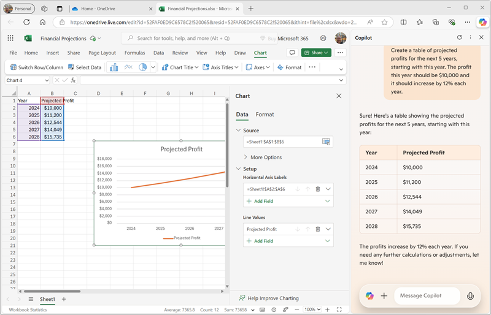

---
lab:
    title: 'Explore Copilot in Microsoft Edge'
---
# Explore Microsoft Copilot in Microsoft Edge

Welcome to the exciting world of Microsoft Copilot!

In this exercise, you'll harness the power of Copilot to explore a new business idea: starting a corporate cleaning company.

Imagine this: you're about to launch a top-notch cleaning service that will revolutionize office spaces everywhere. With Microsoft Copilot by your side, you'll research market trends and develop a solid business plan. But that's not all! You'll also create compelling documents, eye-catching presentations, and persuasive emails to help get your idea off the ground and attract investors.

Get ready to unleash your creativity and business acumen as you navigate through this engaging and interactive lab. By the end of this exercise, you'll have a comprehensive set of materials that will set you on the path to entrepreneurial success. Let's get started and make your corporate cleaning company a reality!

This exercise should take approximately **40** minutes to complete.

> **Note**: This exercise assumes that you have a [personal Microsoft Account](https://signup.live.com) (such as an outlook.com account) with which you are signed into [Microsoft Edge](https://www.microsoft.com/edge/download) on your computer. If you have both a work account and a personal account, be sure to select your *personal* account in the account settings at the top left of Microsoft Edge.

## Use Copilot to explore a document and research an idea

To start your exploration of generative AI, let's use Microsoft Copilot in Edge to examine an existing document and extract some insights from it.

1. In Microsoft Edge, browse to [OneDrive](https://onedrive.live.com) at `https://onedrive.live.com` and sign in using your personal Microsoft account - closing any welcome messages or offers that are displayed.
1. In another browser tab, open the document [Business Idea.docx](https://github.com/MicrosoftLearning/mslearn-ai-fundamentals/raw/main/data/generative-ai/Business%20Idea.docx) from `https://github.com/MicrosoftLearning/mslearn-ai-fundamentals/raw/main/data/generative-ai/Business%20Idea.docx`. Then, when the document opens in Edge, select the option to **Save a copy to OneDrive** and save the document in your **Documents** folder in OneDrive. The document should then open in Microsoft Word online automatically.

    > **Tip**: If you don't see the option to save a copy of the file to OneDrive, download it to your local computer. Then, in OneDrive, open the **Documents** folder and use the **+ Add new** button to upload the **Business Idea.docx** file from your local computer to OneDrive.

1. View the text in the **Business Idea** document, which describe some high-level ideas for a cleaning business in New York City.
1. Use the **Copilot** icon on the Edge toolbar to open the Copilot pane, as shown here:

    

1. In the chat box at the bottom of the Copilot pane, enter following the prompt:

    ```
    Summarize this document into 5 key points, and suggest next steps.
    ```

    If prompted, confirm that you want to allow Copilot to access the page.

1. Review the response from Copilot, which should summarize the main points in the document and suggest some follow up actions for you to take, as shown here:

    

    > **Note**: The specific response may vary.

    Hopefully, Copilot has provided some useful guidance. However if you have additional questions, you can just ask for more specific information.

1. Enter the following prompt:

    ```
    How do I go about setting up a business in New York?
    ```

1. Review the response, which should contain some advice and links to resource to help you get started setting up a business in New York.

    > **Important**: The AI-generated response is based on information publicly on the Web. While it may be useful to help you understand the steps required to set up a business, it is not guaranteed to be 100% accurate and does not replace the need for professional advice!

## Use Copilot to create content for a business plan

Now that you've done some initial research, let's have Copilot help you develop a business plan for your cleaning company.

1. With the **Business Idea.docx** document still open in Microsoft Edge, in the Copilot pane, enter the following prompt:

    ```
    Suggest a name for my cleaning business.
    ```

1. Review the suggestions and select a name for your cleaning company (or continue prompting for more suggestions find a name you like). When you have chosen one, let Copilot know which one - for example, enter `Let's go with the first one.`.
1. Ensure that the **Business Idea** document is still open in the main browser page, then enter the following prompt:

    ```
    Based on the contents of this document, create a business plan for my cleaning business.
    ```

1. Review the response. Then in the Microsoft Word pane, in the **File** menu, create a new blank document. Close the **Designer** pane if it opens and change the name of the new document from *Document* to `Business Plan`.
1. Copy the business plan that was generated in the Copilot pane and paste it into the business plan document:

    

1. In the Copilot pane, enter the following prompt:

    ```
    Create a corporate logo for the cleaning company. The logo should be round and include an iconic New York landmark.
    ```

1. Review the image that Copilot generated.

1. Use more prompts to iterate on the design (for example, `Make it green and blue`) until you have a logo you like.

    > **Tip**: When Coplot generates images that contain text, you may notice some spelling errors. Try different prompts until you're happy with the results.

1. Right-click the generated logo and copy it to the clipboard. Then paste it into the top of the business plan document, like this:

    

1. Close the Microsoft Word browser tabs and return to the **Documents** folder in your OneDrive.

## Use Copilot to generate and visualize financial projections

With Copilot's help, you've created a draft of a business plan for the cleaning business idea. Now let's use Copilot to perform some calculations that will help further refine the business plan.

1. In the **Documents** folder in OneDrive, use the **(+)** button to add a new **Excel workbook**. Then change the name of the workbook to `Financial Projections`.
1. In the Copilot pane, enter the following prompt:

    ```
    Create a table of projected profits for the next 5 years, starting with this year. The profit this year should be $10,000 and it should increase by 12% each year.
    ```

1. Review the response, which should include a table of projected profits for the next five years.
1. Copy the table to the clipboard (being careful to select just the table). Then select cell A1 in the Excel workbook, and on the **Home** tab, in the **Clipboard** menu, under **Paste special**, select **Values only** to that the values from the table are pasted into the spreadsheet like this:

    

1. In the Copilot pane, enter the following prompt:

    ```text
    What's a good way to visualize these projections in a chart?
    ```

1. Review the response, which should recommend a few ways to visualize the projections data. Then enter the following prompt:

    ```text
    How do I create a line chart in Excel?
    ```

1. Follow the guidance provided by Copilot to create a line chart.

    > **Tip**: You may need to adjust the default data axis selected by Excel. Select the chart in the spreadsheet, and on the **Chart** tab, select **Select Data**. Then in the **Chart** pane, on the **Data** tab, modify the setup so that the **Year** field is the horizontal label and only the **Projected Profit** field is used as a line value:

    

1. Close the **Chart** tab to see the chart in the spreadsheet.

1. Close the Microsoft Excel browser tab and return to the **Documents** folder in your OneDrive.

## Use Copilot to create content for a presentation

Thanks to Copilot, you've created a business plan for the cleaning business and generated some financial projections. Now you'll need an effective presentation to convince an investor to lend you the funding to start the business.

1. In the **Documents** folder in OneDrive, add a new **PowerPoint presentation**. If the **Designer** pane opens automatically, close it. Then change the name of the presentation from *Presentation* to `Business Presentation`.

1. On the title slide for the presentation, enter the the name of your cleaning company as the title, and `Investor Opportunity` as the subtitle.
1. Insert a new slide, using the **Two Content** slide layout (which includes a title and two placeholders for content).
1. Change the slide title to `Benefits of Hiring a Commercial Cleaner`.
1. In the Copilot pane, enter the following prompt:

    ```
    Write a summary of the benefits of using a corporate cleaning company for your business. The summary should consist of five short bullet points.
    ```

1. Copy Copilot's response to the clipboard, and paste it into the left content placeholder. Then edit and reformat the text in the placeholder until you are satisfied.
1. In the Copilot pane, enter the following prompt:

    ```
    Create a photorealistic image of a clean office.
    ```

1. When Copilot has generated an image you like, copy it to the clipboard and paste it into the content placeholder on the right of the slide.

    If the **Designer** pane opens automatically, select a slide design you like. Then close the **Designer** pane.

1. Apply any additional reformatting you think is required until you have a slide that you're happy with:

    

1. Open a new browser tab and use it to download the [mopping.png](https://github.com/MicrosoftLearning/mslearn-ai-fundamentals/raw/main/data/generative-ai/mopping.png) image from `https://github.com/MicrosoftLearning/mslearn-ai-fundamentals/raw/main/data/generative-ai/mopping.png` to your local computer, saving it in any folder.
1. Return to the browser tab containing your PowerPoint presentation, and in the Copilot pane, use the **+** button next to the chat box to upload the **mopping.png** image to Copilot, and add the prompt `What does this image show?`.
1. Review the response, which should be similar to this:

    

1. Follow up with the following prompt, and review the response:

    ```
    Would this image be helpful to promote a commercial cleaning business?
    ```

    Copilot has analyzed the image and assessed its usefulness for your specific business scenario in the same way you might ask a colleague's opinion.

1. In PowerPoint, add a new slide with the same **Two Content** layout as before. Then in one of the content placeholders, upload the **mopping.png** image to add it to the slide.

1. In the Copilot pane, enter the following prompt:

    ```
    Write a short paragraph to accompany this image, emphasizing the professionalism of the cleaning staff we employ.
    ```

1. Review the resulting text, and then copy it to the empty content placeholder on the slide, editing and formatting it as you think necessary.
1. In the Copilot pane, enter the following prompt:

    ```
    Suggest a good title for a slide that contains the image and text.
    ```

1. Use the suggested title for the slide, and then use the Designer in PowerPoint to format the slide. You should end up with a slide similar to this:

    

1. Close the PowerPoint browser tab and return to the **Documents** folder in your OneDrive.

## Use Copilot to arrange a funding meeting

You've created some collateral to help you get your business started. Now it's time to reach out to an investor seeking some startup funding.

1. Use the **App Launcher** (&#8759;) at the left end of the OneDrive title bar to open **Outlook**.
1. Switch to the **Calendar** page and change the view to **Work week**. If you don't already have any scheduled events in your calendar, you can add a couple so that Copilot has some information to work with.
1. In the Copilot pane, enter the following prompt:

    ```
    What events do I have scheduled in this calendar?
    ```
    
    Copilot should be able to read the calendar in the web page and identify events in your calendar:

    

1. Try using this prompt to check your availability for a meeting with a a bank manager to seek funding for the business:

    ```
    What's my availability for a meeting this week?
    ```

    Copilot should provide a summary of your availability based on the calendar information in the Outlook web page.

    > **Note**: Microsoft Copilot can read the calendar page that is open in the browser (and may "remember" details during the current session), but it cannot access your calendar data directly. In a corporate environment, your organization can use Microsoft 365 Copilot, which *does* have access to your calendar and email in Outlook, as well as information in other enterprise apps like Microsoft Teams.

1. Switch to the **Mail** page, and create a new email. Fill in the **To** box with your own email address and set the **Subject** to `Business funding meeting request`.
1. In the Copilot pane, enter the following prompt:

    ```
    Write an email to a bank manager requesting a meeting to discuss funding for a commercial cleaning business. The email should be concise and the tone should be professional.
    ```
    
1. Use the generated content to complete your email, as shown here:

    

    You can send the email to yourself if you wish!

## Challenge

Now you've seen how to use Copilot to research ideas and generate content, why not try exploring further? To start a new Copilot session, in the **+** menu next to the chat box, select **Start new chat**. Then, based on what you've learned in this exercise, try using Copilot to plan a meeting in which you'll propose the adoption of generative AI in your organization. Here are a few ideas to get you started:

- Research the benefits of generative AI and Microsoft Copilot for businesses, finding information about productivity benefits, cost-savings, and examples of organizations that have already successfully adopted AI.
- Create a discussion document that you can circulate as pre-reading before the meeting.
- Create a presentation that you can use to present your case, including data and visualizations to emphasize key elements of your pitch.
- Compose an email to tell your coworkers about the meeting and provide some context for it.

Be as inventive as you like, and explore how Copilot can help you by finding information, generating and refining text, creating images, and answering questions.

## Conclusion

In this exercise, you've used Copilot in Microsoft Edge to find information and generate content. Hopefully you've seen how using generative AI in a copilot can help with productivity and creativity.

While the free services used in this exercises are undoubtedly very powerful, you can achieve even more with services like [Microsoft 365 Copilot](https://www.microsoft.com/microsoft-365/enterprise/copilot-for-microsoft-365), in which Microsoft Copilot is integrated into Windows and Microsoft Office productivity applications, providing highly contextualized help with common tasks. Microsoft 365 enables you to bring the power of generative AI to your business data and processes, while integrating into your existing IT infrastructure to ensure a manageable, secure solution.