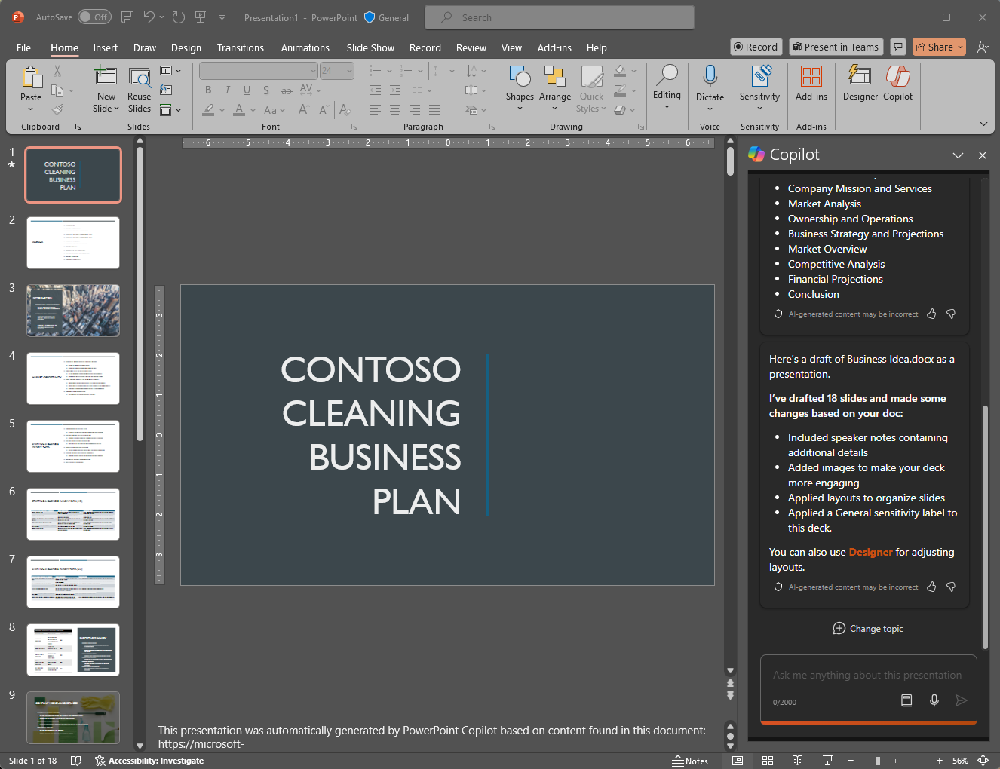

---
lab:
    title: 'Explore Copilot for Microsoft 365'
---
# Explore Copilot for Microsoft 365

In this exercise you will explore some of the ways in which Microsoft Copilot can use generative AI to help you be more productive when creating new content. In the scenario for this exercise, you will start with some high-level notes for a business idea, and use Copilot for Microsoft 365 across multiple apps such as Word, PowerPoint, and Excel to help you develop a business plan and a presentation for potential investors.

This exercise should take approximately **40** minutes to complete.

> **Note**: This exercise requires a **Copilot for Microsoft 365** license from your organization.

## Use Copilot to explore a document and research an idea

To start your exploration of generative AI, let's use Copilot for Word to examine an existing document and extract some insights from it.

1. In your web browser, open the document [Business Idea.docx](https://github.com/MicrosoftLearning/mslearn-ai-fundamentals/raw/main/data/generative-ai/Business%20Idea.docx) at `https://github.com/MicrosoftLearning/mslearn-ai-fundamentals/raw/main/data/generative-ai/Business%20Idea.docx`. Then download the file and save it in the **Documents** folder in your **OneDrive** folder.
1. In the **Documents** folder in your **OneDrive** folder, open **Business Idea.docx** in Microsoft Word (closing any welcome messages or notifications of new features) and review the document, which describes some high-level ideas for a cleaning business in New York City. If prompted, enable editing.
1. Find and select the **Copilot** icon on the Word toolbar to open the Copilot pane, as shown here (your visual theme may vary):

    

1. In the Copilot pane, enter following the prompt in the text area at the bottom:

    ```
    What is this document about?
    ```

1. Review the response from Copilot, which should summarize the main points in the document, as shown here:

    

    > [!NOTE]
    > The specific response you receive may vary due to the nature of generative AI.

1. Return to the Copilot pane to ask Copilot the following question:

    ```
    How do I setup a new business in New York?
    ```

1. Review the response and follow up with additional questions as needed. When you're happy with the response, use the **Copy** (&#128461;) icon under the response to copy it to the clipboard. Paste it into the Word document, select all the text and then select the Copilot icon to visualize the text as a table.

    

1. Review the table and ask Copilot to add more information, such as references for more details.  Your response should look something like this (you may need to use the **Regenerate** button)

    

    > **Important**: The AI-generated response is based on information publicly on the Web. While it may be useful to help you understand the steps required to set up a business, it is not guaranteed to be 100% accurate and does not replace the need for professional advice!

1. When you're happy with the table that Copilot has generated, select the option to **Keep it**.

## Use Copilot to create content for a business plan

Now that you've done some initial research, let's have Copilot help you develop a business plan for your cleaning company.

1. With the **Business Idea.docx** document still open, in the Copilot pane, enter the following prompt:

    ```
    Can you suggest a name for my cleaning business?
    ```

1. Review the suggestions and select a name for your cleaning company (or continue prompting to find a name you like).
1. In the Word document, select the Copilot icon in the margin to draft new content. Enter the following prompt, replacing **Contoso Cleaning** with the company name of your choice:

    ```
    Write a business plan for "Contoso Cleaning" based on the information in this document. Include an executive summary, market overview, and financial projections.
    ```

    

1. Review the response drafted by Copilot and keep it, adjust the tone, length, or ask Copilot to rewrite it with a new prompt. Apply appropriate headings and styling to your document to make it look professional. Your response should look something like this:

    

1. Save the Word document and close it.

## Use Copilot to create content for a presentation

With Copilot's help, you've created a draft of a business plan for the cleaning business idea. Now you'll need an effective presentation to convince an investor to lend you the funding to start the business.

1. Open **PowerPoint** and create a new **blank presentation**. If the **Designer** pane opens automatically, close it.

    

1. Select the **Copilot button** in the **Home tab** of the ribbon, select **Create presentation from file...**, then choose **Business Idea.docx** from your OneDrive Documents folder and send the prompt to Copilot.

    

1. Copilot in PowerPoint will comb through the Word document and create an outline for the presentation before creating the slides.  The process may take several minutes and your output should look something like this with a different theme:

    

1. In the Copilot pane, ask to add a new slide using this prompt:

    ```
    Create a new slide with a summary of the benefits of using a corporate cleaning company for your business. 
    ```

    

1. In the Copilot pane on the same slide you just created, enter the following prompt:

    ```
    Create a photorealistic image of a clean office and add it to this slide.
    ```

    

1. Save the presentation and close PowerPoint.

## Use Copilot to compose an email

You've created some collateral to help you get your business started. Now it's time to reach out to an investor seeking some startup funding.

1. On your PC with Microsoft 365 apps installed, open **Outlook**. If you haven't setup Outlook with your Microsoft 365 account, see [Set up and use Outlook - Microsoft Support](https://support.microsoft.com/office/set-up-and-use-outlook-4636f361-d5e3-4a87-9cd4-382858de55fa).
1. To get the latest Copilot features in Outlook, you should be using the "New Outlook" experience. To see which version you're using, see [What version of Outlook do I have? - Microsoft Support](https://support.microsoft.com/office/what-version-of-outlook-do-i-have-b3a9568c-edb5-42b9-9825-d48d82b2257c).
1. Create a new email, and fill in the **To** box with your own email address.
1. You can start drafting your email from the Copilot pane or right from within the body of the email:

    
    
1. Enter the following prompt and adjust the tone to "Formal" and the length to "Medium":

    ```
    Request a meeting with an investment bank to discuss funding for a commercial cleaning business.
    ```

    

1. Select **Generate draft**, and review the output that is generated.

    

1. You can send the email to yourself if you wish!

## Challenge

Now you've seen how to use Copilot for Microsoft 365 in a couple different apps to research ideas and generate content, why not try exploring further? Start a new Copilot session in Word, PowerPoint, or even Edge, and then try using Copilot to plan an event to promote children's literacy at a local library. Some things you could try include:

- Research some tips for encouraging children to read at an early age.
- Create a flyer or poster for the event.
- Compose an email for a campaign to invite local children's authors to come and speak at the event.
- Create a presentation to start the event.

Be as inventive as you like, and explore how Copilot can help you by finding information, generating and refining text, creating images, and answering questions.

## Conclusion

In this exercise, you've used Copilot for Microsoft 365 to find information and generate content. Hopefully you've seen how using generative AI in a copilot can help with productivity and creativity.

While the features used in this exercises required additional Copilot licensing, you can use a free Microsoft account (*outlook.com*, *live.com*, or *hotmail.com* for example), the Microsoft Edge browser, and the online versions of Word, PowerPoint, and Outlook to accomplish similar tasks. 

However, you can achieve even more with [Copilot for Microsoft 365](https://www.microsoft.com/microsoft-365/enterprise/copilot-for-microsoft-365), in which Microsoft Copilot is integrated into Windows and Microsoft Office productivity applications, providing highly contextualized help with common tasks. Microsoft 365 enables you to bring the power of generative AI to your business data and processes, while integrating into your existing IT infrastructure to ensure a manageable, secure solution.
